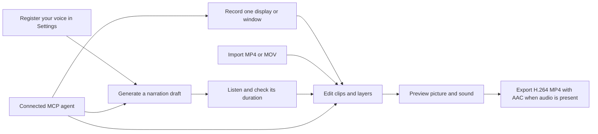

# Storybird

<p align="center">
  
</p>

**Create product demos and tutorials with your own voice.**

Storybird is a local macOS video editor. Record one display or window, or import
an MP4/MOV, then edit the picture, add captions and effects, and generate Korean
or English narration from your own voice. Export a finished MP4, or let an AI
agent handle recording and editing through the Model Context Protocol (MCP).

[](#requirements)
[](Package.swift)
[](LICENSE)


> [!NOTE]
> Storybird is an early-stage project, distributed as source. There is no
> notarized binary release, and the project format may change before a stable
> release. Keep backups of important recordings.

## What you can make

- **Service introductions:** show the result, highlight important features, and
  add an opening title and closing call to action.
- **Step-by-step tutorials:** keep clicks, explanations, subtitles, and narration
  aligned with the demonstrated workflow.
- **Korean and English versions:** reuse your voice profile and duplicate a
  project to maintain separate editable versions.
- **Videos edited from a text request:** ask your connected agent to find a
  scene, rewrite a sentence, change a title, adjust timing, or export a revision.

## How it works



Screen capture itself is silent: Storybird does not record microphone, system
audio, or keyboard input during capture. Your voice is added afterward through
local synthesis. Imported movies may already contain an audio track.

## Features

| Workflow | Included |
|---|---|
| Capture | Display and unfocused-window thumbnails, continuous video, visible cursor, timed left/right clicks |
| Edit | Split, trim, delete, reorder, speed changes, freeze frames, undo and redo |
| Explain | Click indicators with descriptions and subtitles, independent top/bottom subtitles, editable styling |
| Direct attention | Spotlight, pan and zoom, title cards, closing CTA cards, deterministic click-edit suggestions |
| Narrate | Local voice profiles, Korean/English prompts and output selection, sentence regeneration, volume and timing |
| Reuse audio | Persistent narration drafts, listening, cancellation, measured duration, placement without regenerating |
| Stay aligned | Scene-linked narration and subtitles, with fixed project time available for existing work and cards |
| Make variants | Independent project copies with their own video and placed narration assets |
| Automate | 53 local MCP tools for capture, edit context, targeted edits, narration, preview, and export jobs |
| Store locally | Atomic project persistence, selectable project folders, shared voice settings, configurable local shortcuts |

## Requirements

For recording and editing:

- macOS 14 or later
- Xcode 26 or a Swift 6.2 toolchain to build from source
- Screen Recording permission for capture
- Input Monitoring permission to timestamp human mouse clicks
- Accessibility permission for approved MCP pointer control

For local voice cloning:

- Apple Silicon with **24GB or more unified memory** for the supported proof of
  concept baseline
- [`uv`](https://docs.astral.sh/uv/) installed locally
- Several GB of free disk space and network access for initial preparation
- One user-approved download of approximately 2GB for
  `mlx-community/Qwen3-TTS-12Hz-1.7B-Base-8bit`, plus the private Python runtime
- Microphone permission only if you choose to record a voice-profile sample

Certificate signing is required for MCP control. Storybird authenticates the
companion using its code-signing identifier and Apple Team ID. Ad-hoc builds can
run the manual UI but cannot use authenticated MCP control.

## Quick start

```bash
git clone https://github.com/haandol/storybird.git
cd storybird
swift test
./build.sh release
open build/Storybird.app
```

To build and install into `/Applications`:

```bash
./install.sh
```

`build.sh` signs both the app and its bundled MCP companion, preferring a
Developer ID Application or Apple Development certificate. To choose a specific
identity:

```bash
SIGN_IDENTITY="Apple Development: you@example.com (TEAMID)" ./build.sh release
```

Without a certificate, the build falls back to ad-hoc signing. Rebuilding may
then require new macOS permission approvals. Run the `.app` bundle, rather than
`swift run`, when testing capture or pointer-control permissions.

### Record or import your first video

1. Choose **Record Video**, select one display or window, and approve the needed
   macOS permissions. Alternatively, choose **Import Video** for a local MP4/MOV.
2. Demonstrate the service, then stop recording. Each recording creates a new
   project; it does not append to the selected project.
3. Trim waits and mistakes, arrange clips, and add titles or emphasis effects.
4. Fill the description and subtitle of each retained Click Cue, or remove
   irrelevant Cues. Incomplete Cues can be previewed but block export.
5. Add narration if needed, preview the result, and choose **Export**.

The editor is hidden during recording and Storybird's floating control is
excluded from capture. Clicks outside the selected source are ignored. Importing
an existing movie does not require Screen Recording or Input Monitoring.

## Add your voice


### Prepare a profile once

1. Install `uv` if needed: `brew install uv`.
2. Open **Settings › Voice** and approve local model preparation.
3. Confirm that you own the reference voice or have permission to use it.
4. Choose the reference language, then import an MP3/WAV with its exact spoken
   transcript, or record the displayed Korean or English prompt.
5. For guided recording, choose a microphone and record at least 10 seconds.
   Use the waveform, timer, pause/resume, listening, and rerecord controls to
   check the sample before saving it.

The guided prompt is intended to take about 10–15 seconds. The selected language,
prompt, and input device stay fixed during that sample. A saved microphone choice
persists across restarts; if the device is absent, the next recording uses the
system default while preserving your choice.

<details>
<summary>Voice settings screenshot</summary>


</details>

### Generate, listen, then place

1. In a video project, open **Narration** and choose an existing profile.
2. Select Korean or English output, enter a sentence, and choose **Generate Draft**.
   Reference language and output language are independent.
3. When the draft is ready, **Listen** and check its measured duration.
4. Choose a start time and **Follow scene** or **Fixed project time**, then select
   **Place at Start Time**.
5. If the sentence does not fit, edit the picture or start time and place the
   same draft again. The ready WAV survives placement failure and app restart.

Scene-linked narration and subtitles follow their start frame through clip
movement, splitting, and speed changes. Speech duration and pitch remain
unchanged. Trimming away the start or deleting its owning clip removes the layer;
undo restores it. Existing layers keep fixed timing unless you change their mode.
Cards use fixed project time.

Narration cannot overlap another narration or extend past the project. An edit
that would create an invalid result is rejected as a whole. A ready draft can be
placed once; undo does not make it available for duplicate placement. Interrupted
generation is marked failed after restart and never runs again automatically.

To revise a sentence, change its text or language in the Narration inspector and
choose **Regenerate This Narration**. Only that sentence is regenerated. Complete
previous WAVs remain available for undo until the project is deleted. Deleting a
voice profile removes its reference audio and transcript, while existing project
narration remains playable.

Use **Duplicate** in the project header before making a second language version.
The copy owns its video and placed narration. Unplaced drafts, running jobs, and
undo history are not copied. Translate the text and regenerate the needed
sentences; translated speech may need different timing.

Voice similarity and pronunciation depend on the reference sample and text.
Listen to a short sample containing your service name, numbers, and mixed-language
phrases before producing a longer video.

## Edit with an AI agent

Connect an MCP client to the companion inside the certificate-signed app:

```text
/Applications/Storybird.app/Contents/MacOS/StorybirdMCP
```

For a development build, use the executable inside `build/Storybird.app` instead.
After rebuilding, restart the app and reconnect the client to the updated
companion. A [Kiro configuration example](mcp/storybird.kiro.json) is included.

The repository's
[`create-storybird-video` skill](.agents/skills/create-storybird-video/SKILL.md)
guides agents through recording, narration, text-based revisions, and verified
export. For example, ask your agent:

> Create a short Korean tutorial of this service using my existing voice profile.
> Show project creation, explain the result, and export an MP4.

> Change the second scene's explanation to English. Keep the other sentences and
> styling unchanged, then preview the revised scene.

> Duplicate this project for an English version, update the title and narration,
> and keep the Korean project intact.

The agent interprets the request and supplies text. Storybird provides the
validated editing commands; it does not contain a built-in chat assistant or call
a text-generation API.

| Agent task | Main tools |
|---|---|
| Record a service | `storybird_list_sources`, `storybird_start_session`, observation/pointer tools, `storybird_stop_session` |
| Resolve a text request | `storybird_get_edit_context` — current revision, scene numbers, IDs, and layer text |
| Make a focused change | Clip tools, `storybird_update_click`, `storybird_upsert_subtitle`, `storybird_update_effect` |
| Generate reusable speech | `storybird_start_narration_draft`, status/list tools, `storybird_place_narration_draft` |
| Revise one sentence | `storybird_update_narration` with replacement text and language |
| Create a language variant | `storybird_duplicate_project` |
| Check and export | `storybird_render_preview`, `storybird_start_export`, `storybird_get_export` |

Edits use the latest project revision to avoid overwriting a newer change. Scene
numbers refer to one-based clip order, excluding title and CTA cards. Keep real
pointer-changing tools out of `autoApprove`: they operate the user's desktop and
can trigger effects in the demonstrated service.

Model preparation, voice-profile registration/deletion, and microphone recording
remain native user actions. Agents may use existing profiles. Storybird does not
type into the demonstrated service; a separately authorized browser tool can
handle text input in the visible captured window when needed.

See [the complete MCP guide](docs/MCP.md) for all tools, fields, retries,
concurrency, and the security boundary.

## Local storage and privacy

Open **Settings › General › Storage** to choose a project folder or restore the
default. Each folder has its own library; switching does not move or merge
projects. Folder changes are blocked while recording, importing, exporting, or
performing voice work. An unavailable or damaged folder produces an error rather
than silently falling back to another location.

<details>
<summary>Storage settings screenshot</summary>


</details>

The default layout is:

```text
~/Library/Application Support/Storybird/
├── library.json              # Projects, editing state, and narration draft metadata
├── Assets/<project-id>/      # Source video and project-owned narration WAVs
├── Voices/                   # Shared voice references and exact transcripts
└── VoiceRuntime/             # Prepared runtime and model cache
```

Custom project folders hold their own library and assets. Shared voice profiles,
the model, and the authenticated local MCP socket remain at the default root.
If a sync service manages your chosen folder, that service controls any upload.

- Ordinary recording, editing, and export have no Storybird-owned upload path.
- Initial voice-model preparation requires the approved download; later synthesis
  uses the local model cache in offline mode.
- Approved MCP capture can return the selected source's PNG to the connected
  client. Authenticated project preview can return a composited stored frame.
  The MCP client controls any onward disclosure to its model or other services.
- Profile listing exposes selection metadata, not reference audio or transcripts.
- Export preserves the source and replaces the chosen destination only after
  successful completion. Imported audio and narration are mixed into at most one
  synchronized AAC track.

Existing OpenLane data is copied only when the Storybird library does not exist.
The legacy copy is never moved or deleted. Legacy screenshot files are preserved,
but the video editor does not convert or edit them.

Screenshots in this README use synthetic project data. Do not attach customer
recordings, voice references, credentials, or private libraries to public issues.
See [SECURITY.md](SECURITY.md).

## Current boundaries

- One selected source per recording and one source video per project. Separate
  recordings cannot be combined into one project.
- Screen recording does not capture live microphone audio, system audio, or
  keyboard events. Imported audio and generated narration are supported.
- Import supports MP4 and QuickTime MOV. Minimized and off-screen windows are not
  listed as capture sources.
- Local voice cloning has the 24GB+ Apple Silicon baseline described above.
- No cloud project service, automatic translation inside the app, or notarized
  binary distribution is included.

## Development and contributing

```bash
swift build -c debug
swift test
./build.sh release
```

Tests use temporary projects and synthetic media. Real MLX synthesis, export
performance checks, and documentation screenshot generation are opt-in. To
regenerate the synthetic screenshots:

```bash
STORYBIRD_UPDATE_DOC_SCREENSHOTS=1 \
  swift test --filter DocumentationScreenshotTests/test_generateSyntheticReadmeScreenshots
```

Project shortcuts are configurable in **Settings › Shortcuts**. Defaults include
`⌘N` for a new project, `⇧⌘R` for recording, `⇧⌘I` for import, and `⇧⌘E` for
export. They apply only while Storybird is active.

| Location | Purpose |
|---|---|
| `Sources/Storybird/` | SwiftUI app, capture, playback, voice, and export |
| `Sources/StorybirdCore/` | Models, timeline rules, geometry, and persistence |
| `Sources/StorybirdMCPKit/` | MCP tools and authenticated app communication |
| `Sources/StorybirdMCP/` | Companion executable |
| `Tests/` | Core, app, MCP, and media regression coverage |
| `Resources/` | Bundle metadata, icon, entitlements, and local voice worker |
| `docs/adr/` | Architectural decisions |

Read [CONTRIBUTING.md](CONTRIBUTING.md), [AGENTS.md](AGENTS.md), and the
[troubleshooting guide](docs/Troubleshooting.md) before changing behavior.
The project follows an ADR-first development workflow.

## License

[MIT](LICENSE).
