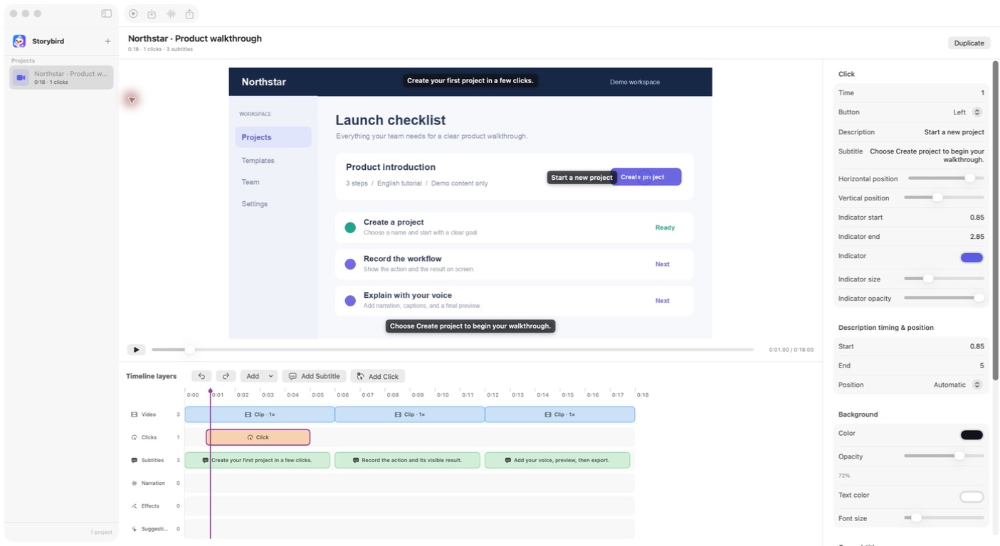
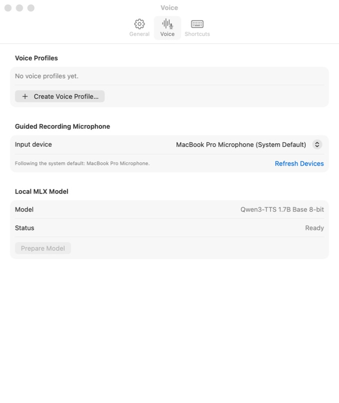
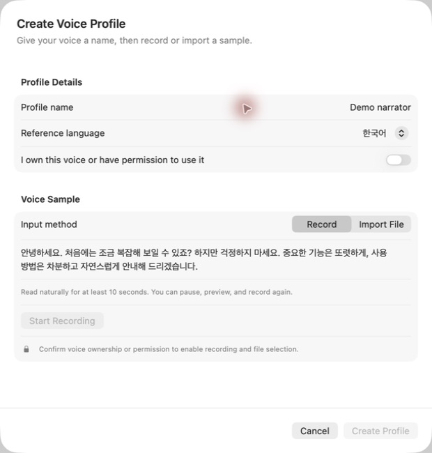
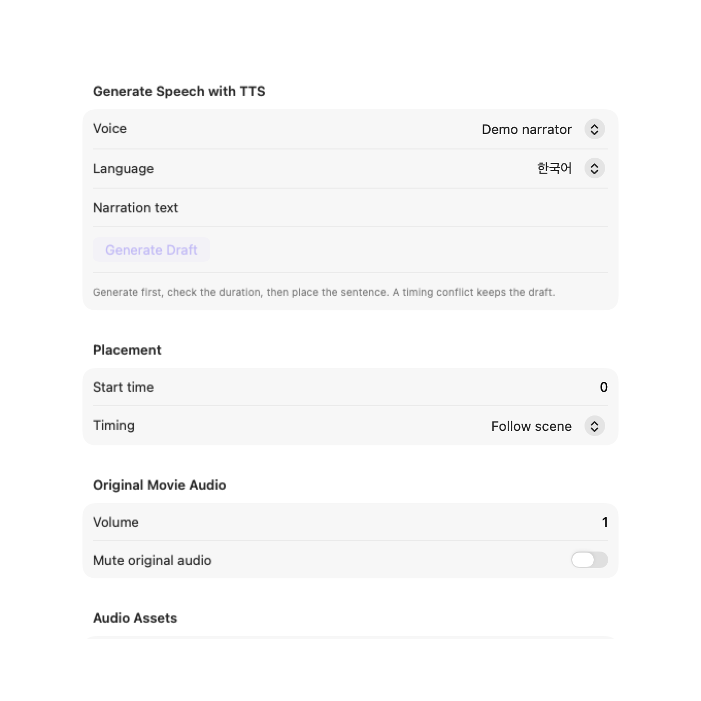

<div align="center">
  

  <h1>Storybird</h1>

  <p><strong>Turn a screen walkthrough into a narrated product demo — on your Mac.</strong></p>

  <p>
    <a href="./LICENSE"></a>
    
    <a href="./Package.swift"></a>
  </p>
</div>

Storybird records one display or window, keeps your clicks on the video timeline,
and lets you add captions, zooms, titles, and narration in your own voice. You can
also start with an existing MP4 or MOV. The result is an editable project and a
finished MP4 you can share.

Use the native editor yourself, or **ask an AI agent to record, edit, narrate, and
export through MCP (Model Context Protocol)**. For example:

> 이 서비스의 프로젝트 생성 과정을 30초 정도의 한국어 튜토리얼로 만들어줘.
> 등록된 내 음성을 사용하고, 자막을 넣은 다음 MP4로 내보내줘.

The agent writes the script and chooses edits. Storybird records, validates,
synthesizes speech locally, and renders the video. See [Use it with an AI
agent](#use-it-with-an-ai-agent) for connection steps and copyable examples.

<div align="center">
  
</div>

The preview shows the edited picture; the timeline below holds clips and timed
layers. This screenshot was taken from the running app with a separate synthetic
demo library. No customer screen or personal voice sample is included.

> [!NOTE]
> Storybird is an early-stage, source-distributed project. There is no notarized
> binary release, and the project format can change before a stable release.
> Keep backups of important recordings.

## Features

| | |
|---|---|
| **Record or import** | Compare display/window thumbnails, record one source, or import an MP4/MOV with its primary audio track |
| **Explain each click** | Recorded left/right clicks become timed Cues with an indicator, description, and subtitle |
| **Edit the picture** | Split, trim, reorder, change speed, insert freezes, and undo or redo edits |
| **Direct attention** | Add spotlights, pan and zoom, opening titles, and a closing call to action |
| **Use your voice** | Create a local voice profile and generate Korean or English narration, one sentence at a time |
| **Listen before placing** | Keep ready narration drafts, check their actual duration, and place them without generating again |
| **Keep speech with its scene** | Scene-linked narration and subtitles follow their start frame through clip edits; fixed timing is also available |
| **Make another language version** | Duplicate a project with its own media, then ask your agent to translate and regenerate the needed sentences |
| **Work through an agent** | Local MCP tools cover recording, targeted edits, narration, composited previews, and export jobs |

## System requirements

Recording and editing require **macOS 14 or later**. Building requires Xcode 26
or a Swift 6.2+ toolchain.

Local voice cloning uses **Apple Silicon with at least 24GB of unified memory**
as its supported proof-of-concept baseline. Install [`uv`](https://docs.astral.sh/uv/),
leave several GB of free disk space, and approve the initial runtime and roughly
2GB model download in Settings. Storybird uses the Qwen3-TTS 1.7B Base 8-bit MLX
model; after preparation, synthesis runs offline.

| Permission | When Storybird uses it |
|---|---|
| Screen Recording | Recording the display or window you select |
| Input Monitoring | Timestamping human mouse clicks during recording |
| Accessibility | Pointer movement, clicks, and scrolling in an approved MCP session |
| Microphone | An explicitly started voice-profile sample only |

**Screen recording is silent.** It captures neither microphone nor system audio,
and never records keyboard input. Imported audio and generated narration can be
included in the finished video. Importing a movie does not require capture permissions.

## Installation

Build from source:

```bash
git clone https://github.com/haandol/storybird.git
cd storybird
./install.sh
```

This builds and installs `/Applications/Storybird.app`. To build and run in the
checkout instead:

```bash
./build.sh release
open build/Storybird.app
```

`build.sh` signs the app and bundled MCP companion with an available Developer ID
Application or Apple Development certificate. Select one explicitly if needed:

```bash
SIGN_IDENTITY="Apple Development: you@example.com (TEAMID)" ./build.sh release
```

> [!IMPORTANT]
> Certificate signing is required for MCP control: the app authenticates the
> companion by its signing identifier and Apple Team ID. Without a certificate,
> the build uses ad-hoc signing; the manual UI can run, but authenticated MCP
> control is unavailable and rebuilds may require fresh macOS permission grants.
> Test permissions using the `.app` bundle, not `swift run`.

## Make your first video

### 1. Record a workflow or import a movie

Choose **Record Video**, select one display or window, and approve the required
macOS permissions. Demonstrate the workflow, then stop. Each recording creates a
new project. To use existing footage, choose **Import Video** and select an MP4
or MOV.

<div align="center">
  
</div>

Storybird hides its editor while recording and excludes its floating controls
from capture. Clicks outside the chosen source are ignored.

### 2. Edit and explain the action

Trim waits and mistakes, arrange the clips, and add a title or emphasis effect.
Select a Click Cue to fill in its description and subtitle, or remove it if it is
irrelevant. **Every retained Cue needs both texts before export.** You can also
add independent subtitles at the top or bottom of the picture.

The source video stays intact. **Undo** and **Redo** operate on the edits. Use
**Duplicate** in the project header before making an independent variant.

### 3. Create a voice profile once

Open **Settings › Voice** (`⌘,`). Prepare the local model and choose your default
microphone here. The profile list contains preview/delete controls and a
**Create Voice Profile…** button below it.

<div align="center">
  
</div>

Click **Create Voice Profile…** to open its own window:

1. Enter a profile name and choose Korean or English as the reference language.
2. Confirm that you own the voice or have permission to use it.
3. Choose **Record** to read the displayed prompt, or **Import File** to select
   an MP3/WAV and enter its exact spoken transcript.
4. For a recording, read for at least **10 seconds**. The waveform and timer show
   progress; pause/resume, preview, and rerecord are available.
5. Choose **Create Profile**. A successful save closes the window and adds the
   profile to the list. **Cancel** discards the temporary recording. A save error
   keeps your input in the window for retry.

<div align="center">
  
</div>

The prompt takes about 10–15 seconds. Its language and microphone stay fixed for
that sample. A selected microphone is remembered across restarts; if it is
unavailable, the next recording uses the system default while preserving your choice.

### 4. Generate, listen, and place narration

Open **Narration** in a project, choose an existing profile, select Korean or
English output, and enter a sentence. **Generate Draft** creates the local audio
without placing it on the timeline. When ready, **Listen** and check its duration,
then choose a start time and **Place at Start Time**.

<div align="center">
  
</div>

Choose **Follow scene** when speech should move with a clip, or **Fixed project
time** for an exact time, including title/closing cards. Moving a scene does not
speed up or stretch the speech. Narrations cannot overlap or extend beyond the
project; if placement fails, edit the picture or time and reuse the ready draft.
Ready drafts survive restarting the app.

To change one sentence, edit its text and choose **Regenerate This Narration**.
Other sentences keep their existing audio. A profile can use a Korean reference
to generate English output. Listen to a short sample with your service name,
numbers, and mixed-language phrases before producing a longer video.

### 5. Preview and export

Check the picture, captions, and sound, then choose **Export**. Storybird renders
H.264 MP4 and mixes imported audio plus narration into one synchronized AAC track
when audio is present. A recording without narration exports without an audio
track. The destination is replaced only after export succeeds.

## Use it with an AI agent

Storybird includes a **local stdio MCP server**: a companion process that lets an
agent call the app's recording and editing tools. Keep the certificate-signed app
open, then connect your agent to:

```text
/Applications/Storybird.app/Contents/MacOS/StorybirdMCP
```

For a development build, use the absolute path inside `build/Storybird.app`.
Restart the app and reconnect the agent after rebuilding.

### Connect Codex

With Codex installed, register the companion:

```bash
codex mcp add storybird -- /Applications/Storybird.app/Contents/MacOS/StorybirdMCP
codex mcp list
```

Start a new Codex session and use `/mcp` to check that Storybird is connected.
The same server can be configured in `~/.codex/config.toml`:

```toml
[mcp_servers.storybird]
command = "/Applications/Storybird.app/Contents/MacOS/StorybirdMCP"
```

See the [official Codex MCP setup guide](https://learn.chatgpt.com/docs/extend/mcp).
For Kiro, merge the included [configuration example](mcp/storybird.kiro.json)
into its MCP settings. Other local MCP clients can use the same command; no
HTTP URL or API key is required by Storybird.

The checkout includes the
[`create-storybird-video` skill](.agents/skills/create-storybird-video/SKILL.md).
When working in this repository, ask Codex to use `$create-storybird-video`.
From another workspace, give the agent the path to that skill and ask it to read
it first. Connecting the MCP server and giving the agent the workflow are separate
steps; the app is not a built-in chat assistant.

### Try these requests

Replace the service, project, profile, and output names with your own.

**Record a Korean tutorial**

```text
Use $create-storybird-video to make a 30–45 second Korean tutorial of the
project-creation workflow in the browser window I have open.
Use my existing voice profile "My voice". Show the starting screen, the action,
and the resulting project. Add Korean subtitles and a short closing title.
Preview the result and export it to ~/Movies/project-tutorial-ko.mp4.
```

The agent should prepare the scenes, ask Storybird to start the selected source,
wait for native approval, record the actions, and stop to create the project.
It then edits the picture, generates speech drafts, places them using measured
durations, checks composited previews, and waits for export to finish.

**Edit existing footage**

First use **Import Video** in Storybird to create a project from your MP4/MOV.
Then ask:

```text
Use Storybird to edit the existing project "Product walkthrough".
Remove the idle opening, add the title "Create your first project", and add
English subtitles for the important actions. Keep the imported audio.
Preview the result and export ~/Movies/product-walkthrough-edited.mp4.
```

**Revise one sentence**

```text
In the project "Product walkthrough", change the second scene's narration to
"Create your first project, then invite your team."
Update the matching subtitle. Keep the voice, other sentences, and styling.
Check that the new speech fits, then preview the changed scene.
```

**Make an English version**

```text
Duplicate the Korean project as "Product walkthrough — English".
Translate its titles, subtitles, and narration into English, then regenerate
speech using the existing profile. Adjust timing to the actual speech lengths.
Keep the Korean project intact and export the English copy separately.
```

The agent reads the current scene list and edit revision before changing a
project. A revision is its edit version; stale requests are rejected so they
cannot overwrite newer work. See [the complete MCP guide](docs/MCP.md) for tool
schemas, retries, and export-job handling.

### What still needs you

- Prepare the model and create/delete voice profiles in native Settings.
  Agents can use existing profiles, but cannot register your voice or start a microphone sample.
- Approve the selected recording source and pointer control in Storybird.
  Keep pointer-changing tools out of automatic approval: they operate the real desktop.
- If a demonstrated workflow needs typing, use a separately authorized browser
  tool. Storybird itself only moves, clicks, and scrolls the pointer.
- Check pronunciation and voice resemblance. A composited still preview verifies
  picture/layout; it does not verify speech or motion.

> [!NOTE]
> An approved MCP recording can send the selected source's PNG to the connected
> client. Project previews can also be returned to that client. **Your agent
> controls any onward transmission to its model or other services.** Use a demo
> account and synthetic data when showing a service.

## Where your data goes

```text
~/Documents/Storybird/
├── library.json              # Projects, edits, and narration draft metadata
└── Assets/<project-id>/      # Original video and project-owned narration

~/Library/Application Support/Storybird/
├── Voices/                   # Shared voice profiles and reference audio
└── VoiceRuntime/             # Local runtime and model cache
```

Change the project folder in **Settings › General › Storage**. Each folder keeps
its own library; selecting another folder does not move or merge existing
projects. **Use Default** returns to `~/Documents/Storybird`. An unavailable or
damaged folder reports an error instead of silently writing elsewhere. Folder
changes are disabled during recording, import, export, and voice work.

Shared profiles, the model, and the local MCP socket stay in Application Support.
Older Application Support projects are not moved; choose that folder in Settings
to access them. Legacy OpenLane data is copied only when the Storybird Application
Support folder does not exist, and its original is preserved.

### Network and retention

Ordinary recording, editing, and export have no Storybird-owned upload path.
Model preparation downloads the approved runtime/model; subsequent synthesis
uses the local cache offline. A sync service managing your chosen folder controls
its own synchronization. MCP disclosure is described above.

Deleting a voice profile removes its reference audio and transcript, while
project-owned narration remains playable. Removed narration audio is retained for
undo until its project is deleted. A duplicate owns its source video and placed
narration, but does not copy unplaced drafts or undo history.

## Current boundaries

- One selected source per recording and one source video per project; separate
  recordings cannot be combined into one project.
- Minimized/off-screen windows are not listed as capture sources.
- Screen recording captures neither audio nor keyboard input.
- Voice cloning uses the 24GB+ Apple Silicon baseline above.
- Storybird has no cloud project service or built-in text-generation/translation
  service. The connected agent supplies the script and translations.

## Development and contributing

```bash
swift build -c debug
swift test
./build.sh release
```

Tests use temporary projects and synthetic media. Real MLX synthesis, export
performance checks, and documentation screenshot generation are opt-in. The
component screenshots can be regenerated with:

```bash
STORYBIRD_UPDATE_DOC_SCREENSHOTS=1 \
  swift test --filter DocumentationScreenshotTests/test_generateSyntheticReadmeScreenshots
```

The README combines running-app screenshots with real SwiftUI components rendered
using synthetic state. See [the screenshot notes](docs/images/README.md) for their
sources and reproduction. Additional component views: [voice settings](docs/images/voice-narration.png),
[profile creation](docs/images/voice-profile-creation.png), and [storage settings](docs/images/storage-settings.png).

Read [CONTRIBUTING.md](CONTRIBUTING.md), the [architecture invariants](AGENTS.md#architecture-invariants),
and [Troubleshooting](docs/Troubleshooting.md) before changing capture, persistence,
or export behavior. Architectural decisions are recorded under `docs/adr/`.

**Never commit customer recordings, voice samples, credentials, or private
libraries.** Report security issues through [SECURITY.md](SECURITY.md).

## License

[MIT](LICENSE)
