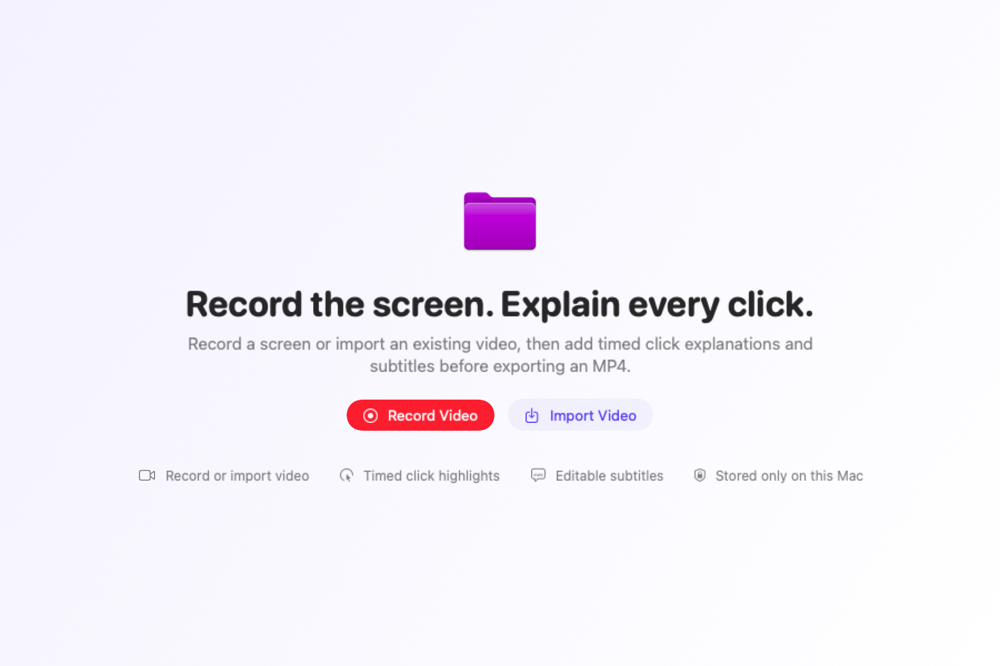
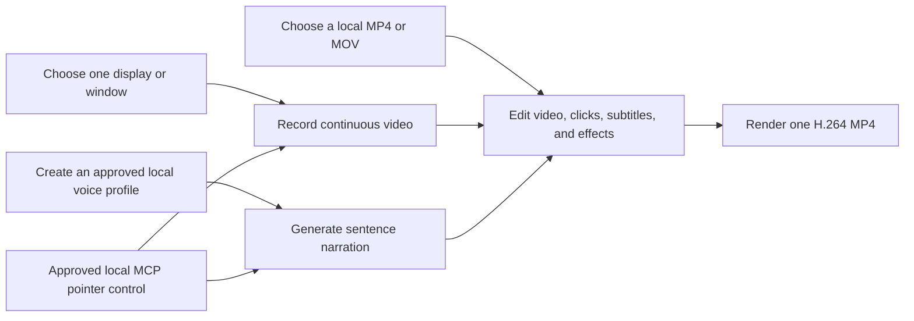
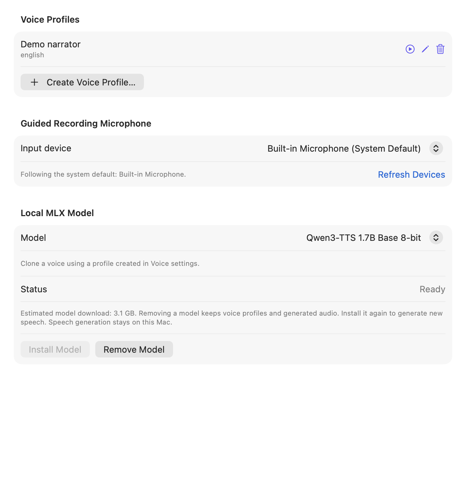
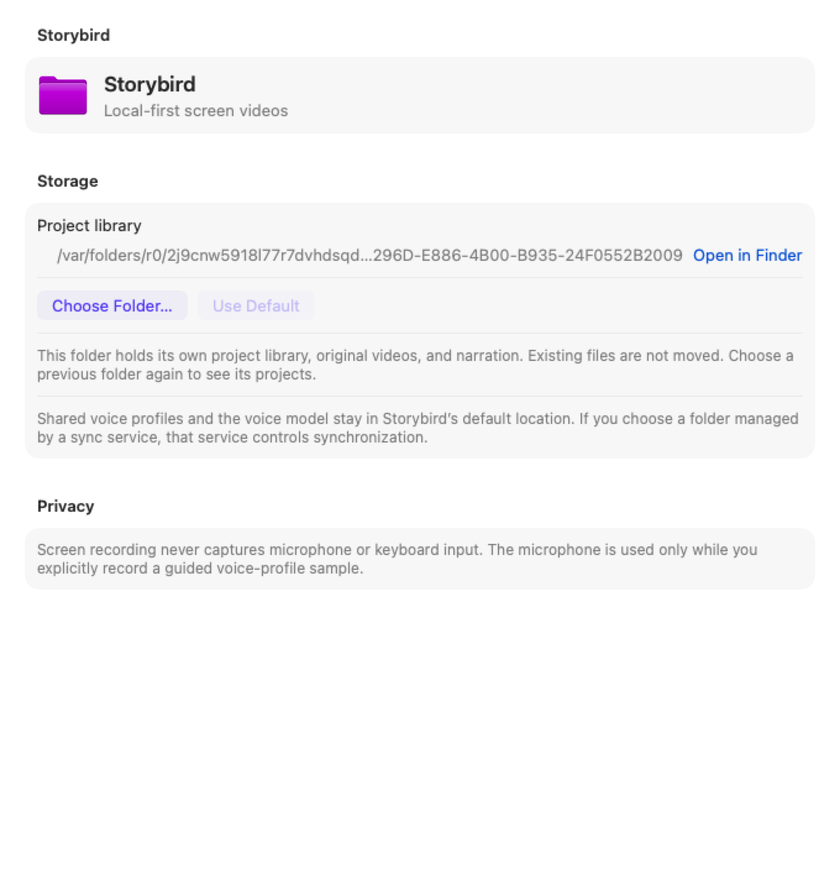

# Storybird

Storybird is a local-first macOS video editor for product walkthroughs. Record
one display or window, or import an existing MP4/MOV, then add timed click
explanations, subtitles, effects, and optional cloned-voice narration before
exporting a self-contained H.264/AAC MP4.

[](#requirements)
[](Package.swift)
[](LICENSE)

> [!NOTE]
> Storybird is an early-stage project. The project format may change before the
> first stable release. Keep backups of important recordings.

## How it works





## Features

- Live thumbnail gallery for displays and unfocused windows.
- Continuous cursor-visible screen video recorded directly by Storybird.
- Local MP4 and QuickTime MOV import with project-owned source copies.
- Timed left/right click coordinates on the same clock as the recording.
- Manual Click Cue placement at any playable video time and position.
- Timeline preview with editable click captions and top/bottom subtitles.
- Per-layer background color and opacity.
- User-authorized MP3/WAV voice profiles or a guided 10-second microphone
  recording with a live waveform, timer, pause/resume, preview, and rerecord.
- Settings-managed voice profiles and a persistent guided-recording microphone
  choice that falls back to the system default while disconnected.
- Local Qwen3-TTS 1.7B Base 8-bit MLX voice cloning after one approved model
  download.
- Project-owned sentence narration with editable text, timing, volume,
  regeneration, and deletion.
- Local H.264 MP4 export with layers burned into the video and imported audio
  plus project narration mixed into at most one AAC track.
- Local stdio MCP companion for source observation and real pointer movement,
  left/right clicks, scrolling, revision-checked editing, narration generation,
  and export.
- Atomic local persistence and one-time OpenLane library migration.
- Configurable local shortcuts for project creation, recording, import, and
  export without global keyboard monitoring.
- Stable Apple Development signing support for repeatable macOS permissions.

Storybird does not record keyboard input, microphone audio, or system audio
during screen capture.
Imported videos may contain narration, and users may explicitly record a guided
10-second microphone sample to create an on-device cloned voice profile. Voice
synthesis and generated narration remain local after the user-approved model
download.

## Requirements

- macOS 14 or later
- Xcode 26 or a Swift 6.2 toolchain
- Screen Recording permission
- Input Monitoring permission for human mouse clicks
- Accessibility permission for approved MCP pointer control
- Microphone permission only for an explicit guided voice-profile recording

Local voice cloning additionally uses:

- Apple Silicon with at least 24GB unified memory for the supported PoC baseline
- [`uv`](https://docs.astral.sh/uv/) installed locally
- several GB of free disk space and network access for the first approved
  preparation; the model download itself is approximately 2GB and the private
  Python runtime uses additional space

| Permission | Why it is needed | What Storybird does not do |
|---|---|---|
| Screen Recording | Record the selected display or window and show source thumbnails | It does not upload the recording |
| Input Monitoring | Observe global left/right mouse-down events and timestamp them | It does not observe keyboard events |
| Accessibility | Move, click, and scroll the real pointer after native MCP approval | It does not read or generate keyboard events |
| Microphone | Record a user-started local voice-profile sample | It does not record microphone audio during screen capture or expose recording to MCP |

The MCP companion itself receives no TCC permission. Storybird performs capture
and pointer input after authenticating the local companion. Microphone access,
voice-file selection, initial model preparation, and voice-profile deletion
remain native Storybird actions.

## Installation

Storybird does not currently publish a notarized binary release.

```bash
git clone https://github.com/haandol/storybird.git
cd storybird
swift test
./build.sh release
open build/Storybird.app
```

Install the signed local build into `/Applications`:

```bash
./install.sh
```

`build.sh` prefers a `Developer ID Application` or `Apple Development`
certificate. Override it when necessary:

```bash
SIGN_IDENTITY="Apple Development: you@example.com (TEAMID)" \
  ./build.sh release
```

Without a certificate, the script falls back to ad-hoc signing. macOS may then
treat each rebuild as a new identity and request Screen Recording, Input
Monitoring, or Accessibility permission again.

Run the `.app` bundle rather than `swift run` when testing permissions.

To use local voice cloning, install `uv` before preparing the model:

```bash
brew install uv
```

## Record, import, and edit a video

1. Click **Record Video**.
2. Choose one display or open window.
3. After the countdown, use the selected product normally.
4. Storybird records the screen continuously and timestamps valid left/right
   clicks inside the selected source.
5. Click **Stop** in the floating Storybird control.
6. Use the aligned Video, Clicks, Subtitles, Effects, and Suggestions tracks to
   see which layers overlap at the current playhead.
7. Select a video block to split it, remove content before or after the
   playhead, delete it, or apply the **1×**, **2×**, and **4×** speed presets.
8. Select click and subtitle layers to edit their text, timing, position,
   colors, and opacity.
9. Click **Export** and choose an MP4 destination.

Every recording creates a new project. Storybird does not append a new session
to the currently selected project. Clicks outside the selected source are
ignored. The editor is hidden while recording and the floating HUD is excluded
from captured content.

To edit an existing video:

1. Click **Import Video** or **Import**.
2. Choose one local MP4 or QuickTime MOV.
3. Storybird copies and validates the movie before creating a new project.
4. Move the playhead, click **Add Click**, then select the target point inside
   the video.
5. Fill the Click Cue description and subtitle, then add any independent
   subtitles or effects.
6. Optionally add generated Narration layers from a local voice profile.
7. Export the finished MP4. Imported audio and project narration stay
   synchronized with trimmed, reordered, or speed-adjusted video clips.

Importing does not require Screen Recording or Input Monitoring permission.

## Generate narration with your cloned voice



1. Install `uv`, open **Settings › Voice**, and approve preparation of
   `mlx-community/Qwen3-TTS-12Hz-1.7B-Base-8bit`. Storybird displays the
   approximately 2GB download before starting it.
2. Choose the current **(System Default)** device or a specific input device for
   guided recordings. A disconnected selected device remains selected while
   Storybird temporarily uses the system default.
3. Confirm that you own the reference voice or have permission to use it.
   File import and microphone recording stay disabled until this confirmation.
4. Import an MP3/WAV plus its exact spoken transcript, or choose
   **Record Guided Sample**.
5. For a guided sample, read the displayed 10–15 second prosody prompt. The
   recording screen shows a live input waveform, elapsed time, remaining time,
   pause/resume, and the 10-second completion boundary. Preview or rerecord the
   sample before saving the profile. Storybird normalizes different microphone
   sample rates and channel layouts into one 24kHz mono WAV.
6. Return to a project, choose **Narration**, then select a voice profile,
   narration text, and project start time.
7. Generate the sentence, then edit its start time and volume on the Narration
   timeline track. Change its text and choose **Regenerate This Narration** to
   replace only that sentence's WAV.
8. Export the project. Storybird mixes imported source audio and project
   narration into one synchronized AAC track.

Model preparation is staged and replaces the active runtime only after the
model loads successfully. Later synthesis forces the local model cache into
offline mode.

Narration clips cannot overlap or extend beyond the edited project. Storybird
validates each generated WAV before publishing the project revision. Deleting a
voice profile removes its sensitive reference audio and transcript but keeps
the generated narration already owned by projects.

The approved local MCP client can list minimal profile metadata and generate,
regenerate, retime, adjust, or delete project narration. It cannot select voice
files, record the microphone, download the model, return reference transcripts,
or delete a voice profile.

## Keyboard shortcuts

Open **Settings › Shortcuts** to change Storybird-local project shortcuts. The
defaults are:

- `⌘N`: new recording project
- `⇧⌘R`: start or stop recording
- `⇧⌘I`: import video
- `⇧⌘E`: export video
- `⌘,`: open Settings (standard macOS shortcut)

Project shortcuts work only while Storybird is active. They use the same
availability, permission, and confirmation rules as the matching controls and
do not require Accessibility or Input Monitoring permission.

## Control a recording through MCP

Architecture, tools, and security details are in [Storybird MCP](docs/MCP.md).
A ready-to-merge Kiro configuration is provided at
[`mcp/storybird.kiro.json`](mcp/storybird.kiro.json).

The signed app bundle contains the local stdio companion:

```text
/Applications/Storybird.app/Contents/MacOS/StorybirdMCP
```

Keep pointer-changing tools out of `autoApprove`; they operate the real pointer
and can trigger external side effects.

The MCP workflow is:

1. Call `storybird_list_sources` and choose one display or window.
2. Call `storybird_start_session` with a project name.
3. Approve the native Storybird disclosure.
4. Use `storybird_observe`, `storybird_move_pointer`, `storybird_click`, and
   `storybird_scroll`.
5. Call `storybird_stop_session`.

Storybird continuously records the selected source during the session and saves
one video project with non-duplicated timed clicks. The selected source PNG may
be returned to the connected MCP client; that client controls any onward model
or network disclosure.

The companion also supports project listing, revision-checked clip split, trim,
delete, move, speed, and freeze-frame edits, click-layer edits, subtitle
upsert, voice-profile listing, narration generation/update/deletion, opening
the timeline editor, MP4 export, and native-confirmed project deletion.

## Project and export layout

Open **Settings › General › Storage** to choose a project folder, open it in
Finder, or restore the default location. The choice persists across restarts.
Each folder has its own library: existing projects are not moved or merged.
Select a previous folder again to see its projects.

Folder changes are disabled during recording (including preparation and
finalization), import, export, and voice work. An unreadable, unwritable, or
damaged library leaves the current selection unchanged and shows an error.
If the selected folder is unavailable at launch, Storybird preserves the choice
and blocks project writes until you restore or select a usable folder.



The default layout is:

```text
~/Library/Application Support/Storybird/
├── library.json
├── Assets/
│   └── <project-id>/
│       ├── <source>.mp4|mov
│       └── narration-<id>.wav
├── Voices/
│   ├── profiles.json
│   └── <profile-id>/
│       └── reference.mp3|wav
└── VoiceRuntime/
    ├── .venv/
    ├── ModelCache/
    └── model-ready.txt
```

With a custom folder, `library.json` and `Assets/` live in that folder.
Shared `Voices/`, `VoiceRuntime/`, and the local MCP connection remain in the
default Storybird location. A folder change does not download a model again.
If you select a folder managed by a sync service, that service controls any
synchronization; Storybird does not upload these files itself.

The library stores the source duration and dimensions, timed normalized clicks,
subtitles, effects, and narration layers. Imported files and generated
narration are copied or written into project-owned storage. Voice references
and their exact transcripts have a separate lifetime from project narration.
The project-owned source is never modified by editing or export.

Export produces one MP4:

```text
<recording-name>.mp4
```

Storybird renders click highlights, click captions, subtitles, and optional
branding into the exported video. Direct Storybird recordings remain silent.
If an imported source or project narration exists, export includes one mixed,
synchronized AAC audio track. A failed or cancelled export does not replace an
existing destination.

On first launch after the rename, Storybird copies an existing
`~/Library/Application Support/OpenLane` library only when the Storybird
library does not already exist. The legacy copy is never moved or deleted.
Legacy screenshot projects remain readable but are not automatically converted
into video projects.

## Privacy and security

Storybird writes original recordings, click positions, projects, and timeline
layers to the selected local folder without uploading them. An external sync
service may synchronize a folder the user chooses. Voice references, exact
reference transcripts, voice profiles, generated narration, and the prepared
MLX model also remain local. The initial model preparation is the only
Storybird-owned network path in the voice workflow.

During an approved MCP screen-control session, only the selected source may
pass through authenticated local IPC and stdio to the connected client. Voice
profile listing returns selection metadata, not reference audio or the exact
reference transcript.

Recordings may contain customer data, credentials, or private messages. Never
attach real recordings to a public issue or pull request. See
[SECURITY.md](SECURITY.md).

## Current limitations

- Direct recordings are silent because microphone and system audio are not
  captured. Imported audio and explicit cloned-voice narration are preserved.
- Import supports MP4 and QuickTime MOV files.
- Local voice cloning requires 24GB+ Apple Silicon for the supported PoC
  baseline, `uv`, several GB of free disk space, and a one-time user-approved
  model download of approximately 2GB.
- Keyboard input is never observed or generated.
- Minimized and off-screen windows are not listed in the source gallery.
- Legacy screenshot projects are preserved but cannot be exported as videos
  without a new recording.
- The project format has no compatibility guarantee before a stable release.
- Public builds are not currently notarized.

## Development

```bash
swift build -c debug
swift test
./build.sh release
```

Regenerate the synthetic README screenshots:

```bash
STORYBIRD_UPDATE_DOC_SCREENSHOTS=1 \
  swift test --filter DocumentationScreenshotTests/test_generateSyntheticReadmeScreenshots
```

The repository follows an ADR-first workflow. See:

- [CONTRIBUTING.md](CONTRIBUTING.md)
- [AGENTS.md](AGENTS.md)
- [docs/adr](docs/adr)
- [docs/Troubleshooting.md](docs/Troubleshooting.md)

## Repository layout

```text
Sources/Storybird/          SwiftUI, ScreenCaptureKit, video encoding and export
Sources/StorybirdCore/      Models, validation, persistence and geometry
Sources/StorybirdMCPKit/    MCP tools, source observation and pointer contracts
Sources/StorybirdMCP/       Bundled stdio companion entry point
Tests/StorybirdCoreTests/   Deterministic core XCTest coverage
Tests/StorybirdTests/       Recording, MCP and real video-pipeline tests
Resources/                  Info.plist, entitlements, app icon and MLX worker
docs/images/                Synthetic screenshots generated by XCTest
docs/adr/                   Architecture Decision Records
```

## License

Storybird is available under the [MIT License](LICENSE).
