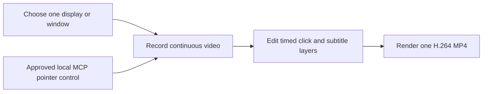

# Storybird

Storybird is a local-first macOS screen-video recorder for product walkthroughs.
Choose one display or window, record its motion and clicks, add timed click
captions and subtitles, then export a silent H.264 MP4.

[](#requirements)
[](Package.swift)
[](LICENSE)

> [!NOTE]
> Storybird is an early-stage project. The project format may change before the
> first stable release. Keep backups of important recordings.

## How it works



## Features

- Live thumbnail gallery for displays and unfocused windows.
- Continuous cursor-visible screen video recorded directly by Storybird.
- Timed left/right click coordinates on the same clock as the recording.
- Timeline preview with editable click captions and top/bottom subtitles.
- Per-layer background color and opacity.
- Local H.264 MP4 export with the layers burned into the video.
- Local stdio MCP companion for source observation and real pointer movement,
  left/right clicks, and scrolling while Storybird records.
- Atomic local persistence and one-time OpenLane library migration.
- Stable Apple Development signing support for repeatable macOS permissions.

Storybird does not record keyboard input, system audio, or microphone input. It
has no account, cloud upload, telemetry, CRM integration, or application-owned
network listener.

## Requirements

- macOS 14 or later
- Xcode 26 or a Swift 6.2 toolchain
- Screen Recording permission
- Input Monitoring permission for human mouse clicks
- Accessibility permission for approved MCP pointer control

| Permission | Why it is needed | What Storybird does not do |
|---|---|---|
| Screen Recording | Record the selected display or window and show source thumbnails | It does not upload the recording |
| Input Monitoring | Observe global left/right mouse-down events and timestamp them | It does not observe keyboard events |
| Accessibility | Move, click, and scroll the real pointer after native MCP approval | It does not read or generate keyboard events |

The MCP companion itself receives no TCC permission. Storybird performs capture
and pointer input after authenticating the local companion.

## Installation

Storybird does not currently publish a notarized binary release.

```bash
git clone https://github.com/haandol/storybird.git
cd storybird
swift test
./build.sh release
open build/Storybird.app
```

Install the signed local build into `/Applications`:

```bash
./install.sh
```

`build.sh` prefers a `Developer ID Application` or `Apple Development`
certificate. Override it when necessary:

```bash
SIGN_IDENTITY="Apple Development: you@example.com (TEAMID)" \
  ./build.sh release
```

Without a certificate, the script falls back to ad-hoc signing. macOS may then
treat each rebuild as a new identity and request Screen Recording, Input
Monitoring, or Accessibility permission again.

Run the `.app` bundle rather than `swift run` when testing permissions.

## Record and edit a video

1. Click **Record Video**.
2. Choose one display or open window.
3. After the countdown, use the selected product normally.
4. Storybird records the screen continuously and timestamps valid left/right
   clicks inside the selected source.
5. Click **Stop** in the floating Storybird control.
6. Use the aligned Video, Clicks, Subtitles, Effects, and Suggestions tracks to
   see which layers overlap at the current playhead.
7. Select a video block to split it, remove content before or after the
   playhead, delete it, or apply the **1×**, **2×**, and **4×** speed presets.
8. Select click and subtitle layers to edit their text, timing, position,
   colors, and opacity.
9. Click **Export** and choose an MP4 destination.

Every recording creates a new project. Storybird does not append a new session
to the currently selected project. Clicks outside the selected source are
ignored. The editor is hidden while recording and the floating HUD is excluded
from captured content.

## Control a recording through MCP

Architecture, tools, and security details are in [Storybird MCP](docs/MCP.md).
A ready-to-merge Kiro configuration is provided at
[`mcp/storybird.kiro.json`](mcp/storybird.kiro.json).

The signed app bundle contains the local stdio companion:

```text
/Applications/Storybird.app/Contents/MacOS/StorybirdMCP
```

Keep pointer-changing tools out of `autoApprove`; they operate the real pointer
and can trigger external side effects.

The MCP workflow is:

1. Call `storybird_list_sources` and choose one display or window.
2. Call `storybird_start_session` with a project name.
3. Approve the native Storybird disclosure.
4. Use `storybird_observe`, `storybird_move_pointer`, `storybird_click`, and
   `storybird_scroll`.
5. Call `storybird_stop_session`.

Storybird continuously records the selected source during the session and saves
one video project with non-duplicated timed clicks. The selected source PNG may
be returned to the connected MCP client; that client controls any onward model
or network disclosure.

The companion also supports project listing, revision-checked clip split, trim,
delete, move, speed, and freeze-frame edits, click-layer edits, subtitle
upsert, opening the timeline editor, MP4 export, and native-confirmed project
deletion.

## Project and export layout

Projects remain local:

```text
~/Library/Application Support/Storybird/
├── library.json
└── Assets/
    └── <project-id>/
        └── <recording>.mp4
```

The library stores the recording duration and dimensions, timed normalized
clicks, subtitles, and overlay styles. The original MP4 is never modified by
editing or export.

Export produces one silent MP4:

```text
<recording-name>.mp4
```

Storybird renders click highlights, click captions, subtitles, and optional
branding into the exported video. A failed or cancelled export does not replace
an existing destination.

On first launch after the rename, Storybird copies an existing
`~/Library/Application Support/OpenLane` library only when the Storybird
library does not already exist. The legacy copy is never moved or deleted.
Legacy screenshot projects remain readable but are not automatically converted
into video projects.

## Privacy and security

Original recordings, click positions, projects, and timeline layers remain on
the Mac unless the user explicitly exports a video. During an approved MCP
session, only the selected source may pass through authenticated local IPC and
stdio to the connected client.

Recordings may contain customer data, credentials, or private messages. Never
attach real recordings to a public issue or pull request. See
[SECURITY.md](SECURITY.md).

## Current limitations

- Recordings and exports are silent; microphone and system audio are not captured.
- Keyboard input is never observed or generated.
- Minimized and off-screen windows are not listed in the source gallery.
- Legacy screenshot projects are preserved but cannot be exported as videos
  without a new recording.
- The project format has no compatibility guarantee before a stable release.
- Public builds are not currently notarized.

## Development

```bash
swift build -c debug
swift test
./build.sh release
```

The repository follows an ADR-first workflow. See:

- [CONTRIBUTING.md](CONTRIBUTING.md)
- [AGENTS.md](AGENTS.md)
- [docs/adr](docs/adr)
- [docs/Troubleshooting.md](docs/Troubleshooting.md)

## Repository layout

```text
Sources/Storybird/          SwiftUI, ScreenCaptureKit, video encoding and export
Sources/StorybirdCore/      Models, validation, persistence and geometry
Sources/StorybirdMCPKit/    MCP tools, source observation and pointer contracts
Sources/StorybirdMCP/       Bundled stdio companion entry point
Tests/StorybirdCoreTests/   Deterministic core XCTest coverage
Tests/StorybirdTests/       Recording, MCP and real video-pipeline tests
Resources/                  Info.plist, entitlements and app icon
docs/adr/                   Architecture Decision Records
```

## License

Storybird is available under the [MIT License](LICENSE).
