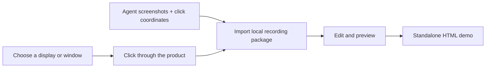

# Storybird

Storybird is a local-first macOS recorder that turns a real product walkthrough
into an interactive demo. Select a display or window from live thumbnails,
click through the product or let an agent execute a software-controlled flow,
then edit, preview, and export the generated demo.

[](#requirements)
[](Package.swift)
[](LICENSE)

> [!NOTE]
> Storybird is an early-stage project. The project format may change before the
> first stable release. Keep backups of important captures.

## Why Storybird?

Most product-demo tools require a hosted account or start from manually
uploaded screenshots. Storybird records a real desktop walkthrough while
keeping every capture on your Mac:



## Features

- Live thumbnail gallery for displays and unfocused windows.
- Click-driven capture: every click links the previous screen to its result.
- Agent recording import from local screenshots and normalized click points.
- Visual screen and hotspot editor with branching targets.
- Responsive editor for compact and wide windows.
- Interactive native preview with local-only analytics.
- Standalone HTML export with no Storybird server dependency.
- Atomic local persistence and one-time OpenLane library migration.
- Stable Apple Development signing support for repeatable macOS permissions.

Storybird does **not** record keyboard input and has no account, cloud upload,
telemetry, CRM integration, video output, or HTML/DOM/cookie capture.

## Requirements

- macOS 14 or later
- Xcode 26 or a Swift 6.2 toolchain
- Screen Recording permission
- Input Monitoring permission for mouse clicks only

The two permissions are required only for human-driven live recording. Agent
recording packages can be imported without either permission.

## Installation

Storybird does not currently publish a notarized binary release. Build from
source:

```bash
git clone https://github.com/haandol/storybird.git
cd storybird
swift test
./build.sh release
open build/Storybird.app
```

Install the signed local build into `/Applications`:

```bash
./install.sh
```

`build.sh` prefers a `Developer ID Application` or `Apple Development`
certificate. Override it when necessary:

```bash
SIGN_IDENTITY="Apple Development: you@example.com (TEAMID)" \
  ./build.sh release
```

Without a certificate, the script falls back to ad-hoc signing. The app still
launches, but macOS may treat each rebuild as a new identity and ask for Screen
Recording and Input Monitoring permission again.

Run the `.app` bundle rather than `swift run` when testing permissions. macOS
ties Transparency, Consent, and Control (TCC) grants to the bundle identifier
and signing requirement.

## First Launch and Permissions

Storybird requests only the permissions needed for click-driven recording:

| Permission | Why it is needed | What Storybird does not do |
|---|---|---|
| Screen Recording | Build source thumbnails and capture the selected display/window | It does not upload captures |
| Input Monitoring | Observe global left/right mouse-down events | It does not observe keyboard events |

After enabling a permission in System Settings, quit and reopen Storybird.
Permission loops and signing diagnostics are covered in
[Troubleshooting](docs/Troubleshooting.md).

## Record a Flow

1. Click **Record Flow**.
2. Choose a display or open window from the thumbnail gallery.
3. Use the selected product normally. Pause briefly after each click so the
   resulting screen can settle.
4. Click **Stop** in the floating Storybird control.
5. Edit screen titles, captions, hotspot behavior, and target screens.
6. Preview the flow or export it as static HTML.

Clicks outside the selected source are ignored. The Storybird editor is hidden
during capture, and the floating recording HUD is excluded from shared content.

## Record a Flow with an Agent

The repository includes the `record-storybird-flow` agent skill. It executes a
user-approved browser or desktop workflow, captures the visible initial screen
and each post-click screen, and records normalized click coordinates without
trying to synthesize macOS mouse input.

The skill builds a local `.storybirdrecording` package:

```text
example.storybirdrecording/
├── manifest.json
└── assets/
    ├── step-0001.png
    └── step-0002.png
```

Open the package with Storybird. Storybird validates the whole package, copies
its PNG assets, and creates a new project.
It rejects unsupported fields, extra files, path traversal, symbolic links,
missing transitions, and coordinates outside `0...1`.

Agent packages remain local and contain no DOM, cookies, keyboard input,
credentials, or payment information. Recording a workflow does not authorize
the agent to complete purchases or other external side effects.

## Project and Export Layout

Projects are stored locally:

```text
~/Library/Application Support/Storybird/
├── library.json
└── Assets/
    └── <project-id>/
        └── <capture>.png
```

On first launch after the rename, Storybird copies an existing
`~/Library/Application Support/OpenLane` library only when the Storybird
library does not already exist. The OpenLane copy is never moved or deleted.

A static export contains:

```text
<demo-name>/
├── index.html
├── demo.json
└── assets/
    └── step-*.png
```

The export is self-contained and can be opened locally or placed on a static
web host. It contains the selected demo's screenshots, so review it before
sharing. Hotspot captions and top/bottom subtitles keep their selected
background colors and opacity in the exported player.

## Privacy and Security

Storybird has no application-owned network path. Screenshots, click positions,
projects, and preview analytics remain on the Mac unless the user explicitly
exports a demo.

Captured screens may contain customer data, credentials, or private messages.
Never attach real captures to a public issue or pull request. See
[SECURITY.md](SECURITY.md) for the vulnerability boundary and private reporting
instructions.

## Current Limitations

- Transitions and animation are represented by post-click screenshots, not
  video clips.
- Very rapid clicks can skip an intermediate visual state; pace clicks during
  recording.
- Minimized and off-screen windows are not listed in the source gallery.
- Analytics are local preview events, not visitor analytics from exported
  demos.
- The project format has no compatibility guarantee before a stable release.
- Public builds are not currently notarized.

## Development

```bash
swift build -c debug
swift test
./build.sh release
```

The repository follows an ADR-first workflow and Swift 6 concurrency checking.
See:

- [CONTRIBUTING.md](CONTRIBUTING.md) for build, test, smoke, commit, and PR rules.
- [AGENTS.md](AGENTS.md) for architecture invariants.
- [docs/adr](docs/adr) for decisions and rejected alternatives.
- [CODE_OF_CONDUCT.md](CODE_OF_CONDUCT.md) for community expectations.

## Repository Layout

```text
Sources/Storybird/          SwiftUI and ScreenCaptureKit orchestration
Sources/StorybirdCore/      Models, persistence, geometry, analytics, export
Tests/StorybirdCoreTests/   Deterministic XCTest suite
Resources/                  Info.plist, entitlements, editable app icon
docs/adr/                   Architecture Decision Records
.agents/skills/             Agent recording and release preparation skills
```

## Support

- Bugs and feature requests: [GitHub Issues](https://github.com/haandol/storybird/issues)
- Security reports: [GitHub Security Advisories](https://github.com/haandol/storybird/security/advisories/new)
- Recovery steps: [Troubleshooting](docs/Troubleshooting.md)

## License

Storybird is available under the [MIT License](LICENSE).
