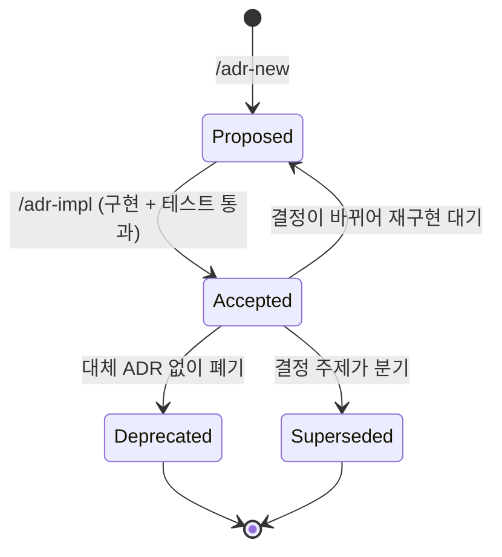

# Architecture Decision Records (ADR)

이 디렉토리는 프로젝트의 주요 아키텍처 결정을 문서화한다. ADR 은 코드 구현의 근거이며, 새 결정은 `/adr-new <category>` 로 직접 작성한다. ALPS (PRD) 가 함께 있는 프로젝트라면 Section 7 의 각 feature 를 `/feature-to-adr` helper 로 한 번에 ADR 로 변환할 수도 있다.

이 문서는 인덱스다. 상세 규칙·구조는 sub-doc 으로 분리해 둔다.

- [`authoring-rules.md`](./authoring-rules.md) — ADR 본문에 무엇을 넣고 무엇을 빼는지, 재생성 테스트·요구사항 관문과 두 단계 필터·요구사항 값 vs 구현 튜닝값·코드 참조 깊이·DB 동시 작업·리뷰 체크리스트
- [`structure.md`](./structure.md) — DDD 도메인(bounded context) × 피쳐 디렉토리 레이아웃, 피쳐 sub-folder 분할, subdomain 분류, [`ADR 레지스트리`](./structure.md#adr-레지스트리-mappingjson)(`.mapping.json` 정책)

## ADR이란?

Architecture Decision Record (ADR)는 소프트웨어 개발 과정에서 내린 중요한 아키텍처 결정을 기록하는 문서다. 각 ADR은 다음을 포함한다:

- **Context**: 결정이 필요했던 배경과 문제
- **Decision Drivers**: 옵션을 평가하는 데 사용된 압력·제약·요구사항 (선택지를 실제로 변별하는 것만)
- **Decision**: 내린 결정과 그 이유
- **대안 검토**: **최소 2개 이상**의 현실적 대안과 채택하지 않은 이유
- **Consequences**: 결정의 긍정적/부정적 영향

## ADR이 다루는 영역 — 비즈니스와 코드 사이의 회색지대

ADR 은 **비즈니스 요구사항(WHY)** 과 **코드(WHAT/HOW)** 사이에 끼어 있는 모호한 영역을 구체화하는 문서다. 이 회색지대만 ADR 에 적는다 — 여기서 회색지대는 "결정의 근거" 뿐 아니라 **결과물이 지켜야 하는 요구사항 계약**까지 포함한다 (아래 [재생성 테스트](#재생성-테스트--adr-완성도의-단일-기준)).


**회색지대에 해당하는 것들** — 코드만 읽어서는 동기와 근거가 안 보이는 결정, 그리고 **결과물이 지켜야 하는 계약**.

- 같은 요구사항을 풀 수 있는 **여러 접근 중 왜 이것을 골랐는가** (대안 비교와 채택 근거)
- 코드 곳곳에 흩어져 있어 한 곳에서 보지 않으면 안 보이는 **횡단 결정** (예: 토큰 회전 정책, 키 디자인 패턴, 상태 머신 전체)
- 비즈니스 규칙이 시스템 동작으로 **번역되는 방식** (예: "가입 후 7일 grace period" → 어떤 트리거·테이블·상태값으로 표현되는가)
- **결과물이 지켜야 하는 요구사항 값** — 최대 턴 수, 횟수 한도, 보존 기간, 크기 상한, 응답 목표치처럼 개발자가 임의로 바꾸면 요구사항 위반이 되는 숫자. 값과 근거를 그대로 적는다 (구현이 성능을 위해 고른 튜닝값은 반대로 적지 않는다 — 판정 기준은 [`authoring-rules.md`](./authoring-rules.md#구체적인-숫자--요구사항-값은-반드시-적고-구현-튜닝값은-적지-않는다))
- 도메인 모델 사이의 **개념 수준 관계** (필드 정의가 아니라 "Flashcard 와 Vocabulary 는 phrase hash 로 연결된다" 수준)
- 외부 시스템·서비스에 의존할 때의 **fallback / degradation 정책**
- 한 결정이 가진 **의도된 트레이드오프와 리스크**

**회색지대가 아닌 것들** — 에이전트/리뷰어가 그 ADR 이 다스리는 코드를 직접 읽으면 알 수 있고 **요구사항도 아닌** 것은 ADR 의 일이 아니다. 함수/클래스 책임 분담, 시그니처, 필드 타입, 디자인 패턴, 디렉토리 레이아웃, 에러 메시지 문구, 환경 변수 이름, 의사코드, 성능 튜닝값 등은 코드와 docstring·README·AGENTS.md 가 source of truth 다. ADR 에 옮겨 적으면 코드 변경 때마다 ADR 도 함께 갱신해야 하는 부담만 늘고 drift 가 쌓인다. 자세한 금지/유지 항목 표는 [`authoring-rules.md`](./authoring-rules.md#adr에-포함하지-않는-것) 참조.

### 재생성 테스트 — ADR 완성도의 단일 기준

ADR 의 목표는 **같은 코드를 재현하는 것이 아니라, 다시 만들어진 코드가 비즈니스 요구사항을 만족하게 하는 것**이다.

> 코드가 전부 지워지고 이 ADR 만 남았을 때, 이것만 읽고 요구사항을 정확히 지키는 코드를 다시 만들 수 있는가?

- **구현 방법·구조·이름은 달라도 된다** — ADR 에 없으므로 재량이다.
- **결과물이 지켜야 하는 것은 하나도 빠질 수 없다** — 빠지면 재생성된 코드가 요구사항을 어긴다.

이 테스트가 아래 [코드 직독 테스트](#코드-직독-테스트-2차-필터)보다 우선한다. 전체 정의와 요구사항 관문은 [`authoring-rules.md`](./authoring-rules.md#adr-이-만족시켜야-하는-것--재생성-테스트).

### 의존성은 단방향, 참조는 어느 방향으로도 직접 적지 않는다

PRD → ADR → 코드 는 **논리적 단방향 의존**이다. 안쪽(=상류) 레이어가 바뀌면 바깥쪽이 따라 바뀌지만, 그 반대는 일어나면 안 된다.


참조는 **양쪽 변(PRD↔ADR, ADR↔코드) 어디에도 직접 적지 않는다**. PRD↔ADR 는 아예 저장하지 않고(adr-writer 는 ALPS 를 참조하지 않는다), 카테고리·ADR·`dependsOn` 의 연결만 외부 매핑 레이어(`.mapping.json`) 한 곳에 둔다.

- **ADR → 코드 참조 금지**: ADR 에 파일·함수·줄 번호를 적지 않는다. 자세한 규칙은 [`authoring-rules.md`](./authoring-rules.md#코드-참조-깊이--폴더-단위까지만).
- **코드 → ADR 참조 금지**: 주석·상수·import 에 ADR ID 나 경로를 남기지 않는다. ADR 번호는 split / rollup / supersede 로 이동하므로, 코드가 ADR ID 를 들고 있으면 결정이 바뀌지 않았는데도 구조 변경이 코드 줄줄이 수정을 강제한다.
- **ADR → PRD 참조 금지**: ADR 본문(Context·Related 포함)에 ALPS 파일 경로·Section 번호·feature-id 를 적지 않는다. ADR 은 PRD 의 *동기를 흡수*하되 PRD 를 _가리키지_ 않는다 — PRD feature 가 split / 재번호 / 재구성되면, 결정이 바뀌지 않았는데도 ADR 본문 수정을 강제하기 때문이다. PRD 의 user story·acceptance criteria 를 ADR 에 복사하지도 않는다 (중복 → drift).
- **PRD → ADR 참조 금지**: ALPS 문서가 특정 ADR ID·경로를 본문에 적지 않는다. PRD 는 가장 안정적인 계약이며 하류 산출물을 알지 못한다.
- **ADR 결정이 바뀌면 코드는 바뀐다 / PRD 가 바뀌면 ADR·코드가 바뀐다** — 그게 단방향 의존이 의도하는 정상 흐름이다. 역방향(코드 변경이 ADR 을, ADR 변경이 PRD 를 끌고 가는 것)은 일어나면 안 된다.
- **연결은 외부 매핑 레이어에 둔다**: [`docs/adr/.mapping.json`](./structure.md#adr-레지스트리-mappingjson) 이 ADR 인덱스(카테고리 → adrs, 각 adr 의 path·status·summary)와 카테고리 간 `dependsOn` 을 한 곳에 기록한다. **PRD 참조는 매핑에 저장하지 않는다** — adr-writer 는 ALPS 를 참조하지 않는다. ADR↔코드 도 본문에서 직접 가리키지 않고(코드는 그때그때 탐색), 이 매핑이 카테고리·ADR·의존을 잇는 유일한 결합점이다.
- **안정성 기울기 검증**: 변경 빈도가 `Code >> ADR >> PRD` 를 따라야 한다. 휘발성 높은 레이어의 변경이 안정 레이어의 변경을 끌고 다닌다면, 화살표가 잘못 그려진 것 — 보통 ADR 이 코드 디테일을 들고 있거나, 코드가 ADR ID 를, ADR 이 ALPS 경로를 들고 있다.

### 코드 직독 테스트 (2차 필터)

먼저 **요구사항 관문**을 묻는다 — "이 사실이 빠지면 ADR 만 보고 다시 만든 코드가 요구사항을 어길 수 있는가?" YES 면 아래 필터를 적용하지 않고 **무조건 남긴다.**

관문을 통과하지 못한(=요구사항이 아닌) 줄에만 다음을 묻는다.

> "에이전트가 이 ADR 이 다스리는 코드를 그대로 읽으면, 이 사실을 발견할 수 있는가?"
>
> **YES** → ADR 에 넣지 않는다 (코드가 source of truth).
> **NO** → 회색지대 후보다. 그 다음으로 [리트머스 테스트](./authoring-rules.md#요구사항-관문과-두-단계-필터)를 통과해야 ADR 에 들어간다.

관문에서 남긴 것 + 두 필터를 모두 통과한 것만 ADR 본문에 남긴다. 세 질문의 전체 정의는 [`authoring-rules.md`](./authoring-rules.md#요구사항-관문과-두-단계-필터).

## ADR이 다루는 결정의 종류

다음 중 하나에 해당하면 ADR을 작성한다.

| 종류             | 예                                                                                     |
| ---------------- | -------------------------------------------------------------------------------------- |
| **도메인 결정**  | 인증 방식, 결제 모델, 권한 체계, 핵심 도메인 엔티티의 관계와 상태 머신                 |
| **인프라 결정**  | 배포 토폴로지, 캐시 전략, 모니터링·알람 구조, CDN/이미지 처리 정책                     |
| **데이터 결정**  | DB 키 디자인(PK/SK/GSI), 단일 테이블 vs 다중 테이블, 마이그레이션 전략                 |
| **외부 연동**    | LLM/결제/메일/푸시 등 외부 서비스 선정과 graceful degradation 정책                     |
| **보안·운영**    | 비밀 관리 전략, 토큰 회전, 감사 로그 범위, 백업/복구 RPO·RTO                           |
| **UX 아키텍처**  | 라우팅 구조, 상태 관리 라이브러리 선택, 디자인 시스템 채택 — 토큰 자체는 디자인 문서로 |
| **마이그레이션** | API 버전 전환 전략, 백필 절차의 안전성, downtime 허용 범위                             |

ADR 폴더는 **DDD 도메인(bounded context) × 피쳐(vertical slice)** 두 축으로 묶는다 — 최상위 폴더(`docs/adr/<context>/`)는 도메인 전문가의 모델 경계(bounded context), sub-folder(`<context>/<feature>/`)는 한 사용자 동작의 vertical slice 다. ALPS Section 7 의 feature 는 그 sub-folder(또는 피쳐가 하나뿐이라 평면으로 둔 context 폴더)와 1:1 매핑된다. 기술 레이어로 폴더를 만들지 않는 이유, subdomain 분류(core/supporting/generic), cross-cutting context 사용 조건은 [`structure.md`](./structure.md#디렉토리-구조--ddd-도메인bounded-context--피쳐vertical-slice).

## ADR이 아닌 것 (anti-patterns)

다음은 ADR로 만들지 않는다. 만들면 ADR 신뢰도가 떨어지고 검토 부담만 커진다.

- **버그 수정 결정** — "이 함수의 null 체크를 추가했다"는 ADR 사유가 아니다. 코드와 커밋 메시지로 충분
- **스타일/포매팅 변경** — Prettier·ESLint 규칙 변경은 PR 설명·CONTRIBUTING.md 영역
- **의존성 패치 업그레이드** — `lodash 4.17.20 → 4.17.21`. 메이저 업그레이드(`React 17 → 18`)는 ADR 후보
- **리팩토링** — 함수 분리·이름 변경부터 인터페이스 정리·모듈 재배치까지, 동작을 바꾸지 않는 구조 변경은 ADR 대상이 아니다. 코딩 에이전트의 플래닝 기능이 변경 범위와 호출자 영향을 그때그때 계획하므로, 그 계획을 ADR 로 옮겨 적을 필요가 없다 (계획은 코드와 함께 휘발되는 것이 정상이고, ADR 로 굳히면 안정 레이어가 리팩터링에 끌려다닌다). 단 리팩터링이 **결정 자체를 바꾸면**(채택 대안 교체, 상태 머신·키 디자인 변경, 외부 의존 fallback 변경) 그건 리팩터링이 아니라 결정 변경이므로 해당 ADR 을 갱신한다
- **임시 실험·POC** — "다음 주에 결정" 단계는 결정이 확정된 뒤 ADR로 적는다
- **개인 작업 가이드** — "이 모듈은 항상 internal/ 하위에 둔다" 같은 컨벤션은 AGENTS.md/README

판단이 애매하면 [요구사항 관문과 두 단계 필터](./authoring-rules.md#요구사항-관문과-두-단계-필터)를 적용한다.

## ADR vs ALPS vs 디자인 문서

세 문서는 같은 결정을 **다른 추상화 레벨에서** 다룬다. 같은 정보를 중복으로 적지 않는다.

| 문서                      | 답하는 질문              | 예                                                           |
| ------------------------- | ------------------------ | ------------------------------------------------------------ |
| **ALPS PRD**              | WHAT / WHY (사용자 관점) | "이메일 가입 feature를 추가한다. 신규 가입 전환율 +10% 목표" |
| **ADR**                   | HOW (아키텍처 관점)      | "JWT는 단기 access + 7일 refresh로 회전한다"                 |
| **디자인 문서/토큰**      | HOW (시각·인터랙션 관점) | "primary 컬러, 입력 필드 높이 48px, 에러 토스트 패턴"        |
| **코드/AGENTS.md/README** | HOW (상세 구현)          | "파일 구조, 함수 시그니처, 커넥션 풀 크기, 셋업 명령어"      |

ADR 행의 "7일" 이 뭉개지지 않고 그대로 있는 점에 주의한다 — **요구사항 값은 ADR 이 보관하고**, 같은 결정을 실현하는 튜닝값(풀 크기·백오프)은 코드가 보관한다.

규칙: ALPS의 user story·acceptance criteria를 ADR에 복사하지 않는다 — 위 [의존성 모델](#의존성은-단방향-참조는-어느-방향으로도-직접-적지-않는다)대로 ADR 은 ALPS 의 동기를 흡수하되 PRD 를 가리키지 않는다 (adr-writer 는 ALPS 를 참조하지 않는다). 디자인 토큰 값은 디자인 문서로, 함수 시그니처·파일 경로는 코드와 docstring으로 간다.

## 상태



`Superseded` 는 `Superseded by [ADR XXXX](link)` 형태로 후속 ADR 을 명시한다.

| 상태       | 의미                                                                                            |
| ---------- | ----------------------------------------------------------------------------------------------- |
| Proposed   | ADR이 시스템에 제안된 상태. 결정 자체는 합의되었더라도 **아직 코드 구현이 끝나지 않음**         |
| Accepted   | **코드 구현이 완료된 상태**. ADR이 묘사하는 동작이 실제로 코드베이스에 존재하고 테스트를 통과함 |
| Deprecated | 더 이상 유효하지 않음. 대체 ADR 없이 폐기                                                       |
| Superseded | 새로운 ADR로 대체됨. `Superseded by [ADR XXXX](link)` 형태로 후속 ADR을 명시                    |

### 자동 전환 규칙

상태는 **사람이 손으로 묻고 바꾸는 값이 아니라 사이클이 자동으로 갱신하는 값**이다.

- `/adr-new`(또는 그것에 위임하는 `/feature-to-adr`)로 새 ADR이 만들어지면 항상 `Proposed`로 저장된다. 사용자에게 "Accepted로 할까요?"를 묻지 않는다.
- `/adr-impl`이 ADR을 구현하고 테스트가 통과하면 그 명령이 ADR Status를 `Accepted`로 자동 갱신한다. 승격 여부를 따로 확인하지 않는다.
- `/adr-sync`는 코드와 ADR을 대조해 Status drift를 잡는다: ADR이 `Accepted`인데 묘사한 동작이 코드에 없으면 `Proposed`로 되돌리고, ADR이 `Proposed`인데 코드+테스트가 있으면 `Accepted`로 올린다. (`Accepted`의 기준은 위 상태 표와 같이 **구현 + 테스트 통과**다 — 코드 존재만으로 올리지 않는다.)
- **요구사항 변경으로 이미 `Accepted`된 ADR의 결정이 실제로 바뀌면**(제자리 수정이라도 결정 방향이 달라졌으면 — 판정은 [`authoring-rules.md` "요구사항 변경으로 ADR을 고칠 때"](./authoring-rules.md#요구사항-변경으로-adr을-고칠-때--edit-in-place-vs-supersede-판정) 참조), 새 결정이 코드·테스트로 반영되기 전까지 Status를 `Proposed`로 되돌린다. 이후 `/adr-impl`이 다시 `Proposed → Accepted`로 자동 승격한다. supersede라면 되돌리는 대신 옛 ADR을 `Superseded`로 표기하고 새 ADR을 `Proposed`로 시작한다. 단순 구현 사실 정정(API 표·엔티티명 등)은 결정이 안 바뀐 것이므로 이 규칙 대상이 아니다 — `Accepted`를 유지한다.
- 상태 전환 시 날짜를 함께 기록한다: `Accepted (YYYY-MM-DD)`, `Deprecated (YYYY-MM-DD)`. **괄호 안에는 날짜만 넣는다** — `Accepted (2026-07-09)` 처럼 날짜 하나뿐이며, 그 뒤에 참조·feature-id·구현 설명 같은 부가 텍스트를 붙이지 않는다 (`Accepted (2026-07-09) — F1 구현`, `Accepted (2026-07-09, ref)` 모두 금지 — `adr-structure-lint` 가 `date-only` 로 잡는다). `Superseded`는 날짜 대신 후속 ADR 링크로 표기한다 (`Superseded by [ADR XXXX](link)`). `Proposed`에는 날짜를 붙이지 않는다 — 작성일은 본문 최상단 `Date:`(작성 시점, Status 전환일과 별개)에 두고, Status 줄의 날짜는 전환 시에만 기록한다.
- `Implemented`, `Done`, `Completed` 같은 비공식 상태는 사용하지 않는다.

### 진화 이력은 어디에 사는가 — decision-log.md

ADR 본문은 **현재 코드 상태를 설명하는 요구사항 문서**다 — "처음엔 ~였다가 ~로 바꿨다" 같은 시간축 서술을 본문에 남기지 않는다. 같은 결정이 진화하면 **기존 ADR 을 현재 상태로 덮어쓰는 것(edit-in-place)이 기본**이고, 그 전환이 major(채택 대안 교체·핵심 알고리즘/아키텍처 변경·Driver 반전·폐기)면 카테고리별 `docs/adr/<category>/decision-log.md` 에 역순 한 줄로 남긴다. 새 ADR(supersede)은 결정 주제가 분기해 옛 결정을 별개 레코드로 공존시켜야 할 때만 만든다 (판정: [`authoring-rules.md` "요구사항 변경으로 ADR을 고칠 때"](./authoring-rules.md#요구사항-변경으로-adr을-고칠-때--edit-in-place-vs-supersede-판정)).

**세 층이 각자 다른 것을 보존한다**: ADR 본문 = 현재 상태 / `decision-log.md` = 주요 변경의 시간축 / Git = verbatim diff. 로그는 ADR 이 아닌 **컨벤션 파일**이라 `.mapping.json` 에 등록하지 않고 결정론적 하네스도 검사하지 않는다 — 기록 기준·포맷은 [`authoring-rules.md` "결정 로그 (decision-log.md)"](./authoring-rules.md#결정-로그-decision-logmd), 디렉토리·미인덱스 정책은 [`structure.md`](./structure.md#결정-로그-decision-logmd--매핑에-등록하지-않는-컨벤션-파일).

## ADR 템플릿

```markdown
# ADR XXXX: 제목

Date: YYYY-MM-DD

## Status

Proposed | Accepted (YYYY-MM-DD) | Deprecated (YYYY-MM-DD) | Superseded by [ADR XXXX](link)

<!-- Accepted/Deprecated 괄호에는 전환 날짜만 — 그 뒤에 참조·설명을 붙이지 않는다. -->

## Context

결정이 필요한 배경과 문제. PRD 의 비즈니스 동기를 여기서 *흡수*해 서술한다 — ALPS 파일 경로·Section 번호·feature-id 를 본문에 적지 않는다. PRD 를 가리키지 않는다 (adr-writer 는 ALPS 를 참조하지 않는다).

## Decision Drivers

- 이 결정을 변별하는 압력·제약·요구사항 3-5개. 일반적인 품질 속성("유지보수성") 이 아니라 옵션 사이의 선택을 실제로 가르는 것만.
- 예: "동시 사용자 10k 처리", "PII 가 외부로 나가면 안 됨", "팀이 Go 경험만 있음".

## Decision

내린 결정과 그 이유.

### 요구사항 계약

(결과물이 지켜야 하는 것 — 코드가 사라져도 이것만 보고 다시 만들 수 있게. 한도·정원·주기·보존 기간·허용 범위 같은 **요구사항 값은 숫자와 근거를 그대로** 적는다. 예: "채팅 한 세션은 최대 20턴 — 요금제 정책". 구현 튜닝값(풀 크기·백오프·캐시 TTL)은 적지 않는다.)

### 시퀀스 다이어그램

비동기 처리·서비스 간 연동·이벤트 흐름이 포함된 결정이라면 Mermaid 다이어그램을 추가한다.

### 대안 검토

**최소 2개 이상**의 현실적 대안을 비교한다. 진짜 대안만 — strawman(누가 봐도 안 될 옵션) 은 넣지 않는다. 각 대안의 pros/cons 는 위 Decision Drivers 에 비추어 적는다. 진짜로 외길이라 대안이 없다면, 그 결정에 ADR 자체가 필요한지 다시 판단한다.

## Consequences

### Positive / Negative / Risks

## Implementation Notes

(선택 섹션 — 아키텍처 수준의 구현 고려사항이 있을 때만 둔다. 없으면 생략한다.) 아키텍처 수준의 구현 고려사항만. 코드 스니펫·파일 경로·필드별 스키마·구현 튜닝값은 포함하지 않는다. 요구사항 값은 여기가 아니라 Decision 의 요구사항 계약에 둔다.

## Related

- 관련 ADR: [...] (같은/의존 카테고리의 ADR 링크 — ADR ↔ ADR 참조는 정상)
- 스키마/테이블 문서: [...] (DB 변경이 있는 경우)

> adr-writer 는 standalone 이므로 ADR 본문은 PRD 를 가리키지 않는다 — 여기에도 ALPS feature 링크를 적지 않는다. 매핑도 PRD 참조를 저장하지 않는다.
```

## ADR 인덱스는 어디에 있나

ADR 목록은 이 README 가 아니라 [`docs/adr/.mapping.json`](./structure.md#adr-레지스트리-mappingjson) 이 단일하게 들고 있다 — 카테고리별 `adrs[]` 레코드마다 path·Status·한 줄 summary 를 담으며, 이 인덱스는 UserPromptSubmit hook 이 매 턴 렌더링한다. 그래서 README 는 별도의 ADR 목록을 두지 않고, ADR 이 무엇인지·회색지대 모델·의존성 모델·템플릿 같은 **개념 인덱스**만 유지한다. 새 ADR 을 추가하거나 본문 결정이 바뀌면 그 한 줄 요약은 `.mapping.json` 의 해당 `adrs[]` 레코드(path·status·summary)에 갱신한다.

## 참고

- [ADR GitHub](https://adr.github.io/) — ADR 일반 자료 모음
- [Joel Parker Henderson — ADR templates](https://github.com/joelparkerhenderson/architecture-decision-record) — 다양한 템플릿 비교
- [Michael Nygard — Documenting Architecture Decisions](https://cognitect.com/blog/2011/11/15/documenting-architecture-decisions) — 원조 ADR 글
- [adr-writer plugin](https://github.com/haandol/alps-writer-plugins) — 이 plugin 자체
