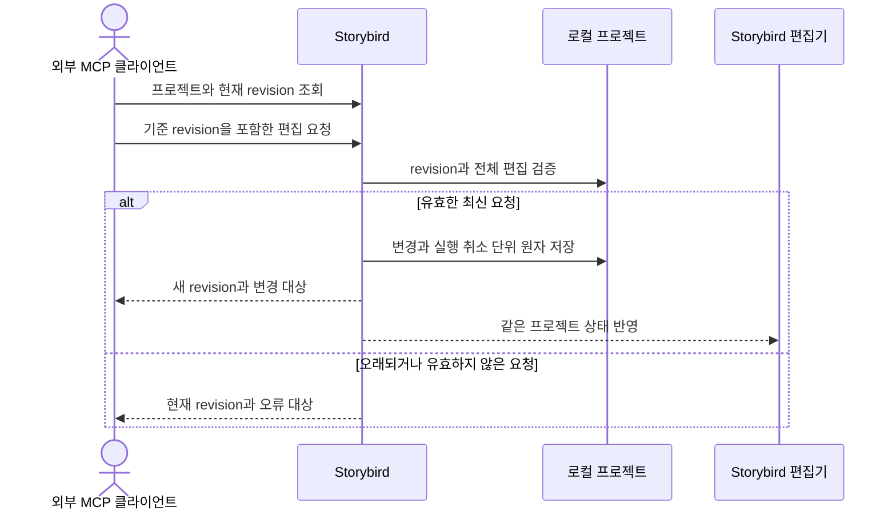

# ADR 0001: 외부 MCP 편집은 Storybird 명령과 revision 충돌 검증을 사용한다

Date: 2026-09-05

## Status

Accepted (2026-09-05)

## Context

외부 MCP 클라이언트는 녹화 후 Click Cue 문구를 채우고 클립, 자막, 효과와 편집 제안을
수정해야 한다. 프로젝트 파일을 직접 쓰게 하면 Storybird 검증을 우회하고 사람 UI와 동시에
편집할 때 최신 상태를 잃을 수 있다.

화면 해석과 문구 작성은 외부 클라이언트의 책임이지만 프로젝트 변경은 Storybird가 소유해야
한다. UI와 MCP는 같은 속성·검증·실행 취소 결과를 제공하고, 오래된 에이전트 상태는 사용자의
최신 편집을 덮어쓰면 안 된다.

## Decision Drivers

- 외부 MCP 클라이언트가 UI의 모든 편집 속성을 사용할 수 있어야 한다.
- 프로젝트 파일과 영상 자산은 Storybird만 기록해야 한다.
- UI와 MCP의 동시 편집은 오래된 상태를 조용히 덮어쓰면 안 된다.
- 한 명령의 연결된 클립·레이어 변경은 부분 적용 없이 함께 저장돼야 한다.
- 비파괴 프로젝트 편집은 화면 제어 세션이나 반복 네이티브 승인에 의존하면 안 된다.

## Decision

인증된 로컬 MCP 연결은 기기 안의 모든 Storybird 프로젝트를 나열하고 현재 편집 상태와
revision을 조회한다. 외부 클라이언트는 Storybird 명령을 통해 프로젝트 이름·설명, 클립
타임라인, Click Cue, 독립 자막, 데모 효과와 클릭 편집 제안을 변경한다.

모든 변경 요청은 조회한 기준 revision을 포함한다. Storybird는 현재 revision과 일치하는
요청만 검증하고, 한 명령과 연결된 시간·레이어 변경을 원자적인 프로젝트 편집과 실행 취소
단위 하나로 저장한다. 성공한 실제 변경은 새 revision과 변경 대상 식별자를 반환한다. 오래된
revision, 잘못된 대상과 잘못된 속성은 어떤 프로젝트 상태도 바꾸지 않는다.

프로젝트 편집은 활성 화면 제어 세션 없이 사용할 수 있고 비파괴 명령마다 네이티브 승인을
반복하지 않는다. 프로젝트 영구 삭제는 이 편집 계약에 포함하지 않는다. 외부 클라이언트는
설명과 자막 문구를 프로젝트 명령으로 전달하며 Storybird는 키보드를 합성하거나 문구를 생성하지
않는다.

### Requirement contract

#### Required guarantees

- 인증된 로컬 MCP 연결은 모든 로컬 프로젝트의 메타데이터, 편집 모델과 현재 revision을 조회할
  수 있다 — 로컬 자동화 가시성 계약이다.
- MCP에서 편집 가능한 속성은 UI에서 편집 가능한 프로젝트 속성의 `100%`다 — 편집 경로
  동등성 목표다.
- MCP는 프로젝트 이름·설명, 클립 분할·트림·삭제·재배치·속도·정지 구간, 실행 취소·재실행을
  편집할 수 있다 — 비파괴 타임라인 자동화 범위다.
- MCP는 Click Cue 전체·미완성 목록, 클릭 표시·설명·Cue 자막, 독립 자막을 조회·생성·수정·
  삭제할 수 있다 — 안내 레이어 자동화 범위다.
- MCP는 스포트라이트, 팬·줌, 타이틀·CTA와 클릭 편집 제안을 조회·생성·수정·삭제·적용·거부할
  수 있다 — 데모 효과 자동화 범위다.
- 모든 변경 요청은 기준 revision을 포함한다 — 동시 편집 검증 계약이다.
- 현재 revision과 일치하는 실제 변경은 프로젝트와 연결 레이어를 원자적으로 저장하고 revision을
  정확히 `1` 진행시킨다 — 변경 순서 계약이다.
- 성공한 변경은 새 revision과 변경된 대상 식별자를 반환한다 — 후속 편집 기준 계약이다.
- 한 명령과 이에 연결된 클립·레이어 시간 변경은 프로젝트 편집 및 실행 취소 단위 `1개`다 —
  원자적 사용자 동작 계약이다.
- 실제 상태 변화가 없는 동일 값 요청으로 증가하는 revision과 실행 취소 기록은 각각 `0개`다 —
  멱등 편집 계약이다.
- 비파괴 프로젝트 편집은 화면 제어 세션 없이 사용할 수 있다 — 프로젝트·화면 권한 분리
  계약이다.
- 비파괴 편집 명령마다 네이티브 승인을 반복하지 않는다 — 로컬 도구 자동화 계약이다.
- `1080p`, `120초`, 시간 기반 레이어 `100개`인 프로젝트에서 성공한 변경의 `95%`는
  `500ms` 안에 Storybird UI 프리뷰에 반영된다 — MVP 반응성 목표다.
- 외부 MCP 클라이언트가 입력한 설명·자막 문구는 프로젝트 텍스트로 저장하고 대상 앱의
  키보드 입력으로 합성하지 않는다 — 텍스트 입력 경계다.
- Storybird 애플리케이션만 프로젝트와 영상 자산을 검증하고 기록한다 — 단일 작성자 계약이다.

#### Prohibitions

- 외부 MCP 클라이언트와 companion은 프로젝트 파일 또는 앱 소유 영상 자산을 직접 수정하지
  않는다.
- 오래된 revision의 요청은 현재 프로젝트를 덮어쓰지 않는다.
- 한 요청의 속성이나 연결 레이어 중 하나가 유효하지 않으면 유효한 일부만 저장하지 않는다.
- 존재하지 않거나 이미 삭제된 대상 식별자를 새 대상으로 자동 생성하지 않는다.
- 이 편집 계약은 프로젝트 영구 삭제를 제공하지 않는다.
- Storybird는 설명·자막·효과 문구를 자동 생성하거나 키보드 이벤트를 합성하지 않는다.
- Storybird는 LLM을 실행하거나 모델 API를 호출하거나 모델 API 키를 저장하거나 자체 외부
  네트워크 경로를 사용하지 않는다.

#### Failure guarantees

- 오래된 revision은 현재 revision을 반환하고 프로젝트, revision과 실행 취소 기록을 변경하지
  않는다.
- 존재하지 않는 대상 또는 잘못된 시간·좌표·스타일·상태 전환은 잘못된 대상과 속성을 반환하고
  프로젝트를 변경하지 않는다.
- 하나의 요청에 여러 속성이 있을 때 하나라도 실패하면 전체 요청을 거부한다.
- 프로젝트 저장이 실패하면 프로젝트, revision과 실행 취소 기록을 명령 전 상태로 유지한다.
- 인증된 로컬 연결이 종료되면 이후 프로젝트 조회와 편집 명령을 거부한다.

#### Observable evidence

- 외부 MCP 클라이언트는 별도 프로젝트 승인 화면 없이 모든 로컬 프로젝트의 현재 상태와
  revision을 조회한다.
- UI의 편집 속성 목록과 MCP 편집 속성 목록을 비교하면 누락된 UI 속성이 `0개`다.
- 외부 클라이언트가 클립, Cue 문구, 자막, 효과와 제안을 편집하면 같은 변경이 Storybird UI에
  나타난다.
- UI와 MCP가 같은 revision으로 서로 다른 변경을 요청하면 먼저 성공한 변경만 저장되고 다른
  요청은 현재 revision을 반환한다.
- 성공한 실제 변경은 revision을 하나 증가시키고 동일 값 요청은 revision과 실행 취소 기록을
  바꾸지 않는다.
- 연결된 클립·레이어 변경은 실행 취소 한 번으로 함께 복원된다.
- 화면 제어 세션이 없어도 프로젝트 편집은 동작하고 편집 명령마다 네이티브 승인 화면이 나타나지
  않는다.
- 기준 프로젝트의 성공한 변경 `100회` 중 `95회` 이상이 `500ms` 안에 UI 프리뷰에 나타난다.
- 잘못된 속성을 섞은 요청 뒤 프로젝트, revision과 실행 취소 기록은 명령 전과 같다.
- 프로젝트 파일을 직접 수정할 권한 없이 Storybird 명령만으로 전체 편집 시나리오를 완료한다.
- 프로젝트 편집 명령 집합에는 영구 삭제가 없고, 인증된 로컬 연결을 종료하면 이후 조회와
  편집 요청이 모두 거부된다.
- 모델 API 키, 키보드 합성과 외부 네트워크 없이 외부 클라이언트가 제공한 문구를 프로젝트에
  저장한다.

### Edit flow

### Alternatives

#### 외부 MCP 클라이언트가 프로젝트 파일을 직접 수정한다

도구 호출 수는 줄지만 앱 검증과 원자 저장을 우회하고 UI와 동시에 파일을 쓸 수 있다. 프로젝트
단일 작성자와 revision 충돌 계약을 만족하지 못한다.

#### 외부 클라이언트가 Storybird UI를 접근성 자동화로 조작한다

별도 프로젝트 명령이 필요 없지만 UI 배치와 포커스에 의존하고 숨겨진 속성이나 원자 편집을
안정적으로 다루기 어렵다. UI와 같은 도메인 명령을 MCP에 직접 제공한다.

#### revision 없이 마지막 요청이 항상 이기게 한다

요청 형식은 단순하지만 사람 또는 에이전트의 최신 변경을 조용히 잃을 수 있다. 기준 revision을
통해 충돌을 명시한다.

#### 편집 명령마다 네이티브 승인을 요구한다

각 변경을 사용자가 확인할 수 있지만 외부 에이전트의 다단계 편집이 모든 명령에서 멈춘다.
인증된 로컬 연결의 비파괴 편집은 반복 승인 없이 허용한다.

## Consequences

### Positive

- 외부 MCP 클라이언트가 UI와 같은 전체 편집 기능을 안정적으로 사용한다.
- 사람과 에이전트의 동시 편집 충돌을 조용히 덮어쓰지 않는다.
- 프로젝트 파일과 자산은 Storybird 단일 작성자 경계 안에 남는다.

### Negative

- 모든 편집 명령과 응답이 revision을 다뤄야 한다.
- 외부 클라이언트는 충돌 시 최신 프로젝트를 다시 읽고 편집을 재계산해야 한다.
- 인증된 연결은 모든 로컬 프로젝트의 편집 모델을 볼 수 있다.

### Risks

- UI에 새 편집 속성을 추가하면서 MCP 대응을 누락하면 `100%` 동등성 계약을 위반한다.
- 연결 레이어 변경을 원자 단위에 포함하지 않으면 실행 취소와 프로젝트 시간이 어긋날 수 있다.

## Related

- [안정적인 서명 신원과 분리된 MCP 권한 경계를 사용한다](../recording/0003-permission-and-signing.md)
- [영상 프로젝트와 편집 revision을 기기 안에 원자적으로 저장한다](../library/0001-local-project-library.md)
- [원본 영상을 보존하는 비파괴 클립 타임라인을 사용한다](../timeline-editing/0001-non-destructive-clip-timeline.md)
- [영상 레이어와 합성 프리뷰가 하나의 프로젝트 시간축을 사용한다](../authoring/0001-timeline-overlay-editor.md)
- [제품 데모 효과를 시간 기반 레이어로 편집한다](../demo-effects/0001-timed-demo-effects.md)
- [클릭마다 비파괴 편집 제안 묶음을 결정론적으로 생성한다](../click-edit-suggestions/0001-deterministic-click-suggestions.md)
