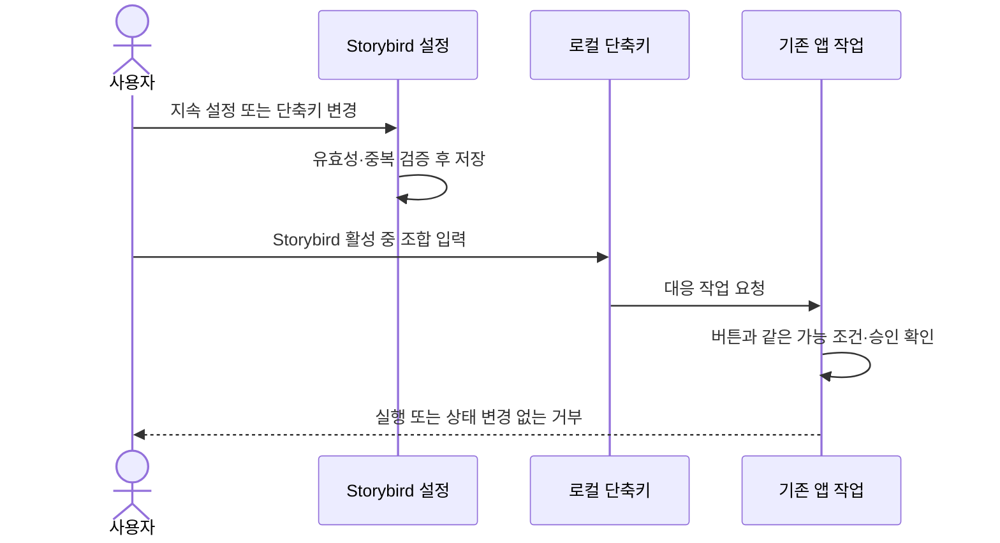

# ADR 0001: 네이티브 설정 창에서 지속 설정과 작업 단축키를 관리한다

Date: 2026-09-09

## Status

Accepted (2026-09-09)

## Context

Storybird 설정은 현재 서비스 소개와 프로젝트 저장 경로만 보여 준다. 음성 모델, 프로필과 입력
장치처럼 앱을 다시 열어도 유지되어야 하는 값이 프로젝트 작업 화면에 섞여 있고, 자주 쓰는
녹화·가져오기·내보내기 작업은 마우스로만 실행해야 한다.

Storybird는 일반 macOS 앱이므로 다른 앱을 사용하는 동안 키를 가로채는 전역 단축키가 필요하지
않다. 단축키가 현재 작업의 비활성 조건, 권한 확인 또는 파괴적 확인을 우회해서도 안 된다.

설정 탭마다 내용 높이가 다르다. 창이 내용 크기를 따라 계속 변하면 탭 전환 때 위치와 크기가
흔들리고, 긴 탭은 화면 밖으로 커질 수 있다.

## Decision Drivers

- 지속되는 앱 설정을 프로젝트 편집과 분리해 한곳에서 찾을 수 있어야 한다.
- 키보드 사용자는 핵심 프로젝트 작업을 Storybird가 앞에 있을 때 실행할 수 있어야 한다.
- 사용자가 다른 앱이나 macOS와 충돌하는 단축키를 바꿀 수 있어야 한다.
- 단축키가 기존 작업 가능 조건과 사용자 승인 경계를 우회하면 안 된다.
- 설정 창은 탭마다 내용이 달라도 화면 안에서 안정적으로 사용할 수 있어야 한다.

## Decision

Storybird는 macOS의 네이티브 Settings 장면을 지속 설정의 단일 진입점으로 사용한다. 설정은
서비스·프로젝트 저장 위치를 관리하는 일반 영역, 로컬 음성 환경을 관리하는 음성 영역, 앱 작업
단축키를 관리하는 단축키 영역으로 나눈다. 창 크기는 고정하고 각 탭의 긴 내용은 창 안에서
스크롤한다.

일반 영역은 현재 프로젝트 폴더 표시, Finder 열기, 네이티브 폴더 선택과 기본 위치 복원을
제공한다. 폴더 전환은 저장소의 검증과 작업 중 변경 금지 규칙을 따른다. 기존 프로젝트는
이동하지 않으며 이전 폴더를 다시 선택해 볼 수 있음을 설명한다. 공유 음성 프로필과 모델은
Application Support 위치를 유지함을 함께 표시한다.

단축키는 Storybird가 활성 앱일 때만 동작하는 로컬 작업 단축키다. 사용자는 새 프로젝트,
녹화 시작·중지, 영상 가져오기와 영상 내보내기 조합을 바꿀 수 있고 선택은 앱 재실행 뒤에도
유지한다. 기본 조합은 각각 `⌘N`, `⇧⌘R`, `⇧⌘I`, `⇧⌘E`다. 설정 열기는 macOS 표준 `⌘,`
경로를 유지하며 사용자 지정 작업 목록에 넣지 않는다.

작업 단축키는 Command, Option 또는 Control 중 하나 이상을 포함해야 한다. Storybird 작업
사이에서 같은 조합을 중복 저장하지 않는다. 유효하지 않거나 중복된 조합은 저장하지 않고 기존
조합과 오류 설명을 유지한다. 단축키 입력을 기록하는 동안에는 앱 작업을 실행하지 않는다.

단축키는 해당 버튼이나 메뉴와 같은 작업 가능 조건을 사용한다. 예를 들어 녹화 중 가져오기,
원본 영상이 없는 프로젝트 내보내기와 승인되지 않은 권한 작업은 단축키로도 실행하지 않는다.
단축키 사용을 위해 Accessibility 권한이나 전역 키 감시를 추가하지 않는다.

### Requirement contract

#### Required guarantees

- macOS 네이티브 Settings 장면이 지속 앱 설정의 단일 진입점이다 — 설정 발견성 계약이다.
- 설정은 일반, 음성, 단축키 영역을 제공한다 — 설정 정보 구조 계약이다.
- 설정 창은 고정 크기를 유지하고 긴 탭은 창 내부에서 스크롤한다 — 화면 도달성 계약이다.
- 일반 영역은 현재 프로젝트 폴더, Finder 열기, 폴더 선택과 기본 위치 복원을 제공한다 —
  저장 위치 발견성과 변경 계약이다.
- 폴더 선택은 네이티브 폴더 선택 창에서 사용자가 직접 수행하며 취소는 현재 선택을
  변경하지 않는다 — 명시적 사용자 선택 계약이다.
- 폴더 변경이 금지된 작업 중에는 선택·기본 위치 복원을 비활성화하고 이유를 표시한다 —
  저장 작업 경계의 가시성 계약이다.
- 전환 실패는 현재 폴더와 프로젝트를 유지하고 설정에 오류를 표시한다 — 복구 가능성 계약이다.
- 기존 프로젝트를 이동하지 않는다는 점, 이전 폴더 재선택 방법과 공유 음성 자산의
  Application Support 위치 유지를 설명한다 — 데이터 위치 이해 계약이다.
- 새 프로젝트, 녹화 시작·중지, 영상 가져오기와 영상 내보내기는 사용자 지정 로컬 단축키를
  제공한다 — 키보드 작업 범위 계약이다.
- 기본 단축키는 각각 `⌘N`, `⇧⌘R`, `⇧⌘I`, `⇧⌘E`다 — 초기 작업 단축키 계약이다.
- 설정 열기는 macOS 표준 `⌘,`를 유지한다 — 플랫폼 관례 계약이다.
- 사용자 지정 단축키는 앱 재실행 뒤에도 유지한다 — 설정 지속성 계약이다.
- 작업 단축키는 Storybird가 활성 앱일 때만 동작한다 — 입력 범위 계약이다.
- 단축키는 Command, Option 또는 Control 중 하나 이상을 포함하고 Storybird 작업 사이에서
  중복되지 않는다 — 충돌 방지 계약이다.
- 거부된 단축키 변경은 기존 유효 조합을 유지하고 거부 이유를 표시한다 — 복구 가능성 계약이다.
- 단축키 입력 기록 중에는 어떤 Storybird 작업 단축키도 실행하지 않는다 — 편집 안전 계약이다.
- 단축키 실행은 대응 버튼·메뉴와 같은 활성 조건, 권한 확인과 파괴적 확인을 사용한다 —
  동작 동등성 계약이다.

#### Prohibitions

- 작업 단축키를 전역 등록하거나 다른 앱이 활성인 동안 가로채지 않는다.
- 단축키를 위해 Accessibility 권한, Input Monitoring 권한 또는 키보드 이벤트 저장을
  추가하지 않는다.
- 유효하지 않거나 중복된 조합을 저장하지 않는다.
- 단축키가 비활성 작업, 권한 승인 또는 삭제 확인을 우회하지 않는다.
- 탭 내용이 설정 창 자체를 화면 밖으로 확장하지 않는다.

#### Failure guarantees

- 저장된 단축키가 손상되거나 허용 규칙을 만족하지 않으면 해당 작업의 기본 조합으로 복구한다.
- 단축키 변경이 거부되어도 다른 단축키와 프로젝트 데이터는 바뀌지 않는다.
- 현재 작업을 실행할 수 없으면 단축키 입력은 프로젝트, 녹화와 내보내기 상태를 바꾸지 않는다.
- 설정 탭의 내용이 길어져도 마지막 항목은 내부 스크롤로 도달할 수 있다.
- Finder 열기에 실패하면 오류를 표시하고 선택된 폴더를 바꾸지 않는다.

#### Observable evidence

- `⌘,`로 설정을 열면 일반, 음성, 단축키 영역을 전환할 수 있고 창 크기는 바뀌지 않는다.
- 일반에서 폴더를 선택하면 경로와 프로젝트 목록이 함께 바뀌고 Finder 열기는 표시된 위치를
  연다. 선택 창을 취소하면 기존 경로를 유지한다.
- 녹화·가져오기·내보내기·음성 작업 중에는 폴더 선택·기본 위치 복원이 비활성화되고 이유를
  볼 수 있다. 실패한 선택은 오류 설명과 이전 위치를 유지한다.
- 긴 음성 설정의 마지막 프로필 작업까지 창 안에서 스크롤해 도달한다.
- 기본 상태에서 `⌘N`, `⇧⌘R`, `⇧⌘I`, `⇧⌘E`가 각각 표시된 작업을 실행한다.
- 단축키를 바꾸고 앱을 다시 열면 새 조합이 표시되고 동작한다.
- 수정자 없는 키나 다른 Storybird 작업과 같은 조합을 입력하면 기존 값이 남고 이유가 보인다.
- 단축키 입력 필드가 새 조합을 기다리는 동안 기존 작업 조합을 눌러도 프로젝트 작업이 실행되지
  않는다.
- 다른 앱이 앞에 있을 때 Storybird 작업 단축키를 눌러도 Storybird가 활성화되거나 작업을
  시작하지 않는다.
- 녹화 중 가져오기 또는 내보낼 원본이 없는 프로젝트 내보내기를 단축키로 요청해도 상태와
  프로젝트가 바뀌지 않는다.

### Settings and command flow

### Alternatives

#### 모든 설정을 프로젝트 작업 모달에 둔다

구현 위치는 적지만 프로젝트와 무관한 공유 자산, 장치와 단축키를 찾기 어렵고 현재 프로젝트
작업과 영구 설정이 섞인다.

#### 단축키를 전역 등록한다

다른 앱이 앞에 있어도 Storybird 작업을 시작할 수 있지만 시스템 전체 키 충돌과 추가 입력 권한
위험이 생긴다.

#### 단축키를 고정한다

설정 UI는 단순하지만 사용자 환경에서 다른 앱과 충돌한 조합을 복구할 수 없다.

#### 탭 내용에 맞춰 설정 창 높이를 바꾼다

짧은 탭의 빈 공간은 줄지만 탭 전환마다 창이 움직이고 긴 음성 설정이 화면 밖으로 커질 수 있다.

## Consequences

### Positive

- 사용자는 공유 음성 환경과 앱 단축키를 표준 위치에서 찾고 유지할 수 있다.
- 핵심 프로젝트 작업을 키보드로 실행하면서 기존 승인과 활성 조건을 유지한다.
- 설정 탭이 늘어나도 창 크기와 화면 도달성이 안정적이다.

### Negative

- 단축키 충돌 검증과 앱 작업 상태 연결을 유지해야 한다.
- 짧은 설정 탭에는 빈 공간이 남을 수 있다.

### Risks

- 로컬 단축키 처리와 메뉴 작업의 활성 조건이 갈라지면 단축키만 다른 동작을 할 수 있다.
- 텍스트 입력 중 작업 조합이 의도치 않게 실행되지 않도록 수정자와 단축키 기록 상태를 정확히
  구분해야 한다.

## Related

- [선택한 로컬 프로젝트 라이브러리를 원자적으로 저장한다](../library/0001-local-project-library.md)
- [본인 음성을 로컬에서 복제해 문장별 내레이션으로 사용한다](../voice-narration/0001-local-cloned-voice-narration.md)
