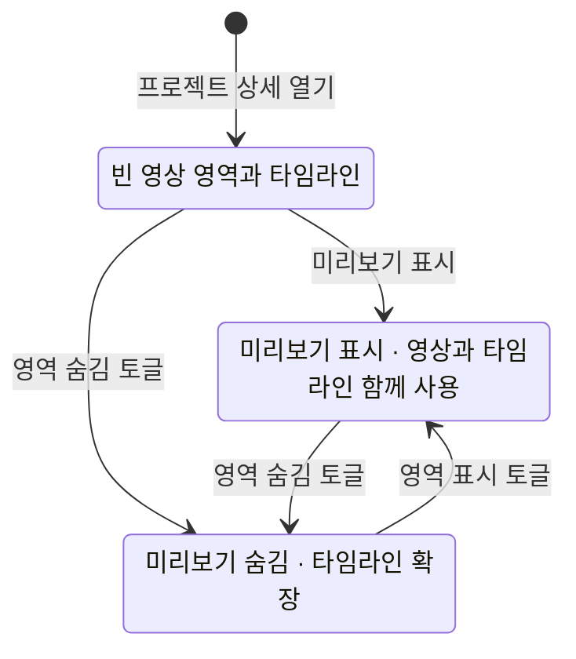
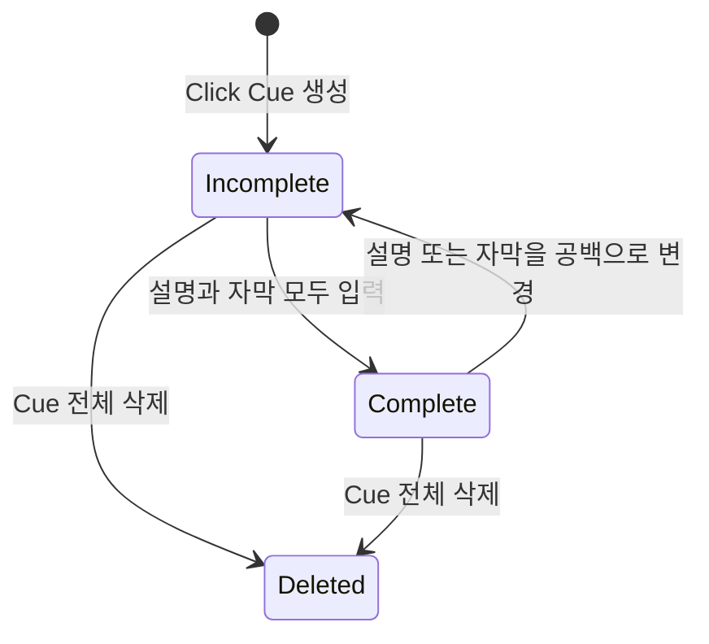

# ADR 0001: 영상 레이어와 합성 프리뷰가 하나의 프로젝트 시간축을 사용한다

Date: 2026-09-05

## Status

Accepted (2026-09-12)

## Context

제품 데모의 클릭은 위치만 보여 주는 이벤트가 아니다. 시청자가 클릭 대상과 의미를 함께
이해하려면 클릭 표시, 클릭 주변 설명과 화면 자막이 같은 시점에 나타나야 한다. 이 세 요소를
서로 독립적인 선택 레이어로 두면 일부 문구가 비어 있거나 편집 뒤 시간이 어긋난 상태로
내보내기 쉽다.

사람 UI, 외부 MCP 클라이언트, 합성 프리뷰와 MP4 내보내기는 같은 프로젝트 상태를 해석해야
한다. 서로 다른 시간·좌표·스타일 모델을 사용하면 편집기에서 확인한 안내가 결과 영상과
달라진다.

## Decision Drivers

- 유지하는 모든 클릭에 클릭 표시, 설명과 자막이 같은 클릭 시점을 포함해야 한다.
- 사람과 외부 MCP 클라이언트가 모든 레이어 속성을 동일하게 편집해야 한다.
- 프리뷰와 MP4가 같은 시간·좌표·스타일 결과를 보여야 한다.
- 원본 영상은 레이어 편집과 프리뷰로 변경되면 안 된다.
- 작은 창과 MCP 이미지 조회에서도 모든 편집·검증 동작에 접근할 수 있어야 한다.
- 빈 영상 영역으로 편집 화면의 구성을 보여 주고, 사용자가 경계를 드래그하거나 미리보기를
  숨겨 영상과 레이어에 배정할 세로 공간을 조절할 수 있어야 한다.

## Decision

Storybird는 편집된 클립 타임라인 위에 Click Cue, 독립 자막과 시간 기반 데모 효과를 배치한다.
Click Cue는 클릭 표시, 클릭 주변 설명과 상단 또는 하단 자막을 하나의 그룹으로 관리한다.
녹화 직후 설명과 자막은 비어 있으며 사람 또는 외부 MCP 클라이언트가 입력한다.

Click Cue의 세 요소는 각자 시간·위치·색상·크기와 투명도를 편집할 수 있지만 모두 클릭 시점을
포함해야 한다. 설명이나 자막이 비어 있는 Cue는 `미완성`, 둘 다 공백이 아닌 문구를 가지면
`완성`이다. 미완성 Cue는 프리뷰할 수 있지만 결과 영상으로 내보낼 수 없다.

합성 프리뷰는 편집된 영상, Click Cue, 독립 자막과 활성 데모 효과를 같은 프로젝트 시간으로
렌더링한다. UI는 재생·일시정지·탐색을 제공하고, 외부 MCP 클라이언트는 유효한 프로젝트 시각의
프로젝트 해상도 PNG와 표시 레이어 정보를 조회한다. 프리뷰는 프로젝트를 변경하지 않는다.

영상·타임라인에서 작업한 뒤 수정자 없는 Space를 누르면 같은 재생 버튼의 재생·일시정지를
전환한다. 텍스트를 입력하거나 대화상자를 사용하는 동안에는 이 재생 키가 입력을 가로채지
않는다. 재생 위치를 드래그하는 동안 해당 조절부 위에 현재 초를 표시하고, 놓은 뒤 잠시 후
숨긴다. 키보드 재생과 시간 안내는 현재 편집 화면의 상태이며 프로젝트 편집으로 저장하지 않는다.

타임라인은 축소·확대 버튼, 배율 슬라이더와 전체 맞춤으로 가로 배율을 조절한다.
확대할수록 초 이하 눈금을 읽을 수 있으며 현재 재생 시각은 유지한다. 타임라인 안에서
Option과 스크롤을 함께 사용하거나 트랙패드에서 두 손가락으로 핀치하면 포인터 아래 시각을
기준으로 확대·축소한다. 핀치는 수정자 키 없이 사용하며 손가락을 벌리면 확대하고 모으면 축소한다.
일반 스크롤과 Shift 스크롤은 기존 이동을 유지한다. 배율은 현재 편집 화면의 보기 상태다.

프로젝트 상세는 실제 영상 대신 빈 영상 영역과 타임라인을 함께 표시하는 상태로 시작한다.
사용자가 미리보기 표시를 선택하면 빈 영역에 실제 합성 영상을 표시한다. 영상 영역은 비어
있거나 실제 영상을 표시하는 상태 모두에서 숨길 수 있으며, 숨긴 뒤에도 같은 영역 토글
버튼으로 미리보기를 다시 표시할 수 있다.

빈 영상 영역 또는 실제 영상과 타임라인 사이의 경계는 위아래로 드래그하여 두 영역의 높이를
조절한다. 영상 영역을 숨기면 해당 공간을 타임라인에 돌려주어 재생 컨트롤과 열려 있는 편집
패널을 제외한 하단의 남은 높이 전체를 타임라인 레이어 영역이 사용한다. 넓은 창과 좁은 창에서
같은 규칙을 적용하며, 미리보기 표시 상태와 높이 조절은 현재 편집 화면의 보기 상태로만 관리한다.

Storybird는 기존 프로젝트 모델을 새 Click Cue 모델로 읽거나 변환하거나 내보내지 않는다.
기존 파일은 삭제하지 않고 그대로 둔다. 새 편집 계약은 새 모델로 생성한 프로젝트에 적용한다.

타임라인은 Click Cue 묶음, 독립 자막, 오디오와 효과를 종류별로 자동 정리한다. 시간이 겹치지
않는 레이어는 같은 행을 재사용하고 겹치는 레이어만 추가 행을 사용한다. 사용자는 종류 이름
왼쪽 화살표로 해당 종류를 개별 레이어 행으로 펼치거나 자동 정리 보기로 돌아간다.
사용자는 세로 스크롤로 모든 행을 선택하고 블록을 좌우로 드래그해 타이밍을 조정한다.
이동은 레이어 길이를 유지하고 장면 연결을 새 위치에 맞춘다. 놓는 시점의 유효한 이동만
한 번 저장하며 실행 취소 한 번으로 복원한다. 영상 클립의 순서·트림과 편집 제안의 적용은
각각의 기존 편집 규칙을 따른다.

오디오 제작 패널은 타임라인과 함께 표시한다. 사용자는 완성된 자산과 준비 완료 음성 초안을
미리듣고 타임라인으로 끌어 놓거나 현재 재생 위치에 추가한다. 선택한 오디오 블록의 가장자리로
사용 구간을 조절하며 블록 도구막대, 메뉴, 음량 슬라이더와 페이드 조절점에서 편집한다.
생성 음성 블록을 두 번 클릭하면 해당 원고를 수정하고 재생성한다. 숫자 입력은 정밀 편집을
위해 제공한다. 직접 조작은 임시 결과를 보여 주고 완료 시 하나의 검증된 변경으로 저장한다.

### Requirement contract

#### Required guarantees

- 활성 Storybird 편집 창의 영상·타임라인 작업 영역에서 수정자 없는 Space는 재생 버튼과
  같은 재생·일시정지를 한 번 전환한다. 길게 눌러 발생한 키 반복은 재전환하지 않는다 —
  편집기 재생 키 계약이다.
- 텍스트 입력, 대화상자, 다른 창·앱과 작업 영역 밖에서는 재생 키 처리가 기존 입력을
  가로채지 않는다. Command·Option·Control·Shift 조합과 사용자 지정 작업 단축키는
  기존 경로를 유지한다 — 입력 범위 계약이다.
- 재생 슬라이더나 타임라인 눈금을 드래그하면 해당 조절부 위에 현재 프로젝트 시각을 초 단위
  소수점 두 자리로 표시한다. 놓은 뒤 잠시 후 사라지며 다시 드래그하면 최신 시각을 유지한다 —
  탐색 시각 가시성 계약이다.
- 재생 키와 탐색 시각 표시만으로 프로젝트 데이터·수정 버전·실행 취소 기록을 바꾸지 않는다 —
  보기와 편집 분리 계약이다.
- 타임라인은 축소·확대 버튼, 배율 슬라이더와 전체 맞춤을 제공한다. 전체 맞춤은 현재
  가로 표시 영역에 영상 전체 길이를 표시하며 확대 수준에 맞는 초 이하 눈금을 제공한다 —
  정밀 탐색 보기 계약이다.
- 배율 변경은 실제 재생 시각을 바꾸지 않는다. 버튼·슬라이더는 현재 재생 위치를 보이게 유지하고,
  Option 스크롤은 포인터 아래 시각의 화면 위치를 유지한다 — 확대 기준점 계약이다.
- Option 스크롤 확대는 해당 타임라인에서만 동작하고 일반·Shift 스크롤의 이동은 유지한다.
  배율·스크롤 위치는 프로젝트 데이터·수정 버전·실행 취소 기록에 저장하지 않는다 —
  로컬 보기 계약이다.
- 핀치 확대·축소는 활성 앱의 보이는 타임라인 안에서만 동작하며 Option 스크롤과 같은 가로 배율
  범위와 포인터 기준점을 사용한다. 실제 재생 시각, 프로젝트 데이터·수정 버전·실행 취소 기록은
  바꾸지 않는다 — 핀치 탐색 계약이다.
- 끝나거나 취소된 핀치 뒤에도 다음 핀치를 사용할 수 있다. 취소 이벤트와 유효하지 않은 배율 변화는
  추가 확대를 만들지 않으며 이미 바뀐 보기 배율은 유지한다 — 제스처 종료 계약이다.
- 프로젝트 상세를 열면 실제 영상 프레임을 표시하지 않는 빈 영상 영역과 타임라인이 함께
  보인다. 빈 영역에는 미리보기 표시 동작이 있고, 이를 선택하면 실제 합성 영상을 표시한다 —
  초기 영상 화면 계약이다.
- 빈 영상 영역과 실제 영상은 모두 숨길 수 있다. 영역 토글은 숨김 상태에서도 접근 가능하며
  다시 누르면 실제 미리보기를 표시한다. 표시·숨김은 횟수 제한 없이 반복한다 —
  미리보기 가시성 계약이다.
- 빈 영상 영역 또는 실제 영상과 타임라인 사이의 경계를 위아래로 드래그하면 두 영역에
  배정되는 높이가 조작 중 함께 바뀐다. 조절 범위는 재생 컨트롤과 타임라인 편집 도구 및
  레이어 스크롤 영역에 계속 접근할 수 있도록 제한한다 — 직접 높이 조절 계약이다.
- 미리보기를 숨기면 영상 영역의 예약 공간을 제거한다. 재생 컨트롤과 열려 있는 편집 패널을
  제외한 하단의 남은 높이 전체를 타임라인 레이어 영역에 배정하고, 창 높이가 바뀌면 함께
  확장·축소한다 — 편집 공간 배분 계약이다.
- 높이 조절은 타임라인에서 한 번에 보이는 행 수를 바꾸며 개별 레이어 행을 세로로 늘이지
  않는다 — 레이어 표시 밀도 계약이다.
- 미리보기를 표시하면 영상과 타임라인을 함께 사용한다. 빈 영상·표시·숨김 상태 모두 재생·일시정지·탐색과
  레이어 선택·편집에 접근하며, 넘치는 레이어는 타임라인 내부에서 세로 스크롤한다.
  넓은 창과 좁은 창에 같은 규칙을 적용한다 — 보기별 편집 도달성 계약이다.
- 미리보기 표시·숨김과 영역 경계의 높이 조절은 프로젝트 데이터·수정 버전·실행 취소 기록을
  변경하지 않는다 — 비파괴 보기 조절 계약이다.

- 오디오 패널에서 파일 가져오기·별도 음성 녹음·기존 프로필 음성 생성에 접근한다. 타임라인과
  패널은 넓은 창과 좁은 창에서 함께 사용 가능하며 긴 내용은 내부 스크롤한다 — 작업 맥락 계약이다.
- 완성 자산과 준비 완료 초안은 실제 길이와 미리듣기를 제공한다. 드래그 중 배치될 구간을
  표시하고 놓은 시각 또는 추가 버튼을 누른 시점의 재생 위치에 전체 길이로 배치한다 — 배치 계약이다.
- 배치한 블록은 선택된다. 준비 완료 초안은 성공한 배치와 함께 한 번만 소비하고 재사용 가능한
  자산은 여러 레이어로 배치할 수 있다 — 선택과 자산 수명 계약이다.
- 오디오 블록의 왼쪽 끝은 원본 시작과 프로젝트 시작을 같은 차이로 옮겨 오른쪽 끝을 유지한다.
  오른쪽 끝은 시작을 유지하며 사용 길이를 바꾼다. 원본 자산과 프로젝트의 유효 범위, 기존 페이드
  보존 및 장면 연결 규칙을 적용한다 — 비파괴 트림 계약이다.
- 선택 블록 도구막대와 우클릭 메뉴는 재생 위치 분할·복제·음소거·삭제를 제공한다.
  분할은 선택 레이어 내부에서만 허용하며 복제는 같은 시각의 별도 레이어를 만든다 — 직접 편집 계약이다.
- 음량은 슬라이더, 페이드 인·아웃은 블록 위 조절점으로 바꾼다. 시간·음량의 기존 허용 범위와
  숫자 입력을 유지한다 — 시각 조절과 정밀 입력 계약이다.
- 생성 음성 블록을 두 번 클릭하면 해당 원고·언어의 편집과 재생성을 제공한다.
  성공 시 대상 레이어만 교체하며 실패하면 기존 음성과 수정 입력을 유지한다 — 문장 수정 계약이다.
- 레이어 드래그·트림·페이드·음량 슬라이더는 조작 중 저장하지 않고 완료 시 한 번 검증·저장한다.
  각 성공한 변경은 실행 취소 한 번으로 복원하며 취소는 변경을 남기지 않는다 — 조작 원자성 계약이다.
- 범위 초과·오래된 편집 기준·저장 실패는 기존 프로젝트와 준비 완료 초안을 보존한다.
  배치 때문에 영상을 늘리거나 다른 레이어를 밀거나 음성을 자동으로 자르지 않는다 — 실패 보존 계약이다.

- 오디오 레이어는 이름과 실제 자산 파형을 가진 개별 블록으로 표시하며 겹친 구간의 모든 레이어를 선택할 수 있다 — 다중 레이어 도달성 계약이다.
- Click Cue 묶음·독립 자막·오디오·효과는 종류별 자동 정리 보기를 기본으로 한다. 같은 종류에서
  시간이 겹치지 않는 레이어는 같은 행을 쓰고 겹치는 항목만 추가 행에 표시한다. 끝 시각과 다음
  시작 시각이 같으면 겹치지 않는다 — 최소 행 표시 계약이다.
- 종류 이름 왼쪽 화살표는 해당 종류만 자동 정리와 레이어별 개별 행 보기 사이에서 전환한다.
  두 보기 모두 모든 블록을 개별 선택하고 드래그할 수 있다 — 보기와 편집의 분리 계약이다.
- 보기 전환은 현재 편집 화면의 표시 상태이며 프로젝트 데이터·수정 버전·실행 취소 기록과
  출력 겹침·효과 충돌·합성 순서 규칙을 바꾸지 않는다 — 비파괴 보기 계약이다.
- 레이어 드래그 중에는 행 배치를 유지하고 놓거나 취소한 뒤 현재 프로젝트의 시간으로 다시 정리한다 —
  직접 조작 중 위치 안정성 계약이다.
- 넓은 창과 좁은 창 모두 타임라인 내부의 세로 스크롤로 마지막 행까지 선택·편집할 수 있다 —
  레이어 수와 화면 도달성 계약이다.
- 레이어 블록을 좌우로 드래그하면 길이를 유지하며 시작·종료 시간을 같은 초 단위 차이만큼
  이동한다. Click Cue는 클릭 시점과 표시·설명·자막 구간을 함께 이동한다 — 직접 타이밍 편집 계약이다.
- 장면 연결 자막·오디오는 이동한 시작점의 장면에 다시 연결하고 고정 시각 레이어는 고정 시각을
  유지한다. Click Cue와 콘텐츠 효과는 새 위치의 유효한 소유 장면에 연결한다 — 이동 후 장면 일관성 계약이다.
- 레이어 드래그 중의 위치 표시는 저장 상태를 바꾸지 않는다. 놓을 때 최신 프로젝트를 검증하고 성공한
  이동 하나를 수정 버전과 실행 취소 각각 하나로 저장한다 — 단일 이동 원자성 계약이다.
- 영상 클립의 순서·트림과 편집 제안의 적용 규칙은 유지한다. 카드 위치와 효과 중첩은 해당 효과의
  기존 허용 규칙을 따른다 — 편집 도구 경계 계약이다.
- 넓은 창과 좁은 창에서 오디오 이동·트림·분할·복제·삭제·음량·음소거·페이드와 장면 연결을 편집한다 — 편집 동등성 계약이다.
- 사용자는 프로젝트에서 WAV·MP3·M4A 가져오기, 별도 음성 녹음 또는 기존 프로필 TTS 생성을 선택한다. 완성 자산을 미리듣고 실제 길이를 확인해 배치한다 — 분리 제작 계약이다.
- 영상 프리뷰와 구간 오디오 미리듣기는 출력과 같은 레이어 시간·트림·음량·음소거·페이드를 사용한다 — 합성 동등성 계약이다.

- 독립 자막은 프로젝트 시각 고정 또는 시작 장면 연결을 선택한다. 연결 정보가 없는 기존 자막은 고정 시각을 유지하고 새 UI 자막은 재생 가능한 장면에서 장면 연결을 기본으로 한다 — 기존 편집 의미 보존 계약이다.
- 장면 연결 자막의 시작점은 소유 클립을 따라가되 표시 길이는 유지한다. 시작점이 잘리거나 소유 클립이 삭제되면 자막을 제외하고 실행 취소 때 복원한다. 분할 경계는 오른쪽 클립 하나에 귀속한다 — 장면 연결 계약이다.
- 카드 위 자막은 고정 시각으로 배치하고 연결 결과가 프로젝트 범위를 벗어나면 편집 전체를 거부한다 — 유효 범위 계약이다.

- Click Cue는 클릭 표시, 설명과 자막을 하나의 그룹으로 가진다 — 클릭 안내 완결성 계약이다.
- 클릭 표시는 원형 링이며 클릭 시간, 가로·세로 각각 `0...1` 범위의 위치, 색상, 크기와
  불투명도를 편집할 수 있다 — 클릭 위치 표현 계약이다.
- 설명은 클릭 주변에 자동 배치하거나 가로·세로 각각 `0...1` 범위의 위치에 배치할 수 있다 —
  설명 위치 계약이다.
- 자동 배치한 설명은 영상 프레임 밖으로 벗어나지 않는다 — 가독성 계약이다.
- Cue 자막의 위치는 상단 또는 하단 중 하나다 — 화면 고정 자막 계약이다.
- 설명과 자막은 텍스트, 시작·종료 시간, 글자색, 배경색, 불투명도와 크기를 각각 편집할 수
  있다 — 화면 편집 동등성 계약이다.
- 클릭 표시, 설명과 Cue 자막의 시작 시간은 종료 시간보다 빠르고 세 시간 범위는 모두 클릭
  시점을 포함한다 — Click Cue 시간 일관성 계약이다.
- 유지할 Click Cue의 설명과 자막은 모두 공백이 아닌 문구를 가진다 — 완성 Cue 계약이다.
- Click Cue 삭제는 클릭 표시, 설명과 Cue 자막을 함께 제거하는 작업 하나다 — 그룹 수명주기
  계약이다.
- 독립 자막은 공백이 아닌 텍스트, 프로젝트 범위 안의 시작·종료 시간, 상단 또는 하단 위치와
  편집 가능한 텍스트 스타일을 가진다 — 구간 설명 계약이다.
- Click Cue와 독립 자막의 배경 불투명도 범위는 `0%...100%`다 — 화면 스타일 계약이다.
- 불투명도 `0%`는 완전 투명, `100%`는 완전 불투명 배경으로 렌더링한다 — 스타일 의미
  계약이다.
- UI와 MCP는 Click Cue 전체 목록, 미완성 Cue 목록과 독립 자막을 조회하고 같은 속성을 생성,
  수정, 삭제할 수 있다 — 편집 경로 동등성 계약이다.
- 유효한 편집은 하나의 원자적 레이어 변경으로 저장한다 — 부분 레이어 방지 계약이다.
- UI 프리뷰는 편집된 영상과 현재 시점의 Click Cue, 독립 자막 및 활성 데모 효과를 합성한다 —
  편집 결과 가시성 계약이다.
- MCP 프리뷰 시간은 `0초` 이상 프로젝트 종료 시간 미만이다 — 프레임 조회 범위 계약이다.
- MCP 프리뷰는 프로젝트 해상도의 PNG를 반환하고 실제 렌더링 시간, 표시된 레이어 식별자와
  미완성 Cue 식별자를 함께 제공한다 — 외부 화면 검증 계약이다.
- 프리뷰 조회로 변경되는 프로젝트 상태, 수정 버전과 실행 취소 기록은 각각 `0개`다 — 읽기
  전용 프리뷰 계약이다.
- `1080p`, `120초`, 시간 기반 레이어 `100개`인 프로젝트에서 탐색과 속성 변경의 `95%`는
  `500ms` 안에 프리뷰에 반영된다 — MVP 반응성 목표다.
- 프리뷰와 MP4의 레이어 표시 시간 차이는 원본 영상 `1프레임` 이내다 — 렌더링 동등성
  목표다.
- 넓은 창과 좁은 창 모두 재생, 탐색, 레이어 선택·추가·수정·삭제 기능에 접근할 수 있다 —
  편집 기능 도달성 계약이다.
- 레이어 편집과 프리뷰는 원본 영상 자산을 수정하지 않는다 — 비파괴 편집 계약이다.
- Storybird는 설명이나 자막 문구를 자동 생성하지 않는다 — 외부 문구 작성 경계다.
- 기존 프로젝트 파일은 삭제하지 않지만 새 Click Cue 모델로 읽거나 변환하거나 내보내지 않는다
  — 호환성 제외 계약이다.

#### Prohibitions

- 프로젝트 범위 밖의 레이어 시간, `0...1` 범위 밖의 좌표와 지원하지 않는 스타일 값을
  저장하지 않는다.
- Click Cue의 한 요소만 삭제해 그룹을 부분 상태로 만들지 않는다.
- 미완성 Click Cue가 남은 프로젝트를 내보내기 가능한 상태로 보고하지 않는다.
- 하나의 레이어 변경 요청에 유효하지 않은 속성이 있으면 일부 속성만 저장하지 않는다.
- 프리뷰는 프로젝트, 원본 영상, 수정 버전과 실행 취소 기록을 변경하지 않는다.
- 영상 프로젝트는 화면 분기, 인터랙티브 핫스팟 또는 HTML 플레이어를 출력 계약으로 사용하지
  않는다.
- Storybird는 LLM을 실행하거나 모델 API를 호출하거나 모델 API 키를 저장하지 않는다.

#### Failure guarantees

- 프로젝트 범위 밖, 장면 연결 불가, 효과 충돌, 유효하지 않은 카드 위치, 오래된 편집 기준 또는
  저장 실패로 거부한 드래그는 기존 레이어 시간·프로젝트·실행 취소 기록을 유지하고 오류를 표시한다.
- 잘못된 시간, 좌표, 스타일, 프로젝트 또는 레이어 식별자는 기존 프로젝트를 변경하지 않는다.
- 클릭 시간을 변경해 기존 설명 또는 자막 범위가 새 클릭 시점을 포함하지 못하면 전체 변경을
  거부한다.
- 원본 영상을 읽을 수 없으면 편집 가능한 프로젝트나 프리뷰 이미지로 표시하지 않는다.
- 프리뷰 합성 실패는 마지막 유효 프로젝트와 원본 영상을 유지한다.
- 지원하지 않는 기존 프로젝트를 열어도 해당 파일을 변환·덮어쓰기·삭제하지 않는다.

#### Observable evidence

- 영상·타임라인에서 Space를 두 번 누르면 재생 후 일시정지하며, 길게 눌러도 반복 전환되지 않는다.
- 텍스트 입력 중 Space는 공백 입력으로 남고, 대화상자나 다른 창·앱을 사용하는 동안 편집기
  재생이 바뀌지 않는다.
- 재생 위치를 드래그하면 소수점 두 자리의 초가 바로 보이고, 놓은 뒤 잠시 후 사라진다.
  사라지기 전에 새 드래그를 시작하면 이전 숨김 예약이 새 표시를 지우지 않는다.
- 키보드 재생과 시간 안내를 사용한 뒤 프로젝트와 수정 버전·실행 취소 기록이 같다.
- 배율 슬라이더와 버튼으로 확대하면 같은 구간의 가로 길이가 늘고 초 이하 눈금을 읽을 수 있다.
  전체 맞춤을 선택하면 전체 영상 길이가 보인다.
- 확대·축소 전후 실제 재생 시각은 같고 Option 스크롤 아래의 시각은 화면에서 같은 위치에 남는다.
  일반·Shift 스크롤은 배율을 바꾸지 않는다.
- 배율과 가로 위치를 바꾼 뒤 프로젝트와 수정 버전·실행 취소 기록은 같다.
- 타임라인에서 두 손가락을 벌리고 모으면 가로 배율만 바뀌고 포인터 아래 시각은 유지된다.
  타임라인 밖이나 비활성 앱의 핀치는 타임라인을 변경하지 않는다.
- 연속 핀치와 취소 후 새 핀치에서도 배율·기준점이 유효하며 프로젝트·재생 시각은 같다.
- 프로젝트 상세를 처음 열면 빈 영상 영역과 타임라인이 함께 보이고, 미리보기 표시 동작을
  선택하면 같은 영역에 실제 합성 영상이 나타난다.
- 빈 영상 영역과 실제 영상을 각각 숨길 수 있으며, 숨긴 상태에서도 토글 버튼으로 실제
  미리보기를 다시 표시할 수 있다.
- 빈 영상 상태와 실제 영상 표시 상태에서 경계를 위아래로 드래그하면 두 영역의 높이가
  함께 변한다. 개별 레이어 행 높이는 같고 타임라인에 한 번에 보이는 행 수가 바뀐다.
- 경계를 양 끝으로 드래그해도 재생 컨트롤과 타임라인 편집 도구를 사용할 수 있으며,
  마지막 레이어까지 내부 스크롤로 접근한다.
- 미리보기 토글을 반복해서 누르면 영상이 표시되고 다시 숨겨지며, 숨긴 뒤에는 영상이 차지했던
  공간까지 타임라인이 확장된다.
- 넓은 창과 좁은 창에서 높이를 바꾸면 숨김 상태의 타임라인이 남은 높이에 맞춰 변한다.
  재생·탐색과 열려 있는 편집 패널을 사용할 수 있고 마지막 레이어까지 스크롤하여 선택한다.
- 미리보기 표시·숨김과 높이 조절만 반복한 뒤 프로젝트 데이터·수정 버전·실행 취소 기록이 같다.

- 패널의 완성 음성을 타임라인으로 끌면 예상 위치와 길이를 보고 놓은 위치에 선택된 파형을 얻는다.
- 재생 위치를 옮긴 뒤 추가 버튼을 누르면 그 시각에 음성이 배치된다.
- 파형 양쪽 끝을 조절하면 들리는 원본 구간이 바뀌고 원본 파일은 유지된다.
- 블록 도구막대와 우클릭 메뉴에서 분할·복제·음소거·삭제를 수행하고 실행 취소로 복원한다.
- 음량 슬라이더와 페이드 조절점을 움직인 뒤 프리뷰와 출력이 동일한 조절 결과를 사용한다.
- 생성 음성을 두 번 클릭해 한 문장만 재생성하고 실패 시 기존 음성과 수정 입력을 확인한다.
- 조작 중 저장 상태는 같으며 놓은 뒤 실행 취소 한 번으로 조작 이전 상태가 복원된다.
- 프로젝트 끝을 넘는 배치는 오류와 함께 거부되고 준비 완료 음성을 다른 위치에 다시 배치할 수 있다.
- 좁은 창에서도 오디오 패널·타임라인·선택 편집 도구를 스크롤해 사용할 수 있다.

- 같은 시간의 자막과 Click Cue가 여러 개여도 각각 다른 행에서 선택되고 마지막 행까지 스크롤할 수 있다.
- 순차 자막 여러 개는 기본 보기에서 한 행에 표시되고, 동시에 겹친 자막만 추가 행을 사용한다.
- Subtitles 왼쪽 화살표를 누르면 자막만 개별 행으로 펼쳐지고 다시 누르면 자동 정리된다.
  오디오·클릭·효과도 각각 같은 방식으로 전환한다.
- 두 보기에서 같은 블록을 선택하고 이동할 수 있으며 보기만 바꾼 뒤 프로젝트와 실행 취소 기록이 같다.
- 블록을 드래그하면 이동할 위치가 보이고 놓은 뒤에도 길이는 같다. Click Cue의 세 요소와 클릭
  시점은 같은 차이만큼 움직인다.
- 장면 연결 레이어를 다른 장면으로 옮기고 그 장면을 편집하면 새 장면을 따라간다.
- 이동 중에는 저장된 프로젝트가 바뀌지 않고, 성공한 드래그를 실행 취소 한 번으로 복원한다.
- 잘못된 위치에 놓거나 저장이 실패하면 오류와 원래 위치를 확인할 수 있다.
- 완성 Click Cue의 클릭 시점 프리뷰에는 원형 클릭 표시, 클릭 주변 설명과 상단 또는 하단
  자막이 함께 나타난다.
- 설명 또는 자막을 공백으로 만들면 Cue가 미완성으로 표시되고 내보내기 가능 상태가 되지 않는다.
- Click Cue를 삭제하고 실행 취소하면 클릭 표시, 설명과 자막이 함께 제거되고 함께 복원된다.
- 프레임 경계 가까이 있는 설명은 자동 배치 뒤에도 전체가 영상 안에 보인다.
- 독립 자막의 상단·하단 위치와 `0%`, `100%` 배경 불투명도가 UI와 합성 프레임에서 같은
  의미로 보인다.
- UI와 MCP에서 같은 레이어 변경을 적용하면 텍스트, 시간, 위치와 스타일이 같은 프로젝트
  상태가 된다.
- 같은 프로젝트 시점의 UI 프리뷰와 MCP PNG에 같은 레이어가 표시되고 실제 렌더링 시간과
  미완성 Cue 목록이 일치한다.
- 프리뷰 요청 전후의 프로젝트 상태, 수정 버전과 실행 취소 기록이 같다.
- 프로젝트 범위 밖 프리뷰 시간은 PNG를 반환하지 않고 프로젝트 상태를 바꾸지 않는다.
- 기준 프로젝트의 탐색·속성 변경 `100회` 중 `95회` 이상이 `500ms` 안에 프리뷰에 나타난다.
- 프리뷰와 내보낸 MP4의 레이어 시작·종료 시각 차이가 원본 영상 `1프레임`을 넘지 않는다.
- 넓은 창과 좁은 창 모두에서 재생, 탐색, Cue·자막 선택과 생성·수정·삭제에 접근할 수 있다.
- 유효하지 않은 속성을 섞은 레이어 변경 요청은 어느 속성도 저장하지 않는다.
- 레이어 편집과 프리뷰 뒤에도 원본 영상의 바이트와 재생 길이가 유지된다.
- 기존 프로젝트 파일은 새 편집기에 표시되지 않지만 디스크에서 그대로 유지된다.
- Storybird는 모델 API 키와 네트워크 연결 없이 사람이 입력하거나 MCP가 제공한 문구를
  프리뷰한다.

### State diagram

미리보기 표시 상태는 프로젝트의 편집 상태와 독립적이다. 빈 영상 영역과 실제 영상 표시
상태에서 경계를 드래그하면 표시 상태는 유지하고 두 영역의 높이만 바뀐다.

Click Cue의 완성 상태는 설명과 자막 입력에 따라 바뀐다.

### Alternatives

#### 미리보기 영역과 타임라인 높이를 항상 고정한다

영상과 레이어의 화면 위치를 일정하게 유지할 수 있다. 다만 영상을 보지 않을 때도 미리보기
공간을 예약하면 동시에 확인할 수 있는 레이어가 줄어든다. 경계 드래그로 높이를 조절하고
미리보기를 숨기면 그 공간을 타임라인에 배정하여 현재 작업에 맞게 편집 영역을 활용하도록 한다.

#### 오디오 제작과 편집을 별도 입력 양식에서 수행한다

정밀한 값을 입력하기 쉽고 화면 배치가 단순하다. 영상과 음성의 위치를 비교하며 반복하는
편집에서는 창 이동과 시간 계산이 필요하다. 직접 조작을 기본으로 제공하고 숫자 입력을
보조 경로로 유지한다.

#### 클릭 표시, 설명과 자막을 서로 독립적인 레이어로 둔다

일부 요소만 선택적으로 사용할 수 있지만 유지할 클릭에 필요한 안내가 빠진 상태를 발견하기
어렵고, 클릭 시간을 바꿀 때 세 요소가 서로 어긋날 수 있다. Click Cue 그룹이 완성 상태와
공통 클릭 시점을 명시한다.

#### 미리보기와 내보내기에 별도 레이어 모델을 사용한다

각 렌더링 경로를 독립적으로 최적화할 수 있지만 시간·좌표·스타일 변환이 중복되고 결과 drift가
발생한다. 하나의 프로젝트 계약을 두 경로가 해석한다.

#### 모든 오버레이를 자유 좌표의 일반 텍스트·도형 레이어로 표현한다

표현 범위는 넓지만 클릭과 설명의 관계, Cue 완성 상태와 화면 경계 보장을 각 프로젝트가
수동으로 관리해야 한다. 제품 데모의 반복 작업을 도메인 모델로 보존하지 못한다.

#### 기존 프로젝트를 새 Click Cue 모델로 자동 변환한다

사용자는 이전 프로젝트를 계속 편집할 수 있지만 어떤 독립 자막이 어느 클릭 설명인지
결정적으로 알 수 없다. 잘못 연결된 안내를 자동 생성하는 대신 기존 파일을 보존하고 새 모델의
호환성 의무를 두지 않는다.

## Consequences

### Positive

- 빈 영상 영역으로 화면 구성을 파악하고, 경계 드래그나 미리보기 숨김으로 더 많은 레이어를
  한 번에 보며 필요할 때 같은 화면에서 영상을 확인한다.
- 유지할 클릭마다 클릭 표시, 설명과 자막의 완결성을 검증할 수 있다.
- 사람 UI, MCP 프리뷰와 MP4가 같은 레이어 계약을 사용한다.
- 미완성 Cue를 외부 MCP 클라이언트가 찾아 문구를 채울 수 있다.
- 원본 영상과 기존 프로젝트 파일을 변경하지 않는다.

### Negative

- 기본 빈 영상 상태에서는 합성 결과를 확인하려면 미리보기 표시를 한 번 선택해야 한다.
- 겹친 항목이 많거나 개별 행으로 펼치면 타임라인 내부 스크롤이 필요하다.
- 단순 클릭 표시만 필요한 경우에도 설명과 자막을 입력하거나 Cue를 삭제해야 한다.
- Click Cue 그룹과 독립 자막의 상태·시간 검증이 필요하다.
- 기존 프로젝트를 새 편집기에서 계속 사용할 수 없다.

### Risks

- 프리뷰와 내보내기가 서로 다른 시간 경계 규칙을 사용하면 `1프레임` 목표를 위반할 수 있다.
- 많은 텍스트와 효과를 합성하면 `500ms` 프리뷰 반응성 목표가 어려워질 수 있다.

## Related

- [연속 화면 영상과 Click Cue를 같은 시간축에 기록한다](../recording/0002-continuous-video-recording.md)
- [원본 영상을 보존하는 비파괴 클립 타임라인을 사용한다](../timeline-editing/0001-non-destructive-clip-timeline.md)
- [시간 기반 레이어를 영상에 합성해 내보낸다](../sharing/0001-layered-video-export.md)
