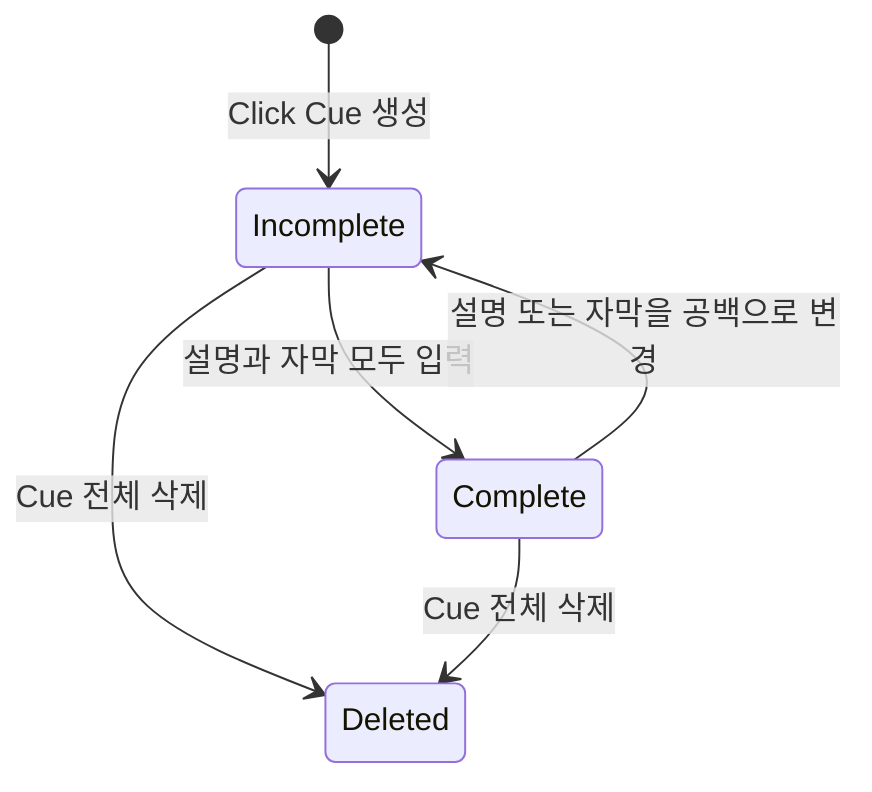

# ADR 0001: 영상 레이어와 합성 프리뷰가 하나의 프로젝트 시간축을 사용한다

Date: 2026-09-05

## Status

Accepted (2026-09-05)

## Context

제품 데모의 클릭은 위치만 보여 주는 이벤트가 아니다. 시청자가 클릭 대상과 의미를 함께
이해하려면 클릭 표시, 클릭 주변 설명과 화면 자막이 같은 시점에 나타나야 한다. 이 세 요소를
서로 독립적인 선택 레이어로 두면 일부 문구가 비어 있거나 편집 뒤 시간이 어긋난 상태로
내보내기 쉽다.

사람 UI, 외부 MCP 클라이언트, 합성 프리뷰와 MP4 내보내기는 같은 프로젝트 상태를 해석해야
한다. 서로 다른 시간·좌표·스타일 모델을 사용하면 편집기에서 확인한 안내가 결과 영상과
달라진다.

## Decision Drivers

- 유지하는 모든 클릭에 클릭 표시, 설명과 자막이 같은 클릭 시점을 포함해야 한다.
- 사람과 외부 MCP 클라이언트가 모든 레이어 속성을 동일하게 편집해야 한다.
- 프리뷰와 MP4가 같은 시간·좌표·스타일 결과를 보여야 한다.
- 원본 영상은 레이어 편집과 프리뷰로 변경되면 안 된다.
- 작은 창과 MCP 이미지 조회에서도 모든 편집·검증 동작에 접근할 수 있어야 한다.

## Decision

Storybird는 편집된 클립 타임라인 위에 Click Cue, 독립 자막과 시간 기반 데모 효과를 배치한다.
Click Cue는 클릭 표시, 클릭 주변 설명과 상단 또는 하단 자막을 하나의 그룹으로 관리한다.
녹화 직후 설명과 자막은 비어 있으며 사람 또는 외부 MCP 클라이언트가 입력한다.

Click Cue의 세 요소는 각자 시간·위치·색상·크기와 투명도를 편집할 수 있지만 모두 클릭 시점을
포함해야 한다. 설명이나 자막이 비어 있는 Cue는 `미완성`, 둘 다 공백이 아닌 문구를 가지면
`완성`이다. 미완성 Cue는 프리뷰할 수 있지만 결과 영상으로 내보낼 수 없다.

합성 프리뷰는 편집된 영상, Click Cue, 독립 자막과 활성 데모 효과를 같은 프로젝트 시간으로
렌더링한다. UI는 재생·일시정지·탐색을 제공하고, 외부 MCP 클라이언트는 유효한 프로젝트 시각의
프로젝트 해상도 PNG와 표시 레이어 정보를 조회한다. 프리뷰는 프로젝트를 변경하지 않는다.

Storybird는 기존 프로젝트 모델을 새 Click Cue 모델로 읽거나 변환하거나 내보내지 않는다.
기존 파일은 삭제하지 않고 그대로 둔다. 새 편집 계약은 새 모델로 생성한 프로젝트에 적용한다.

### Requirement contract

#### Required guarantees

- Click Cue는 클릭 표시, 설명과 자막을 하나의 그룹으로 가진다 — 클릭 안내 완결성 계약이다.
- 클릭 표시는 원형 링이며 클릭 시간, 가로·세로 각각 `0...1` 범위의 위치, 색상, 크기와
  불투명도를 편집할 수 있다 — 클릭 위치 표현 계약이다.
- 설명은 클릭 주변에 자동 배치하거나 가로·세로 각각 `0...1` 범위의 위치에 배치할 수 있다 —
  설명 위치 계약이다.
- 자동 배치한 설명은 영상 프레임 밖으로 벗어나지 않는다 — 가독성 계약이다.
- Cue 자막의 위치는 상단 또는 하단 중 하나다 — 화면 고정 자막 계약이다.
- 설명과 자막은 텍스트, 시작·종료 시간, 글자색, 배경색, 불투명도와 크기를 각각 편집할 수
  있다 — 화면 편집 동등성 계약이다.
- 클릭 표시, 설명과 Cue 자막의 시작 시간은 종료 시간보다 빠르고 세 시간 범위는 모두 클릭
  시점을 포함한다 — Click Cue 시간 일관성 계약이다.
- 유지할 Click Cue의 설명과 자막은 모두 공백이 아닌 문구를 가진다 — 완성 Cue 계약이다.
- Click Cue 삭제는 클릭 표시, 설명과 Cue 자막을 함께 제거하는 작업 하나다 — 그룹 수명주기
  계약이다.
- 독립 자막은 공백이 아닌 텍스트, 프로젝트 범위 안의 시작·종료 시간, 상단 또는 하단 위치와
  편집 가능한 텍스트 스타일을 가진다 — 구간 설명 계약이다.
- Click Cue와 독립 자막의 배경 불투명도 범위는 `0%...100%`다 — 화면 스타일 계약이다.
- 불투명도 `0%`는 완전 투명, `100%`는 완전 불투명 배경으로 렌더링한다 — 스타일 의미
  계약이다.
- UI와 MCP는 Click Cue 전체 목록, 미완성 Cue 목록과 독립 자막을 조회하고 같은 속성을 생성,
  수정, 삭제할 수 있다 — 편집 경로 동등성 계약이다.
- 유효한 편집은 하나의 원자적 레이어 변경으로 저장한다 — 부분 레이어 방지 계약이다.
- UI 프리뷰는 편집된 영상과 현재 시점의 Click Cue, 독립 자막 및 활성 데모 효과를 합성한다 —
  편집 결과 가시성 계약이다.
- MCP 프리뷰 시간은 `0초` 이상 프로젝트 종료 시간 미만이다 — 프레임 조회 범위 계약이다.
- MCP 프리뷰는 프로젝트 해상도의 PNG를 반환하고 실제 렌더링 시간, 표시된 레이어 식별자와
  미완성 Cue 식별자를 함께 제공한다 — 외부 화면 검증 계약이다.
- 프리뷰 조회로 변경되는 프로젝트 상태, 수정 버전과 실행 취소 기록은 각각 `0개`다 — 읽기
  전용 프리뷰 계약이다.
- `1080p`, `120초`, 시간 기반 레이어 `100개`인 프로젝트에서 탐색과 속성 변경의 `95%`는
  `500ms` 안에 프리뷰에 반영된다 — MVP 반응성 목표다.
- 프리뷰와 MP4의 레이어 표시 시간 차이는 원본 영상 `1프레임` 이내다 — 렌더링 동등성
  목표다.
- 넓은 창과 좁은 창 모두 재생, 탐색, 레이어 선택·추가·수정·삭제 기능에 접근할 수 있다 —
  편집 기능 도달성 계약이다.
- 레이어 편집과 프리뷰는 원본 영상 자산을 수정하지 않는다 — 비파괴 편집 계약이다.
- Storybird는 설명이나 자막 문구를 자동 생성하지 않는다 — 외부 문구 작성 경계다.
- 기존 프로젝트 파일은 삭제하지 않지만 새 Click Cue 모델로 읽거나 변환하거나 내보내지 않는다
  — 호환성 제외 계약이다.

#### Prohibitions

- 프로젝트 범위 밖의 레이어 시간, `0...1` 범위 밖의 좌표와 지원하지 않는 스타일 값을
  저장하지 않는다.
- Click Cue의 한 요소만 삭제해 그룹을 부분 상태로 만들지 않는다.
- 미완성 Click Cue가 남은 프로젝트를 내보내기 가능한 상태로 보고하지 않는다.
- 하나의 레이어 변경 요청에 유효하지 않은 속성이 있으면 일부 속성만 저장하지 않는다.
- 프리뷰는 프로젝트, 원본 영상, 수정 버전과 실행 취소 기록을 변경하지 않는다.
- 영상 프로젝트는 화면 분기, 인터랙티브 핫스팟 또는 HTML 플레이어를 출력 계약으로 사용하지
  않는다.
- Storybird는 LLM을 실행하거나 모델 API를 호출하거나 모델 API 키를 저장하지 않는다.

#### Failure guarantees

- 잘못된 시간, 좌표, 스타일, 프로젝트 또는 레이어 식별자는 기존 프로젝트를 변경하지 않는다.
- 클릭 시간을 변경해 기존 설명 또는 자막 범위가 새 클릭 시점을 포함하지 못하면 전체 변경을
  거부한다.
- 원본 영상을 읽을 수 없으면 편집 가능한 프로젝트나 프리뷰 이미지로 표시하지 않는다.
- 프리뷰 합성 실패는 마지막 유효 프로젝트와 원본 영상을 유지한다.
- 지원하지 않는 기존 프로젝트를 열어도 해당 파일을 변환·덮어쓰기·삭제하지 않는다.

#### Observable evidence

- 완성 Click Cue의 클릭 시점 프리뷰에는 원형 클릭 표시, 클릭 주변 설명과 상단 또는 하단
  자막이 함께 나타난다.
- 설명 또는 자막을 공백으로 만들면 Cue가 미완성으로 표시되고 내보내기 가능 상태가 되지 않는다.
- Click Cue를 삭제하고 실행 취소하면 클릭 표시, 설명과 자막이 함께 제거되고 함께 복원된다.
- 프레임 경계 가까이 있는 설명은 자동 배치 뒤에도 전체가 영상 안에 보인다.
- 독립 자막의 상단·하단 위치와 `0%`, `100%` 배경 불투명도가 UI와 합성 프레임에서 같은
  의미로 보인다.
- UI와 MCP에서 같은 레이어 변경을 적용하면 텍스트, 시간, 위치와 스타일이 같은 프로젝트
  상태가 된다.
- 같은 프로젝트 시점의 UI 프리뷰와 MCP PNG에 같은 레이어가 표시되고 실제 렌더링 시간과
  미완성 Cue 목록이 일치한다.
- 프리뷰 요청 전후의 프로젝트 상태, 수정 버전과 실행 취소 기록이 같다.
- 프로젝트 범위 밖 프리뷰 시간은 PNG를 반환하지 않고 프로젝트 상태를 바꾸지 않는다.
- 기준 프로젝트의 탐색·속성 변경 `100회` 중 `95회` 이상이 `500ms` 안에 프리뷰에 나타난다.
- 프리뷰와 내보낸 MP4의 레이어 시작·종료 시각 차이가 원본 영상 `1프레임`을 넘지 않는다.
- 넓은 창과 좁은 창 모두에서 재생, 탐색, Cue·자막 선택과 생성·수정·삭제에 접근할 수 있다.
- 유효하지 않은 속성을 섞은 레이어 변경 요청은 어느 속성도 저장하지 않는다.
- 레이어 편집과 프리뷰 뒤에도 원본 영상의 바이트와 재생 길이가 유지된다.
- 기존 프로젝트 파일은 새 편집기에 표시되지 않지만 디스크에서 그대로 유지된다.
- Storybird는 모델 API 키와 네트워크 연결 없이 사람이 입력하거나 MCP가 제공한 문구를
  프리뷰한다.

### State diagram

### Alternatives

#### 클릭 표시, 설명과 자막을 서로 독립적인 레이어로 둔다

일부 요소만 선택적으로 사용할 수 있지만 유지할 클릭에 필요한 안내가 빠진 상태를 발견하기
어렵고, 클릭 시간을 바꿀 때 세 요소가 서로 어긋날 수 있다. Click Cue 그룹이 완성 상태와
공통 클릭 시점을 명시한다.

#### 미리보기와 내보내기에 별도 레이어 모델을 사용한다

각 렌더링 경로를 독립적으로 최적화할 수 있지만 시간·좌표·스타일 변환이 중복되고 결과 drift가
발생한다. 하나의 프로젝트 계약을 두 경로가 해석한다.

#### 모든 오버레이를 자유 좌표의 일반 텍스트·도형 레이어로 표현한다

표현 범위는 넓지만 클릭과 설명의 관계, Cue 완성 상태와 화면 경계 보장을 각 프로젝트가
수동으로 관리해야 한다. 제품 데모의 반복 작업을 도메인 모델로 보존하지 못한다.

#### 기존 프로젝트를 새 Click Cue 모델로 자동 변환한다

사용자는 이전 프로젝트를 계속 편집할 수 있지만 어떤 독립 자막이 어느 클릭 설명인지
결정적으로 알 수 없다. 잘못 연결된 안내를 자동 생성하는 대신 기존 파일을 보존하고 새 모델의
호환성 의무를 두지 않는다.

## Consequences

### Positive

- 유지할 클릭마다 클릭 표시, 설명과 자막의 완결성을 검증할 수 있다.
- 사람 UI, MCP 프리뷰와 MP4가 같은 레이어 계약을 사용한다.
- 미완성 Cue를 외부 MCP 클라이언트가 찾아 문구를 채울 수 있다.
- 원본 영상과 기존 프로젝트 파일을 변경하지 않는다.

### Negative

- 단순 클릭 표시만 필요한 경우에도 설명과 자막을 입력하거나 Cue를 삭제해야 한다.
- Click Cue 그룹과 독립 자막의 상태·시간 검증이 필요하다.
- 기존 프로젝트를 새 편집기에서 계속 사용할 수 없다.

### Risks

- 프리뷰와 내보내기가 서로 다른 시간 경계 규칙을 사용하면 `1프레임` 목표를 위반할 수 있다.
- 많은 텍스트와 효과를 합성하면 `500ms` 프리뷰 반응성 목표가 어려워질 수 있다.

## Related

- [연속 화면 영상과 Click Cue를 같은 시간축에 기록한다](../recording/0002-continuous-video-recording.md)
- [원본 영상을 보존하는 비파괴 클립 타임라인을 사용한다](../timeline-editing/0001-non-destructive-clip-timeline.md)
- [시간 기반 레이어를 영상에 합성해 내보낸다](../sharing/0001-layered-video-export.md)
