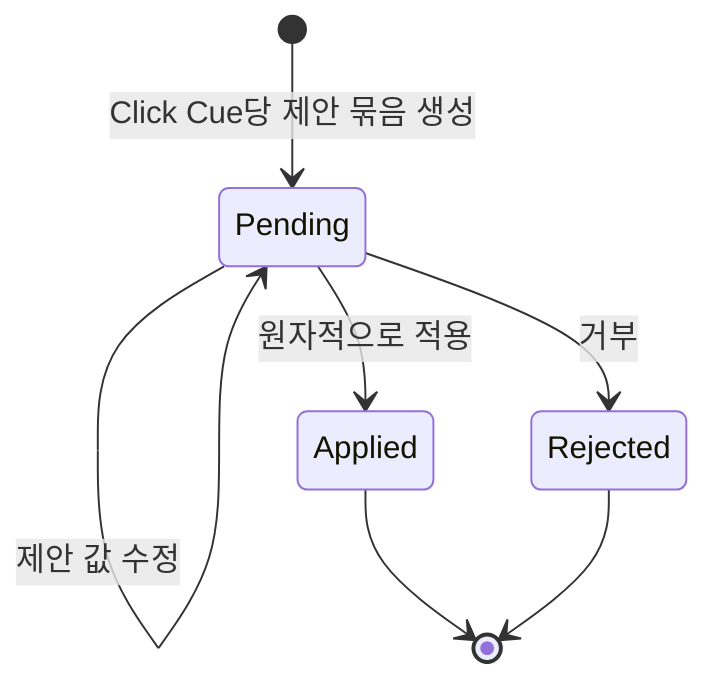

# ADR 0001: 클릭마다 비파괴 편집 제안 묶음을 결정론적으로 생성한다

Date: 2026-09-05

## Status

Accepted (2026-09-05)

## Context

제품 데모에서 클릭마다 분할 지점, 클릭 표시, 스포트라이트와 팬·줌을 처음부터 만드는 작업은
반복적이다. 녹화된 Click Cue에는 이미 클릭 시각과 위치가 있으므로 편집 초안을 만들 수 있다.

제안을 즉시 적용하면 원하지 않은 분할과 카메라 효과가 프로젝트를 바꾸고, LLM을 Storybird에
내장하면 로컬·결정론적 제품 경계가 깨진다. 제안은 같은 입력에서 같은 결과를 만들고 사용자가
적용하기 전까지 프로젝트 출력에 영향을 주지 않아야 한다.

## Decision Drivers

- 녹화된 클릭 시각과 좌표를 반복 편집의 시작점으로 재사용해야 한다.
- 같은 프로젝트 상태는 UI와 MCP에서 같은 제안 결과를 만들어야 한다.
- 제안은 명시적인 적용 전까지 원본과 프로젝트 출력 상태를 바꾸면 안 된다.
- 적용한 여러 편집은 한 번에 실행 취소할 수 있어야 한다.
- Storybird는 LLM, 모델 API와 외부 네트워크 없이 제안을 생성해야 한다.

## Decision

Storybird는 유효한 Click Cue마다 편집 제안 묶음을 최대 하나 생성한다. 묶음은 클릭 시점의
타임라인 마커와 분할 지점, 클릭 표시 스타일, 클릭 좌표 중심의 스포트라이트와 팬·줌 초안을
포함한다.

제안 상태는 `대기`, `적용`, `거부`다. 사람 또는 외부 MCP 클라이언트는 대기 제안의 값을
수정한 뒤 묶음 전체를 적용하거나 거부한다. 적용은 모든 제안 편집을 원자적인 프로젝트 편집과
실행 취소 단위 하나로 저장한다. 적용한 효과는 이후 일반 클립·레이어·효과로 편집한다.

Storybird는 같은 프로젝트와 Click Cue 입력에서 같은 제안 결과를 만든다. 제안을 다시
생성해도 중복 묶음을 추가하지 않는다. 제안 계산은 결정론적인 로컬 규칙만 사용한다.

### Requirement contract

#### Required guarantees

- 유효한 Click Cue 하나당 제안 묶음은 최대 `1개`다 — 제안 중복 방지 계약이다.
- 제안 묶음은 클릭 시점의 타임라인 마커, 클릭 시점의 분할 지점, 클릭 표시 스타일, 클릭 좌표
  중심의 스포트라이트와 팬·줌 초안을 포함한다 — 제품 데모 자동화 범위다.
- 같은 프로젝트 상태와 Click Cue 입력은 같은 제안 결과를 만든다 — 결정론적 편집 계약이다.
- 같은 입력으로 다시 생성할 때 추가되는 중복 제안 묶음 수는 `0개`다 — 재실행 안정성
  계약이다.
- 제안 상태의 허용 값은 `대기`, `적용`, `거부`다 — 제안 수명주기 계약이다.
- 대기 제안은 UI와 외부 MCP 클라이언트에서 조회하고 수정할 수 있다 — 편집 경로 동등성
  계약이다.
- 대기 제안의 적용은 관련 분할·스타일·스포트라이트·팬·줌을 프로젝트 편집 및 실행 취소 단위
  `1개`로 저장한다 — 원자 적용 계약이다.
- 대기 제안의 거부로 변경되는 프로젝트 출력 상태, 수정 버전과 실행 취소 기록은 각각 `0개`다
  — 비파괴 거부 계약이다.
- 적용 전 대기 제안으로 변경되는 원본, 프로젝트 출력 상태와 수정 버전은 각각 `0개`다 —
  비파괴 초안 계약이다.
- 적용 또는 거부된 제안을 다시 적용해 발생하는 프로젝트 편집 수는 `0개`다 — 종료 상태
  중복 방지 계약이다.
- Click Cue가 클립 편집으로 이동하면 대기 제안의 프로젝트 시간도 같은 시각으로 이동한다 —
  장면 동기화 계약이다.
- Click Cue를 삭제하면 연결된 대기 또는 거부 제안도 제거한다 — 제안 수명주기 계약이다.
- 적용된 제안은 일반 프로젝트 편집이 되며 원래 Click Cue를 삭제해도 자동 삭제하지 않는다 —
  적용 결과 독립성 계약이다.
- UI와 MCP는 제안 조회·수정·적용·거부에 같은 상태와 검증을 사용한다 — 자동화 동등성
  계약이다.
- Storybird의 제안 생성은 로컬 결정론적 규칙만 사용한다 — 로컬 도구 경계다.

#### Prohibitions

- 유효한 Click Cue가 없거나 클릭 시간·좌표가 유효하지 않으면 제안을 생성하지 않는다.
- 대기 제안을 명시적으로 적용하기 전에 클립, 레이어, 효과, 프로젝트 수정 버전과 원본을
  변경하지 않는다.
- 제안 묶음의 일부만 유효할 때 유효한 편집만 부분 적용하지 않는다.
- 적용 또는 거부된 제안을 대기 상태로 되돌리거나 다시 적용하지 않는다.
- Storybird는 제안 생성에 LLM, 모델 API, 모델 API 키 또는 외부 네트워크를 사용하지 않는다.

#### Failure guarantees

- 존재하지 않는 Click Cue 또는 제안 요청은 프로젝트와 제안 상태를 변경하지 않는다.
- 제안 묶음의 편집 하나라도 유효하지 않으면 어느 편집도 적용하지 않고 대기 상태를 유지한다.
- 편집 기준 프로젝트가 최신 상태와 다르면 현재 프로젝트를 덮어쓰지 않고 최신 상태를 다시
  조회하도록 한다.
- 제안 적용 저장이 실패하면 제안을 대기 상태로 유지하고 프로젝트와 실행 취소 기록을 명령 전
  상태로 유지한다.

#### Observable evidence

- Click Cue가 있는 새 프로젝트에는 Cue마다 제안 묶음 하나가 나타난다.
- 같은 프로젝트 상태에서 제안 생성을 반복해도 제안 개수와 내용이 달라지지 않는다.
- 대기 제안의 값을 UI에서 바꾼 결과와 MCP에서 바꾼 결과가 같다.
- 제안 적용 전과 거부 후의 프리뷰, 수정 버전과 실행 취소 기록이 같다.
- 제안을 적용하면 분할·클릭 스타일·스포트라이트·팬·줌이 함께 나타나고 실행 취소 한 번으로
  모두 사라진다.
- 적용 또는 거부된 제안을 다시 적용해도 프로젝트가 바뀌지 않는다.
- Click Cue를 이동하면 대기 제안도 같은 프로젝트 시각으로 이동한다.
- Click Cue를 삭제하면 대기·거부 제안은 사라지고 이미 적용된 일반 효과는 유지된다.
- 유효하지 않은 제안 묶음 적용 뒤 프로젝트와 제안 상태는 명령 전과 같다.
- 모델 API 키와 네트워크 연결 없이 동일한 제안 결과를 생성한다.

### State diagram

### Alternatives

#### 생성한 제안을 즉시 프로젝트에 적용한다

편집 단계가 줄지만 원하지 않은 분할과 카메라 효과가 프로젝트를 바꾼다. 자동 변경을 발견하고
되돌려야 하므로 비파괴 편집 계약과 맞지 않는다.

#### 제안 기능을 두지 않고 외부 MCP 클라이언트가 모든 효과를 계산한다

Storybird의 규칙이 단순해지지만 사람 UI는 같은 자동화 혜택을 받지 못하고 클라이언트마다 다른
제안을 만든다. UI와 MCP의 결과 동등성을 잃는다.

#### Storybird에 LLM을 내장해 화면 의미 기반 제안을 만든다

화면 내용에 맞춘 문구와 효과를 만들 수 있지만 모델 API, 키와 네트워크 경계가 Storybird에
추가된다. 외부 MCP 클라이언트가 화면 해석을 담당한다는 제품 경계와 충돌한다.

#### 생성할 때마다 새 제안 묶음을 추가한다

제안 이력을 비교할 수 있지만 동일 입력의 반복 호출이 중복 효과 후보를 계속 늘린다. Cue당
제안 하나와 결정론적 갱신이 자동화 재실행에 적합하다.

## Consequences

### Positive

- 반복적인 클릭 강조와 카메라 효과 편집을 빠르게 시작할 수 있다.
- 사람과 외부 MCP 클라이언트가 같은 제안과 상태 전이를 사용한다.
- 적용 전까지 프로젝트를 바꾸지 않고 적용 후에는 한 번에 실행 취소할 수 있다.

### Negative

- 규칙 기반 제안은 화면 의미를 이해하지 못해 사람이 값을 수정해야 할 수 있다.
- 적용된 효과와 원래 Click Cue의 수명주기가 분리된다.

### Risks

- 제안 입력 정규화가 일관되지 않으면 같은 프로젝트에서 다른 결과가 생길 수 있다.
- 제안 적용의 원자성이 깨지면 일부 효과만 남을 수 있다.

## Related

- [연속 화면 영상과 Click Cue를 같은 시간축에 기록한다](../recording/0002-continuous-video-recording.md)
- [원본 영상을 보존하는 비파괴 클립 타임라인을 사용한다](../timeline-editing/0001-non-destructive-clip-timeline.md)
- [영상 레이어와 합성 프리뷰가 하나의 프로젝트 시간축을 사용한다](../authoring/0001-timeline-overlay-editor.md)
- [제품 데모 효과를 시간 기반 레이어로 편집한다](../demo-effects/0001-timed-demo-effects.md)
