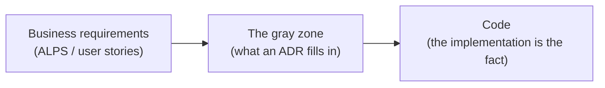
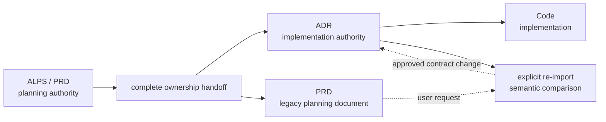
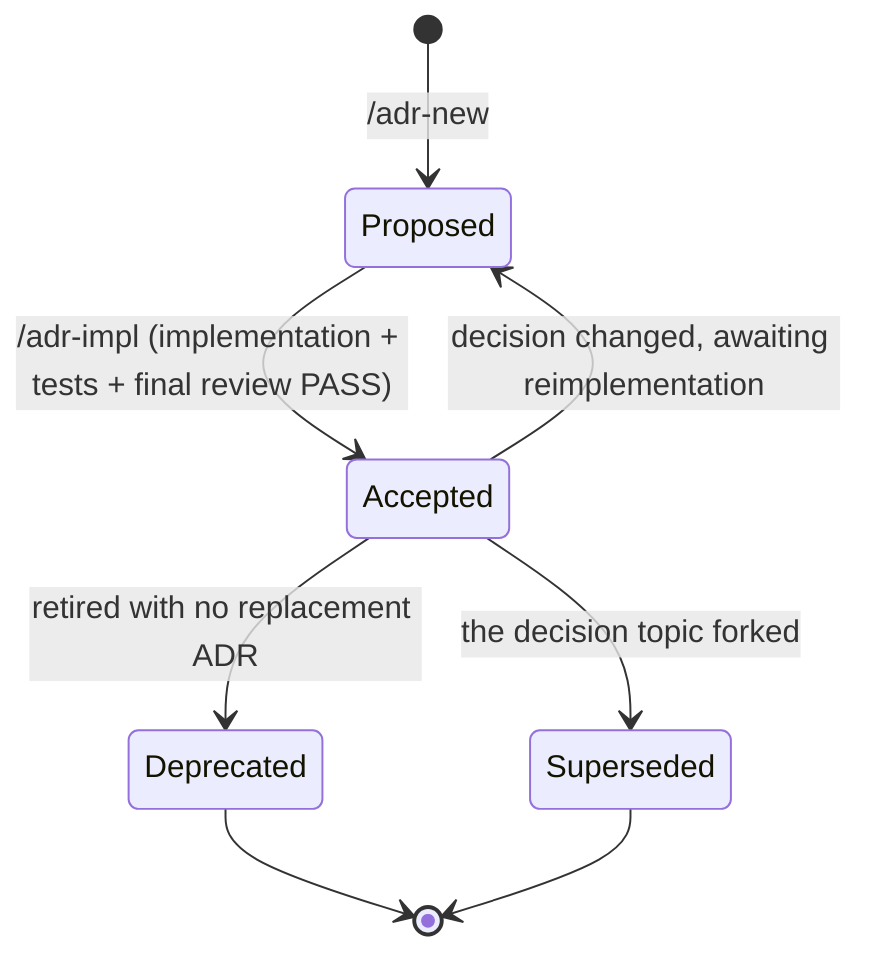

# ADR concepts — how ADRs work in this project

**This is the document to read before writing, reviewing, or changing an ADR.** It states the principle the authoring rules follow from, how a decision moves through the cycle, and which artifact owns which fact. [`README.md`](./README.md) is the directory's index (what an ADR is, the template, where the ADR list lives); the detailed rules live in [`authoring-rules.md`](./authoring-rules.md) and [`structure.md`](./structure.md).

## The abstraction ladder — the principle every rule follows from

PRD, ADR, and code are not three documents about three topics. They are **the same system at three resolutions**, the way a C4 diagram shows one architecture at context, container, and component zoom. And as in C4, the value comes from what each level **refuses to show**: a context diagram that also drew every class would answer no question better than the code already does.

| Level        | Document                 | The one question it answers   | Resolution                                                         |
| ------------ | ------------------------ | ----------------------------- | ------------------------------------------------------------------ |
| **Zoom out** | **ALPS PRD**             | WHAT / WHY (user's view)      | "Add email signup. Target +10% new-signup conversion"              |
| **Middle**   | **ADR**                  | HOW (architectural view)      | "JWT rotates as a short-lived access token plus a 7-day refresh"   |
| **Middle**   | **Design docs / tokens** | HOW (visual and interaction)  | "Primary color, input field height 48px, error toast pattern"      |
| **Zoom in**  | **Code / AGENTS.md**     | HOW (detailed implementation) | "File structure, signatures, connection pool size, setup commands" |

**The goal: a reader can load one level and stop there.** Someone asking "why is the refresh window 7 days rather than 30?" should get the answer from the ADR without opening a source file. Someone asking "how is the rotation implemented?" should go to the code without reading the PRD. That only works while each level holds **its own resolution and no other** — so the exclusion rules in [`authoring-rules.md`](./authoring-rules.md#what-to-exclude-from-an-adr) are not tidiness. They are what makes a level independently readable.

Two failure modes, and both cost the same thing:

- **Detail leaking up from a lower level into the ADR** (signatures, field types, pool sizes, pseudocode) — now the ADR cannot be trusted alone, because it asserts things the code may already have changed. The reader has to open the code to learn which half is still true, so the level stopped answering its question.
- **A requirement leaking out of the ADR** ("the PRD or code has the number, so drop it") — code shows enforcement and the PRD shows user intent, but neither explains the admitted architectural contract and rationale. This one is more expensive, and it is why [the requirement gate](#the-requirement-gate-comes-before-any-exclusion-filter) is asked before any exclusion filter.

So the two are one test, asked in both directions:

> **The single-level read test**: can this level be read alone and answer its own question — with nothing in it that belongs to a level below, and nothing missing that no other level holds?

Note that the ADR row's "7-day" stays intact rather than blurring into "a short window" — that value is the ADR's own resolution, so it stays verbatim, while the tuning values realizing the same decision (pool sizes, backoff) sit one level down and stay out.

### Harnesses are removable; artifacts are authoritative

Skills, hooks, reviewers, reports, and evals are a management harness over the
abstraction ladder. They are not another rung and do not own durable product or
implementation context. Removing the plugin leaves each level readable:
product intent in the PRD, admitted decisions and contracts in ADRs,
implementation truth in code and tests, and repository conventions in project
documentation.

Harness instructions constrain observable artifacts, allowed actions, evidence,
approval boundaries, and lifecycle transitions. They do not require private
chain-of-thought or a particular internal reasoning sequence. The current model
may choose no subagent, one, or several; named or generic roles; parallel or
sequential execution; and whichever available model fits the role. These choices
remain ephemeral as long as the required perspectives, evidence, and
user-visible workflow are preserved.

**Never maintain the same information as two current authorities.** Before handoff, the PRD owns the planning intent. `/feature-to-adr` transfers every implementation-relevant obligation into ADRs and proves that nothing required was left behind. After that commit, the ADR set is the only implementation authority and the PRD remains a legacy planning document; implementation, review, and sync do not read it. A user may explicitly re-import a changed PRD, but the importer compares it with the current ADR target state and proposes only semantic contract changes. Repeating equivalent input is a no-op. The remaining deliberate overlap is a requirement contract in the ADR and its enforcement in code; those are [different things, not a duplicate](#requirements-live-in-both-the-adr-and-the-code--and-the-adr-comes-first).

Rule: never copy ALPS's user stories or acceptance-criteria prose into an ADR. Transfer only admitted motivation, decision pressures, and requirement contracts, without a PRD reference; adr-writer remains standalone. Design token values go to the design docs; function signatures and file paths go to the code and its docstrings.

### Named applications of the same test

Every rule and command name below is this one test applied at a different moment. They are worth knowing by name, because separately-running review agents stay aligned by citing them:

| Name                                             | The moment it applies                | What it asks                                                               |
| ------------------------------------------------ | ------------------------------------ | -------------------------------------------------------------------------- |
| **ADR admission gate**                           | before creating or updating an ADR   | Is this a durable decision, or only one replaceable implementation means?  |
| **Decision identity check**                      | after admission, before new ADR      | Does an existing ADR already own this architectural question and boundary? |
| **Regeneration test**                            | finishing an ADR draft; reviewing it | Delete all code — can requirement-honoring code be rebuilt from this ADR?  |
| **Requirement gate → code-readthrough → litmus** | writing each line                    | Which level owns this one fact?                                            |
| **Stability gradient** (`Code >> ADR >> PRD`)    | after the fact                       | Did a volatile-level change drag a stable level with it?                   |
| **`Spec violation` vs `Impl-fact mismatch`**     | reviewing an implementation          | Which level must change to resolve this disagreement?                      |

## The ADR admission gate — decide whether an ADR should exist

The requirement gate and line-level filters cannot repair an ADR whose **core subject is already at code resolution**. Before writing a new ADR or updating one because code changed, ask whether the choice belongs at the architectural level at all.

An ADR is warranted when the choice changes at least one durable constraint:

- a requirement contract, domain invariant, allowed state or transition, permission, or visibility rule
- a system boundary, deployment topology, data/key design, or security trust boundary
- the adopted external system, provider, or model, including its fallback/degradation policy
- an algorithm, consistency model, or operating trade-off that constrains multiple implementations

Then apply the **implementation substitution test**:

> Could another library, SDK, framework, module structure, credential-loading mechanism, signer, or adapter replace this one while preserving the same requirement contract, system boundaries, trust boundaries, and accepted trade-offs?
>
> **YES** → it is implementation discretion. Do not create or update an ADR.
> **NO** → it may be an architectural decision. Continue with the requirement gate and line-level filters.

Technology names are not automatically architectural. "Use GPT-5.6 through Amazon Bedrock" can be an ADR because it fixes an external model/provider boundary and the constraints that follow from it. "Use this Bedrock SDK, credential provider chain, signing helper, or authentication adapter" is code detail unless that choice itself establishes a required security trust boundary or policy.

Apply the **stability check** as a final guard: if ordinary behavior-preserving code changes would repeatedly force this ADR to change, its subject is probably one level too low. Move the detail to code, tests, or the project's `AGENTS.md`/README instead.

The admission gate also governs review and sync. Code that contains an unrecorded implementation choice is not automatically `Undecided behavior` or a `New ADR needed` finding. Raise it only when the choice passes this gate. If an existing ADR's core subject fails the gate, propose retiring the ADR and moving any useful detail down rather than polishing the document in place.

## The decision identity check — update before create

After a request passes the admission gate, inspect `.mapping.json` summaries and the plausible ADR bodies before allocating a new ADR number. The question is not "does the requested provider, algorithm, or value differ from the current text?" It is "which architectural question and durable boundary does this request change?"

An existing ADR owns the change when it can be rewritten as one current-state record that answers the same question and owns the same requirement or system/data/security/external boundary. In that case, edit it in place, keep its path and number, update the mapping summary, and put a major old → new transition in `decision-log.md`. If the ADR was already `Accepted`, return it to `Proposed` while implementation is brought into line.

Changing GPT-5.6 access from Amazon Bedrock to the OpenAI API changes the adopted provider but still evolves the same model/provider-boundary decision. Reverting to Amazon Bedrock evolves that same decision again. Neither direction creates a new decision identity. A new ADR is reserved for a topic with no existing owner or a true fork where multiple decisions must remain independently current and separately referenceable.

This check keeps **one logical decision = one current-state ADR** during normal authoring. `/adr-rollup` repairs legacy repositories where revisions were already stacked into an evolution chain.

## What an ADR covers — the gray zone between business and code

An ADR makes concrete the ambiguous area wedged between **business requirements (WHY)** and **code (WHAT/HOW)**. Only this gray zone goes into an ADR — and the gray zone includes not just "the rationale for the decision" but **the requirement contract the result must honor.**

**What belongs to the gray zone** — decisions whose motivation and rationale cannot be seen from the code alone, plus **the contract the result must honor.**

- Among **several approaches** that could solve the same requirement, **why this one was chosen** (the alternatives comparison and adoption rationale)
- **Cross-cutting decisions** scattered across the code that are invisible unless gathered in one place (e.g. the token rotation policy, the key design pattern, a whole state machine)
- How a business rule is **translated into system behavior** (e.g. "7-day grace period after signup" → which triggers, tables, and state values express it)
- **The requirement values the result must honor** — numbers such as max turns, count limits, retention periods, size caps, and response targets that become a requirement violation if a developer changes them at will. Record the value and its basis verbatim (conversely, do not record tuning values the implementation chose for performance — for the criteria see [`authoring-rules.md`](./authoring-rules.md#concrete-numbers--keep-requirement-values-drop-tuning-values))
- **Non-numeric requirements** — allowed value sets (the list of order states and their transition rules), mandatory fields, permission and visibility rules, ordering and uniqueness, and the unit of money or time. Requirements do not arrive only as numbers, so keep them by applying the same deciding question ("would a developer changing this at will be a violation?"). **Split enums — the allowed set and transitions belong to the ADR, the identifier name and representation to the code** ([`authoring-rules.md`](./authoring-rules.md#non-numeric-requirements--value-sets-mandatory-fields-permissions-ordering))
- **Conceptual-level relationships** between domain models (not field definitions, but at the level of "Flashcard and Vocabulary are linked by phrase hash")
- The **fallback / degradation policy** when depending on an external system or service
- The **intended trade-offs and risks** a decision carries

**What does not belong to the gray zone** — anything an agent or reviewer can learn by reading the code this ADR governs that is **also not a requirement** is not the ADR's business. Function and class responsibilities, signatures, field types, design patterns, directory layout, error message wording, env var names, pseudocode, performance tuning values, and the like have the code plus docstrings and the project's own AGENTS.md as their source of truth. Transcribing them into an ADR only adds the burden of updating the ADR on every code change and accumulates drift. For the detailed forbidden/keep tables see [`authoring-rules.md`](./authoring-rules.md#what-to-exclude-from-an-adr).

### The regeneration test — the single standard for ADR completeness

An ADR's goal is **not to reproduce the same code, but to make regenerated code satisfy the business requirements.**

> If all the code were deleted and only this ADR survived, could someone read it and rebuild code that honors the requirements exactly?

- **Implementation, structure, and names may differ** — they are not in the ADR, so they are discretionary.
- **Nothing the result must honor may be missing** — if it is, the regenerated code violates a requirement.

The same contract must also support the review that follows regeneration. Write each obligation independently and record implementation-independent **observable evidence**: the result a reviewer should see when the obligation is met or violated. This is not a test plan. Tests, commands, files, libraries, and internal data representation remain below ADR resolution. The implementation review derives a disposable Evidence Package from these rows, shows requirement-by-requirement coverage to the human reviewer, and keeps code-level choices separate.

This test takes precedence over the code-readthrough test below. For the full definition and the requirement gate, see [`authoring-rules.md`](./authoring-rules.md#what-an-adr-must-satisfy--the-regeneration-test).

### Requirements live in both the ADR and the code — and the ADR comes first

The fact that a requirement value or rule also lives in the code is not a reason to drop it from the ADR. The two hold different things — **the ADR is the contract** ("a chat session is capped at 7 turns — pricing policy"), and **the code is that contract's enforcement** (the logic that counts turns and cuts off past 7). From the code alone you can see "it is 7 turns today" but **not whether that is a contract to honor or a value the implementation happened to pick.**

So changing that value changes a system behavior requirement, and the order is fixed — **fix the ADR first (plus one line in `decision-log.md`, since it is major), then bring the code into line.** This holds even when it looks like a single constant. Conversely, a tuning value absent from the ADR is implementation discretion and carries no such order. For details see [`authoring-rules.md`](./authoring-rules.md#requirements-live-in-the-code-and-in-the-adr--layers-not-duplication).

### The requirement gate comes before any exclusion filter

Ask the **requirement gate** first — "if this fact were missing, could code rebuilt from the ADR alone violate a requirement?" YES means **keep it unconditionally**, without applying the filter below.

Only for lines that failed the gate (i.e. are not requirements), ask the **code-readthrough test**:

> "Would an agent reading the code this ADR governs discover this fact?"
>
> **YES** → leave it out of the ADR (the code is the source of truth).
> **NO** → it is a gray-zone candidate. It then has to pass [the litmus test](./authoring-rules.md#the-requirement-gate-and-two-filters) to go into the ADR.

Only what the gate kept plus what passed both filters stays in the ADR body. For the full definition of the three questions see [`authoring-rules.md`](./authoring-rules.md#the-requirement-gate-and-two-filters).

> **Caution — "the code has that value" is not grounds for dropping a requirement that passed the gate.** A requirement value or rule is naturally enforced in the code too (that is what makes it work), so it is visible on a code readthrough. But it passed the gate first, so it is not subject to this filter — see [Requirements live in both the ADR and the code](#requirements-live-in-both-the-adr-and-the-code--and-the-adr-comes-first) above. What this filter removes is what is "in the code **and also not a requirement.**"

## Dependencies run one way; references are written in neither direction

PRD → ADR → code is a **one-way ownership transfer followed by a logical dependency.** Before handoff, the PRD supplies planning intent. After handoff, ADRs own the implementation contract and code depends on them. A later PRD edit has no operational effect until the user explicitly re-imports and approves an ADR contract change.

References are **written directly on neither edge (PRD↔ADR, ADR↔code).** PRD↔ADR is not stored at all (adr-writer does not reference ALPS), and only the linkage of categories, ADRs, and `dependsOn` lives in one external mapping layer (`.mapping.json`).

- **No ADR → code references**: never write files, functions, or line numbers in an ADR. For the detailed rule see [`authoring-rules.md`](./authoring-rules.md#code-references--folder-level-only).
- **No code → ADR references**: never leave an ADR ID or path in comments, constants, or imports. ADR numbers move through split / rollup / supersede, so code holding an ADR ID forces a cascade of code edits on a structural change even when the decision did not change.
- **No ADR → PRD references**: never write an ALPS file path, section number, or feature ID in the ADR body (Context and Related included). An ADR _absorbs_ the PRD's motivation but never _points at_ it — because after handoff the ADR must stand alone even when the legacy PRD is stale, moved, or absent. Never copy the PRD's user stories or acceptance-criteria prose into an ADR either; transfer independently reviewable obligations at ADR resolution.
- **No PRD → ADR references**: an ALPS document never writes a specific ADR ID or path in its body. Handoff evidence is ephemeral, and the legacy PRD does not track downstream artifacts.
- **When an ADR decision changes, the code changes. A PRD edit alone changes nothing after handoff.** Only an explicit re-import may propose an ADR contract change, and the existing ADR remains authoritative until that change is approved. The reverse (a code change dragging the ADR, or an ADR change dragging the legacy PRD) must never happen.
- **Keep the linkage in the external mapping layer**: [`docs/adr/.mapping.json`](./structure.md#the-adr-registry-mappingjson) records the ADR index (categories → adrs, each with path, status, summary) and the `dependsOn` between categories in one place. **PRD references are not stored in the mapping** — adr-writer does not reference ALPS. ADR↔code is likewise not pointed at from the body (the code is searched for as needed), and this mapping is the only coupling point joining categories, ADRs, and dependencies.
- **Verifying the stability gradient**: change frequency must follow `Code >> ADR >> PRD` while the PRD is active planning input. After handoff, the live dependency is `Code >> ADR`; a legacy PRD revision enters it only through explicit re-import. If a volatile-layer change drags a stable layer, an arrow is drawn wrong — usually because the ADR holds code detail, the code holds an ADR ID, or the ADR holds an ALPS path.

## Kinds of decisions an ADR covers

Write an ADR when the decision falls into one of these.

| Kind                     | Examples                                                                                                        |
| ------------------------ | --------------------------------------------------------------------------------------------------------------- |
| **Domain decisions**     | Login or payment model, permission scheme, core domain entity relationships and state machines                  |
| **Infrastructure**       | Deployment topology, cache ownership/consistency policy, monitoring boundaries, CDN/image handling policy       |
| **Data decisions**       | DB key design (PK/SK/GSI), single-table vs multi-table, migration safety policy                                 |
| **External integration** | Choosing an external service/provider/model (for example GPT-5.6 through Bedrock) and its degradation policy    |
| **Security and ops**     | Security trust boundaries, token rotation policy, audit scope, backup/recovery RPO and RTO                      |
| **UX architecture**      | Routing ownership, client/server state boundary, design system adoption — specific state libraries stay in code |
| **Migration**            | API compatibility policy, backfill safety, acceptable downtime                                                  |

ADR folders are grouped along **two axes: DDD domain (bounded context) × feature (vertical slice)** — the top-level folder (`docs/adr/<context>/`) is the domain expert's model boundary (a bounded context), and a sub-folder (`<context>/<feature>/`) is one user action's vertical slice. An ALPS Section 7 feature maps 1:1 onto that sub-folder (or onto the flat context folder when there is only one feature). For why folders are never created per technical layer, the subdomain classification (core/supporting/generic), and the conditions for using a cross-cutting context, see [`structure.md`](./structure.md#directory-structure--ddd-domain-bounded-context--feature-vertical-slice).

## What an ADR is not (anti-patterns)

Do not turn these into ADRs. Doing so lowers ADR credibility and only increases the review burden.

- **Bug-fix decisions** — "added a null check to this function" is not an ADR reason. The code and the commit message suffice
- **Style/formatting changes** — Prettier or ESLint rule changes belong in the PR description or CONTRIBUTING.md
- **Dependency patch upgrades** — `lodash 4.17.20 → 4.17.21`. A major upgrade (`React 17 → 18`) is an ADR candidate
- **Replaceable implementation choices** — libraries, SDKs, frameworks, middleware, class/module structure, credential provider chains, signing helpers, and authentication adapters when they preserve the same requirement contract and architecture/security boundaries
- **Refactoring** — from extracting a function or renaming to tidying an interface or relocating modules, a structural change that does not alter behavior is not an ADR target. The coding agent's planning step plans the change scope and caller impact as it goes, so there is no need to transcribe that plan into an ADR (a plan is meant to be volatile alongside the code; freezing it into an ADR drags the stable layer along with the refactor). But if a refactor **changes the decision itself** (replacing the adopted alternative, changing a state machine or key design, changing an external-dependency fallback), that is not a refactor but a decision change, so update the relevant ADR
- **Temporary experiments and POCs** — a "we'll decide next week" stage is written as an ADR once the decision is settled
- **Personal working guides** — conventions such as "this module always lives under internal/" belong in the project's AGENTS.md or README

When the judgment is ambiguous, apply [the requirement gate and two filters](./authoring-rules.md#the-requirement-gate-and-two-filters).

## Status

`Superseded` names the successor ADR in the form `Superseded by [ADR XXXX](link)`.

| Status     | Meaning                                                                                                                                                      |
| ---------- | ------------------------------------------------------------------------------------------------------------------------------------------------------------ |
| Proposed   | The ADR has been proposed to the system. Even when the decision itself is agreed, **the code implementation or its completion review is not finished**       |
| Accepted   | **The code implementation is complete.** The behavior exists, required tests pass, and the final necessity/sufficiency implementation review returned `PASS` |
| Deprecated | No longer valid. Retired with no replacement ADR                                                                                                             |
| Superseded | Replaced by a new ADR. Names the successor in the form `Superseded by [ADR XXXX](link)`                                                                      |

### Automatic transition rules

Status is **not a value a human asks about and changes by hand, but one the cycle updates automatically.**

- When a new ADR is created by `/adr-new` (or `/feature-to-adr`, which delegates to it), it is always saved as `Proposed`. Never ask the user "shall I make it Accepted?"
- When `/adr-impl` completes implementation, required tests, verified refactoring, and the final `/adr-impl-review` with `PASS`, that command updates the ADR's Status to `Accepted` automatically. It does not separately confirm the promotion.
- `/adr-sync` catches invalid completion claims by comparing the code with the ADR: if an `Accepted` behavior or its tests are absent, it reverts to `Proposed`. It does **not** promote a `Proposed` ADR merely because code and tests exist, because the final review result is not persisted in the ADR or mapping; it routes that case to `/adr-impl` to complete the review gate.
- **When a requirement change actually changes the decision of an already-`Accepted` ADR** (even an in-place edit, if the decision's direction changed — for the judgment call see [`authoring-rules.md` "Changing an ADR — edit-in-place vs supersede"](./authoring-rules.md#changing-an-adr--edit-in-place-vs-supersede)), revert Status to `Proposed` until the new decision is reflected in code, tests, and the final implementation review. `/adr-impl` then auto-promotes `Proposed → Accepted` again. For a supersede, rather than reverting, mark the old ADR `Superseded` and start the new ADR as `Proposed`. Removing or correcting stale implementation detail does not change the admitted decision, so keep `Accepted`.
- Record the date with the transition: `Accepted (YYYY-MM-DD)`, `Deprecated (YYYY-MM-DD)`. **The parentheses hold the date only** — just the single date, as in `Accepted (2026-07-09)`, with no trailing references, feature IDs, or implementation notes (`Accepted (2026-07-09) — implements F1` and `Accepted (2026-07-09, ref)` are both forbidden — `adr-structure-lint` catches them as `date-only`). `Superseded` is marked with the successor link instead of a date (`Superseded by [ADR XXXX](link)`). `Proposed` carries no date — the authoring date lives in the `Date:` at the top of the body (the time of writing, separate from the Status transition date), and the date on the Status line is recorded only on a transition.
- Never use informal statuses such as `Implemented`, `Done`, or `Completed`.

### Where evolution history lives — decision-log.md

An ADR body is **a requirements and architecture document describing the current admitted decision and contract**, not the current shape of the code. State the final decision directly: "Amazon Bedrock is the external model-provider boundary", not "the direct API client was replaced by Bedrock and the old client is no longer used." Timeline narration, replaced implementation identifiers, previous values, and migration steps belong outside the current-state body. When the same decision evolves, **overwriting the existing ADR to current state (edit-in-place) is the default**, and if that transition is major (replacing the adopted alternative, changing the core algorithm or architecture, inverting a Driver, retirement), leave one line, newest first, in the per-category `docs/adr/<category>/decision-log.md`. Create a new ADR (a supersede) only when the decision topic forks and the old decision must coexist as a separate record (for the judgment call see [`authoring-rules.md` "Changing an ADR — edit-in-place vs supersede"](./authoring-rules.md#changing-an-adr--edit-in-place-vs-supersede)).

**Three layers preserve different things**: the ADR body = current state / `decision-log.md` = the timeline of major changes / Git = the verbatim diff. The log is a **convention file** rather than an ADR, so it is not registered in `.mapping.json` and the deterministic harness does not check it — for the recording criteria and format see [`authoring-rules.md` "Decision log (decision-log.md)"](./authoring-rules.md#decision-log-decision-logmd), and for the directory and non-indexing policy see [`structure.md`](./structure.md#decision-log-decision-logmd--a-convention-file-not-registered-in-the-mapping).

<!-- adr-writer:rules-version 0.8.13 — seeded by /adr-new. `adr-structure-lint` warns when this trails the installed plugin; refresh with /adr-new (it re-seeds a stale doc set). Keep this line on re-seed. -->
