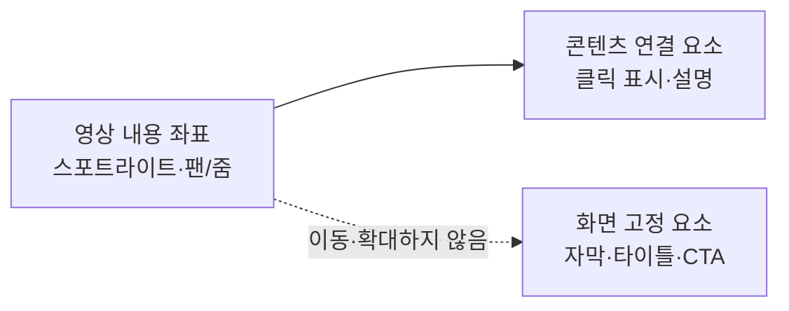

# ADR 0001: 제품 데모 효과를 시간 기반 레이어로 편집한다

Date: 2026-09-05

## Status

Accepted (2026-09-05)

## Context

화면 녹화만으로는 시청자가 어느 영역을 봐야 하는지 알기 어렵다. 클릭 위치를 강조하고 화면을
확대하며 영상의 시작과 종료 메시지를 보여 주려면 스포트라이트, 팬·줌과 카드가 영상 시간에
맞춰 나타나야 한다.

효과를 녹화 픽셀에 바로 넣으면 녹화 후 수정할 수 없고, 자유롭게 중첩되는 일반 영상 효과로
두면 클릭 설명과 자막의 좌표 공간이 섞인다. 제품 데모 효과는 화면 내용에 붙는 요소와 화면에
고정되는 요소를 구분하고 충돌 규칙을 명시해야 한다.

## Decision Drivers

- 클릭 영역을 프레임 안의 정규화 좌표로 강조해야 한다.
- 화면 이동 중 클릭 표시·설명과 자막이 각자의 좌표 공간을 유지해야 한다.
- 같은 종류의 카메라·강조 효과가 겹쳐 모호한 결과를 만들면 안 된다.
- 타이틀과 CTA는 일반 영상 플레이어에서 보이는 비대화형 카드여야 한다.
- UI와 외부 MCP 클라이언트가 모든 효과를 동일하게 편집해야 한다.

## Decision

Storybird는 스포트라이트, 팬·줌, 타이틀 카드와 CTA 카드를 프로젝트 시간 기반 레이어로
저장한다. 각 효과는 프로젝트 범위 안의 시작·종료 시간을 가진다.

스포트라이트와 팬·줌은 영상 내용에 연결된다. 클릭 표시와 클릭 주변 설명은 영상 내용과 함께
이동하고 확대된다. Click Cue 자막과 독립 자막은 화면 고정 요소로 남는다.

타이틀 카드는 영상 시작 또는 클립 사이에 삽입하는 전체 화면 카드다. CTA 카드는 프로젝트
마지막에 유지하는 전체 화면 카드이며 실제 링크나 클릭 동작을 제공하지 않는다. 사람 또는 외부
MCP 클라이언트가 카드 문구와 스타일을 입력한다.

UI와 외부 MCP 클라이언트는 효과의 생성·조회·수정·삭제에 같은 검증을 사용한다. 규칙 기반
편집 제안은 적용 전까지 출력 상태를 바꾸지 않는 초안으로만 효과 값을 제공한다.

### Requirement contract

#### Required guarantees

- 모든 효과의 시작 시간은 종료 시간보다 빠르고 두 값은 프로젝트 시간 범위 안에 있다 —
  유효 효과 구간 계약이다.
- 스포트라이트는 가로·세로 위치와 크기를 각각 `0...1` 범위의 직사각형으로 가진다 — 해상도
  독립 강조 영역 계약이다.
- 스포트라이트는 직사각형 밖의 영상만 어둡게 하고 어두움 정도를 편집할 수 있다 — 시선 유도
  계약이다.
- 같은 프로젝트 시각에 활성화되는 스포트라이트는 최대 하나다 — 강조 충돌 방지 계약이다.
- 팬·줌은 시작·종료 중심점을 가로·세로 각각 `0...1` 범위로 가진다 — 해상도 독립 카메라
  이동 계약이다.
- 팬·줌의 시작·종료 배율은 `1배...3배`다 — 승인된 MVP 확대 범위다.
- 같은 프로젝트 시각에 활성화되는 팬·줌은 최대 하나다 — 카메라 변환 충돌 방지 계약이다.
- 팬·줌 중 클릭 표시와 클릭 주변 설명은 영상 내용과 함께 이동하고 확대된다 — 콘텐츠 연결
  좌표 계약이다.
- Click Cue 자막과 독립 자막은 팬·줌 중에도 화면 상단 또는 하단의 고정 위치와 크기를
  유지한다 — 화면 고정 좌표 계약이다.
- 타이틀 카드는 영상 시작 또는 두 클립 사이에 배치하는 전체 화면 카드이며 공백이 아닌 제목을
  가진다 — 시작·구간 안내 계약이다.
- 타이틀 카드 삽입으로 프로젝트 시간이 늘어나면 뒤 클립과 시간 기반 레이어가 같은 길이만큼
  이동한다 — 프로젝트 시간 일관성 계약이다.
- CTA 카드는 프로젝트 마지막에 배치하는 전체 화면 카드이며 공백이 아닌 제목과 버튼 모양의
  라벨을 가진다 — 종료 안내 계약이다.
- CTA 카드의 실제 링크와 클릭 동작 수는 각각 `0개`다 — MP4 비대화형 출력 계약이다.
- 마지막 클립을 삭제하거나 재배치해도 CTA 카드는 새 프로젝트 마지막에 유지된다 — 종료 위치
  불변식이다.
- UI와 MCP는 네 효과 유형의 모든 속성을 생성·조회·수정·삭제할 수 있다 — 편집 경로 동등성
  계약이다.
- 하나의 효과 편집과 그로 인한 프로젝트 시간 이동은 원자적인 저장 및 실행 취소 단위 하나다 —
  부분 효과 방지 계약이다.
- 규칙 기반 제안은 사람 또는 외부 MCP 클라이언트가 적용하기 전에는 프로젝트 출력 상태와
  수정 버전을 변경하지 않는다 — 제안 비파괴 계약이다.
- 프리뷰와 MP4의 효과 시작·종료 시각 차이는 원본 영상 `1프레임` 이내다 — 렌더링 동등성
  목표다.
- Storybird는 효과 문구를 자동 생성하지 않는다 — 외부 문구 작성 경계다.

#### Prohibitions

- 프로젝트 범위 밖 시간, `0...1` 범위 밖 영역·중심점과 `1배...3배` 범위 밖 팬·줌을
  저장하지 않는다.
- 같은 종류의 스포트라이트 또는 팬·줌을 같은 시간에 둘 이상 활성화하지 않는다.
- 공백 제목의 타이틀 카드와 공백 제목 또는 라벨의 CTA 카드를 저장하지 않는다.
- CTA 카드를 프로젝트 마지막 이외의 위치에 저장하지 않는다.
- 하나의 요청에 유효하지 않은 속성이 있으면 일부 효과 속성이나 시간 이동만 저장하지 않는다.
- 효과를 녹화 원본 픽셀에 영구 합성하지 않는다.
- CTA를 인터랙티브 링크, 버튼 동작 또는 HTML 런타임으로 해석하지 않는다.
- Storybird는 효과 생성을 위해 LLM이나 모델 API를 호출하지 않는다.

#### Failure guarantees

- 효과 시간이 기존 동일 종류 효과와 겹치면 충돌 효과와 시간 구간을 반환하고 프로젝트를
  변경하지 않는다.
- 잘못된 영역, 중심점, 배율, 카드 위치와 필수 문구는 기존 효과 상태를 유지한다.
- 효과 저장 또는 프로젝트 시간 이동이 실패하면 효과, 클립, 레이어와 실행 취소 기록을 명령 전
  상태로 유지한다.
- 프리뷰 합성 실패는 저장된 효과와 원본 영상을 변경하지 않는다.

#### Observable evidence

- 스포트라이트 구간에는 지정 영역만 원래 밝기로 남고 나머지 영상이 어두워진다.
- 팬·줌 구간에는 클릭 표시와 설명이 영상 내용의 같은 지점을 따라가고 자막은 화면 고정 위치에
  남는다.
- 같은 시각에 두 번째 스포트라이트 또는 팬·줌을 추가하면 기존 효과와 프로젝트 상태가
  유지된다.
- 배율 `1배`와 `3배`가 프리뷰와 MP4에서 같은 중심점과 크기로 보인다.
- 타이틀 카드를 삽입하면 뒤 클립과 레이어가 카드 길이만큼 함께 이동하고 실행 취소 시 함께
  복원된다.
- 공백 제목의 타이틀 카드와 공백 제목 또는 라벨의 CTA 요청은 프로젝트 시간을 변경하지
  않는다.
- 마지막 클립을 재배치하거나 삭제해도 CTA 카드가 새 프로젝트 끝에 나타난다.
- CTA 카드의 버튼 모양 라벨은 영상에 보이지만 클릭 가능한 동작은 없다.
- UI와 MCP에서 같은 효과 편집을 적용하면 시간, 영역, 카메라 상태와 카드 문구가 같다.
- 적용하지 않은 제안은 프리뷰와 프로젝트 수정 버전을 바꾸지 않는다.
- 프리뷰와 MP4의 효과 시작·종료 차이가 원본 영상 `1프레임`을 넘지 않는다.
- 유효하지 않은 효과 요청 뒤 효과, 클립, 레이어와 실행 취소 기록은 변하지 않는다.
- 모델 API 키와 네트워크 연결 없이 사람이 입력하거나 외부 MCP 클라이언트가 제공한 효과와
  카드 문구를 프리뷰한다.

### Coordinate spaces

### Alternatives

#### 녹화 중 효과를 원본 영상에 바로 합성한다

추가 렌더링 없이 결과를 얻지만 클릭 설명과 효과를 녹화 뒤 수정할 수 없고 원본 화면을
잃는다. 반복 편집과 외부 MCP 제어 요구를 만족하지 못한다.

#### 범용 영상 편집기에 효과 작성을 위임한다

다양한 전환과 시각 효과를 사용할 수 있지만 Click Cue 좌표와 시간을 수동으로 다시 맞춰야
한다. Storybird 프로젝트와 MCP 도구의 동일한 효과 계약을 유지할 수 없다.

#### 같은 종류의 효과 중첩을 모두 허용한다

복잡한 연출을 만들 수 있지만 여러 카메라 변환과 마스크가 합성되는 순서가 사용자에게
예측하기 어렵다. MVP는 종류별 활성 효과 하나로 결과를 결정적으로 유지한다.

#### CTA를 인터랙티브 링크로 제공한다

웹에서 직접 전환할 수 있지만 MP4 플레이어는 링크 동작을 보존하지 않는다. CTA는 모든 일반
영상 플레이어에서 동일하게 보이는 시각적 카드로 제한한다.

## Consequences

### Positive

- 클릭 위치와 핵심 화면 영역으로 시선을 유도할 수 있다.
- 효과를 녹화 후에도 UI와 MCP에서 수정하고 실행 취소할 수 있다.
- 프리뷰와 MP4가 같은 콘텐츠 연결·화면 고정 좌표 규칙을 사용한다.

### Negative

- 종류별 효과 중첩 제한으로 복잡한 영상 연출은 지원하지 않는다.
- 카드 삽입과 카메라 효과가 프로젝트 시간 및 레이어 매핑을 변경한다.

### Risks

- 콘텐츠 연결 요소와 화면 고정 요소의 좌표 공간을 잘못 적용하면 자막이나 클릭 설명이
  예상하지 않은 위치로 이동할 수 있다.
- 카드 삽입 뒤 프로젝트 시간 이동이 누락되면 후속 Click Cue와 효과가 어긋날 수 있다.

## Related

- [원본 영상을 보존하는 비파괴 클립 타임라인을 사용한다](../timeline-editing/0001-non-destructive-clip-timeline.md)
- [영상 레이어와 합성 프리뷰가 하나의 프로젝트 시간축을 사용한다](../authoring/0001-timeline-overlay-editor.md)
