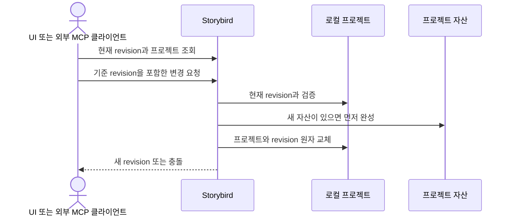

# ADR 0001: 영상 프로젝트와 편집 revision을 기기 안에 원자적으로 저장한다

Date: 2026-09-05

## Status

Accepted (2026-09-09)

## Context

화면 녹화에는 고객 데이터, 계정 정보와 내부 제품 화면이 포함될 수 있다. Storybird는 계정이나
클라우드 저장 없이 프로젝트를 기기 안에 유지해야 한다.

영상 프로젝트는 원본 영상, 클립 타임라인, Click Cue, 자막, 효과와 편집 제안을 함께
보존한다. 사람 UI와 외부 MCP 클라이언트가 같은 프로젝트를 편집하므로 오래된 상태가 최신
편집을 덮어쓰지 않아야 한다. 자산과 프로젝트 인덱스의 일부만 저장되면 복구할 수 없는 참조가
남는다.

## Decision Drivers

- 캡처 영상과 편집 상태가 Storybird 소유 네트워크 경로로 전송되면 안 된다.
- 프로젝트가 존재하지 않거나 불완전한 자산을 참조하면 안 된다.
- UI와 MCP의 동시 편집이 최신 프로젝트를 조용히 덮어쓰면 안 된다.
- 원본 영상은 편집과 내보내기 중에도 불변 자산으로 남아야 한다.
- 기존 OpenLane과 이전 Storybird 파일은 호환성 없이도 삭제하거나 이동하면 안 된다.

## Decision

Storybird는 사용자가 설정에서 선택한 폴더에 로컬 프로젝트 인덱스와 프로젝트별 자산을
저장한다. 기본 위치는 Application Support의 Storybird 루트다. 프로젝트 자산을 먼저
완성한 뒤 프로젝트 상태와 인덱스를 원자적으로 교체한다.
원본 영상은 프로젝트 소유의 읽기 전용 자산으로 유지한다.

폴더 선택은 해당 폴더의 라이브러리로 전환하는 작업이다. 기존 파일을 이동하거나 병합하지
않으며 이전 폴더를 다시 선택하면 그곳의 프로젝트를 표시한다. 선택은 앱 재실행 뒤에도
유지한다. 대상 폴더의 접근 가능 여부와 프로젝트 인덱스를 검증한 뒤에만 전환한다.
실패하면 현재 위치와 프로젝트를 유지하고 이유를 표시한다. 녹화 준비부터 저장 완료까지,
가져오기, 내보내기와 음성 작업 중에는 전환하지 않는다.

Storybird 애플리케이션이 프로젝트와 자산의 유일한 작성자다. 사람 UI와 외부 MCP 클라이언트는
Storybird 명령을 통해서만 프로젝트를 변경한다. 인증된 로컬 MCP 연결은 현재 선택한 라이브러리의 모든 프로젝트의
메타데이터와 편집 모델을 조회할 수 있지만 프로젝트 파일과 자산을 직접 수정하지 않는다.

각 프로젝트는 현재 편집 revision을 가진다. 변경 요청은 기준 revision을 제시하고, Storybird는
현재 revision과 일치할 때만 원자적으로 저장한다. 실제 프로젝트 변경이 성공하면 revision을
정확히 하나 진행시키고, 실패·충돌·동일 값 요청은 revision과 실행 취소 기록을 바꾸지 않는다.

Storybird 라이브러리가 없고 OpenLane 라이브러리가 있으면 기존 루트를 복사해 원본을 보존한다.
새 편집 모델은 기존 프로젝트를 읽거나 변환하거나 내보낼 의무가 없다. 기존 파일은 삭제하거나
이동하지 않고 그대로 둔다.

Storybird는 공유 음성 프로필 인덱스와 프로필별 참조 음성·대본, 준비한 음성 모델을 기본
Storybird 루트 안에 유지한다. 프로젝트 폴더 전환은 이 공유 자산이나 로컬 MCP 연결 위치를
바꾸지 않는다. 생성 내레이션은 선택한 폴더의 프로젝트 소유 자산이며 프로필 삭제와 독립적으로
유지한다.

### Requirement contract

#### Required guarantees

- 기본 프로젝트 루트는 `~/Library/Application Support/Storybird`다 — 기존 제품의 로컬 저장
  위치 계약이다.
- 사용자는 네이티브 설정에서 프로젝트 저장 폴더를 선택하거나 기본 위치로 복원하며 선택은
  앱 재실행 뒤에도 유지한다 — 저장 위치 선택 계약이다.
- 프로젝트 인덱스, 원본 영상, 생성 내레이션과 편집 상태는 선택한 프로젝트 폴더에 저장한다.
  공유 음성 프로필·참조 음성·대본·모델과 로컬 MCP 연결 위치는 기본 위치에 유지한다 —
  프로젝트 저장과 앱 공유 자산의 분리 계약이다.
- 폴더 전환은 대상의 프로젝트 목록을 표시하고 이전 파일을 이동·삭제·병합하지 않는다.
  이전 폴더를 다시 선택하면 그곳의 프로젝트를 표시한다 — 비파괴 폴더 전환 계약이다.
- 대상 폴더의 읽기·쓰기 가능 여부와 기존 프로젝트 인덱스를 검증한 뒤에만 선택을 저장하고
  현재 라이브러리를 전환한다 — 검증 선행 계약이다.
- 녹화 준비·녹화·중지 후 저장, 가져오기, 내보내기와 음성 작업이 진행 중이면 저장 폴더 변경을
  거부하고 이유를 표시한다. UI와 MCP에서 시작한 작업 모두에 적용한다 — 작업 위치 고정
  계약이다.
- 프로젝트와 캡처 자산은 Storybird 소유 네트워크 요청 없이 기기 안에 저장한다 — 로컬 우선
  개인정보 계약이다.
- 프로젝트 자산은 프로젝트 상태가 해당 자산을 참조하기 전에 완전히 저장한다 — 참조 무결성
  계약이다.
- 프로젝트 인덱스와 한 편집 명령의 프로젝트 상태는 원자적으로 교체한다 — 부분 저장 방지
  계약이다.
- 원본 영상 자산은 편집, 프리뷰와 내보내기 전후에 같은 바이트를 유지한다 — 비파괴 원본
  계약이다.
- Storybird 애플리케이션만 프로젝트와 앱 소유 자산을 기록한다 — 단일 작성자 계약이다.
- 편집 가능한 클립, Cue, 자막, 효과와 제안은 프로젝트 안에서 각각 고유한 식별자를 가진다 —
  편집 대상 명확성 계약이다.
- 프로젝트 조회는 현재 revision을 반환하고 변경 요청은 기준 revision을 포함한다 — 동시 편집
  계약이다.
- 현재 revision과 일치하는 실제 프로젝트 변경이 성공하면 revision을 정확히 `1` 진행시킨다 —
  변경 순서 계약이다.
- 충돌, 실패 또는 실제 상태 변화가 없는 요청으로 증가하는 revision과 실행 취소 기록은 각각
  `0개`다 — 중복·실패 안정성 계약이다.
- 앱 재시작 뒤에도 이전에 얻은 revision이 더 최신 상태를 덮어쓰지 못한다 — 재시작 경계의
  동시 편집 계약이다.
- 인증된 로컬 MCP 연결은 현재 선택한 라이브러리의 모든 프로젝트의 메타데이터와 편집 모델을 Storybird 명령으로
  조회·변경할 수 있다 — 로컬 자동화 가시성 계약이다.
- Storybird 라이브러리가 없고 OpenLane 라이브러리가 있으면 기존 라이브러리를 복사하고 원본을
  남긴다 — 기존 데이터 보존 계약이다.
- Storybird 라이브러리가 이미 있으면 OpenLane 데이터로 덮어쓰지 않는다 — 현재 라이브러리
  우선 계약이다.
- 기존 OpenLane과 이전 Storybird 프로젝트 파일은 삭제하거나 이동하지 않는다 — 데이터 보존
  계약이다.
- 새 편집 모델은 기존 프로젝트의 읽기·변환·내보내기 호환성을 제공하지 않는다 — 승인된
  호환성 제외 계약이다.
- 저장·취소·렌더링 실패를 주입한 기준 `20개` 모두에서 원본과 마지막 유효 프로젝트를
  보존한다 — MVP 저장 안전성 목표다.
- 음성 프로필은 고유 식별자, 이름, 참조 음성, 대본과 사용 권한 확인 상태를 기기 안에
  보존한다 — 로컬 음성 프로필 계약이다.
- 생성 내레이션 자산은 프로젝트가 참조하기 전에 완전히 저장한다 — 음성 자산 무결성 계약이다.
- 프로필 삭제는 참조 음성과 대본을 제거하지만 프로젝트 소유 생성 내레이션을 제거하지 않는다
  — 데이터 수명 분리 계약이다.

#### Prohibitions

- companion, 외부 MCP 클라이언트와 다른 프로세스는 프로젝트 파일이나 앱 소유 자산을 직접
  수정하지 않는다.
- 프로젝트 상태는 아직 저장되지 않았거나 실패한 자산을 참조하지 않는다.
- 오래된 revision의 변경은 현재 프로젝트를 덮어쓰지 않는다.
- 실패한 편집의 일부 상태, 일부 레이어 또는 일부 실행 취소 기록만 저장하지 않는다.
- 기존 프로젝트를 새 모델로 자동 변환하거나 변환 실패를 이유로 삭제하지 않는다.
- 프로젝트와 캡처 자산을 Storybird 소유 클라우드 또는 외부 네트워크 저장소에 업로드하지
  않는다.
- companion과 외부 MCP 클라이언트는 음성 프로필과 생성 내레이션 파일을 직접 수정하지 않는다.
- MCP는 저장 폴더를 선택하거나 기본 위치로 복원하지 않는다.
- 사용할 수 없는 선택 폴더를 다른 폴더나 임시 폴더로 조용히 대체하지 않는다.

#### Failure guarantees

- 자산 저장이 실패하면 해당 자산을 참조하는 프로젝트 변경을 저장하지 않는다.
- 프로젝트 또는 인덱스 저장이 실패하면 마지막 유효 프로젝트와 인덱스를 유지한다.
- 오래된 revision은 현재 revision과 충돌 대상 정보를 반환하고 프로젝트를 변경하지 않는다.
- 외부 MCP 명령 검증이나 저장이 실패하면 프로젝트 파일, revision과 실행 취소 기록을 명령 전
  상태로 유지한다.
- 기존 데이터 복사에 실패하면 OpenLane 원본을 유지하고 불완전한 Storybird 라이브러리를
  권위 상태로 사용하지 않는다.
- 음성 프로필 또는 내레이션 저장 실패는 마지막 유효 프로필 인덱스와 프로젝트를 유지한다.
- 폴더 선택 취소, 접근 불가 또는 손상된 라이브러리는 기존 선택과 프로젝트를 변경하지 않는다.
- 재실행 시 선택 폴더를 열 수 없으면 선택을 유지하고 오류를 표시하며 해당 라이브러리에
  쓰지 않는다. 폴더를 복구한 뒤 다시 선택하거나 다른 유효 폴더를 선택해 복구할 수 있다.

#### Observable evidence

- 네트워크를 차단한 상태에서도 프로젝트를 생성·편집·재실행하고 원본 영상을 열 수 있다.
- 프로젝트가 참조하는 영상과 자산은 모두 완전한 파일로 존재하며 실패한 자산 경로는 프로젝트에
  나타나지 않는다.
- 편집 저장 중 실패를 유도해도 다시 연 프로젝트는 마지막 유효한 클립·레이어 상태를 보여 준다.
- 레이어 편집과 내보내기 뒤 원본 영상의 바이트가 유지된다.
- UI와 MCP가 같은 revision으로 각각 변경을 요청하면 먼저 성공한 변경만 저장되고 다른 요청은
  현재 revision을 반환한다.
- 성공한 실제 변경 뒤 revision은 하나 증가하고 동일 값·실패·충돌 요청 뒤에는 증가하지 않는다.
- 앱을 다시 시작한 뒤 오래된 revision으로 요청해도 재시작 이후 프로젝트 상태를 덮어쓰지
  못한다.
- companion의 프로젝트 파일 직접 변경 없이 Storybird 명령을 통해 현재 선택한 라이브러리의 모든 프로젝트를
  조회·편집할 수 있다.
- Storybird 루트가 없는 첫 실행에서 OpenLane 파일은 Storybird 쪽에 복사되며 원본 루트는
  그대로 남는다.
- 기존 프로젝트는 새 편집기에 나타나지 않지만 원본 파일은 디스크에 남는다.
- 기준 실패 주입 `20개` 모두에서 원본 영상과 마지막 유효 프로젝트가 유지된다.
- 음성 프로필을 삭제해도 기존 프로젝트의 생성 내레이션 파일과 재생 결과가 유지된다.
- 다른 폴더를 선택하고 프로젝트를 저장한 뒤 앱을 재실행하면 같은 폴더의 프로젝트가 나타난다.
- 기본 위치 복원과 이전 폴더 재선택은 각 폴더의 프로젝트만 표시하며 파일 바이트를 유지한다.
- 폴더 전환 후에도 기존 음성 프로필과 준비된 모델을 사용할 수 있고 MCP가 같은 연결 위치로
  현재 라이브러리를 조회한다.
- 진행 중인 작업, 손상된 인덱스, 쓰기 불가 폴더와 연결 해제된 선택 폴더를 대상으로 전환을
  시도해도 이전 선택과 프로젝트를 유지하며 오류가 보인다.

### Edit consistency

### Alternatives

#### 폴더를 바꿀 때 기존 라이브러리를 자동으로 이동한다

프로젝트 목록을 계속 유지할 수 있지만 대형 영상 복사 중 실패와 기존 대상의 충돌을 처리해야
한다. 사용자가 고른 폴더의 라이브러리로 전환하고 원본을 보존하는 방식을 사용한다.

#### SQLite에 인덱스와 영상 자산을 모두 저장한다

트랜잭션과 동시성 제어는 강하지만 대형 영상 blob, 사용자의 수동 백업과 자산 단위 진단이
어려워진다. 프로젝트별 파일 자산과 원자적 인덱스가 로컬 데모 라이브러리에 더 단순하다.

#### UI와 companion이 프로젝트 파일을 각각 직접 수정한다

중계 호출이 줄지만 두 작성자가 서로의 변경을 덮어쓰고 부분 파일을 만들 수 있다. 앱 단일
작성자와 revision 검증을 유지한다.

#### 클라우드 저장을 기본 프로젝트 저장소로 사용한다

백업과 협업은 쉬워지지만 계정, 네트워크, 개인정보와 운영 인프라를 필수로 만든다. 오프라인
녹화·편집·내보내기 계약과 맞지 않는다.

#### 기존 프로젝트를 새 모델로 자동 변환한 뒤 원본을 제거한다

사용자는 하나의 최신 라이브러리만 보지만 클릭·자막 연결을 결정할 수 없는 프로젝트에서 잘못된
Click Cue를 만들거나 데이터를 잃을 수 있다. 원본 파일을 보존하고 호환성 의무를 두지 않는다.

## Consequences

### Positive

- 영상과 편집 상태가 네트워크 없이 기기 안에 남는다.
- 자산과 프로젝트 인덱스가 실패 중간 상태를 참조하지 않는다.
- UI와 MCP의 동시 편집이 조용히 서로를 덮어쓰지 않는다.
- 기존 데이터 파일을 삭제하지 않고 새 모델의 복잡성을 제한한다.

### Negative

- 인증된 MCP 클라이언트는 현재 선택한 라이브러리의 모든 프로젝트의 편집 모델을 볼 수 있다.
- 기존 프로젝트는 새 편집기에서 사용할 수 없다.
- revision과 원자적 파일 교체를 모든 프로젝트 변경에 적용해야 한다.
- 폴더마다 프로젝트 목록이 분리된다. 이전 프로젝트를 보려면 그 폴더를 다시 선택해야 한다.
- 선택한 외장 저장소를 사용할 수 없으면 복구하거나 다른 폴더를 선택해야 프로젝트 저장을
  재개할 수 있다.

### Risks

- 자산과 프로젝트 교체 순서가 깨지면 고아 자산 또는 누락 참조가 남을 수 있다.
- revision 검증이 우회되면 UI와 MCP의 최신 변경이 손실될 수 있다.

## Related

- [연속 화면 영상과 Click Cue를 같은 시간축에 기록한다](../recording/0002-continuous-video-recording.md)
- [원본 영상을 보존하는 비파괴 클립 타임라인을 사용한다](../timeline-editing/0001-non-destructive-clip-timeline.md)
- [영상 레이어와 합성 프리뷰가 하나의 프로젝트 시간축을 사용한다](../authoring/0001-timeline-overlay-editor.md)
