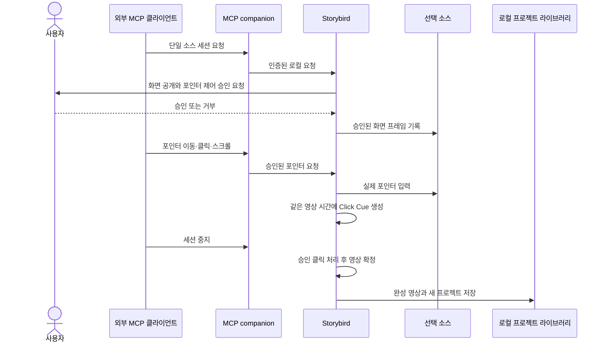

# ADR 0002: 연속 화면 영상과 Click Cue를 같은 시간축에 기록한다

Date: 2026-09-05

## Status

Accepted (2026-09-05)

## Context

제품 데모는 로딩, 스크롤, 전환 애니메이션과 커서 이동을 포함한 실제 화면 움직임을 보존해야
한다. 클릭 전후 정지 화면만 저장하면 이 움직임을 다시 만들 수 없고, 영상과 클릭이 서로 다른
시계를 사용하면 후속 설명과 자막이 실제 조작에서 벗어난다.

사람과 외부 MCP 클라이언트는 같은 결과물을 만들어야 한다. Storybird는 화면 캡처, 실제 포인터
입력, 영상 자산과 프로젝트 저장을 소유하고, companion은 승인된 로컬 명령만 중계한다.
Storybird는 LLM을 실행하지 않으며 외부 클라이언트가 화면 해석과 문구 작성을 담당한다.

## Decision Drivers

- 실제 화면 움직임과 커서 경로를 정지 화면 추정 없이 보존해야 한다.
- 유효한 클릭 하나가 영상의 같은 시각과 위치에 Click Cue 하나를 만들어야 한다.
- 선택한 소스 밖의 클릭과 승인되지 않은 외부 제어는 대상 앱과 프로젝트를 바꾸면 안 된다.
- Stop과 클릭이 겹쳐도 승인된 클릭 순서와 완전한 영상 파일을 보존해야 한다.
- Storybird만 영상 자산과 프로젝트를 기록하고 외부 제어 경계는 로컬에 머물러야 한다.

## Decision

Storybird는 사용자가 고른 디스플레이 하나 또는 창 하나를 무음 연속 영상으로 기록한다. 첫 유효
프레임의 표시 시각이 프로젝트 시간 `0초`가 되고, 이후 프레임과 클릭은 같은 시간축을 사용한다.

선택 소스 안에서 발생한 유효한 mouse-down 하나는 Click Cue 하나를 만든다. Click Cue는 클릭
시각, 버튼, 선택 소스의 왼쪽 위 기준 정규화 좌표, 클릭 표시, 빈 설명 슬롯과 빈 자막 슬롯을
가진다. Storybird는 설명이나 자막 문구를 만들지 않는다. 사람 또는 외부 MCP 클라이언트가
녹화 후 해당 문구를 입력한다.

새 녹화는 항상 별도 프로젝트를 준비한다. Stop은 새 클릭을 차단하고 이미 승인한 클릭을 발생
순서대로 처리한 뒤 영상 기록을 끝낸다. Storybird는 재생 가능한 영상 자산이 완성된 후에만
프로젝트를 라이브러리에 공개한다.

외부 MCP 클라이언트는 Storybird의 네이티브 승인을 받은 세션에서 선택 소스의 현재 PNG를
관찰하고 포인터 이동, 왼쪽·오른쪽 클릭과 스크롤을 요청한다. companion은 화면 권한, 실제 입력
게시, 영상 인코딩 또는 프로젝트 쓰기를 소유하지 않는다.

### Requirement contract

#### Required guarantees

- 한 녹화 세션은 디스플레이 하나 또는 창 하나만 사용한다 — 사용자가 승인한 캡처 경계다.
- 앱 인스턴스당 활성 녹화와 승인된 MCP 화면 제어 세션은 각각 하나다 — 단일 소스와 단일
  작성자 계약이다.
- 첫 유효 영상 프레임의 표시 시각이 프로젝트 시간 `0초`다 — 영상과 레이어의 공통 기준이다.
- 유효 화면 프레임은 표시 순서와 시각을 보존해 영상 자산 하나에 기록한다 — 연속 움직임 보존
  계약이다.
- 유효한 클릭 하나는 Click Cue 하나를 만든다 — 클릭 중복 및 누락 방지 계약이다.
- Click Cue는 클릭 시각, 버튼, 가로·세로 각각 `0...1` 범위의 왼쪽 위 기준 좌표, 클릭 표시,
  빈 설명 슬롯과 빈 자막 슬롯을 가진다 — 제품 데모 편집 계약이다.
- 클릭은 mouse-down 시점에 보이는 유효 캡처 프레임과 연결한다 — 빠른 화면 변화에서도 클릭
  장면을 보존하는 계약이다.
- 클릭 이벤트는 입력 순서대로 저장하고 Stop은 이미 승인한 클릭 처리를 기다린다 — 녹화 종료
  순서 보장이다.
- 사람 녹화와 MCP 녹화는 항상 새 프로젝트를 만들고 현재 프로젝트를 변경하지 않는다 — 녹화
  격리 계약이다.
- 완전한 영상 자산을 저장하기 전에는 프로젝트가 해당 자산을 참조하지 않는다 — 부분 프로젝트
  방지 계약이다.
- 녹화 HUD는 선택 화면의 가로 중앙과 가시 영역 상단에서 `96pt` 아래에 시작하고, 공간이
  부족하면 전체가 가시 영역 안에 남는다 — 기존 녹화 조작성 계약이다.
- 승인된 MCP 세션의 관찰 응답은 선택 소스의 현재 PNG와 해당 프레임 정보만 포함한다 — 화면
  가시성 경계다.
- MCP 포인터 제어의 허용 동작은 이동, 왼쪽·오른쪽 클릭, 가로·세로 스크롤이다 — 외부 입력
  권한 계약이다.
- MCP가 실행한 유효한 클릭은 프로젝트에 Click Cue로 정확히 한 번 기록된다 — 자동화와 녹화
  결과 동등성 계약이다.
- Storybird는 사람 녹화와 MCP 녹화에 같은 영상·Click Cue 모델을 사용한다 — UI와 자동화
  결과 동등성 계약이다.
- 녹화 결과는 오디오 트랙이 없는 영상이다 — MVP 출력 범위다.

#### Prohibitions

- 선택 범위 밖 좌표, 유효 프레임 부재 또는 필요한 권한 부재 상태에서는 실제 입력이나
  Click Cue를 만들지 않는다.
- Storybird와 companion은 키보드 이벤트를 관찰·생성·저장하지 않는다.
- Storybird는 시스템 오디오와 마이크 입력을 수집하지 않는다.
- Storybird는 DOM, 쿠키, 로컬 저장소, 비밀번호, 인증 토큰 또는 결제 데이터를 별도 구조화
  데이터로 저장하지 않는다.
- Storybird와 companion은 외부 제어를 위한 TCP·HTTP 서버 또는 Storybird 소유의 외부
  네트워크 경로를 만들지 않는다.
- Storybird는 LLM을 실행하거나 모델 API를 호출하거나 모델 API 키를 저장하지 않는다.
- 화면 관찰과 포인터 제어 승인은 구매, 메시지 전송, 업로드, 계정 변경 또는 다른 외부 부작용을
  별도로 승인하지 않는다.

#### Failure guarantees

- 캡처, 영상 확정, 로컬 IPC 또는 프로젝트 저장이 실패하면 기존 프로젝트 라이브러리를
  유지한다.
- 첫 프레임이나 영상 확정이 실패하면 빈 프로젝트 또는 부분 영상 프로젝트를 남기지 않는다.
- 권한 거부, 세션 종료, 유효 프레임 부재와 잘못된 좌표는 실제 입력이나 Click Cue를 만들지
  않은 오류로 반환한다.
- 취소되거나 실패한 세션의 임시 영상 자산은 프로젝트 라이브러리에서 참조되지 않는다.

#### Observable evidence

- 움직임이 있는 화면을 녹화하면 완성 프로젝트의 원본 영상에서 같은 움직임이 연속 재생된다.
- 유효한 클릭 하나를 실행하면 같은 프로젝트 시각과 위치에 Click Cue 하나가 나타나고 설명과
  자막 슬롯은 비어 있다.
- 활성 녹화 또는 MCP 화면 제어 세션 중 같은 종류의 두 번째 세션을 요청하면 기존 세션과 선택
  소스가 유지되고 새 요청은 실행되지 않는다.
- 빠른 연속 클릭 후 즉시 Stop해도 마지막 승인 클릭까지 순서대로 보존된 새 프로젝트가 열린다.
- 선택 범위 밖 클릭, 권한 없는 클릭과 유효 프레임 없는 클릭은 대상 앱과 프로젝트를 바꾸지
  않는다.
- 기존 프로젝트를 선택한 상태에서 새 녹화를 시작해도 기존 프로젝트는 유지되고 새 프로젝트가
  생성된다.
- 녹화 HUD는 넓은 화면과 짧은 화면 모두에서 상단 `96pt` 시작 위치 또는 하단 제한을 지키며
  전체가 보인다.
- 승인된 관찰 요청은 선택 소스의 PNG만 반환하고 다른 화면의 픽셀은 포함하지 않는다.
- 완성된 영상에는 오디오 트랙이 없고 프로젝트에는 키보드 이벤트 데이터가 없다.
- 완성 프로젝트에는 DOM, 쿠키, 비밀번호, 인증 토큰과 결제 데이터의 별도 구조화 기록이 없다.
- Storybird를 네트워크에서 차단해도 사람 녹화와 승인된 로컬 MCP 녹화가 완료된다.
- 모델 API 키를 설정하지 않아도 녹화가 완료되고 Storybird가 외부 모델 요청을 만들지 않는다.
- 캡처, 영상 확정 또는 저장 실패를 유도해도 기존 프로젝트와 자산은 유지되고 부분 프로젝트는
  나타나지 않는다.

### Sequence diagram

### Alternatives

#### 클릭 전후 정지 화면만 저장한다

저장 공간은 작지만 로딩, 스크롤, 전환 애니메이션과 커서 이동을 보존하지 못한다. 실제 제품
움직임을 보여 주는 영상 결과와 Click Cue 시간 동기화를 만족하지 못한다.

#### companion이 화면 캡처와 프로젝트 저장을 직접 소유한다

외부 클라이언트와 가까운 곳에서 자동화할 수 있지만 별도 화면·입력 권한이 필요하고 Storybird와
동시에 프로젝트를 쓸 수 있다. 사용자 승인과 앱 단일 작성자 경계가 분산되므로 채택하지 않는다.

#### 앱에 로컬 HTTP 제어 서버를 연다

명령과 이미지를 전달하기 쉽지만 포트, 수명주기와 네트워크 인증 경계를 제품에 추가한다. 한
사용자 기기의 로컬 companion이 필요한 범위에는 인증된 프로세스 간 통신이 더 좁은 경계다.

#### 키보드와 오디오까지 함께 기록한다

폼 자동화와 음성 설명을 한 번에 담을 수 있지만 민감한 텍스트·음성, 추가 권한과 동기화 계약을
제품 범위에 포함한다. MVP는 포인터 기반 무음 제품 데모에 집중한다.

## Consequences

### Positive

- 실제 화면 움직임과 커서 경로를 Storybird 프로젝트에 보존한다.
- 사람과 외부 MCP 클라이언트가 같은 영상·Click Cue 타임라인을 만든다.
- 녹화 실패와 부분 파일이 기존 프로젝트를 손상시키지 않는다.

### Negative

- 정지 화면 모델보다 프로젝트 자산 크기와 녹화 중 CPU·디스크 사용량이 증가한다.
- 사용자는 선택한 화면이 승인한 외부 MCP 클라이언트에 공개될 수 있음을 이해해야 한다.
- 설명과 자막은 녹화 후 사람 또는 외부 MCP 클라이언트가 완성해야 한다.

### Risks

- 캡처 프레임과 입력 이벤트의 시계가 어긋나면 Click Cue가 잘못된 장면에 나타날 수 있다.
- 영상 확정과 Stop 경계가 불완전하면 마지막 클릭 또는 전체 프로젝트를 잃을 수 있다.

## Related

- [썸네일 갤러리에서 녹화 소스를 선택한다](./0001-thumbnail-source-selection.md)
- [안정적인 서명 신원과 최소 권한을 사용한다](./0003-permission-and-signing.md)
- [영상과 시간 기반 레이어를 같은 타임라인에서 편집한다](../authoring/0001-timeline-overlay-editor.md)
