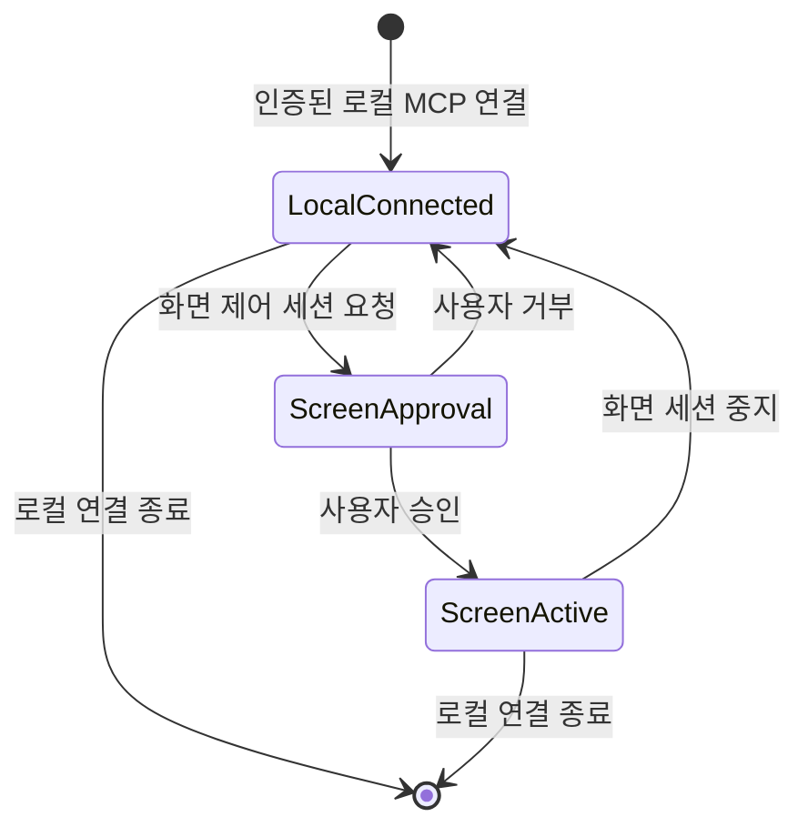

# ADR 0003: 안정적인 서명 신원과 분리된 MCP 권한 경계를 사용한다

Date: 2026-09-05

## Status

Accepted (2026-09-11)

## Context

macOS는 화면 기록, mouse-down 관찰과 실제 포인터 게시 권한을 실행 주체의 서명 신원에
연결한다. ad-hoc 서명은 재빌드마다 다른 신원으로 취급될 수 있고, 권한 사전 검사는 설정
화면과 실제 API 상태가 일시적으로 어긋날 수 있다.

외부 MCP 클라이언트는 두 종류의 권한을 사용한다. 로컬 프로젝트 조회·편집·프리뷰·내보내기는
기기 안의 인증된 연결 경계에 속하고, 현재 화면 공개와 실제 포인터 입력은 사용자가 세션마다
승인하는 더 좁은 경계에 속한다. 두 경계를 하나로 묶으면 반복 승인이 자동화를 방해하거나,
반대로 한 번의 연결이 화면과 입력까지 과도하게 허용한다.

## Decision Drivers

- 개발 빌드와 배포 빌드가 재빌드 사이에 안정적인 macOS 권한 신원을 유지해야 한다.
- 인증된 로컬 MCP 연결은 모든 로컬 프로젝트를 자동화할 수 있어야 한다.
- 화면 공개와 실제 포인터 제어는 프로젝트 편집과 분리해 세션마다 사용자가 승인해야 한다.
- companion은 별도 TCC 권한과 프로젝트 직접 쓰기 권한을 가지면 안 된다.
- 권한·연결 실패는 실제 입력이나 부분 프로젝트 변경 없이 복구 가능해야 한다.

## Decision

Storybird 앱과 번들된 MCP companion은 가능한 경우 Developer ID 또는 Apple Development
인증서와 같은 Team ID로 서명한다. 앱 번들 ID는 `com.storybird.app`으로 유지한다. 인증서가
없으면 사람용 앱을 ad-hoc으로 빌드할 수 있지만 외부 MCP 제어는 허용하지 않는다.

companion은 stdio로 외부 MCP 클라이언트와 통신하고, Storybird 앱에는 인증된 사용자 전용 로컬
연결로 요청을 중계한다. Storybird는 peer의 Team ID와 허용된 companion identifier를
검증한다. companion은 Screen Recording, Input Monitoring, Accessibility 권한 또는 프로젝트
파일 쓰기를 소유하지 않는다.

인증된 로컬 MCP 연결은 기기 안의 모든 Storybird 프로젝트 메타데이터와 편집 모델을 조회하고,
Storybird 명령을 통해 편집·프리뷰·내보내기할 수 있다. 비파괴 프로젝트 작업은 항목별 네이티브
승인을 반복하지 않는다. 프로젝트 영구 삭제는 Storybird 앱의 네이티브 확인을 거친다.

화면 관찰과 포인터 제어는 별도 활성 세션이다. Storybird는 선택 소스, 화면 공개와 실제 입력
범위를 네이티브 화면에 표시하고 사용자가 승인한 뒤에만 현재 PNG와 포인터 이동·좌우
클릭·스크롤을 허용한다. 사용자가 화면 제어 세션을 중지하면 관찰과 입력만 중단되고, 인증된
로컬 MCP 연결의 프로젝트 도구는 연결이 유지되는 동안 사용할 수 있다.

화면 접근은 실제 캡처 API 결과를 먼저 시도하고 실패한 뒤 권한 문제로 분류한다. 사람 녹화의
Input Monitoring은 왼쪽·오른쪽 mouse-down 관찰에만 사용한다. 마이크는 사용자가 음성 프로필 또는 프로젝트 음성 녹음을 명시적으로 시작한 동안에만 사용하고 화면 녹화 세션과 분리한다. 최초 로컬 음성
모델 다운로드는 UI의 준비 버튼 또는 인증된 MCP의 특정 모델 준비 요청으로 바로 시작하며 별도 승인을 요구하지 않는다.

### Requirement contract

#### Required guarantees

- 인증된 로컬 MCP 연결은 앱이 읽을 수 있는 로컬 MP4·MOV·WAV·MP3·M4A 절대 경로로 프로젝트 미디어를 가져온다. 파일·폴더별 추가 승인과 화면 제어 세션을 요구하지 않는다 — 무인 제작 권한 계약이다.
- 앱이 실제 파일을 읽고 검증하며 운영체제가 거부한 접근은 오류로 반환한다. 가져오기는 음성 프로필 등록·참조 음성 관리·마이크·화면 공개 권한을 부여하지 않는다 — 기존 민감 입력 경계다.

- 사용자가 직접 시작하는 프로젝트 음성 녹음은 프로필 등록과 분리한 프로젝트 자산을 만든다. 유효한 양수 길이를 저장할 수 있고 프로필의 최소 10초 조건을 적용하지 않는다 — 독립 발화 입력 계약이다.
- 프로젝트 녹음 상태는 대기, 녹음, 일시정지, 미리듣기, 저장 중, 완료다. 대기에서 녹음을 시작하고 녹음과 일시정지를 오가며 종료 후 미리듣기를 거쳐 저장한다 — 명시적 입력 상태 계약이다.
- 녹음 화면은 입력 장치, 실제 파형과 경과 시간을 표시한다. 시작 시 입력 장치를 고정하며 기존 장치 부재 대체 규칙을 사용한다 — 입력 가시성 계약이다.
- 활성 마이크 녹음은 앱 전체에서 1개이며 화면 녹화 준비·녹화와 동시에 실행하지 않는다. 프로필 녹음과 프로젝트 녹음도 동시에 실행하지 않는다 — 입력 세션 배타성 계약이다.
- 취소는 입력과 미저장 샘플을 정리한다. 저장 중 중복 저장·닫기를 막고 저장 실패는 샘플과 미리듣기를 유지한다. 재시작은 입력을 자동 재개하지 않는다 — 입력 실패 보존 계약이다.
- MCP는 마이크 시작과 음성 프로필 참조 파일 선택을 실행하지 않는다. 프로젝트용 영상·오디오 경로 가져오기는 인증된 로컬 연결에서 실행한다 — 네이티브 입력 경계다.

- 실제 인증서가 있으면 Storybird 앱과 번들된 companion을 같은 Team ID로 서명한다 — 안정적인
  TCC 권한 신원 계약이다.
- 앱 번들 ID는 `com.storybird.app`이다 — macOS 권한 신원 계약이다.
- ad-hoc 빌드는 사람용 녹화를 허용할 수 있지만 외부 MCP 제어를 허용하지 않는다 — 신뢰할
  Team ID가 없는 상태의 보안 경계다.
- 화면 접근 가능 여부는 실제 캡처 API 결과가 권위다 — 오래된 사전 권한 상태로 가능한 녹화를
  차단하지 않는 계약이다.
- 사람 녹화의 Input Monitoring은 왼쪽·오른쪽 mouse-down 관찰에만 사용한다 — 최소 권한
  계약이다.
- 실제 포인터 게시 권한은 Storybird 앱이 네이티브 승인된 활성 화면 제어 세션에서만 사용한다
  — 사용자 입력 통제 계약이다.
- MCP companion은 Screen Recording, Input Monitoring과 Accessibility 권한을 요청하지 않는다
  — 무권한 중계 경계다.
- 로컬 앱 연결은 같은 Team ID와 허용된 companion identifier를 가진 peer만 허용한다 — 인증된
  로컬 신뢰 경계다.
- 인증된 로컬 MCP 연결은 모든 로컬 프로젝트의 메타데이터와 편집 모델을 조회하고 Storybird
  명령으로 비파괴 편집·프리뷰·내보내기할 수 있다 — 로컬 자동화 범위다.
- 비파괴 프로젝트 작업은 프로젝트별 네이티브 승인을 반복하지 않는다 — 로컬 도구 자동화
  계약이다.
- 프로젝트 영구 삭제는 Storybird 앱의 네이티브 확인을 요구한다 — 복구 어려운 동작의 승인
  계약이다.
- 화면 관찰과 포인터 제어는 세션마다 선택 소스와 권한 범위를 공개하고 네이티브 승인을
  요구한다 — 화면·입력 가시성 계약이다.
- 앱 인스턴스당 활성 화면 제어 세션은 하나이며 소스 하나에 고정된다 — 승인 범위 계약이다.
- 사용자가 화면 제어 세션을 중지하면 이후 관찰과 포인터 명령을 거부한다 — 즉시 철회 계약이다.
- 화면 제어 세션의 종료는 인증된 로컬 MCP 연결의 프로젝트 도구 권한을 종료하지 않는다 —
  프로젝트와 화면 권한 분리 계약이다.
- 인증된 로컬 연결이 끊기면 이후 모든 MCP 프로젝트·화면 명령을 거부한다 — 연결 수명 계약이다.
- 권한 실패는 필요한 권한과 복구 가능한 사용자 동작을 UI와 MCP 클라이언트에 알린다 — 복구
  가능성 계약이다.
- 마이크 권한은 사용자가 음성 프로필 또는 프로젝트 음성 녹음을 시작할 때만 요청하고 녹음 중임을 표시한다 —
  음성 입력 가시성 계약이다.
- 음성 모델의 크기와 공급원을 표시한다. 다운로드는 UI의 준비 버튼 또는 인증된 MCP의 특정 모델 준비 요청으로 바로 시작하며 별도 승인을 요구하지 않는다 — 외부 네트워크 실행 계약이다.
- 모델 상태 조회와 선택은 다운로드를 시작하지 않는다. 모델 준비는 마이크 입력·프로필 등록·삭제 권한을 부여하지 않는다 — 민감 입력 분리 계약이다.

#### Prohibitions

- Storybird와 companion은 키보드 이벤트를 관찰·생성·저장하지 않는다.
- 화면 녹화 세션은 마이크 입력을 수집하지 않는다.
- MCP와 companion은 마이크 녹음, 음성 프로필 참조 파일 선택과 음성 프로필 삭제를
  사용자 대신 승인하지 않는다.
- Storybird UI와 companion은 macOS 권한 설정을 우회하거나 직접 변경하지 않는다.
- 필요한 화면 또는 입력 권한이 없으면 포인터 이벤트를 게시하지 않는다.
- companion과 외부 MCP 클라이언트는 프로젝트 파일과 앱 소유 자산을 직접 수정하지 않는다.
- Storybird와 companion은 외부 제어용 TCP·HTTP 서버를 만들지 않는다.
- 사용자 승인 모델 다운로드 이외의 음성 합성 데이터는 외부 네트워크로 전송하지 않는다.
- Storybird는 LLM을 실행하거나 모델 API를 호출하거나 모델 API 키를 저장하지 않는다.
- 화면 제어 세션 승인은 다른 소스, 키보드 입력 또는 프로젝트 영구 삭제 권한으로 확대되지
  않는다.

#### Failure guarantees

- Screen Recording, Input Monitoring 또는 포인터 게시 권한이 거부되면 해당 기능은 실제 입력과
  프로젝트 변경 없이 실패한다.
- companion 서명 또는 peer 인증이 실패하면 프로젝트 모델, 프리뷰 프레임과 화면 픽셀을
  반환하지 않는다.
- 인증된 로컬 연결이 끊기거나 화면 제어 세션이 철회되면 늦게 도착한 명령을 실행하지 않는다.
- companion 검증·실행 실패와 권한 거부는 기존 사람 녹화와 프로젝트 라이브러리를 유지한다.
- 같은 안정 서명 신원으로 다시 빌드한 배포물은 기존 macOS 권한 신원을 유지할 수 있어야 한다.
- 마이크 권한 거부는 요청한 프로필 또는 프로젝트 음성 녹음만 실패시키고 화면 녹화와 기존 프로젝트를 유지한다.
- 모델 다운로드 거부·실패는 기존 모델 캐시와 프로젝트를 유지한다.

#### Observable evidence

- 인증된 MCP의 모델 준비 요청과 UI 준비 버튼은 승인 창 없이 다운로드를 시작한다. 상태 조회와 모델 선택만으로는 다운로드하지 않는다.

- 인증된 MCP로 영상·오디오 경로를 가져오는 동안 네이티브 승인 창이 나타나지 않고, 잘못된 경로는 프로젝트 변경 없이 실패한다.

- 같은 인증서와 번들 ID로 다시 빌드한 앱이 기존 승인으로 화면 관찰과 포인터 제어를 수행하고
  companion은 별도 TCC 항목을 요구하지 않는다.
- 인증된 로컬 MCP 연결은 별도 프로젝트 승인 화면 없이 모든 로컬 프로젝트를 나열하고
  Storybird 명령으로 비파괴 편집할 수 있다.
- 화면 관찰 또는 클릭을 처음 요청하면 선택 소스와 권한 범위가 보이고, 승인 전에는 PNG와
  포인터 이벤트가 없다.
- 활성 화면 제어 세션 중 두 번째 소스를 요청하면 기존 소스와 세션이 유지되고 새 요청은
  실행되지 않는다.
- 화면 제어 세션을 중지한 뒤 관찰과 포인터 명령은 실패하지만 프로젝트 조회·편집 명령은
  인증된 연결에서 계속 동작한다.
- 인증된 로컬 연결을 종료하면 프로젝트 조회, 편집, 프리뷰, 내보내기와 화면 제어가 모두
  거부된다.
- 서명이 다른 companion이나 Team ID가 없는 ad-hoc companion은 프로젝트 및 화면 기능을
  호출하지 못한다.
- 프로젝트 영구 삭제 요청은 Storybird 네이티브 확인 전에는 프로젝트를 제거하지 않는다.
- 권한 사전 상태가 오래됐더라도 실제 화면 캡처가 성공하면 소스 목록과 녹화를 사용할 수 있다.
- 키보드·마이크 권한과 모델 API 키 없이 사람 화면 녹화와 로컬 MCP 프로젝트 편집을 사용할
  수 있다.
- 음성 프로필 또는 프로젝트 음성 녹음 중에만 마이크 사용 표시가 나타나고 화면 녹화 중에는 나타나지 않는다.
- 모델이 준비된 뒤 네트워크를 차단해도 음성 합성과 프로젝트 편집을 사용할 수 있다.
- 권한 없는 입력과 잘못된 peer 요청은 대상 앱과 기존 프로젝트를 바꾸지 않는다.

### State diagram

### Alternatives

#### companion이 별도 TCC 권한을 소유한다

앱과 독립적으로 캡처와 포인터 입력을 실행할 수 있지만 companion에 별도 승인이 필요하고
Storybird의 사용자 확인 경계를 우회하는 두 번째 권한 주체가 생긴다.

#### 모든 프로젝트 작업을 네이티브 승인으로 확인한다

프로젝트별 가시성을 가장 엄격하게 통제하지만 자동 편집의 모든 읽기·쓰기마다 사용자가
개입해야 한다. 인증된 로컬 도구라는 제품 계약과 맞지 않는다.

#### 인증된 연결만으로 화면과 포인터까지 모두 허용한다

승인 흐름이 단순하지만 한 번 연결된 클라이언트가 사용자가 현재 보고 있는 다른 화면까지
관찰하고 조작할 수 있다. 화면과 실제 입력은 세션별 승인으로 분리한다.

#### 모든 빌드를 ad-hoc으로 서명한다

인증서 준비가 필요 없지만 재빌드마다 권한 신원이 달라질 수 있고 신뢰할 Team ID가 없어 외부
제어 peer를 검증할 수 없다.

## Consequences

### Positive

- 안정적인 서명 신원이 macOS 권한 승인을 재빌드 사이에 유지한다.
- 외부 MCP 클라이언트는 반복 승인 없이 모든 로컬 프로젝트를 자동화할 수 있다.
- 사용자는 현재 화면 공개와 실제 입력을 별도 세션으로 통제하고 즉시 철회할 수 있다.
- companion은 무권한 중계 프로세스로 유지된다.

### Negative

- 프로젝트 접근 권한과 화면 제어 권한의 수명주기를 별도로 관리해야 한다.
- 인증서가 없는 기여자는 외부 MCP 제어를 사용할 수 없다.
- 인증된 로컬 클라이언트는 기기 안의 모든 Storybird 프로젝트를 볼 수 있다.

### Risks

- peer 검증이 잘못되면 로컬 프로젝트 전체가 허가되지 않은 프로세스에 노출될 수 있다.
- 화면 세션 철회와 늦게 도착한 입력의 경계가 불완전하면 철회 뒤 입력이 실행될 수 있다.

## Related

- [썸네일 갤러리에서 녹화 소스를 선택한다](./0001-thumbnail-source-selection.md)
- [연속 화면 영상과 Click Cue를 같은 시간축에 기록한다](./0002-continuous-video-recording.md)
