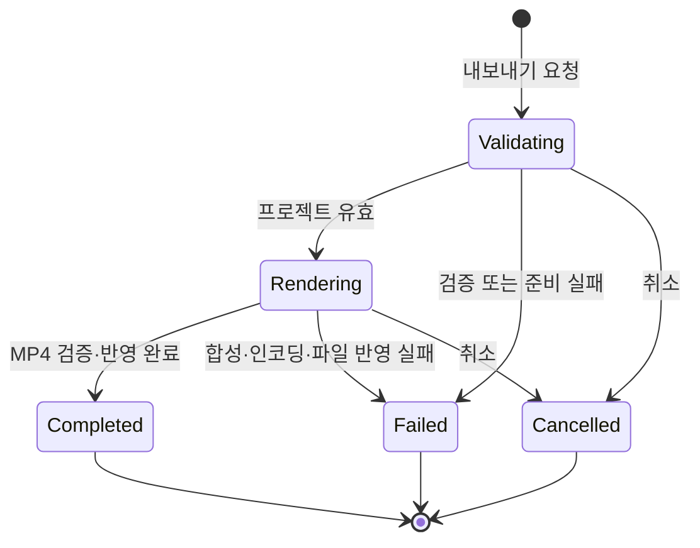

# ADR 0001: 편집 타임라인을 자체 완결된 MP4로 원자적으로 내보낸다

Date: 2026-09-05

## Status

Accepted (2026-09-10)

## Context

사용자는 Storybird 서버, 계정이나 전용 플레이어 없이 재생할 수 있는 제품 데모 영상을
전달해야 한다. 프로젝트에는 원본 영상과 선택적인 기본 음성, 비파괴 클립 타임라인, Click Cue,
자막, 스포트라이트, 팬·줌, 타이틀과 CTA가 별도 상태로 저장된다. 공유 결과는 이 편집 상태를
일반 영상 한 파일에 합성해야 한다.

내보내기 전에 미완성 Click Cue와 잘못된 레이어를 막아야 하며, 렌더링 실패·취소가 원본 또는
기존 출력 파일을 손상시키면 안 된다. 외부 MCP 클라이언트는 UI 없이 검증·진행률·취소·결과를
추적할 수 있어야 한다.

## Decision Drivers

- 결과 파일은 일반 영상 플레이어와 업로드 서비스에서 바로 재생돼야 한다.
- 프리뷰에서 확인한 클립·레이어·효과가 출력과 같은 시각과 위치에 나타나야 한다.
- 가져온 영상의 설명 음성이 편집된 영상 장면과 같은 시간에 출력돼야 한다.
- 미완성 Click Cue와 잘못된 타임라인은 렌더링 전에 거부해야 한다.
- 실패·취소는 원본, 프로젝트와 기존 출력 파일을 바꾸면 안 된다.
- UI와 외부 MCP 클라이언트가 같은 검증·렌더링·상태 계약을 사용해야 한다.

## Decision

Storybird는 내보내기 시작 시 프로젝트 상태를 검증하고 하나의 일관된 편집 스냅샷을 확정한다.
재생 가능한 클립이 하나 이상 있고, 유지할 Click Cue가 모두 완성됐으며, 모든 레이어와 효과가
유효할 때만 렌더링을 시작한다.

Storybird는 편집된 클립, Click Cue, 독립 자막, 스포트라이트, 팬·줌, 타이틀과 CTA를 프로젝트
해상도의 H.264 MP4 한 파일에 합성한다. 원본에 읽을 수 있는 기본 오디오 트랙이 있으면 편집된
클립 구간을 AAC 오디오 트랙 하나로 함께 합성하고, 원본 음성과 독립 오디오 레이어가 모두 없으면 오디오 트랙을 만들지
않는다. 결과는 HTML, 실행 스크립트 또는 별도 자산을 필요로 하지 않는다.

프로젝트 소유 내레이션이 있으면 원본 오디오와 내레이션을 프로젝트 시간과 음량에 맞춰 하나의
AAC 트랙으로 믹싱한다. 무음 화면 녹화에 내레이션이 있으면 결과는 내레이션 AAC 트랙 하나를
가진다.

내보내기는 목적지와 같은 로컬 파일 시스템에 임시 파일을 완성하고 결과 검증이 끝난 뒤
목적지에 반영한다. UI는 사용자가 선택한 목적지를 사용한다. MCP는 허용된 상위 디렉터리에
고유한 파일명을 생성하며 기존 파일을 덮어쓰지 않는다.

외부 MCP 내보내기는 고유한 작업 식별자를 가진다. 작업 상태는 `검증 중`, `렌더링 중`,
`완료`, `실패`, `취소`이며 진행률은 `0%...100%`다. 완료 상태에서만 로컬 MP4 경로를
반환하고 영상 파일 내용은 MCP 응답으로 전송하지 않는다.

### Requirement contract

#### Required guarantees

- 모든 활성 오디오 레이어의 원본 사용 구간, 프로젝트 시작, 음량, 음소거와 선형 페이드를 적용해 합산한다. 겹치는 소리를 모두 포함하고 설정 외의 자동 음량 보정을 하지 않는다 — 명시적 믹스 계약이다.
- 오디오 소스가 있으면 원본 기본 음성과 독립 레이어를 AAC 트랙 1개로 출력하고, 소스가 전혀 없으면 오디오 트랙은 0개다 — 자체 완결 출력 계약이다.
- 유효한 프로젝트 구간의 합성 오디오를 로컬 미리듣기 파일로 만들고 실제 길이와 최대 진폭을 반환한다. 프로젝트와 revision은 변경하지 않는다 — 에이전트 검토 계약이다.
- 활성 자산을 읽거나 합성할 수 없으면 음성을 누락한 성공 결과를 반환하지 않는다. 구간 미리듣기와 MP4 출력은 같은 믹스 규칙을 사용한다 — 출력 실패 보존 계약이다.

- 출력 타임라인에는 재생 가능한 영상 클립이 최소 `1개` 있어야 한다 — 유효 영상 출력
  계약이다.
- 유지할 Click Cue의 빈 설명 또는 빈 자막 수는 각각 `0개`여야 한다 — 안내 완결성 계약이다.
- 모든 클립, Cue, 자막, 효과와 카드가 프로젝트 시간·좌표·스타일 검증을 통과해야 한다 —
  렌더링 입력 계약이다.
- 결과는 H.264 비디오 트랙 `1개`를 가진 MP4 파일 `1개`다 — MVP 배포 형식 계약이다.
- 원본에 읽을 수 있는 기본 오디오 트랙이 있으면 결과는 AAC 오디오 트랙 `1개`를 가진다 —
  사용자 설명 음성 보존 계약이다.
- 원본 기본 오디오와 독립 오디오 레이어가 모두 없으면 결과의 오디오 트랙 수는 `0개`다 — 직접
  화면 녹화의 무음 계약이다.
- 결과 MP4는 프로젝트 영상의 해상도와 화면 비율을 유지한다 — 화면 구성 보존 계약이다.
- 편집된 클립, Click Cue, 독립 자막, 스포트라이트, 팬·줌, 타이틀과 CTA를 영상 픽셀에
  합성한다 — 제품 데모 출력 계약이다.
- 클릭 표시·설명·자막과 효과의 프리뷰 대비 출력 시간 차이는 원본 영상 `1프레임` 이내다 —
  렌더링 동등성 목표다.
- 영상 클립과 기본 음성의 시작·종료 시간 차이는 원본 영상 `1프레임` 이내다 — 영상·음성
  동기화 목표다.
- 정지 구간과 전체 화면 타이틀·CTA 구간은 기본 오디오에 같은 길이의 무음을 두며 독립 오디오 레이어는 지정 시간대로 합성한다 —
  카드·정지 화면 출력 계약이다.
- 내보내기는 시작 시 검증한 프로젝트 스냅샷 하나를 끝까지 사용한다 — 렌더링 일관성 계약이다.
- UI 내보내기는 사용자가 선택한 로컬 목적지를 사용한다 — 사람 출력 위치 계약이다.
- MCP 내보내기는 허용된 상위 디렉터리 안에 고유한 파일명을 만들고 기존 파일을 덮어쓰지 않는다
  — 자동화 파일 안전 계약이다.
- 원본 녹화 파일은 내보내기 목적지가 될 수 없다 — 원본 보존 계약이다.
- 완성되지 않은 결과는 임시 파일에 두고 렌더링과 검증이 성공한 뒤에만 목적지에 반영한다 —
  원자적 출력 계약이다.
- 앱 인스턴스당 활성 내보내기는 최대 `1개`다 — 출력 자원과 상태 단일성 계약이다.
- UI와 MCP는 진행, 완료, 실패와 취소 상태를 조회할 수 있다 — 출력 가시성 계약이다.
- MCP 내보내기는 고유한 작업 식별자를 반환한다 — 비동기 작업 추적 계약이다.
- MCP 작업 상태의 허용 값은 `검증 중`, `렌더링 중`, `완료`, `실패`, `취소`다 — 작업
  수명주기 계약이다.
- 정상 작업은 `검증 중 → 렌더링 중 → 완료`로 전환한다 — 성공 상태 전이 계약이다.
- `검증 중` 또는 `렌더링 중` 작업은 `실패` 또는 `취소`로 전환할 수 있다 — 종료 처리
  계약이다.
- `완료`, `실패`, `취소`는 다시 진행 상태로 전환하지 않는 종료 상태다 — 작업 종료
  불변식이다.
- MCP 진행률 범위는 `0%...100%`다 — 작업 진행 표시 계약이다.
- 완료 상태에서만 완성된 MP4 로컬 경로를 반환한다 — 결과 가시성 계약이다.
- MCP 응답으로 전송하는 MP4 파일 내용 수는 `0개`다 — 로컬 파일 경계다.
- 편집 기능을 조합한 기준 프로젝트 `10개`는 모두 내보내기에 성공하고 지정 프레임의 텍스트와
  효과 누락 수는 `0건`이어야 한다 — MVP 출력 신뢰성 목표다.
- 기준 Mac에서 `1080p`, `120초` 프로젝트를 `240초` 이내에 내보낸다 — MVP 내보내기 성능
  목표다.
- Storybird는 내보내기에 모델 API 또는 자체 외부 네트워크를 사용하지 않는다 — 로컬 출력
  경계다.
- 프로젝트 소유 내레이션이 하나 이상 있으면 결과 AAC 트랙은 해당 시작 시각·길이·음량을
  보존한다 — 합성 내레이션 출력 계약이다.
- 원본 오디오와 내레이션이 함께 있으면 하나의 AAC 트랙으로 믹싱한다 — 일반 플레이어 호환
  계약이다.

#### Prohibitions

- 빈 타임라인, 미완성 Click Cue와 유효하지 않은 레이어는 렌더링을 시작하지 않는다.
- 내보내기는 원본 영상, 프로젝트 상태, revision과 실행 취소 기록을 수정하지 않는다.
- 내보내기는 HTML, 실행 스크립트 또는 별도 자산 디렉터리를 결과로 만들지 않는다.
- 프로젝트에 저장되지 않은 음성이나 시스템 오디오를 추가하지 않는다.
- 프로젝트에 저장되지 않은 임시 합성 음성을 결과에 포함하지 않는다.
- 정지 구간과 전체 화면 타이틀·CTA 구간에 앞뒤 클립의 원본 음성을 반복하지 않는다.
- MCP 내보내기는 기존 목적지 파일과 원본 녹화를 덮어쓰지 않는다.
- 완료되지 않은 작업은 MP4 결과 경로를 반환하지 않는다.
- 종료 상태의 작업을 다시 렌더링 상태로 전환하지 않는다.
- 앱 인스턴스에서 두 번째 동시 내보내기를 시작하지 않는다.
- Storybird는 내보내기 중 LLM을 실행하거나 모델 API를 호출하거나 모델 API 키를 사용하지
  않는다.

#### Failure guarantees

- 사전 검증 실패는 누락되거나 잘못된 클립·Cue·레이어 식별자를 반환하고 파일 생성을 시작하지
  않는다.
- 렌더링, 인코딩, 최종 검증 또는 파일 반영 실패는 원본, 프로젝트와 기존 목적지를 유지한다.
- 취소는 임시 파일을 제거하고 기존 목적지와 원본을 유지한다.
- 두 번째 동시 요청은 현재 내보내기를 유지하고 새 요청을 거부한다.
- 존재하지 않는 작업 식별자와 종료 상태에 대한 잘못된 전이는 다른 작업 상태를 변경하지 않는다.
- 내보내기 시작 뒤 프로젝트가 수정돼도 현재 작업은 시작 시 확정한 스냅샷을 일관되게 렌더링한다.
- 기본 오디오 트랙을 읽거나 인코딩할 수 없으면 음성이 누락된 완료 결과를 반영하지 않는다.
- 내레이션 자산을 읽거나 믹싱할 수 없으면 음성이 누락된 완료 결과를 반영하지 않는다.

#### Observable evidence

- 유효한 프로젝트를 내보내면 일반 영상 플레이어에서 편집된 클립과 모든 레이어·효과가
  재생된다.
- 독립 오디오 레이어가 없는 무음 원본의 결과 파일은 H.264 비디오 트랙 하나, 오디오 트랙 없음,
  HTML·스크립트·자산 디렉터리 없음으로 확인된다.
- 음성이 있는 원본의 결과 파일은 H.264 비디오 트랙 하나와 AAC 오디오 트랙 하나를 가지고,
  클립 경계의 발화와 영상 차이가 `1프레임` 이내다.
- 정지 구간과 전체 화면 타이틀·CTA 구간에서는 앞뒤 원본 발화가 반복되지 않고 독립 오디오만 지정 시간대로 재생된다.
- 미완성 Click Cue 또는 빈 타임라인의 내보내기는 작업 식별자를 만들지 않고 누락 대상을
  반환한다.
- 지정 클릭 프레임의 프리뷰와 MP4에서 클릭 표시, 설명, 자막과 효과 시간이 `1프레임` 이내로
  일치한다.
- 같은 이름의 기존 파일이 있는 MCP 목적지에는 고유한 새 MP4가 생기고 기존 파일은 유지된다.
- 합성 실패 또는 취소 뒤 기존 목적지와 원본 영상의 바이트가 유지되고 임시 파일은 결과로
  반환되지 않는다.
- 진행 중 작업의 상태와 진행률이 `0%...100%` 범위로 보이고 완료 시에만 로컬 경로가
  나타난다.
- 완료·실패·취소 작업을 다시 시작하려는 요청은 상태를 변경하지 않는다.
- 프로젝트를 편집하면서 내보내도 현재 MP4는 시작 시점의 일관된 상태만 포함한다.
- 기준 프로젝트 `10개` 모두 출력되고 지정 프레임의 텍스트·효과 누락이 없다.
- 기준 Mac에서 `1080p`, `120초` 결과가 `240초` 안에 완성된다.
- 네트워크와 모델 API 키 없이 UI와 MCP 내보내기가 완료된다.
- 문장별 내레이션이 지정 시각에 재생되고 원본 오디오와 함께 있을 때도 결과 오디오 트랙은
  하나다.

### Export state

### Alternatives

#### 원본 영상과 레이어 메타데이터를 별도 파일로 전달한다

수신자가 재편집할 수 있지만 Storybird 전용 플레이어나 합성 로직이 필요하다. 일반 영상
플랫폼에 바로 올릴 수 없고 자체 완결 파일 계약을 만족하지 못한다.

#### HTML 플레이어에서 영상을 재생하고 레이어를 런타임에 표시한다

텍스트 접근성과 인터랙션을 유지할 수 있지만 웹 런타임과 여러 파일이 필요하다. MP4 중심 제품
방향과 일반 영상 업로드 흐름에 맞지 않는다.

#### 녹화할 때 레이어와 효과를 원본 영상에 바로 합성한다

추가 내보내기가 필요 없지만 녹화 뒤 문구·시간·효과를 수정할 수 없고 원본 화면을 잃는다.
비파괴 편집 계약을 위반한다.

#### 결과 영상에서 원본 음성을 항상 제거한다

내보내기 구현과 파일 크기는 줄지만 사용자가 말하며 만든 제품 설명을 잃는다. 가져온 영상의
기본 음성을 유지하는 공유 결과 계약을 만족하지 못한다.

#### companion이 프로젝트를 읽고 MP4를 직접 만든다

앱 없이 자동화할 수 있지만 프로젝트 검증·렌더링 구현과 파일 권한을 복제하고 Storybird 단일
작성자 경계를 깨뜨린다. 앱이 UI와 MCP 내보내기를 모두 수행한다.

## Consequences

### Positive

- Storybird 없이 일반 플레이어와 영상 플랫폼에서 결과를 재생할 수 있다.
- 프리뷰와 출력이 같은 프로젝트 시간·좌표·스타일 계약을 사용한다.
- 가져온 영상의 설명 음성이 편집된 화면 장면과 함께 재생된다.
- 실패와 취소가 원본, 프로젝트와 기존 결과를 손상시키지 않는다.
- 외부 MCP 클라이언트가 UI 없이 내보내기 전체 수명주기를 추적할 수 있다.

### Negative

- 모든 레이어를 영상 픽셀로 합성하므로 내보내기 시간과 추가 저장 공간이 필요하다.
- H.264 비디오와 합성 AAC 이외의 출력 코덱·분리 오디오 트랙·인터랙션은 지원하지 않는다.
- 비동기 작업 상태와 임시 파일 정리가 필요하다.

### Risks

- 프리뷰와 출력 렌더러의 시간 경계가 달라지면 `1프레임` 동등성 목표를 위반할 수 있다.
- 취소 또는 파일 반영 경계가 불완전하면 임시 파일이나 기존 출력 손상이 생길 수 있다.
- 복잡한 효과 조합이 `240초` 내보내기 목표를 위협할 수 있다.
- 오디오 디코딩 또는 인코딩 실패가 전체 원자적 내보내기를 실패시킬 수 있다.

## Related

- [영상 레이어와 합성 프리뷰가 하나의 프로젝트 시간축을 사용한다](../authoring/0001-timeline-overlay-editor.md)
- [원본 영상과 음성을 보존하는 비파괴 클립 타임라인을 사용한다](../timeline-editing/0001-non-destructive-clip-timeline.md)
- [제품 데모 효과를 시간 기반 레이어로 편집한다](../demo-effects/0001-timed-demo-effects.md)
- [영상 프로젝트와 편집 revision을 기기 안에 원자적으로 저장한다](../library/0001-local-project-library.md)
- [로컬 동영상을 프로젝트 원본으로 가져온다](../video-import/0001-local-video-import.md)
