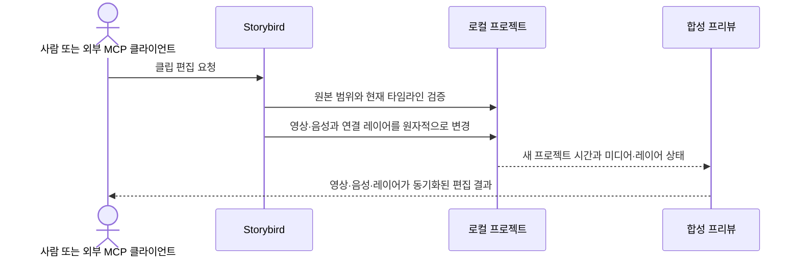

# ADR 0001: 원본 영상과 음성을 보존하는 비파괴 클립 타임라인을 사용한다

Date: 2026-09-05

## Status

Accepted (2026-09-08)

## Context

제품 데모 녹화와 가져온 설명 영상에는 실수, 대기 구간과 불필요한 이동이 포함될 수 있다. 이를
고치기 위해 전체 흐름을 다시 녹화하거나 원본 미디어를 직접 잘라 쓰면 제작 시간이 늘고,
편집을 되돌리거나 다른 버전으로 다시 내보내기 어렵다.

클립 순서와 재생 속도가 바뀌어도 Click Cue와 화면 내용에 연결된 효과는 같은 장면을 가리켜야
한다. 편집기와 외부 MCP 클라이언트가 서로 다른 시간 변환을 사용하면 클릭과 설명이 영상에서
어긋난다.

## Decision Drivers

- 실수 구간을 전체 재녹화 없이 제거해야 한다.
- 모든 편집 후에도 원본 영상 자산을 그대로 보존해야 한다.
- 클립 이동·트림·속도 변경 뒤에도 Click Cue와 효과가 화면 내용에 동기화돼야 한다.
- 가져온 설명 음성은 클립 이동·트림·속도 변경 뒤에도 같은 영상 장면에 동기화돼야 한다.
- 편집과 연결 레이어 변경을 하나의 실행 취소 단위로 되돌릴 수 있어야 한다.
- 사람 UI와 외부 MCP 편집이 같은 타임라인 결과를 만들어야 한다.

## Decision

Storybird는 원본 미디어 자산을 읽기 전용으로 유지하고, 출력에 사용할 원본 구간과 순서,
재생 속도, 정지 구간을 별도 프로젝트 타임라인으로 저장한다. 클립은 원본 시간 범위와 편집 후
프로젝트 시간 범위를 함께 가진다. 원본에 읽을 수 있는 기본 오디오 트랙이 있으면 영상 클립의
같은 원본 범위와 프로젝트 시간 변환을 사용한다.

분할, 트림, 삭제와 재배치는 원본 영상이 아니라 타임라인 상태를 바꾼다. 속도 변경과 정지
구간은 프로젝트 시간만 바꾸고 원본 프레임을 보존한다. Click Cue와 영상 내용에 연결된 효과는
원본 시간을 기준으로 클립에 귀속되고 프로젝트 시간으로 변환된다.

영상 클립의 기본 음성은 영상과 함께 분할, 트림, 삭제, 재배치와 속도 변경을 적용한다. 정지
구간과 전체 화면 타이틀·CTA 구간은 원본 음성을 반복하지 않고 해당 프로젝트 구간을 무음으로
둔다.

한 편집과 그 편집이 유발한 연결 레이어 시간 변경은 원자적인 저장 및 실행 취소 단위 하나다.
UI와 외부 MCP 클라이언트는 같은 검증과 시간 변환 계약을 사용한다.

프로젝트 소유 내레이션은 영상 내용과 독립적인 프로젝트 시간 레이어다. 내레이션은 문장별
오디오 자산, 원고, 음성 프로필, 시작 시각, 재생 길이와 음량을 가지며 서로 겹치거나 프로젝트
종료를 넘을 수 없다. 원고 재생성은 대상 내레이션 자산과 레이어를 원자적으로 교체한다.

### Requirement contract

#### Required guarantees

- 원본 영상 자산은 타임라인 편집 전후에 같은 바이트와 재생 내용을 유지한다 — 비파괴 편집
  계약이다.
- 원본에 읽을 수 있는 기본 오디오 트랙이 있으면 영상 클립은 같은 원본 시간 범위의 음성을
  포함한다 — 영상·설명 음성 결합 계약이다.
- 클립의 원본 시작 시간은 종료 시간보다 빠르고 두 값 모두 원본 영상 범위 안에 있다 — 유효
  구간 계약이다.
- 클립 분할은 클립 시작과 종료 사이에서만 허용하고 길이가 `0초`인 클립을 만들지 않는다 —
  유효 타임라인 계약이다.
- 영상 재생 속도의 허용 범위는 `0.25배...4배`다 — 승인된 MVP 편집 범위다.
- 정지 구간의 길이는 `0초`보다 커야 한다 — 유효 출력 구간 계약이다.
- 클립 재배치는 해당 원본 구간의 Click Cue와 영상 내용에 연결된 효과를 함께 이동한다 —
  장면 동기화 계약이다.
- 트림 또는 삭제한 원본 구간의 연결 레이어는 출력 타임라인에서 제외되고 실행 취소 시 함께
  복원된다 — 비파괴 레이어 계약이다.
- 속도 변경은 해당 클립 안의 Click Cue와 효과 시간을 새 프로젝트 시간에 맞게 변환한다 —
  영상·레이어 동기화 계약이다.
- 분할, 트림, 삭제, 재배치와 속도 변경은 기본 음성에 영상 클립과 같은 원본 범위, 순서와
  프로젝트 시간 변환을 적용한다 — 영상·음성 동기화 계약이다.
- 정지 구간과 전체 화면 타이틀·CTA 구간의 원본 음성 길이는 각각 `0초`다 — 정지 화면과
  카드 구간의 무음 계약이다.
- 분할 시점과 정확히 같은 시각의 Click Cue는 결과 클립 하나에만 귀속된다 — Cue 중복 방지
  계약이다.
- 모든 클립을 삭제한 빈 타임라인은 편집 상태로 보존할 수 있지만 내보낼 수 없다 — 편집과
  출력의 상태 경계다.
- 한 클립 편집과 연결 레이어 변경은 실행 취소 단위 하나다 — 원자적 사용자 동작 계약이다.
- 실행 취소와 재실행 기록은 현재 편집 세션에서 제공하고, 실행 취소 뒤 새 편집을 적용하면
  기존 재실행 기록을 제거한다 — 편집 이력 계약이다.
- `1080p`, `120초`, 시간 기반 레이어 `100개`인 프로젝트에서 시점 이동과 편집 속성 변경의
  `95%`는 `500ms` 안에 프리뷰에 반영된다 — MVP 반응성 목표다.
- UI와 MCP가 같은 편집 명령을 적용하면 같은 클립 순서, 프로젝트 시간과 연결 레이어 시간을
  만든다 — 편집 경로 동등성 계약이다.
- 내레이션 레이어는 서로 겹치지 않고 프로젝트 시간 범위 안에 있다 — 설명 음성 가독성 계약이다.
- 내레이션 원고 수정과 재생성은 대상 레이어 하나의 자산만 교체한다 — 문장 단위 편집 계약이다.
- 내레이션 생성·시간·음량·삭제는 프로젝트 revision과 실행 취소 단위 하나로 저장한다 —
  음성 편집 원자성 계약이다.

#### Prohibitions

- 타임라인 편집은 원본 영상 자산을 덮어쓰거나 재편집본으로 교체하지 않는다.
- 영상 클립의 기본 음성을 영상과 독립적으로 이동, 트림하거나 속도 변경하지 않는다.
- 정지 구간과 전체 화면 타이틀·CTA 구간에서 원본 음성을 반복하지 않는다.
- 원본 범위 밖 분할·트림, `0.25배`보다 느리거나 `4배`보다 빠른 속도, `0초` 이하 정지
  구간을 저장하지 않는다.
- 빈 타임라인을 재생 가능한 영상으로 내보내지 않는다.
- 실패한 편집은 클립, 연결 레이어, 프로젝트 수정 상태와 실행 취소 기록을 부분 변경하지 않는다.
- 겹치는 내레이션과 프로젝트 종료를 넘는 내레이션을 저장하지 않는다.

#### Failure guarantees

- 유효하지 않은 편집은 기존 타임라인과 연결 레이어를 그대로 유지하고 잘못된 범위를 반환한다.
- 편집 기준 상태가 최신 프로젝트와 다르면 이전 상태를 덮어쓰지 않고 최신 상태를 다시
  조회하도록 한다.
- 타임라인 저장이 실패하면 클립, 연결 레이어와 실행 취소 기록을 명령 전 상태로 유지한다.
- 원본 영상이 없거나 읽을 수 없으면 편집 가능한 타임라인으로 표시하지 않는다.
- 프로젝트가 보존 대상으로 식별한 기본 오디오 트랙을 읽을 수 없으면 음성이 있는 편집
  결과로 성공 처리하지 않는다.
- 내레이션 자산 생성 또는 저장이 실패하면 기존 내레이션과 프로젝트 revision을 유지한다.

#### Observable evidence

- 같은 원본 영상으로 여러 클립 편집을 저장해도 원본 자산의 바이트와 재생 길이는 유지된다.
- 클립을 분할·트림·삭제·재배치하면 프리뷰가 새 순서를 보여 주고 Click Cue는 같은 화면
  내용에 남는다.
- 속도를 `0.25배`와 `4배`로 바꾸면 클립과 연결 레이어가 각각 같은 비율의 프로젝트 시간에
  표시된다.
- 음성이 있는 클립을 분할·트림·재배치하거나 속도를 바꾸면 같은 발화 구간이 영상 장면과 함께
  이동하고 같은 프로젝트 길이를 가진다.
- 양수 길이의 정지 구간은 선택 프레임을 해당 길이만큼 유지하고, `0초` 이하 요청은 타임라인을
  바꾸지 않는다.
- 정지 구간과 전체 화면 타이틀·CTA 구간에서는 앞뒤 클립의 음성이 반복되지 않고 무음으로
  재생된다.
- 삭제한 구간을 실행 취소하면 클립과 제외됐던 Click Cue·효과가 한 번에 복원된다.
- 실행 취소 뒤 새 편집을 적용하면 이전 편집을 재실행할 수 없고, 프로젝트를 다시 열면 이전
  편집 세션의 실행 취소 기록은 제공되지 않는다.
- 모든 클립을 삭제하면 편집 상태는 남지만 내보내기 요청은 시작되지 않는다.
- 잘못된 분할, 트림, 속도 또는 정지 구간 요청 뒤 프로젝트 시간과 실행 취소 기록은 변하지
  않는다.
- 기준 프로젝트에서 측정한 시점 이동과 속성 변경 `100회` 중 `95회` 이상이 `500ms` 안에
  프리뷰에 나타난다.
- UI와 MCP에서 같은 편집을 적용한 두 프로젝트는 클립 순서와 레이어 시간이 같다.
- 한 문장의 원고를 재생성하면 해당 내레이션만 바뀌고 다른 내레이션 자산과 시간이 유지된다.

### Sequence diagram

### Alternatives

#### 편집할 때 원본 영상을 직접 잘라 다시 인코딩한다

출력 파일 구조는 단순하지만 편집을 되돌릴 수 없고 매 작업마다 화질 손실과 긴 인코딩이
발생한다. 원본 보존과 빠른 반복 편집을 만족하지 못한다.

#### 실수가 생기면 전체 제품 흐름을 다시 녹화한다

타임라인 모델이 필요 없지만 긴 흐름의 작은 실수도 전체 작업을 반복하게 한다. 제작 시간과
재현성이 요구 목표를 만족하지 못한다.

#### Storybird는 원본만 보관하고 외부 영상 편집기에 편집을 위임한다

범용 효과와 코덱을 사용할 수 있지만 Click Cue 메타데이터와 화면 내용을 수동으로 다시
동기화해야 한다. Storybird UI와 외부 MCP 클라이언트가 같은 프로젝트를 편집하는 계약도
제공하지 못한다.

#### 편집 결과에서 원본 음성을 항상 제거한다

영상 합성과 시간 변환은 단순해지지만 사용자가 말하며 만든 제품 설명을 잃는다. 가져온 영상의
기본 음성을 영상 클립과 같은 시간축으로 편집하는 계약을 만족하지 못한다.

## Consequences

### Positive

- 원본 영상과 음성을 보존한 채 여러 편집 버전과 재내보내기를 만들 수 있다.
- 작은 실수와 대기 구간을 재녹화 없이 제거할 수 있다.
- Click Cue와 효과가 클립 이동과 속도 변경 뒤에도 화면 내용에 연결된다.

### Negative

- 원본 시간과 프로젝트 시간의 양방향 변환을 모든 편집·프리뷰·내보내기에서 유지해야 한다.
- 영상과 기본 음성의 구간·속도 변환을 같은 프로젝트 시간으로 유지해야 한다.
- 실행 취소 기록과 연결 레이어 이동을 함께 관리해야 한다.

### Risks

- 경계 시각 처리 규칙이 일관되지 않으면 Click Cue가 중복되거나 사라질 수 있다.
- 긴 프로젝트와 많은 레이어에서는 프로젝트 시간 재계산이 반응성 목표를 위협할 수 있다.
- 손상되거나 복잡한 오디오 시간 정보는 영상과 설명 음성의 동기화를 위협할 수 있다.

## Related

- [연속 화면 영상과 Click Cue를 같은 시간축에 기록한다](../recording/0002-continuous-video-recording.md)
- [프로젝트 라이브러리를 기기 안에 원자적으로 저장한다](../library/0001-local-project-library.md)
- [영상과 시간 기반 레이어를 같은 타임라인에서 편집한다](../authoring/0001-timeline-overlay-editor.md)
- [로컬 동영상을 프로젝트 원본으로 가져온다](../video-import/0001-local-video-import.md)
