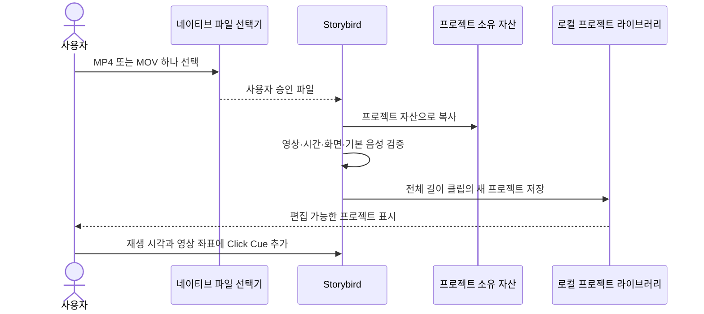

# ADR 0001: 로컬 동영상을 프로젝트 원본으로 가져온다

Date: 2026-09-08

## Status

Accepted (2026-09-08)

## Context

제품 소개 영상을 다른 카메라나 화면 녹화 도구로 만든 사용자는 Storybird에서 다시 녹화하지
않고 기존 영상 위에 클릭 위치, 설명, 자막과 데모 효과를 추가해야 한다. 이 영상에는 사용자가
말하며 녹음한 음성이 포함될 수 있다.

외부 파일 경로를 프로젝트가 계속 참조하면 사용자가 파일을 이동하거나 권한이 사라질 때
프로젝트가 깨진다. 가져오기 중 일부 자산이나 빈 프로젝트가 먼저 공개돼도 복구할 수 없는
참조가 남는다.

## Decision Drivers

- 이미 만든 제품 소개 영상을 재녹화 없이 Storybird 편집기로 가져와야 한다.
- 사용자가 말하며 녹음한 기본 음성을 원본 영상과 함께 보존해야 한다.
- 외부 파일의 이동, 이름 변경과 권한 만료가 완성된 프로젝트를 깨뜨리면 안 된다.
- 가져오기 실패가 기존 프로젝트나 선택한 원본 파일을 변경하면 안 된다.
- 화면 녹화와 입력 모니터링 권한 없이 로컬 파일 가져오기가 가능해야 한다.

## Decision

Storybird는 사용자가 네이티브 파일 선택기로 고른 로컬 MP4 또는 QuickTime MOV 하나를 새
프로젝트의 원본 미디어로 가져온다. Storybird는 선택한 파일을 프로젝트 소유 자산으로 복사한
뒤 영상 트랙, 재생 시간과 화면 크기를 검증한다. 읽을 수 있는 기본 오디오 트랙이 있으면 원본
영상과 함께 프로젝트 시간축에 포함한다.

가져온 프로젝트는 원본 전체 길이의 영상 클립 하나로 시작한다. Click Cue, 독립 자막과 데모
효과는 비어 있다. 프로젝트 이름은 선택한 파일 이름을 기반으로 정하고, 사용자는 재생 위치와
영상 안의 좌표를 지정해 미완성 Click Cue를 추가한 뒤 설명과 자막을 입력한다.

Storybird는 복사와 검증이 끝난 뒤에만 새 프로젝트를 라이브러리에 공개한다. 가져오기와 이후
편집은 외부 원본 파일을 수정하지 않으며 Storybird 소유 네트워크 경로를 사용하지 않는다.

### Requirement contract

#### Required guarantees

- 가져오기 입력의 허용 형식은 로컬 MP4와 QuickTime MOV다 — macOS 제품 소개 영상의 MVP
  호환성 계약이다.
- 사용자는 네이티브 파일 선택기로 가져올 파일 하나를 명시적으로 선택한다 — 로컬 파일
  가시성 계약이다.
- 가져올 미디어는 읽을 수 있는 영상 트랙을 최소 `1개` 가져야 한다 — 편집 가능한 영상
  프로젝트 계약이다.
- 가져올 미디어의 재생 시간은 `0초`보다 크고 화면 가로·세로 크기는 각각 `0픽셀`보다 커야
  한다 — 유효 원본 계약이다.
- Storybird는 선택한 파일의 바이트를 프로젝트 소유 자산으로 복사한다 — 외부 경로 독립성
  계약이다.
- 읽을 수 있는 기본 오디오 트랙이 있으면 그 트랙 `1개`를 영상 클립과 같은 시간축에
  포함한다 — 사용자 설명 음성 보존 계약이다.
- 가져온 프로젝트는 원본 전체 범위의 영상 클립 `1개`로 시작한다 — 즉시 편집 가능한 초기
  상태 계약이다.
- 가져온 프로젝트의 초기 Click Cue, 독립 자막과 데모 효과 수는 각각 `0개`다 — 사용자가
  편집 의도를 명시하는 초기 상태 계약이다.
- 수동 Click Cue는 현재 프로젝트 시각, 해당 시각의 원본 시각, 영상 안의 가로·세로
  `0...1` 좌표와 빈 설명·자막 슬롯을 가진다 — 가져온 영상의 클릭 작성 계약이다.
- Storybird는 완전한 프로젝트 소유 자산을 저장하고 검증한 뒤에만 프로젝트를 라이브러리에
  공개한다 — 부분 프로젝트 방지 계약이다.
- 가져오기는 Screen Recording과 Input Monitoring 권한 없이 동작한다 — 기존 파일 편집의
  최소 권한 계약이다.
- 가져오기, 편집과 내보내기는 Storybird 소유 외부 네트워크 요청 없이 완료된다 — 로컬 우선
  개인정보 계약이다.

#### Prohibitions

- 프로젝트는 사용자가 선택한 외부 파일 경로를 재생 원본으로 계속 참조하지 않는다.
- Storybird는 가져오기 또는 이후 편집 과정에서 사용자가 선택한 외부 원본 파일을 수정,
  이동하거나 삭제하지 않는다.
- 지원하지 않는 형식, 영상 트랙이 없는 파일, 재생 시간이 `0초` 이하인 파일과 유효하지 않은
  화면 크기의 파일을 프로젝트로 공개하지 않는다.
- 파일 선택 승인은 Screen Recording, Input Monitoring 또는 다른 디렉터리의 파일 접근
  권한으로 확대되지 않는다.
- companion과 외부 MCP 클라이언트는 임의 로컬 경로를 가져오기 입력으로 지정하지 않는다.

#### Failure guarantees

- 복사, 미디어 검증 또는 프로젝트 저장이 실패하면 새 프로젝트를 라이브러리에 추가하지 않는다.
- 실패하거나 취소한 가져오기의 프로젝트 소유 부분 자산은 라이브러리에서 참조되지 않고
  제거된다.
- 가져오기 실패는 기존 프로젝트 라이브러리와 사용자가 선택한 외부 원본 파일을 유지한다.
- 읽을 수 없는 기본 오디오 트랙은 음성이 보존된 프로젝트로 성공 처리하지 않는다.

#### Observable evidence

- MP4 또는 MOV를 선택하면 파일 이름을 기반으로 한 새 프로젝트가 열리고 전체 영상 길이의
  클립 하나가 재생된다.
- 음성이 있는 영상을 가져오면 편집기 재생에서 원본 음성이 영상과 함께 들린다.
- 재생 위치에서 영상의 한 지점을 선택하면 그 시각과 좌표에 미완성 Click Cue 하나가 생기고
  설명과 자막을 입력할 수 있다.
- 가져온 프로젝트에 독립 자막과 효과를 추가하면 기존 녹화 프로젝트와 같은 프리뷰·편집
  기능을 사용할 수 있다.
- 외부 원본 파일을 이동하거나 삭제한 뒤에도 이미 가져온 프로젝트가 프로젝트 소유 자산으로
  열린다.
- 지원하지 않는 파일이나 영상 트랙이 없는 파일을 선택하면 새 프로젝트가 나타나지 않고 기존
  라이브러리와 원본 파일이 유지된다.
- Screen Recording과 Input Monitoring 권한을 거부한 상태에서도 파일 선택과 가져오기가
  완료된다.
- 네트워크를 차단한 상태에서도 가져오기, 편집과 내보내기가 완료된다.

### Import flow

### Alternatives

#### 외부 파일 경로를 프로젝트가 계속 참조한다

복사가 없어 빠르고 저장 공간을 덜 쓰지만 파일 이동, 보안 범위와 권한 만료가 프로젝트 수명을
결정한다. 프로젝트 소유 자산과 원자적 저장 계약을 만족하지 못한다.

#### 가져오기 때 모든 영상을 무음 H.264 MP4로 다시 인코딩한다

원본 형식이 단일화되지만 가져오기가 오래 걸리고 화질 손실이 생기며 사용자의 설명 음성을
잃는다. 읽을 수 있는 원본 미디어를 그대로 보존하고 최종 내보내기에서 배포 형식을 만든다.

#### Storybird로 직접 녹화한 영상만 편집한다

녹화 시간축과 클릭 이벤트는 정확하지만 다른 촬영 도구, 카메라와 음성 설명을 사용한 기존
영상을 활용할 수 없다. 제품 소개 영상 제작 흐름을 불필요하게 다시 시작하게 한다.

## Consequences

### Positive

- 기존 제품 소개 영상에 Storybird의 Click Cue, 자막과 효과를 적용할 수 있다.
- 프로젝트가 외부 파일 위치와 권한 수명에서 독립된다.
- 사용자가 말하며 녹음한 음성을 편집 결과에 유지할 수 있다.

### Negative

- 가져온 영상 크기만큼 프로젝트 저장 공간이 추가로 필요하다.
- MP4와 QuickTime MOV 이외의 입력 형식은 MVP에서 지원하지 않는다.
- 가져온 영상에는 클릭 이벤트가 없으므로 사용자가 Click Cue 위치와 시각을 직접 지정해야 한다.

### Risks

- 큰 원본 파일 복사가 오래 걸리면 가져오기 진행 상태가 충분히 명확하지 않을 수 있다.
- 소스 영상과 기본 음성의 시간 정보가 손상되면 동기화된 프로젝트를 만들 수 없다.

## Related

- [영상 프로젝트와 편집 revision을 기기 안에 원자적으로 저장한다](../library/0001-local-project-library.md)
- [원본 영상과 음성을 보존하는 비파괴 클립 타임라인을 사용한다](../timeline-editing/0001-non-destructive-clip-timeline.md)
- [영상과 시간 기반 레이어를 같은 타임라인에서 편집한다](../authoring/0001-timeline-overlay-editor.md)
- [편집 타임라인을 자체 완결된 MP4로 원자적으로 내보낸다](../sharing/0001-layered-video-export.md)
