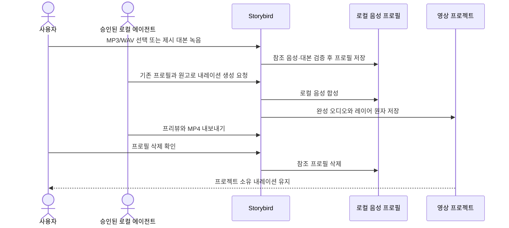

# ADR 0001: 본인 음성을 로컬에서 복제해 문장별 내레이션으로 사용한다

Date: 2026-09-08

## Status

Accepted (2026-09-08)

## Context

서비스 소개 영상의 문구를 수정할 때마다 사용자가 전체 음성을 다시 녹음하면 제작 시간이
늘고 문장마다 톤과 음량이 달라진다. 사용자는 본인 음성을 한 번 등록한 뒤 필요한 문장만 같은
목소리로 다시 생성해야 한다.

참조 음성은 생체 식별성이 있는 민감한 데이터다. 음성 파일, 대본과 합성 결과를 외부 서비스에
전송하거나 에이전트가 임의로 등록·삭제하면 Storybird의 로컬 우선 및 사용자 승인 경계를
위반한다.

사용자는 안내 대본을 읽는 동안 녹음 진행 상태, 경과 시간과 실제 음성 입력이 감지되는지
즉시 알아야 한다. 대본은 한 가지 억양만 반복하지 않고 질문, 평서, 강조와 자연스러운 쉼을
포함해야 화자 특성을 충분히 전달한다.

## Decision Drivers

- Apple Silicon Mac 안에서 본인 음성을 복제하고 합성해야 한다.
- 외부 음성 파일과 진행 상태가 분명한 직접 마이크 녹음을 모두 지원해야 한다.
- 문장 하나의 수정이 전체 내레이션 재녹음을 요구하면 안 된다.
- 에이전트 자동화는 기존 프로필 사용에 한정하고 음성 등록·삭제 권한은 사용자에게 남겨야 한다.
- 모델 준비 실패와 합성 실패가 프로젝트나 기존 음성 자산을 부분 변경하면 안 된다.

## Decision

Storybird는 통합 메모리 `24GB` 이상 Apple Silicon Mac을 PoC 기준 환경으로 사용하고,
`Qwen3-TTS 12Hz 1.7B Base 8-bit` MLX 모델을 로컬 음성 복제 경계로 사용한다. 사용자가 최초
모델 다운로드 범위를 확인하고 승인한 뒤 모델을 준비하며, 준비된 모델의 음성 합성은 네트워크
없이 수행한다.

사용자는 본인 음성 또는 사용할 권리가 있는 음성만 프로필로 등록한다. 등록 입력은 MP3 또는
WAV와 정확한 참조 대본이거나, Storybird가 제시한 대본을 읽은 `10초` 이상의 명시적 마이크
녹음이다. 안내 대본은 보통 속도에서 `10초...15초` 분량이며 질문, 평서, 강조와 짧은 쉼을
포함한다. 녹음 화면은 전체 대본, 녹음 중 표시, 실제 입력 레벨, 경과 시간과 `10초` 충족
상태를 함께 보여 준다. 사용자가 음성 소유권 또는 사용 권한을 확인하기 전에는 파일 선택과
마이크 녹음을 시작할 수 없다. Storybird는 참조 음성, 대본과 프로필을 기기 안에 저장한다.

합성 결과는 프로젝트 소유의 문장별 내레이션 오디오 레이어다. 각 레이어는 원고, 음성 프로필,
언어, 프로젝트 시작 시각, 재생 길이와 음량을 가지며 다른 내레이션과 겹치거나 프로젝트 종료를
넘을 수 없다. 원고를 바꾸면 해당 문장만 새 자산으로 생성하고 성공한 자산을 저장한 뒤
프로젝트를 원자적으로 교체한다.

인증된 로컬 MCP 연결은 프로필 목록 조회와 기존 프로필을 사용한 내레이션 생성·수정·삭제,
프리뷰와 내보내기를 수행할 수 있다. 음성 파일 선택, 마이크 녹음, 모델 최초 다운로드와
프로필 삭제는 Storybird 네이티브 UI에서 사용자가 승인한다.

### Requirement contract

#### Required guarantees

- PoC 기준 환경은 통합 메모리 `24GB` 이상 Apple Silicon Mac이다 — 승인된 로컬 실행 범위다.
- 음성 복제 모델은 `Qwen3-TTS 12Hz 1.7B Base 8-bit` MLX 변환본이다 — 승인된 모델 경계다.
- 최초 모델 다운로드는 예상 범위를 표시하고 사용자가 승인한 뒤에만 실행한다 — 네트워크
  가시성 계약이다.
- 모델 준비 완료 뒤 음성 합성은 외부 네트워크 없이 동작한다 — 로컬 합성 계약이다.
- 음성 프로필 입력은 MP3, WAV 또는 Storybird의 명시적 마이크 녹음이다 — 승인된 입력 집합이다.
- 외부 음성 프로필은 참조 음성과 정확히 일치하는 대본을 요구한다 — 복제 정렬 계약이다.
- 마이크 음성 프로필은 Storybird가 제시한 대본과 `10초` 이상의 녹음을 요구한다 — 최소 참조
  음성 계약이다.
- 안내 대본은 보통 속도에서 `10초...15초` 분량이며 질문, 평서, 강조와 짧은 쉼을 포함한다 —
  화자 억양 표본 계약이다.
- 마이크 녹음 화면은 전체 대본, 녹음 중 상태, 경과 시간, `10초` 충족 상태와 실제 음성 입력
  레벨을 동시에 표시한다 — 녹음 가시성 계약이다.
- 마이크는 사용자가 프로필 녹음을 시작한 동안에만 활성화한다 — 최소 권한 계약이다.
- 음성 프로필은 본인 음성 또는 사용 권한 확인을 요구한다 — 음성 사용 동의 계약이다.
- 음성 파일 선택과 마이크 권한 요청·녹음 시작은 음성 소유권 또는 사용 권한을 확인한 뒤에만
  사용할 수 있다 — 민감 입력 선행 동의 계약이다.
- 참조 음성, 대본, 프로필과 생성 오디오는 Mac 안에 저장한다 — 로컬 개인정보 계약이다.
- 생성 내레이션은 프로젝트가 소유하는 문장별 오디오 자산과 시간 기반 레이어다 — 프로젝트
  독립성 계약이다.
- 내레이션 레이어는 서로 겹치지 않고 종료 시각이 프로젝트 종료를 넘지 않는다 — 유효 타임라인
  계약이다.
- 원고 수정은 대상 내레이션 자산 하나만 새로 생성한다 — 문장 단위 재생성 계약이다.
- 완전한 오디오 자산을 저장하고 검증한 뒤에만 프로젝트가 해당 자산을 참조한다 — 부분 자산
  방지 계약이다.
- 프로필 삭제 뒤에도 기존 프로젝트가 소유한 생성 내레이션은 유지한다 — 프로젝트 보존 계약이다.
- MCP는 기존 프로필 조회와 내레이션 생성·수정·삭제·프리뷰·내보내기를 사용할 수 있다 —
  로컬 에이전트 자동화 계약이다.

#### Prohibitions

- 화면 녹화 세션은 마이크 입력을 수집하지 않는다.
- MCP와 companion은 음성 파일을 선택하거나 마이크 녹음을 시작하지 않는다.
- MCP와 companion은 모델 최초 다운로드 또는 음성 프로필 삭제를 승인하지 않는다.
- Storybird는 참조 음성, 대본과 생성 오디오를 외부 음성 합성 서비스로 전송하지 않는다.
- 겹치는 내레이션, 프로젝트 범위 밖 내레이션과 실패한 생성 자산을 저장하지 않는다.
- 다른 사람의 음성을 사용 권한 확인 없이 프로필로 등록하지 않는다.
- 음성 사용 권한을 확인하기 전에 파일 선택 창을 열거나 마이크를 활성화하지 않는다.

#### Failure guarantees

- 모델 다운로드·로드 실패는 기존 프로필, 프로젝트와 모델 캐시의 마지막 유효 상태를 유지한다.
- 음성 입력 검증 실패는 프로필과 참조 자산을 만들지 않는다.
- 마이크 권한 거부 또는 녹음 실패는 화면 녹화와 프로젝트를 변경하지 않는다.
- `10초`보다 짧은 마이크 녹음은 프로필로 저장하지 않고 사용자가 이어서 녹음하거나 다시
  녹음할 수 있게 한다.
- 음성 합성·오디오 확정·프로젝트 저장 실패는 기존 프로젝트와 내레이션을 유지한다.
- 오래된 project revision의 MCP 생성·편집 요청은 합성 결과를 프로젝트에 반영하지 않는다.
- 취소되거나 실패한 합성의 부분 오디오는 프로젝트에서 참조되지 않는다.

#### Observable evidence

- 24GB 이상 Apple Silicon Mac에서 승인 후 모델을 준비하고, 재실행 뒤에는 다운로드 없이
  합성한다.
- MP3/WAV와 대본을 등록하면 외부 원본 이동 뒤에도 로컬 프로필을 미리듣고 합성할 수 있다.
- 녹음을 시작하면 전체 대본과 녹음 중 표시가 나타나고, 말소리에 따라 입력 레벨 시각화가
  움직이며 경과 시간이 `10초` 충족 여부를 보여 준다.
- 음성 사용 권한 확인이 꺼져 있으면 MP3/WAV 선택과 안내 녹음 버튼이 비활성화되고 파일 선택
  창과 마이크 권한 요청이 나타나지 않는다.
- 제시 대본을 `10초` 이상 읽으면 녹음 미리듣기와 재녹음 후 프로필이 나타난다.
- `10초` 전에 녹음을 멈추면 남은 시간이 보이고 프로필 저장은 실행되지 않는다.
- 화면 녹화 중에는 마이크 사용 표시와 오디오 트랙이 없다.
- 한 문장의 원고를 바꾸면 해당 내레이션만 새 음성으로 교체되고 다른 문장은 유지된다.
- 겹치거나 프로젝트 종료를 넘는 내레이션 요청은 프로젝트를 바꾸지 않는다.
- 네트워크를 차단해도 준비된 프로필로 문장별 음성을 생성한다.
- MCP가 기존 프로필로 내레이션을 생성하고 최종 MP4 내보내기를 완료하지만 마이크·등록·프로필
  삭제 요청은 실행하지 못한다.
- 프로필을 삭제해도 기존 프로젝트의 생성 내레이션과 내보낸 영상은 재생된다.

### Voice narration flow

### Alternatives

#### 사용자가 모든 내레이션을 직접 녹음한다

모델과 음성 프로필이 필요 없지만 작은 문구 수정도 다시 녹음해야 하고 문장별 톤이 달라질 수
있다.

#### 외부 클라우드 음성 복제 API를 사용한다

로컬 모델 준비가 필요 없지만 민감한 참조 음성과 대본이 외부 시스템으로 전송되고 네트워크와
계정이 필수가 된다.

#### 0.6B 모델만 사용한다

메모리와 생성 시간은 줄지만 24GB 이상 기준 환경에서 승인된 1.7B 품질 목표를 사용하지 못한다.

#### 에이전트가 음성 등록과 삭제까지 수행한다

완전 자동화는 가능하지만 민감한 음성 파일 선택, 마이크와 삭제 권한을 사용자의 명시적 동작에서
분리한다.

## Consequences

### Positive

- 사용자는 본인 목소리의 문장별 내레이션을 반복 녹음 없이 수정할 수 있다.
- 음성 참조와 합성이 Mac 내부에 머문다.
- 에이전트가 서비스 데모의 음성 생성부터 내보내기까지 자동화한다.

### Negative

- 최초 모델 다운로드와 로컬 런타임 준비가 필요하다.
- 프로젝트가 생성 내레이션 자산만큼 추가 저장 공간을 사용한다.
- 정확한 참조 대본과 깨끗한 음성 입력이 필요하다.

### Risks

- 참조 음질과 대본이 맞지 않으면 화자 유사도와 발음이 저하될 수 있다.
- 사용자는 음성 프로필 하나를 만들기 위해 최소 `10초`를 녹음해야 한다.
- 모델 또는 런타임 버전 변화가 음성 품질과 생성 결과의 재현성에 영향을 줄 수 있다.
- 음성 프로필 권한 검증이 약하면 다른 사람의 음성을 오용할 수 있다.

## Related

- [안정적인 서명 신원과 분리된 MCP 권한 경계를 사용한다](../recording/0003-permission-and-signing.md)
- [영상 프로젝트와 편집 revision을 기기 안에 원자적으로 저장한다](../library/0001-local-project-library.md)
- [원본 영상과 음성을 보존하는 비파괴 클립 타임라인을 사용한다](../timeline-editing/0001-non-destructive-clip-timeline.md)
- [편집 타임라인을 자체 완결된 MP4로 원자적으로 내보낸다](../sharing/0001-layered-video-export.md)
- [외부 MCP 편집은 Storybird 명령과 revision 충돌 검증을 사용한다](../agent-project-editing/0001-versioned-mcp-project-editing.md)
