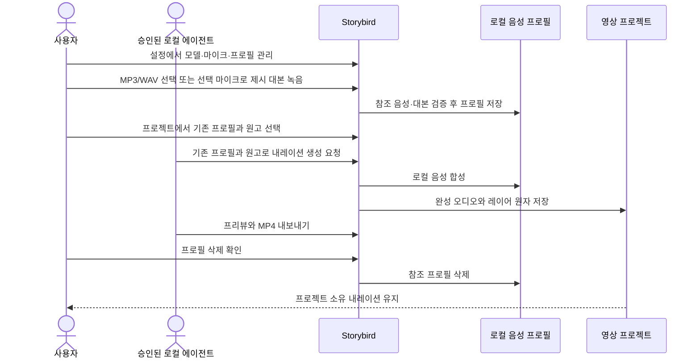

# ADR 0001: 본인 음성을 로컬에서 복제해 문장별 내레이션으로 사용한다

Date: 2026-09-08

## Status

Accepted (2026-09-11)

## Context

서비스 소개 영상의 문구를 수정할 때마다 사용자가 전체 음성을 다시 녹음하면 제작 시간이
늘고 문장마다 톤과 음량이 달라진다. 사용자는 본인 음성을 한 번 등록한 뒤 필요한 문장만 같은
목소리로 다시 생성해야 한다.

참조 음성은 생체 식별성이 있는 민감한 데이터다. 음성 파일, 대본과 합성 결과를 외부 서비스에
전송하거나 에이전트가 임의로 등록·삭제하면 Storybird의 로컬 우선 및 사용자 승인 경계를
위반한다.

사용자는 안내 대본을 읽는 동안 녹음 진행 상태, 경과 시간과 실제 음성 입력이 감지되는지
즉시 알아야 한다. 대본은 한 가지 억양만 반복하지 않고 질문, 평서, 강조와 자연스러운 쉼을
포함해야 화자 특성을 충분히 전달한다.

음성 프로필은 프로젝트 하나의 편집 상태가 아니라 여러 프로젝트가 공유하는 로컬 자산이다.
모델 준비, 프로필 등록·삭제와 마이크 장치 선택을 프로젝트 편집 모달에 함께 두면 영구 설정과
현재 프로젝트 작업의 경계가 섞인다. 사용자는 앱 설정에서 음성 환경을 관리하고, 프로젝트
안에서는 이미 준비된 프로필로 문장별 내레이션만 만들어야 한다.

음성 설정에서 기존 프로필 관리와 새 프로필의 이름·동의·녹음 입력을 함께 펼치면 사용자가
현재 생성 중인지 목록을 관리하는지 구분하기 어렵다. 생성 작업은 시작과 완료·취소가
분명한 별도 창에서 수행해야 한다.

## Decision Drivers

- Apple Silicon Mac 안에서 본인 음성을 복제하고 합성해야 한다.
- 외부 음성 파일과 진행 상태가 분명한 직접 마이크 녹음을 모두 지원해야 한다.
- 문장 하나의 수정이 전체 내레이션 재녹음을 요구하면 안 된다.
- 에이전트 자동화는 기존 프로필 사용에 한정하고 음성 등록·삭제 권한은 사용자에게 남겨야 한다.
- 모델 준비 실패와 합성 실패가 프로젝트나 기존 음성 자산을 부분 변경하면 안 된다.
- 사용자가 안내 녹음에 사용할 입력 장치를 고르고 앱 재실행 뒤에도 같은 선택을 유지해야 한다.
- 선택한 마이크가 연결되지 않아도 프로필 녹음 진입 자체를 잃으면 안 된다.

## Decision

Storybird는 통합 메모리 `24GB` 이상 Apple Silicon Mac을 PoC 기준 환경으로 사용하고,
`Qwen3-TTS 12Hz 1.7B Base 8-bit`와 `Qwen3-TTS 12Hz 0.6B Base 8-bit` MLX 모델을
로컬 음성 복제 경계로 사용한다. 사용자는 Settings 또는 인증된 MCP에서 모델 상태를 조회하고
선택하며 준비를 요청한다. 기본 선택은 1.7B이고 앱 재실행 후에도 선택을 유지한다.
선택만으로 다운로드하지 않는다. UI의 준비 버튼 또는 MCP의 특정 모델 준비 요청으로
다운로드를 바로 시작하고 별도 승인 창을 요구하지 않는다. 준비된 모델의 음성 합성은 네트워크 없이 수행한다.
두 모델은 독립된 준비 상태로 함께 보관하며 기존 프로필과 완성 오디오는 선택 변경으로 바뀌지 않는다.

사용자는 본인 음성 또는 사용할 권리가 있는 음성만 프로필로 등록한다. 등록 입력은 MP3 또는
WAV와 정확한 참조 대본이거나, Storybird가 제시한 대본을 읽은 `10초` 이상의 명시적 마이크
녹음이다. 한국어 안내 대본은 발표 상황에서 영어 기능명을 한국어 문장에 자연스럽게 섞어
읽는 약 `20초` 분량이며, 영어 안내 대본도 약 `20초` 분량의 발표를 사용한다. 한국어는
한국어 인사, 영어는 영어 인사로 시작한다. 두 대본은 보통 속도를 기준으로 질문, 평서,
강조와 짧은 쉼을 포함한다. 녹음 화면은 전체 대본, 약 `20초` 목표 시간,
녹음 중 표시, 실제 입력 레벨, 경과 시간과 `10초` 충족
상태를 함께 보여 준다. 사용자가 음성 소유권 또는 사용 권한을 확인하기 전에는 파일 선택과
마이크 녹음을 시작할 수 없다. Storybird는 참조 음성, 대본과 프로필을 기기 안에 저장한다.

Storybird 설정의 음성 영역은 로컬 모델 준비, 프로필 등록·이름 변경·미리듣기·삭제와 안내 녹음용 마이크
선택을 한곳에서 관리한다. 프로필 목록 아래 생성 진입점을 두고, 새 프로필은 설정에 연결된
별도 모달에서 이름·참조 언어·사용 동의와 입력 방식을 설정한다. 입력 방식에 맞는 녹음
또는 파일·대본 입력만 표시한다. 녹음은 미리듣기와 재녹음 후 명시적으로 프로필을 생성한다.
저장 성공 시 모달을 닫고 목록을 갱신하며, 취소는 녹음과 임시 샘플을 정리하고 닫는다.
저장 실패는 입력과 모달을 유지하고 그 안에서 오류를 알린다.

사용자는 네이티브 음성 설정에서 생성된 프로필의 표시 이름을 변경한다. 이름은 앞뒤 공백을
제거하며 빈 이름은 거부하고 중복 이름은 허용한다. 저장 성공 뒤 목록과 프로필 선택에 즉시
반영하고 앱 재실행 뒤에도 유지한다. 프로필 식별자, 참조 음성과 기존 프로젝트 내레이션은
보존한다. 취소는 변경을 남기지 않으며 실패는 기존 이름과 편집 입력을 유지하고 오류를 표시한다.

마이크 선택의 기본값은 macOS 시스템 기본 입력을 따르는 상태다.
사용자가 특정 입력 장치를 고르면 재연결과 앱 재실행 뒤에도 유지되는 장치 식별자로 저장한다.
고른 장치가 현재 없으면 선택을 지우지 않고 시스템 기본 입력으로 이번 녹음을 수행하며, 설정에
대체 사용 중임을 표시한다. 입력 채널이 없는 장치는 마이크 목록에 표시하지 않는다. 진행 중인
안내 녹음의 장치는 바꾸지 않고, 변경한 선택은 다음 녹음부터 적용한다.

합성 결과는 프로젝트 소유의 문장별 내레이션 오디오 레이어다. 각 레이어는 원고, 음성 프로필,
언어, 프로젝트 시작 시각, 재생 길이와 음량을 가지며 다른 내레이션과 겹칠 수 있으며 프로젝트 종료를 넘을 수 없다. 원고를 바꾸면 해당 문장만 새 자산으로 생성하고 성공한 자산을 저장한 뒤
프로젝트를 원자적으로 교체한다. 프로젝트 내 내레이션 작성 화면은 설정에서 이미 만든 프로필만
선택하며 모델 준비, 프로필 등록·삭제와 마이크 장치 변경을 수행하지 않는다.

인증된 로컬 MCP 연결은 프로필 목록 조회와 기존 프로필을 사용한 내레이션 생성·수정·삭제,
프리뷰와 내보내기를 수행할 수 있다. 모델 상태 조회·선택·준비도 UI와 동일한 앱 명령으로 수행한다.
음성 프로필 참조 파일 선택, 마이크 녹음과
프로필 삭제는 Storybird 네이티브 UI에서 사용자가 승인한다.

### Requirement contract

#### Required guarantees

- 인증된 로컬 MCP는 WAV·MP3·M4A 절대 경로와 대상 프로젝트·요청 식별자로 프로젝트 오디오를 가져온다. 파일·폴더 승인 창을 띄우지 않고 앱이 완성된 독립 오디오 자산을 저장한다 — 직접 미디어 입력 계약이다.
- 가져온 자산의 등록은 배치와 분리하며 편집 revision·재생·실행 취소 기록을 바꾸지 않는다. 완료 결과의 자산 식별자와 실제 초 단위 길이를 사용해 기존 배치 명령을 실행한다 — 준비와 편집 분리 계약이다.

- 준비된 모델과 승인된 기존 프로필이 있으면 에이전트가 대본으로 TTS(Text-to-Speech, 문자를 음성으로 변환) 초안 생성·조회·배치·편집·출력을 사용자 개입 없이 수행한다. 사용자는 직접 녹음·파일 가져오기 또는 중간 편집에 참여할 수 있다 — 에이전트 제작 계약이다.
- 생성 음성은 재생성용 원고·언어·프로필을 유지한다. 직접 녹음·가져온 오디오는 원고와 프로필을 요구하지 않는다 — 입력 종류 구분 계약이다.
- 문장별 생성 음성은 다른 생성 음성 및 오디오 레이어와 겹칠 수 있다. 배치된 레이어를 복제해 같은 자산을 재사용한다 — 다중 음성 계약이다.
- 준비 완료 초안은 검증한 실제 길이를 반환한다. 에이전트가 그 길이를 근거로 장면과 레이어를 편집하며 배치 실패 뒤 재합성을 요구하지 않는다 — 길이 기반 제작 계약이다.

- UI는 참조 언어와 합성 언어를 독립적으로 한국어·영어 중 선택한다. 한국어 참조로 영어 합성을 요청할 수 있으며 언어가 없는 기존 데이터·MCP 요청은 한국어를 사용한다. 다른 기존 언어를 읽을 때 한국어로 바꾸지 않는다 — 명시적 언어 계약이다.
- 안내 녹음은 한국어 선택 시 한영 혼합 발표 대본을, 영어 선택 시 영어 발표 대본을 표시한다. 두 언어 모두 약 `20초` 목표를 표시하고 녹음 중 언어·대본을 바꾸지 않는다. 최소 녹음은 `10초`이며 사용 동의를 요구한다 — 참조 일관성 계약이다.
- 내레이션은 고정 시각 또는 시작 장면 연결을 선택한다. 기존 연결 정보가 없는 데이터·요청은 고정 시각을 유지한다. 장면 위에서 새로 추가하는 UI 내레이션은 장면 연결을 기본으로 하고 카드에서는 고정 시각만 사용한다 — 배치 의미 계약이다.
- 장면 연결 내레이션은 시작 장면을 따라가며 발화 길이·속도·음높이를 바꾸지 않는다. 분할 경계는 오른쪽 클립에 귀속하고 시작점 트림·클립 삭제는 레이어를 제외하되 실행 취소할 음성 자산을 남긴다 — 비파괴 발화 계약이다.
- 기존 즉시 생성·배치를 유지하면서 대상 프로젝트·기존 프로필·원고·언어로 합성 초안을 만들 수 있다. 초안 상태는 생성 중, 준비 완료, 실패, 취소, 배치 완료다 — 분리 생성 수명주기 계약이다.
- 준비 완료 초안은 검증된 로컬 WAV와 실제 길이를 보관하며 배치 전에는 재생·출력·편집 revision에 영향을 주지 않는다. 앱 재시작 뒤에도 배치할 수 있다 — 완성 음성 재사용 계약이다.
- 생성 상태 조회·취소를 제공한다. 재시작으로 중단된 생성은 자동 재실행하지 않고 중단 사유가 있는 실패 상태가 된다 — 중단 가시성 계약이다.
- 준비 완료 초안의 배치는 최신 revision과 시작점·연결 방식을 검증하고 한 레이어·한 revision·한 실행 취소 단위로 저장한다. 같은 초안의 중복 배치는 거부한다 — 단일 배치 계약이다.
- 길이 초과·revision 충돌·저장 실패는 기존 프로젝트와 준비 완료 초안을 유지한다. 영상 길이를 자동으로 늘리거나 다른 발화를 밀지 않고 사용자 또는 에이전트가 장면을 편집한 뒤 재합성 없이 다시 배치한다 — 배치 실패 보존 계약이다.
- 불필요한 준비 완료 초안은 버릴 수 있다. 프로젝트 삭제는 소속 초안도 제거하며 생성·배치 중 저장 폴더 변경을 거부한다. 초안은 원래 라이브러리에 남는다 — 로컬 초안 소유권 계약이다.

- PoC 기준 환경은 통합 메모리 `24GB` 이상 Apple Silicon Mac이다 — 승인된 로컬 실행 범위다.
- 음성 복제 모델은 `Qwen3-TTS 12Hz 1.7B Base 8-bit`와 `Qwen3-TTS 12Hz 0.6B Base 8-bit`다. 두 모델 모두 8비트이며 기본 선택은 1.7B다 — 승인된 모델 집합이다.
- Settings와 인증된 MCP는 같은 모델 목록·선택·모델별 준비 상태를 조회하고 선택을 변경한다. 선택은 앱 재실행 뒤에도 유지하며, 선택만으로 다운로드하지 않는다 — 선택 일관성 계약이다.
- 모델별 다운로드 예상 범위를 표시한다. UI의 준비 버튼 또는 인증된 MCP의 특정 모델 준비 요청으로 다운로드를 바로 시작하고 별도 승인을 요구하지 않는다 — 모델 준비 권한 계약이다.
- 준비 상태는 모델별 미준비·준비 중·준비 완료·실패다. 비동기 준비의 완료·실패를 UI와 MCP에서 조회하고 실패 후 재시도할 수 있다. 같은 모델의 준비 중 중복 요청은 추가 작업을 만들지 않는다 — 준비 수명주기 계약이다.
- 음성 작업 중 모델 선택 변경을 거부한다. 새 생성과 원고 재생성은 선택한 모델을 사용하며 준비되지 않은 모델을 다른 모델로 자동 대체하지 않는다 — 생성 모델 일관성 계약이다.
- 두 모델을 동시에 보관하고 기존 1.7B 준비 자산·음성 프로필·완성 오디오를 보존한다. 모델 선택과 준비는 프로젝트 revision과 실행 취소를 바꾸지 않는다 — 공유 자산 보존 계약이다.
- 준비 실패는 다른 모델과 해당 모델의 마지막 완성 준비 자산을 보존한다. 앱 재시작은 중단된 다운로드를 자동 재개하지 않고 로컬 준비 결과를 다시 확인한다 — 준비 실패 보존 계약이다.
- 모델 준비 완료 뒤 음성 합성은 외부 네트워크 없이 동작한다 — 로컬 합성 계약이다.
- 음성 프로필 입력은 MP3, WAV 또는 Storybird의 명시적 마이크 녹음이다 — 승인된 입력 집합이다.
- 외부 음성 프로필은 참조 음성과 정확히 일치하는 대본을 요구한다 — 복제 정렬 계약이다.
- 마이크 음성 프로필은 Storybird가 제시한 대본과 `10초` 이상의 녹음을 요구한다 — 최소 참조
  음성 계약이다.
- 한국어·영어 안내 대본은 보통 발표 속도에서 각각 약 `20초` 분량이며 해당 언어의 인사로 시작한다. 한국어는 영어 기능명을 설명 문장에 자연스럽게 포함한다. 두 대본은 질문, 평서, 강조와 짧은 쉼을 포함한다 —
  화자 억양 표본 계약이다.
- 마이크 녹음 화면은 전체 대본, 녹음 중 상태, 경과 시간, `10초` 충족 상태와 실제 음성 입력
  레벨을 동시에 표시한다 — 녹음 가시성 계약이다.
- 로컬 모델 준비, 음성 프로필 등록·이름 변경·미리듣기·삭제와 안내 녹음용 마이크 선택은 Storybird
  설정에서 관리한다 — 공유 음성 자산의 관리 경계다.
- 음성 설정은 프로필 목록·이름 변경·미리듣기·삭제와 목록 아래 생성 진입점을 제공한다 — 관리와 생성의
  발견성 계약이다.
- 사용자는 네이티브 음성 설정에서 기존 프로필 이름을 변경한다. 앞뒤 공백을 제거하고 빈 이름을
  거부하며 중복 이름을 허용한다 — 표시 이름 편집 계약이다.
- 이름 저장 성공은 프로필 목록과 선택 화면에 즉시 반영되고 재실행 뒤에도 유지된다 — 지속성 계약이다.
- 이름 변경은 프로필 식별자, 참조 음성·대본·언어·동의·생성 시각과 기존 내레이션을 보존한다 —
  표시 이름과 음성 자산의 분리 계약이다.
- 프로필 이름, 한국어·영어 참조 언어와 사용 동의는 별도 생성 모달에서 입력한다 —
  생성 작업의 경계다.
- 생성 모달은 직접 녹음과 파일 가져오기 중 선택한 방식의 입력만 표시하고, 가져오기에서만
  정확한 참조 대본을 입력한다 — 입력 맥락 계약이다.
- 녹음 완료 후 미리듣기·재녹음을 제공하고, 사용자가 명시적으로 프로필 생성을 실행한 뒤
  저장이 성공했을 때만 모달을 닫고 목록에 추가한다 — 생성 완료 계약이다.
- 생성 취소는 진행 중 녹음과 임시 샘플을 정리한 뒤 모달을 닫고 프로필을 만들지 않는다 —
  미완성 입력의 수명 계약이다.
- 저장 중에는 중복 생성과 모달 닫기를 막는다 — 단일 저장 결과 계약이다.
- 생성 모달의 긴 내용은 내부에서 스크롤하며 완료·취소 작업에 도달할 수 있다 —
  생성 작업 도달성 계약이다.
- 프로젝트 내 내레이션 작성은 설정에서 만든 기존 프로필만 사용한다 — 영구 음성 설정과
  프로젝트 편집의 분리 계약이다.
- 마이크 선택의 기본값은 macOS 시스템 기본 입력을 따르는 상태다 — 안전한 장치 기본값이다.
- 특정 마이크 선택은 앱 재실행과 장치 재연결 뒤에도 같은 장치를 가리키는 식별자로 유지한다
  — 장치 선택 지속성 계약이다.
- 선택한 마이크가 없으면 선택을 보존한 채 시스템 기본 입력으로 해당 녹음을 수행하고 대체
  상태를 표시한다 — 장치 부재 복구 계약이다.
- 마이크 후보에는 입력 채널이 있는 장치만 포함한다 — 유효 장치 계약이다.
- 진행 중인 안내 녹음은 시작할 때 확정한 마이크를 유지하고 설정 변경은 다음 녹음부터 적용한다
  — 민감 입력의 세션 일관성 계약이다.
- 마이크는 사용자가 프로필 또는 프로젝트 음성 녹음을 시작한 동안에만 활성화한다 — 최소 권한 계약이다.
- 음성 프로필은 본인 음성 또는 사용 권한 확인을 요구한다 — 음성 사용 동의 계약이다.
- 음성 프로필 참조 파일 선택과 마이크 권한 요청·녹음 시작은 음성 소유권 또는 사용 권한을 확인한 뒤에만
  사용할 수 있다 — 민감 입력 선행 동의 계약이다.
- 참조 음성, 대본, 프로필과 생성 오디오는 Mac 안에 저장한다 — 로컬 개인정보 계약이다.
- 생성 내레이션은 프로젝트가 소유하는 문장별 오디오 자산과 시간 기반 레이어다 — 프로젝트
  독립성 계약이다.
- 내레이션 레이어는 중첩을 허용하며 종료 시각이 프로젝트 종료를 넘지 않는다 — 유효 타임라인
  계약이다.
- 원고 수정은 대상 내레이션 자산 하나만 새로 생성한다 — 문장 단위 재생성 계약이다.
- 완전한 오디오 자산을 저장하고 검증한 뒤에만 프로젝트가 해당 자산을 참조한다 — 부분 자산
  방지 계약이다.
- 프로필 삭제 뒤에도 기존 프로젝트가 소유한 생성 내레이션은 유지한다 — 프로젝트 보존 계약이다.
- MCP는 기존 프로필 조회와 내레이션 생성·수정·삭제·프리뷰·내보내기를 사용할 수 있다 —
  로컬 에이전트 자동화 계약이다.

#### Prohibitions

- 화면 녹화 세션은 마이크 입력을 수집하지 않는다.
- MCP와 companion은 음성 프로필 참조 파일을 선택하거나 마이크 녹음을 시작하지 않는다.
- MCP와 companion은 음성 프로필 삭제를 승인하지 않는다.
- MCP와 프로젝트 내 내레이션 화면은 음성 프로필 이름 변경을 제공하지 않는다.
- 프로젝트 내 내레이션 작성 화면은 모델 준비, 프로필 등록·삭제 또는 마이크 장치 변경을
  제공하지 않는다.
- Storybird는 참조 음성, 대본과 생성 오디오를 외부 음성 합성 서비스로 전송하지 않는다.
- 타임라인에는 프로젝트 범위 밖 내레이션과 실패한 생성 자산을 저장하지 않는다. 미배치 준비 완료 초안은 타임라인과 분리해 보관한다.
- 다른 사람의 음성을 사용 권한 확인 없이 프로필로 등록하지 않는다.
- 음성 프로필의 사용 권한을 확인하기 전에 참조 파일 선택 창을 열거나 마이크를 활성화하지 않는다.

#### Failure guarantees

- 모델 다운로드·로드 실패는 기존 프로필, 프로젝트와 모델 캐시의 마지막 유효 상태를 유지한다.
- 음성 입력 검증 실패는 프로필과 참조 자산을 만들지 않는다.
- 프로필 저장 실패는 생성 모달과 입력을 유지하고 모달 안에 오류를 표시한다.
- 이름 변경 취소는 저장된 프로필을 바꾸지 않는다. 유효하지 않은 이름, 없는 프로필 또는 저장
  실패는 기존 이름과 편집 입력을 유지하고 이름 변경 화면에 오류를 표시한다.
- 마이크 권한 거부 또는 녹음 실패는 화면 녹화와 프로젝트를 변경하지 않는다.
- 고정한 마이크가 연결되지 않았거나 열리지 않으면 그 선택을 삭제하지 않고 시스템 기본 입력을
  시도하며, 기본 입력도 사용할 수 없을 때만 프로필 녹음을 실패시킨다.
- `10초`보다 짧은 마이크 녹음은 프로필로 저장하지 않고 사용자가 이어서 녹음하거나 다시
  녹음할 수 있게 한다.
- 음성 합성·오디오 확정·프로젝트 저장 실패는 기존 프로젝트와 내레이션을 유지한다.
- 오래된 project revision의 MCP 생성·편집 요청은 합성 결과를 프로젝트에 반영하지 않는다.
- 취소되거나 실패한 합성의 부분 오디오는 프로젝트에서 참조되지 않는다.

#### Observable evidence

- Settings와 MCP에서 두 8비트 모델의 상태를 확인하고 선택을 바꾼 뒤 앱을 다시 열어도 같은 선택을 볼 수 있다.
- UI의 준비 버튼과 MCP 준비 요청 뒤 승인 창 없이 준비 중 상태를 받고 완료 또는 실패를 조회한다. 같은 준비 요청을 반복해도 다운로드가 중복되지 않는다.
- 두 모델을 준비한 뒤 네트워크 없이 각각 기존 프로필로 합성한다. 한 모델의 준비 실패와 선택 변경이 다른 모델·기존 프로필·완성 오디오·프로젝트 revision을 바꾸지 않는다.
- 음성 생성 중 다른 모델 선택은 거부되며 완료 후 다시 선택할 수 있다.

- 외부 WAV를 MCP로 가져온 뒤 파일 선택 클릭 없이 배치·미리듣기·출력한다. 잘못된 배치나 오래된 revision은 가져온 자산을 유지한다.

- 한국어를 선택하면 한국어 인사로 시작하고 영어 기능명이 문장에 섞인 발표 대본을 볼 수 있다.
  영어를 선택하면 영어 인사로 시작하는 발표 대본이 보인다. 두 언어 모두 약 `20초` 목표가
  보이며 녹음 중에도 대본과 목표가 유지된다.
- 기존 프로필 이름을 바꾸고 저장하면 목록과 선택 화면에 새 이름이 보이며 재실행 뒤에도 유지된다.
- 같은 이름을 가진 프로필을 저장할 수 있고 앞뒤 공백은 제거된다. 공백뿐인 이름은 저장되지 않는다.
- 이름 변경 전후 프로필 식별자와 참조 음성이 같고 기존 내레이션은 같은 상태로 재생된다.
- 이름 변경을 취소하면 기존 이름이 남고, 저장 실패 뒤에는 입력과 오류를 보며 다시 시도할 수 있다.

- 24GB 이상 Apple Silicon Mac에서 승인 후 모델을 준비하고, 재실행 뒤에는 다운로드 없이
  합성한다.
- MP3/WAV와 대본을 등록하면 외부 원본 이동 뒤에도 로컬 프로필을 미리듣고 합성할 수 있다.
- 프로필 목록 아래 생성 작업을 열면 이름·언어·동의가 모달에 나타나고, 입력 방식 선택에 따라
  녹음 또는 파일·대본 입력을 볼 수 있다.
- 녹음 완료만으로 프로필이 생기지 않으며, 미리듣기 후 생성이 성공하면 모달이 닫히고
  목록에 새 프로필 하나가 나타난다.
- 녹음 중 취소하면 마이크 입력이 끝나고 모달이 닫히며 목록은 바뀌지 않는다.
- 저장 중 생성·닫기는 실행되지 않으며, 저장 실패 시 이름과 입력을 유지한 모달에서
  오류를 보고 다시 시도할 수 있다.
- 녹음을 시작하면 전체 대본과 녹음 중 표시가 나타나고, 말소리에 따라 입력 레벨 시각화가
  움직이며 경과 시간이 `10초` 충족 여부를 보여 준다.
- 음성 사용 권한 확인이 꺼져 있으면 MP3/WAV 선택과 안내 녹음 버튼이 비활성화되고 파일 선택
  창과 마이크 권한 요청이 나타나지 않는다.
- 설정에서 특정 입력 장치를 고른 뒤 앱을 다시 열어도 같은 선택이 보이고 다음 안내 녹음이 그
  장치를 사용한다.
- 고른 입력 장치를 분리하면 설정은 선택을 유지한 채 시스템 기본 입력을 사용 중이라고 알리고,
  장치를 다시 연결하면 별도 재선택 없이 다음 녹음에 사용한다.
- 출력 전용 장치는 마이크 선택 목록에 나타나지 않으며, 녹음 중 장치 선택을 바꿔도 진행 중인
  WAV는 처음 장치로 끝난다.
- 제시 대본을 `10초` 이상 읽으면 녹음 미리듣기와 재녹음 후 프로필이 나타난다.
- `10초` 전에 녹음을 멈추면 남은 시간이 보이고 프로필 저장은 실행되지 않는다.
- 화면 녹화 중에는 마이크 사용 표시와 오디오 트랙이 없다.
- 한 문장의 원고를 바꾸면 해당 내레이션만 새 음성으로 교체되고 다른 문장은 유지된다.
- 프로젝트 종료를 넘는 내레이션 요청은 프로젝트를 바꾸지 않는다.
- 네트워크를 차단해도 준비된 프로필로 문장별 음성을 생성한다.
- MCP가 기존 프로필로 내레이션을 생성하고 최종 MP4 내보내기를 완료하지만 마이크·등록·프로필
  삭제 요청은 실행하지 못한다.
- 프로필을 삭제해도 기존 프로젝트의 생성 내레이션과 내보낸 영상은 재생된다.

### Voice narration flow

### Alternatives

#### 프로필 생성 양식을 설정 목록에 펼쳐 둔다

별도 창 이동이 없지만 이름·동의·녹음 진행 상태가 지속 설정과 섞여 작업 완료와 취소의
경계가 불분명하다. 목록 아래 생성 진입점과 별도 모달로 작업 범위를 보여 준다.

#### 사용자가 모든 내레이션을 직접 녹음한다

모델과 음성 프로필이 필요 없지만 작은 문구 수정도 다시 녹음해야 하고 문장별 톤이 달라질 수
있다.

#### 외부 클라우드 음성 복제 API를 사용한다

로컬 모델 준비가 필요 없지만 민감한 참조 음성과 대본이 외부 시스템으로 전송되고 네트워크와
계정이 필수가 된다.

#### 0.6B 모델만 사용한다

메모리와 생성 시간은 줄지만 24GB 이상 기준 환경에서 승인된 1.7B 품질 목표를 사용하지 못한다.

#### 에이전트가 음성 등록과 삭제까지 수행한다

완전 자동화는 가능하지만 민감한 음성 파일 선택, 마이크와 삭제 권한을 사용자의 명시적 동작에서
분리한다.

## Consequences

### Positive

- 사용자는 본인 목소리의 문장별 내레이션을 반복 녹음 없이 수정할 수 있다.
- 음성 참조와 합성이 Mac 내부에 머문다.
- 에이전트가 서비스 데모의 음성 생성부터 내보내기까지 자동화한다.
- 공유 음성 환경과 현재 프로젝트 편집의 위치가 분리되고, 사용자가 원하는 마이크를 계속
  사용할 수 있다.
- 프로필 관리와 생성의 시작·완료·취소가 구분된다.

### Negative

- 최초 모델 다운로드와 로컬 런타임 준비가 필요하다.
- 프로젝트가 생성 내레이션 자산만큼 추가 저장 공간을 사용한다.
- 정확한 참조 대본과 깨끗한 음성 입력이 필요하다.
- 연결되지 않은 고정 마이크를 시스템 기본 입력으로 대체했다는 상태를 설정에서 설명해야 한다.
- 생성 모달의 닫기와 비동기 저장·녹음 정리를 일관되게 처리해야 한다.

### Risks

- 참조 음질과 대본이 맞지 않으면 화자 유사도와 발음이 저하될 수 있다.
- 사용자는 음성 프로필 하나를 만들기 위해 최소 `10초`를 녹음해야 한다.
- 모델 또는 런타임 버전 변화가 음성 품질과 생성 결과의 재현성에 영향을 줄 수 있다.
- 음성 프로필 권한 검증이 약하면 다른 사람의 음성을 오용할 수 있다.

## Related

- [안정적인 서명 신원과 분리된 MCP 권한 경계를 사용한다](../recording/0003-permission-and-signing.md)
- [영상 프로젝트와 편집 revision을 기기 안에 원자적으로 저장한다](../library/0001-local-project-library.md)
- [원본 영상과 음성을 보존하는 비파괴 클립 타임라인을 사용한다](../timeline-editing/0001-non-destructive-clip-timeline.md)
- [편집 타임라인을 자체 완결된 MP4로 원자적으로 내보낸다](../sharing/0001-layered-video-export.md)
- [외부 MCP 편집은 Storybird 명령과 revision 충돌 검증을 사용한다](../agent-project-editing/0001-versioned-mcp-project-editing.md)
