# Storybird Video Editor ALPS

## Section 1. Overview

### 1.1. Purpose

Storybird Video Editor는 사람 또는 외부 MCP 클라이언트를 사용하는 LLM 에이전트가 제품 사용 흐름을 화면 영상으로 녹화하고, 제품 데모에 필요한 편집과 시선 유도 효과를 적용해 자체 완결된 MP4 한 파일로 완성하도록 돕는 로컬 우선 macOS 애플리케이션이다. 녹화, 비파괴 편집, 미리보기, 내보내기와 결정론적인 MCP 도구를 하나의 워크플로로 제공하며 HTML 결과물은 생성하지 않는다. Storybird 자체에는 LLM, 프롬프트 처리 또는 모델 호출 기능이 없다.

### 1.2. Document Name

Storybird Video Editor

### 1.3. Target Users

주요 사용자는 제품 데모 영상을 직접 만드는 제품 관리자, 제품 마케터, 세일즈 엔지니어, 창업자와 개발자다. 또한 사용자의 승인을 받아 Storybird의 MCP 도구를 호출하는 외부 MCP 클라이언트 기반 LLM 에이전트를 공식 사용자로 포함한다. LLM 실행과 모델 연결은 외부 MCP 클라이언트가 소유하며 Storybird에 내장되지 않는다.

### 1.4. Core Problem

제품 데모 녹화 중 실수, 대기 구간 또는 잘못된 클릭이 발생하면 전체 흐름을 다시 녹화해야 한다. 범용 영상 편집기에서는 클릭 위치와 시점, 자막, 확대와 강조 효과를 사용자가 영상과 수동으로 동기화해야 한다. 현재 Storybird의 기본 클릭·자막 레이어만으로는 영상 구간 편집과 제품 데모에 필요한 시선 유도 효과를 충분히 만들 수 없다. 또한 편집 기능이 사람용 UI에만 존재하면 LLM 에이전트는 동일한 결과물을 처음부터 끝까지 만들 수 없다.

### 1.5. Solution Strategy

Storybird는 사용자가 선택한 하나의 화면 또는 창을 연속 영상으로 녹화하면서 클릭 시점과 위치를 같은 시간축의 메타데이터로 저장한다. 각 클릭은 클릭 표시, 클릭 위치 주변의 설명 슬롯과 상단 또는 하단 자막 슬롯을 묶은 Click Cue를 생성한다. 클릭 표시는 자동 생성하며 설명과 자막 문구는 녹화 후 사람 또는 외부 MCP 클라이언트가 입력한다. 유지할 Click Cue는 설명과 자막을 모두 입력해야 내보낼 수 있고 불필요한 Click Cue는 전체 삭제할 수 있다.

원본 영상은 변경하지 않고 프로젝트 타임라인에서 영상 구간 분할·삭제·트림·재배치, Click Cue, 독립 자막, 스포트라이트, 팬·줌, 속도, 정지 화면, 타이틀 및 CTA 카드를 편집한다. 편집 결과는 합성 미리보기로 확인하고 최종 MP4에 포함한다.

승인된 외부 MCP 클라이언트는 소스 선택과 승인 요청, 화면 관찰, 포인터 이동·클릭·스크롤, 녹화 종료, 모든 타임라인 및 레이어 조회, 편집 요소의 생성·수정·삭제·재배치, 미완성 Click Cue 조회와 설명·자막 입력, 특정 시점의 합성 프리뷰 확인, 검증, 저장, MP4 내보내기와 상태 확인을 수행할 수 있다. MVP에는 UI에서만 가능한 편집 기능을 두지 않으며 UI와 MCP는 동일한 프로젝트 모델, 검증 규칙과 렌더링 결과를 사용한다. MCP 클라이언트는 프로젝트 파일을 직접 수정하지 않고 Storybird 명령을 통해서만 변경하며 Storybird가 유일한 프로젝트 기록자다.

Storybird는 결정론적인 녹화, 편집, 검증, 프리뷰, 렌더링과 MCP 도구만 제공한다. 화면 해석, 프롬프트 처리, 설명·자막 작성과 모델 API 연결은 외부 MCP 클라이언트의 책임이다. Storybird는 모델 API를 호출하거나 API 키를 저장하지 않는다.

화면 및 포인터 제어는 매 세션 사용자의 네이티브 승인을 요구한다. 키보드 입력은 관찰하거나 합성하지 않으며 자막과 설명 텍스트는 대상 앱의 키보드를 조작하는 대신 Storybird 프로젝트 편집 명령으로 변경한다. 프로젝트와 원본 영상은 로컬에 유지하고 사용자가 명시적으로 내보낼 때만 MP4를 생성한다. 외부 네트워크 전송은 MCP 클라이언트의 정책과 책임이며 Storybird는 자체 네트워크 전송 경로를 갖지 않는다.

초기 MVP는 클립 편집 기반, Click Cue, 제품 데모 효과, MCP 편집 동등성과 MP4 출력에 집중한다. 마이크, 웹캠/PIP, TTS, Storybird 내장 AI 문구 생성과 인터랙티브 웹 플레이어는 초기 MVP에 포함하지 않는다.

### 1.6. Success Criteria

사용자는 범용 영상 편집기나 전체 재녹화 없이 Storybird를 제품 데모 영상의 주 제작 도구로 사용할 수 있어야 한다. 승인된 외부 MCP 클라이언트 기반 LLM 에이전트도 네이티브 권한 승인 외에는 UI 편집 개입 없이 Storybird의 결정론적인 MCP 도구만으로 녹화 세션부터 Click Cue 문구 입력, 모든 화면 편집과 최종 MP4 출력까지 완료할 수 있어야 한다.

### 1.7. Key Differentiators

- 클릭 시점과 위치를 Click Cue의 클릭 표시, 설명과 자막에 연결하는 제품 데모 전용 편집 경험
- 녹화와 편집이 하나의 프로젝트 워크플로로 연결되는 비파괴 편집
- MVP의 모든 편집 속성을 UI와 외부 MCP 클라이언트에서 동일하게 제어하는 에이전트 우선 자동화 경로
- Storybird에 LLM, 모델 API 또는 API 키를 내장하지 않는 명확한 실행 및 신뢰 경계
- 로컬 우선 처리, 키보드 입력 미수집, Storybird 자체 네트워크 전송 없음
- 실행 환경이나 별도 자산이 필요 없는 MP4 한 파일 출력과 HTML 출력 제외

---

## Section 2. MVP Goals and Key Metrics

### 2.1. Purpose

MVP는 사람 또는 외부 MCP 클라이언트 기반 LLM 에이전트가 60–120초 길이의 제품 사용 흐름을 녹화한 뒤, 범용 영상 편집기나 전체 재녹화 없이 Storybird 안에서 편집하여 10분 이내에 공유 가능한 MP4 제품 데모를 만들 수 있다는 가설을 검증한다. 외부 에이전트는 네이티브 권한 승인 외의 녹화, 화면 편집, 검증과 내보내기 작업을 MCP 명령만으로 완료할 수 있어야 한다. Storybird 자체는 LLM을 실행하거나 모델 API를 호출하지 않는다.

### 2.2. Key Performance Indicators (KPIs)

- K1 — 사람의 작업 완료율
  - 기준값: 현재는 클립 편집과 시선 유도 효과가 없어 전체 검증 시나리오를 완료할 수 없다.
  - 목표값: 대표 사용자 5명 이상 중 80% 이상이 도움 없이 녹화, 불필요한 구간 제거, 클릭 효과 적용, 자막 편집과 MP4 출력을 완료한다.

- K2 — 데모 제작 시간
  - 기준값: 현재는 전체 편집 시나리오를 완료할 수 없어 측정할 수 없다.
  - 목표값: 60–120초 제품 흐름에서 소스 선택부터 최종 MP4 출력까지 걸리는 시간의 중앙값이 10분 이하다.

- K3 — 재녹화 방지율
  - 기준값: 영상 중간의 실수나 불필요한 구간을 제거할 수 없어 해당 상황에서는 재녹화가 필요하다.
  - 목표값: 의도적으로 실수 구간을 포함한 테스트의 80% 이상을 전체 재녹화 없이 완성한다.

- K4 — 출력 신뢰성
  - 기준값: 기본 클릭 및 자막 합성만 지원한다.
  - 목표값: 편집 기능을 조합한 기준 프로젝트 10개가 모두 MP4 출력에 성공한다. 지정된 검증 프레임에서 모든 텍스트와 효과가 보여야 하고 효과 시간 오차는 원본 영상 1프레임 이내여야 한다. HTML 또는 별도 실행 자산을 생성하지 않는다.

- K5 — MCP 편집 동등성과 외부 에이전트 완료율
  - 기준값: 모든 MVP 화면 제어와 편집 기능을 MCP에서 수행할 수 없다.
  - 목표값: F7, F8 및 F9를 통해 MVP 화면 제어와 편집 속성의 MCP 지원율이 100%다. 사전 정의한 10개 녹화·편집·내보내기 시나리오를 모두 UI 편집 없이 완료한다. MCP와 UI로 만든 동일 프로젝트의 프리뷰와 MP4 결과가 동일해야 한다. 외부 MCP 클라이언트는 프로젝트 파일을 직접 수정하지 않고 Storybird 명령만 사용한다. 잘못된 시간, 좌표 또는 속성은 저장하지 않고 명시적인 오류를 반환한다. 화면과 포인터 권한 승인만 사용자가 네이티브 화면에서 수행한다. Storybird 자체는 LLM을 실행하거나 모델 API를 호출하지 않는다.

---

## Section 3. Demo Scenario

### 3.1. Demo Scenario

Section 2의 다음 목표를 검증한다: 60–120초 제품 흐름을 10분 이내에 완성하고, 의도적인 실수 구간이 있어도 전체 재녹화를 피하며, 기준 MP4 10개를 정확히 출력하고, 외부 MCP 클라이언트 기반 LLM 에이전트가 Storybird의 모든 편집 도구를 사용한다.

시작 상태:
- 60–120초 분량의 클릭·스크롤 중심 제품 흐름을 준비한다.
- 흐름에는 의도적인 잘못된 클릭과 3초 이상의 불필요한 구간이 포함된다.
- Storybird의 화면 및 포인터 권한을 준비한다.
- Storybird에는 모델이나 모델 API 키가 없으며 별도의 MCP 클라이언트가 연결되어 있다.

사용자 시나리오:
1. 사용자가 창 하나를 선택해 녹화하고 중지한다.
2. 각 녹화 클릭에 해당 시점과 위치의 Click Cue가 생성된다. Click Cue에는 클릭 표시, 빈 설명 슬롯과 빈 자막 슬롯이 포함된다.
3. 사용자가 불필요한 Click Cue와 영상 구간을 삭제한다.
4. 유지할 Click Cue의 설명과 자막을 입력하고 표시 시간, 위치와 스타일을 편집한다.
5. 사용자가 스포트라이트, 팬·줌, 타이틀 및 CTA를 편집한다.
6. 사용자가 각 클릭 시점의 합성 프리뷰에서 클릭 표시, 설명과 자막이 함께 표시되는지 확인한다.
7. 모든 유지 Click Cue가 완성된 뒤 MP4를 내보낸다.
8. 전체 작업을 10분 이내에 완료하고 전체 흐름을 다시 녹화하지 않는다.

외부 MCP 에이전트 시나리오:
1. 외부 MCP 클라이언트가 소스 선택과 녹화 시작을 요청하고 사용자가 Storybird의 네이티브 승인을 완료한다.
2. 외부 에이전트가 승인된 화면을 해석하며 포인터 이동·클릭·스크롤로 녹화를 진행한다.
3. 에이전트가 녹화를 중지하고 타임라인, Click Cue와 미완성 문구 슬롯을 조회한다.
4. 외부 에이전트가 자체 LLM을 사용해 설명과 자막 문구를 결정하고 Storybird MCP 명령으로 입력한다.
5. 에이전트가 UI 편집 없이 모든 클립, Click Cue, 독립 자막과 효과를 편집한다.
6. 에이전트가 잘못된 편집 요청이 거부되고 프로젝트가 변경되지 않았는지 확인한다.
7. 에이전트가 각 클릭 시점의 합성 프리뷰 프레임을 검사하고 MP4를 내보낸다.
8. 사전 정의된 녹화·편집·내보내기 시나리오 10개를 모두 완료한다.

완료 조건:
- 유지된 모든 Click Cue의 클릭 표시, 설명과 자막이 해당 클릭 시점의 프리뷰와 MP4에 함께 표시된다.
- 설명 또는 자막이 비어 있는 Click Cue가 남아 있으면 내보내기가 거부되고 누락 항목이 반환된다.
- MP4에 승인된 모든 편집 요소가 표시된다.
- 효과 시간 오차는 원본 영상 1프레임 이내다.
- HTML 또는 별도 실행 자산이 생성되지 않는다.
- 사용자 시나리오는 10분 이내에 완료되며 전체 재녹화가 없다.
- MCP 시나리오는 네이티브 권한 승인 외에 UI 편집 개입 없이 완료된다.
- Storybird가 모델 API를 호출하거나 API 키를 저장하지 않는다.

---

## Section 4. High-Level Architecture

### 4.1. System Diagram

Context diagram:

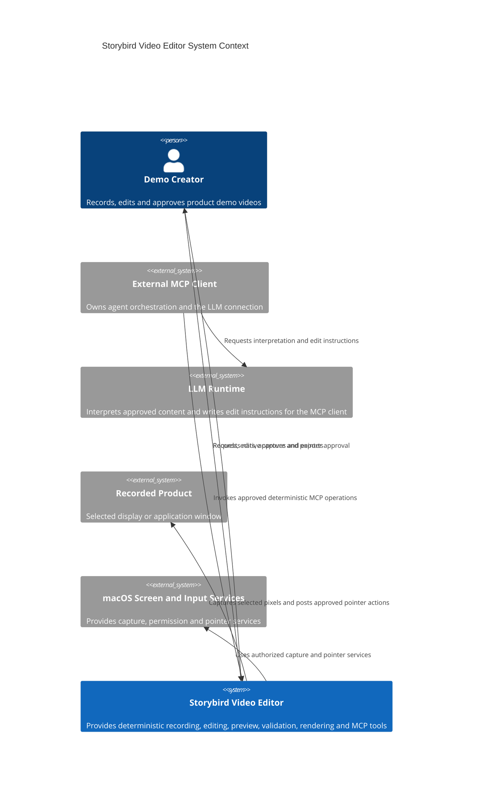

Container diagram:

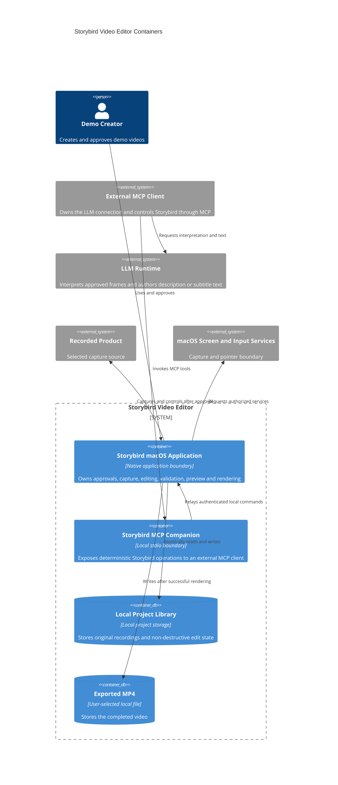

### 4.2. Architecture Constraints

- Storybird는 macOS 로컬 애플리케이션이며 인터넷 연결 없이 녹화, 편집과 내보내기가 가능해야 한다.
- Storybird 자체에는 LLM 런타임, 프롬프트 처리, 모델 API 호출 또는 모델 API 키 저장 기능이 없어야 한다.
- 화면 해석, 설명·자막 문구 작성과 모델 연결은 외부 MCP 클라이언트의 책임이다.
- 녹화 세션은 정확히 하나의 화면 또는 창만 사용하며 녹화 도중 소스를 변경하지 않는다.
- 앱 인스턴스당 활성 녹화와 승인된 MCP 제어 세션은 각각 하나만 허용한다.
- 원본 영상은 변경하지 않고 편집 상태를 별도로 저장한다.
- Storybird 애플리케이션만 프로젝트와 자산을 기록한다.
- MCP companion은 화면 권한이나 직접 프로젝트 쓰기 권한을 갖지 않는다.
- 화면 전달과 포인터 제어는 매 MCP 세션 네이티브 사용자 승인을 요구한다.
- MCP에는 선택된 소스와 승인된 프로젝트 정보만 노출한다.
- 키보드 입력을 관찰하거나 합성하지 않는다.
- Storybird가 소유한 네트워크 전송 경로를 만들지 않는다. 외부 MCP 클라이언트가 모델 또는 네트워크로 데이터를 전달하는 행위는 해당 클라이언트의 정책과 책임이다.
- UI와 MCP는 동일한 명령, 검증, 프로젝트 상태와 렌더링 결과를 사용한다.
- 잘못된 시간, 좌표 또는 속성 요청은 포인터나 프로젝트를 변경하지 않는다.
- 프로젝트 저장은 원자적으로 수행하며 실패하거나 취소된 내보내기는 기존 파일을 교체하지 않는다.
- 출력은 합성된 MP4 한 파일이며 HTML이나 별도 실행 자산을 생성하지 않는다.

---

## Section 5. Design Specification

### 5.1. User Flow and Page Structure

MVP의 사람용 흐름은 프로젝트 라이브러리에서 한 소스를 녹화하고 Click Cue와 영상 레이어를 편집한 뒤 합성 MP4를 내보내는 순서다. 외부 MCP 클라이언트 흐름은 F7의 승인된 화면 제어, F8의 프로젝트 편집, F9의 프리뷰 및 내보내기 오케스트레이션으로 동일한 결과를 만든다. 구체적인 화면과 이동 규칙은 5.1.1과 5.1.2에 정의한다.

### 5.1.1. Key Pages (Features)

- 프로젝트 라이브러리 — F1, F6, F8, F9
  - 새 녹화를 시작하고 기존 프로젝트를 연다.
  - 녹화 시간, Click Cue와 레이어 수, 최근 수정과 내보내기 상태를 표시한다.

- 캡처 소스 선택 및 승인 화면 — F1, F7
  - 화면 또는 창 하나를 선택한다.
  - 외부 MCP 클라이언트, 선택 소스, 화면 전달과 포인터 권한을 사용자에게 공개한다.
  - 승인, 거부와 세션 중지를 제공한다.

- 녹화 HUD — F1, F7
  - 녹화 시간, 클릭 수, 선택 소스와 중지 버튼을 표시한다.
  - Storybird 편집 창은 녹화 대상에서 제외한다.
  - 녹화 클릭마다 Click Cue가 생성되지만 문구 입력은 녹화 종료 후 편집 단계에서 수행한다.

- 영상 편집 워크스페이스 — F2, F3, F4, F5, F8, F10
  - 상단에 프로젝트명, 실행 취소·재실행과 내보내기를 배치한다.
  - 중앙에 모든 활성 레이어가 합성된 영상 프리뷰를 표시한다.
  - 하단 멀티트랙에는 메인 영상 클립, Click Cue, 독립 자막, 스포트라이트·팬·줌, 타이틀·CTA와 규칙 기반 편집 제안 마커를 표시한다.
  - Click Cue는 하나의 그룹으로 표시하며 펼치면 클릭 표시, 설명과 자막을 각각 편집할 수 있다.
  - 설명 또는 자막이 비어 있는 Click Cue에는 미완성 상태를 표시한다.
  - 우측 인스펙터에서 클립의 트림·속도·정지 구간, Click Cue의 설명·자막·시간·위치·색상·크기, 효과 영역과 팬·줌 시작·종료 상태를 편집한다.
  - 외부 MCP 클라이언트의 프로젝트 편집 변경 사항도 같은 타임라인과 프리뷰에 즉시 반영한다.
  - Storybird UI에는 모델 선택, 프롬프트 또는 AI 생성 화면을 제공하지 않는다.
  - 좁은 창에서는 타임라인 접근성을 유지하고 인스펙터를 시트로 전환한다.

- 내보내기 화면 — F6, F9
  - MP4 저장 위치, 진행률, 취소, 완료와 실패 상태를 제공한다.
  - 유지된 Click Cue에 비어 있는 설명 또는 자막이 있으면 누락 목록과 함께 내보내기를 거부한다.
  - 실패하거나 취소하면 기존 출력 파일을 교체하지 않는다.

### 5.1.2. Page Navigation

사용자 흐름:
1. 라이브러리에서 새 녹화를 선택한다.
2. 소스 하나를 선택하고 녹화를 시작한다.
3. 각 클릭이 Click Cue로 기록되며 HUD에서 녹화를 중지한다.
4. 영상이 완전히 종료되고 프로젝트가 저장되면 편집 워크스페이스가 열린다.
5. 사용자가 불필요한 Click Cue를 삭제하고 유지할 Click Cue의 설명과 자막을 입력한다.
6. 규칙 기반 편집 제안을 적용, 수정하거나 거부한다.
7. 클립과 레이어를 편집하며 각 클릭 시점의 합성 프리뷰를 확인한다.
8. 모든 유지 Click Cue가 완성되면 내보내기 화면에서 MP4를 생성한다.
9. 완료 후 편집 워크스페이스 또는 라이브러리로 돌아간다.

외부 MCP 클라이언트 흐름:
1. F7을 통해 외부 MCP 클라이언트가 소스 목록과 녹화 시작을 요청한다.
2. Storybird가 사용자에게 네이티브 승인을 요청한다.
3. 승인 후 외부 에이전트가 화면 관찰과 포인터를 제어하고 녹화를 중지한다.
4. F8을 통해 프로젝트 상태, Click Cue와 미완성 문구 슬롯을 조회한다.
5. 외부 MCP 클라이언트가 자체 LLM 또는 사용자 입력으로 설명과 자막 문구를 결정한다.
6. F8 편집 명령으로 문구, 클립, 레이어, 효과와 F10의 편집 제안을 적용하며 변경 사항은 워크스페이스에 실시간으로 반영된다.
7. F9를 통해 각 클릭 시점의 합성 프리뷰를 검사한다.
8. 미완성 Click Cue가 없으면 F9를 통해 MP4 내보내기를 요청하고 진행, 완료 또는 실패 상태를 확인한다.
9. 사용자가 F7 세션을 중지하면 이후 화면 및 포인터 제어 명령은 거부된다.

상태 규칙:
- 새로운 녹화는 항상 새로운 프로젝트를 생성한다.
- 영상이 완전히 종료되기 전에는 편집 화면으로 전환하지 않는다.
- 클릭 시 Click Cue의 클릭 표시, 빈 설명 슬롯과 빈 자막 슬롯을 같은 기준 시점으로 생성한다.
- 유지할 Click Cue의 설명과 자막은 사람 또는 외부 MCP 클라이언트가 입력한다.
- 설명과 자막 표시 구간은 각각 편집할 수 있지만 둘 다 Click Cue의 클릭 시점을 포함해야 한다.
- 잘못된 MCP 또는 UI 편집은 현재 프로젝트를 변경하지 않는다.
- UI와 F8은 동일한 편집 검증과 저장 결과를 사용하고 UI와 F9는 동일한 프리뷰 및 내보내기 결과를 사용한다.
- Storybird는 LLM을 실행하거나 모델 API를 호출하지 않는다.

---

## Section 6. Requirements Summary

### 6.1. Core Features (Functional Requirements)

- F1 — 녹화 세션 — Must-Have
  - 화면 또는 창 하나를 연속 영상으로 녹화하고 클릭 시점과 좌표를 같은 시간축에 저장한다.
  - 각 클릭에 클릭 표시, 빈 설명 슬롯과 빈 자막 슬롯을 묶은 Click Cue를 자동 생성한다.
  - UI와 MCP 모두 세션을 시작하고 중지할 수 있으며 MCP 세션은 사용자의 네이티브 승인을 요구한다.

- F2 — 비파괴 타임라인 편집 — Must-Have
  - 원본 영상을 유지하면서 영상 구간을 분할, 트림, 삭제, 재배치하고 속도와 정지 구간을 편집한다.
  - 실행 취소와 재실행을 지원한다.

- F3 — Click Cue 및 자막 레이어 — Must-Have
  - Click Cue의 클릭 표시, 클릭 위치 주변 설명과 상단 또는 하단 자막을 하나의 그룹으로 조회하고 편집한다.
  - 사람 또는 외부 MCP 클라이언트가 설명과 자막 문구를 입력한다. Storybird는 문구를 자동 생성하지 않는다.
  - 설명과 자막의 표시 구간은 각각 편집할 수 있지만 둘 다 Click Cue의 클릭 시점을 포함해야 한다.
  - 위치, 색상, 크기와 스타일을 편집할 수 있다.
  - 유지할 Click Cue는 설명과 자막이 모두 필요하며 불필요한 Click Cue는 그룹 전체를 삭제할 수 있다.
  - Click Cue와 별개인 독립 자막도 생성, 조회, 수정하고 삭제할 수 있다.

- F4 — 제품 데모 효과 — Must-Have
  - 스포트라이트, 팬·줌, 타이틀과 CTA 카드를 시간 범위에 배치하고 수정한다.
  - MP4의 CTA는 시각적 요소이며 클릭 가능한 링크가 아니다.

- F5 — 합성 프리뷰 — Must-Have
  - 타임라인을 재생하거나 특정 시점으로 이동하여 영상과 모든 레이어가 합성된 결과를 확인한다.
  - 해당 클릭 시점에는 Click Cue의 클릭 표시, 설명과 자막이 함께 표시된다.
  - MCP는 요청한 시점의 프리뷰 프레임과 상태를 조회할 수 있다.

- F6 — MP4 내보내기 — Must-Have
  - 클립과 모든 레이어를 합성한 MP4 한 파일을 생성하고 진행, 완료, 실패와 취소 상태를 제공한다.
  - 유지된 Click Cue에 설명 또는 자막이 비어 있으면 누락된 Click Cue 목록을 반환하고 내보내기를 거부한다.
  - HTML 또는 별도 실행 자산을 생성하지 않는다.

- F7 — MCP 세션·권한·화면 제어 — Must-Have
  - 외부 MCP 클라이언트가 로컬 세션을 통해 소스를 조회하고 녹화를 요청한다.
  - 화면 전달과 포인터 이동·좌우 클릭·스크롤은 사용자의 네이티브 승인 이후 선택한 소스에 대해서만 허용한다.
  - 사용자는 활성 세션을 중지할 수 있으며 중지 이후 제어 명령은 거부한다.
  - MCP companion은 화면 권한이나 프로젝트 직접 쓰기 권한을 갖지 않는다.

- F8 — MCP 프로젝트·타임라인·레이어 편집 — Must-Have
  - 외부 MCP 클라이언트가 프로젝트 상태를 조회하고 F2, F3, F4 및 F10의 모든 편집 속성을 생성, 수정, 삭제하고 재배치한다.
  - 미완성 Click Cue를 조회하고 설명과 자막 문구를 입력할 수 있다.
  - UI에서만 가능한 프로젝트 편집 기능을 허용하지 않는다.
  - Storybird 애플리케이션만 프로젝트와 자산을 기록한다.

- F9 — MCP 프리뷰·내보내기 오케스트레이션 — Must-Have
  - 외부 MCP 클라이언트가 F5의 합성 PNG 프리뷰를 요청한다.
  - F6의 내보내기 검증, 시작, 진행률, 취소와 완성된 MP4 결과를 조회한다.
  - 프리뷰와 내보내기는 UI와 동일한 프로젝트 상태, 검증과 렌더링 결과를 사용한다.

- F10 — 규칙 기반 클릭 편집 제안 — Must-Have
  - 녹화된 클릭마다 편집 마커와 분할, 클릭 표시, 스포트라이트와 팬·줌 제안을 결정론적인 규칙으로 생성한다.
  - 제안 생성은 LLM 또는 외부 모델 호출을 사용하지 않는다.
  - 제안은 자동으로 원본이나 프로젝트를 파괴적으로 변경하지 않으며 사용자 또는 외부 MCP 클라이언트가 적용, 수정하거나 거부한다.

F7, F8과 F9 전체에 공통으로 Storybird는 결정론적인 MCP 도구만 제공하며 LLM 실행, 프롬프트 처리, 모델 API 호출 또는 API 키 저장을 하지 않는다.

### 6.2. Non-Functional Requirements

Top-3 focus set: NF2 렌더링 정확성, NF4 보안과 개인정보, NF5 MCP 동등성. 이 focus set은 우선순위 지침이며 나머지 Must-Have 요구사항을 제거하지 않는다.

- NF1 — 편집 반응성 — Scope: Global — Must-Have
  - 1080p, 120초, 시간 기반 레이어 100개 프로젝트에서 탐색과 속성 변경의 95%가 500ms 이내에 프리뷰에 반영되어야 한다.
  - 검증: 기준 프로젝트에서 탐색 및 속성 변경 지연 시간을 측정한다.
  - 위험: 충족하지 못하면 반복 편집 속도가 느려져 10분 제작 목표를 달성하기 어렵다.
  - 수준: 로컬 데스크톱 MVP에 일반적인 즉각 반응 기준이다.

- NF2 — 렌더링 정확성 — Scope: F5, F6 — Must-Have
  - 기준 프로젝트 10개가 모두 출력되어야 하며 지정된 클릭 프레임에서 Click Cue의 클릭 표시, 설명과 자막을 포함한 모든 텍스트와 효과 누락이 없어야 한다. 시간 오차는 원본 영상 1프레임 이내여야 한다.
  - 검증: 각 기준 프로젝트의 지정 프레임과 출력 트랙을 자동 검사한다.
  - 위험: 충족하지 못하면 프리뷰를 신뢰할 수 없고 완성된 데모가 잘못 배포된다.
  - 수준: 영상 편집 제품에 필수적인 MVP 기준이다.

- NF3 — 저장 안전성 — Scope: Global — Must-Have
  - 저장, 취소와 렌더링 실패를 주입한 20개 테스트 모두에서 원본 영상과 마지막 유효 프로젝트가 보존되어야 한다.
  - 검증: 각 실패 전후의 원본 해시와 프로젝트 유효성을 비교한다.
  - 위험: 충족하지 못하면 사용자의 원본 또는 편집 작업을 복구할 수 없게 된다.
  - 수준: 로컬 우선 비파괴 편집기에 필수적인 기준이다.

- NF4 — 보안과 개인정보 — Scope: F1, F7 — Must-Have
  - Storybird가 생성하는 네트워크 요청, 모델 API 호출과 키보드 이벤트 수집 또는 합성은 0건이어야 한다.
  - Storybird는 모델 API 키를 저장하지 않아야 한다.
  - 모든 MCP 화면 및 포인터 세션은 네이티브 사용자 승인을 요구한다.
  - 잘못된 요청 20개 모두 포인터 입력이나 프로젝트 저장을 발생시키지 않아야 한다.
  - 검증: 네트워크 차단 및 계측, 저장 자산 검사, 입력 이벤트 계측, 승인 거부와 잘못된 요청 테스트를 수행한다.
  - 위험: 충족하지 못하면 민감한 화면 또는 입력이 사용자 동의 없이 노출되거나 Storybird의 신뢰 경계가 불명확해질 수 있다.
  - 수준: 권한이 있는 화면 녹화 제품에 필수적인 경계다.

- NF5 — MCP 동등성 — Scope: F7, F8, F9 — Must-Have
  - MVP 화면 제어와 편집 속성의 MCP 지원율은 100%이며 외부 MCP 에이전트 기준 시나리오 10개를 모두 UI 편집 없이 완료해야 한다.
  - 검증: UI 명령 목록과 F7, F8, F9 MCP 명령 목록의 대응 관계를 검사하고 외부 MCP 클라이언트를 통한 10개 에이전트 시나리오를 실행한다.
  - 위험: 충족하지 못하면 외부 LLM 에이전트가 사람과 동일한 데모 결과를 만들 수 없다.
  - 수준: Storybird의 핵심 차별점이므로 일반 MVP보다 엄격한 기준이다.

- NF6 — 오프라인 동작 — Scope: Global — Must-Have
  - 네트워크를 차단한 기준 시나리오 10개 모두 Storybird의 녹화, 편집과 MP4 출력에 성공해야 한다.
  - 외부 MCP 클라이언트 또는 LLM 런타임의 네트워크 요구사항은 이 검증 범위에 포함하지 않는다.
  - 검증: Storybird의 네트워크를 차단한 상태에서 전체 기준 시나리오를 실행한다.
  - 위험: 충족하지 못하면 로컬 우선 약속과 화면 데이터 경계가 깨진다.
  - 수준: 외부 MCP 클라이언트의 동작과 별개로 Storybird 자체에 필수적인 기준이다.

- NF7 — 내보내기 성능 — Scope: F6 — Must-Have
  - 기준 Mac에서 1080p 120초 프로젝트를 240초 이내에 내보내야 한다.
  - 검증: 기준 프로젝트의 내보내기 시작부터 완성된 MP4 생성까지 측정한다.
  - 위험: 충족하지 못하면 전체 제작 시간 10분 목표를 침해한다.
  - 수준: MVP에서 실시간보다 느린 렌더링을 허용하는 현실적인 상한이다.

### 6.3. Feature Dependency Diagram

An arrow from A to B means A depends on B. F7, F8 and F9 together provide the complete external MCP workflow. Each MCP feature must be delivered alongside the underlying human-facing capability it exposes.

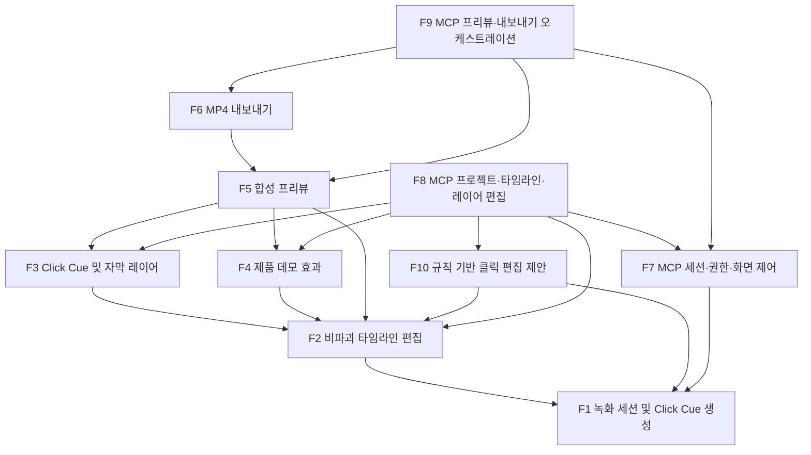

---

## Section 7. Feature-Level Specification

### 7.1. F1: 녹화 세션

#### 7.1.1 User Story

- 제품 데모 제작자로서 화면 또는 창 하나를 녹화하고 싶다. 그래야 영상과 클릭 위치가 연결된 편집 가능한 프로젝트를 만들 수 있다.
- 외부 MCP 클라이언트를 사용하는 에이전트로서 사용자의 승인을 받은 소스를 녹화하고 싶다. 그래야 Storybird에 LLM을 내장하지 않고도 자동화된 데모 제작을 시작할 수 있다.

#### 7.1.2 User Flow

1. 사람 또는 외부 MCP 클라이언트가 새 녹화를 요청한다.
2. 정확히 하나의 화면 또는 창을 선택한다.
3. MCP 요청이면 Storybird가 화면 전달과 포인터 제어 범위를 공개하고 네이티브 사용자 승인을 받는다.
4. Storybird가 연속 영상을 기록한다.
5. 선택 소스 안에서 유효한 클릭이 발생할 때마다 영상 시간과 좌표가 같은 시간축에 기록되고 Click Cue가 생성된다.
6. Click Cue에는 클릭 표시, 빈 설명 슬롯과 빈 자막 슬롯이 포함된다.
7. 중지 요청이 들어오면 새 클릭을 받지 않고 이미 접수된 클릭을 순서대로 처리한 뒤 영상을 완성한다.
8. 유효한 영상이 완성된 후 새 프로젝트를 저장하고 편집기를 연다.

#### 7.1.3 Technical Description

녹화 시작:
- UI(User Interface, 사람이 조작하는 화면) 또는 MCP(Model Context Protocol, 외부 클라이언트가 Storybird 도구를 호출하는 표준)를 통해 시작한다.
- Storybird는 정확히 하나의 소스를 세션에 고정한다. 녹화 도중 다른 소스로 변경할 수 없다.
- 새로운 녹화는 기존 프로젝트에 이어 붙이지 않고 항상 새로운 프로젝트를 준비한다.
- MCP 세션은 사용자의 네이티브 승인 전에는 화면을 전달하거나 포인터를 제어하지 않는다.

프레임과 클릭 기록:
- 선택한 소스의 연속 화면을 프로젝트 소유 영상으로 기록한다.
- 클릭 시점은 영상 시작을 0초로 하는 시간으로 기록한다.
- 좌표는 선택 소스의 왼쪽 위를 기준으로 가로와 세로 각각 0부터 1까지의 값으로 저장한다.
- 선택 소스 밖의 클릭은 무시한다.
- 유효한 클릭 하나마다 Click Cue 하나를 생성한다. Cue에는 클릭 표시와 사람이 또는 외부 MCP 클라이언트가 나중에 작성할 빈 설명·자막 슬롯이 있다.
- 키보드 입력은 기록하거나 합성하지 않는다.

녹화 중지와 저장:
- 중지 이후 새 클릭을 거부하고 이미 접수된 클릭을 발생 순서대로 마무리한다.
- 영상이 정상적으로 완성되고 검증된 뒤에만 영상 자산과 프로젝트를 저장한다.
- 저장이 끝난 후에만 완성된 프로젝트를 편집기에 표시한다.
- 실패하거나 취소된 세션은 불완전한 영상이나 프로젝트를 사용자 라이브러리에 남기지 않는다.

외부 경계:
- Storybird는 결정론적인 녹화와 프로젝트 작성만 수행한다.
- Storybird는 모델 API를 호출하거나 모델 API 키를 저장하거나 자체 네트워크 전송을 수행하지 않는다.

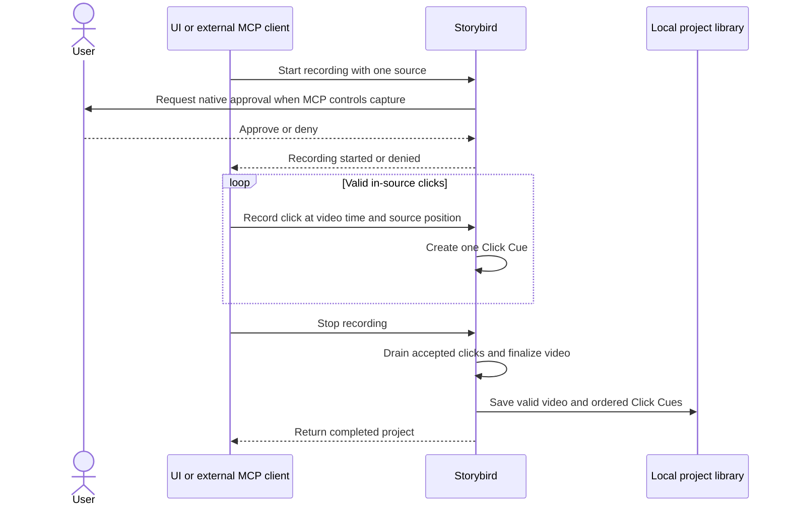

Values and rules:
- 한 녹화 세션은 정확히 하나의 화면 또는 창을 사용한다.
- 앱 인스턴스당 활성 녹화와 승인된 MCP 제어 세션은 각각 하나다.
- 새로운 녹화는 항상 새로운 프로젝트를 생성한다.
- 유효한 클릭 하나는 Click Cue 하나를 생성한다.
- 클릭 좌표의 허용 범위는 가로와 세로 각각 0부터 1까지다.
- 클릭 시간의 단위는 초이며 영상 시작을 0초로 한다.
- Storybird가 수집하거나 합성하는 키보드 이벤트, 모델 API 호출과 자체 네트워크 요청은 각각 0건이다.

#### 7.1.4 Edge Cases

- 선택한 창이 녹화 중 닫히거나 유효한 프레임을 더 이상 제공하지 않으면 세션을 실패 처리하고 불완전한 프로젝트를 공개하지 않는다.
- 선택 소스 밖에서 발생한 클릭은 영상에 Click Cue를 만들지 않는다.
- 빠르게 연속된 클릭은 접수 순서대로 저장한다.
- 녹화 중 두 번째 시작 요청은 기존 세션을 변경하지 않고 거부한다.
- 중지와 클릭이 거의 동시에 발생하면 중지 전에 접수된 클릭만 처리한다.
- 권한 상태가 오래된 사전 확인 결과와 다르더라도 실제 화면 캡처 결과가 성공하면 녹화를 진행한다.

#### 7.1.5 Error Handling

- 화면 또는 포인터 권한이 거부되면 필요한 권한과 수행되지 않은 작업을 명시하고 입력이나 프로젝트를 변경하지 않는다.
- 유효 프레임이 없으면 녹화를 시작하지 않거나 현재 세션을 실패 처리한다.
- 범위를 벗어난 MCP 좌표는 포인터 이벤트와 Click Cue를 만들지 않고 오류를 반환한다.
- 영상 최종화 또는 프로젝트 저장이 실패하면 새 프로젝트를 라이브러리에 공개하지 않고 원인을 반환한다.
- 취소된 세션의 불완전한 영상은 정상 프로젝트 자산으로 보존하지 않는다.

#### 7.1.6 Acceptance Criteria

- [ ] 한 녹화 세션은 정확히 하나의 화면 또는 창만 사용하고 도중에 소스를 변경하지 않는다.
- [ ] 새로운 녹화는 기존 프로젝트와 분리된 새 프로젝트를 생성한다.
- [ ] 선택 소스 안의 유효한 클릭 하나마다 영상 시간, 0부터 1까지의 좌표와 Click Cue 하나가 기록된다.
- [ ] 각 Click Cue에는 클릭 표시, 빈 설명 슬롯과 빈 자막 슬롯이 있다.
- [ ] 선택 소스 밖의 클릭과 범위를 벗어난 MCP 좌표는 포인터 입력 또는 Click Cue를 만들지 않는다.
- [ ] 앱 인스턴스당 활성 녹화와 승인된 MCP 제어 세션은 각각 하나만 허용한다.
- [ ] MCP 녹화와 포인터 제어는 네이티브 사용자 승인 전에는 시작되지 않는다.
- [ ] 중지는 새 클릭을 거부하고 이미 접수된 클릭을 순서대로 처리한 뒤 영상을 완성한다.
- [ ] 유효한 영상이 완성되고 프로젝트가 저장된 후에만 편집기가 열린다.
- [ ] 실패하거나 취소된 녹화는 불완전한 영상 또는 프로젝트를 라이브러리에 남기지 않는다.
- [ ] Storybird의 키보드 이벤트 수집·합성, 모델 API 호출과 자체 네트워크 요청은 각각 0건이다.
- **Demo checkpoint:** Section 3의 60–120초 녹화를 중지했을 때 완성된 영상과 순서가 보존된 Click Cue가 새 프로젝트의 편집기에 나타난다.

### 7.2. F2: 비파괴 타임라인 편집

#### 7.2.1 User Story

- 제품 데모 제작자로서 녹화 영상의 실수 구간을 자르고 순서를 조정하고 싶다. 그래야 전체 흐름을 다시 녹화하지 않고 완성된 데모를 만들 수 있다.
- 외부 MCP 클라이언트를 사용하는 에이전트로서 사람과 동일한 타임라인 편집 명령을 사용하고 싶다. 그래야 UI 편집 개입 없이 영상 구조를 수정할 수 있다.

#### 7.2.2 User Flow

1. 사람 또는 외부 MCP 클라이언트가 프로젝트의 원본 영상과 현재 클립 목록을 연다.
2. 클립 안의 유효한 시점을 선택해 분할한다.
3. 각 클립의 시작 또는 끝을 트림하거나 불필요한 클립을 삭제한다.
4. 클립 순서를 재배치하고 필요한 클립의 속도를 조정한다.
5. 현재 프레임을 원하는 양수 길이의 정지 구간으로 삽입한다.
6. 편집 결과를 프리뷰에서 확인하고 필요하면 실행 취소 또는 재실행한다.
7. Storybird는 원본 MP4를 변경하지 않고 편집 상태만 프로젝트에 저장한다.

#### 7.2.3 Technical Description

프로젝트 열기:
- UI 또는 MCP는 원본 영상의 시간 범위와 프로젝트 타임라인의 클립 순서를 조회한다.
- 각 클립은 원본 영상에서 사용하는 구간과 편집 후 프로젝트에서 차지하는 구간을 유지한다.
- 원본 MP4는 읽기 전용 자산으로 취급하며 편집 명령은 프로젝트 상태만 변경한다.

클립 편집:
- 분할은 한 클립의 시작과 끝 사이에 있는 시점에서만 수행한다.
- 트림은 원본 영상 범위 안에서 클립의 시작 또는 끝을 줄인다.
- 삭제는 클립을 출력 타임라인에서 제외하지만 원본 영상 데이터를 삭제하지 않는다.
- 재배치는 선택한 클립과 그 영상 내용에 연결된 Click Cue 및 효과를 함께 이동한다.
- 속도는 0.25배부터 4배까지 허용하며 변경된 속도에 맞춰 프로젝트 시간과 연결 레이어 시간을 다시 계산한다.
- 정지 구간은 현재 프레임을 양수 길이만큼 유지하는 출력 구간으로 추가한다.

레이어 동기화:
- 클립을 분할하면 원본 시점을 기준으로 Click Cue와 영상 내용에 연결된 효과가 올바른 결과 클립에 귀속된다.
- 트림되거나 삭제된 원본 구간의 연결 레이어는 출력 타임라인에서 제외된다.
- 클립을 복원하는 실행 취소는 제외됐던 연결 레이어도 함께 복원한다.
- 원본 시간과 편집 후 프로젝트 시간을 모두 보존해 후속 프리뷰와 내보내기가 같은 결과를 계산할 수 있게 한다.

편집 기록:
- 한 클립 편집과 그에 따른 레이어 시간 변경은 하나의 실행 취소 단위다.
- 현재 편집 세션에서 실행 취소와 재실행을 제공한다.
- 실행 취소 후 새로운 편집을 적용하면 기존 재실행 기록을 제거한다.
- 실패한 명령은 타임라인, 연결 레이어와 실행 취소 기록을 모두 변경하지 않는다.

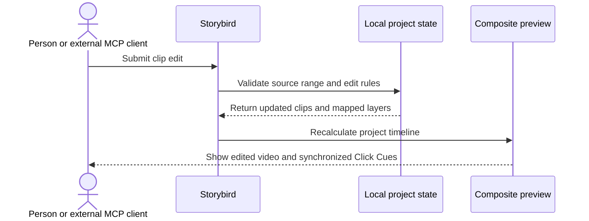

Values and rules:
- 원본 MP4 변경 횟수는 0회다.
- 영상 속도의 허용 범위는 0.25배부터 4배까지다.
- 정지 구간 길이는 0초보다 커야 한다.
- 클립 시작은 종료보다 빨라야 하며 둘 다 원본 영상 범위 안에 있어야 한다.
- 타임라인에서 모든 클립을 삭제할 수 있지만 빈 타임라인은 내보낼 수 없다.
- 실행 취소와 재실행 기록의 범위는 현재 편집 세션이다.

#### 7.2.4 Edge Cases

- 클립 시작 또는 끝 경계에서 분할을 요청하면 길이 0인 클립을 만들지 않고 요청을 거부한다.
- 트림으로 클립 시작과 끝이 같아지거나 역전되면 요청을 거부한다.
- Click Cue가 정확히 분할 시점에 있으면 하나의 결과 클립에만 귀속되어 중복되지 않는다.
- 모든 클립을 삭제하면 프로젝트는 편집 가능한 빈 타임라인 상태를 유지하지만 내보내기는 허용하지 않는다.
- 속도가 변경된 클립 안의 Click Cue와 효과는 원본 순서를 유지한다.
- 이미 삭제된 클립을 다시 삭제하거나 존재하지 않는 클립을 편집하면 현재 상태를 유지한다.

#### 7.2.5 Error Handling

- 원본 범위 밖 분할 또는 트림 요청은 허용 범위를 포함한 오류를 반환한다.
- 0.25배보다 작거나 4배보다 큰 속도는 저장하지 않고 오류를 반환한다.
- 0초 이하의 정지 구간은 생성하지 않는다.
- 프로젝트 상태가 요청 이후 변경돼 편집 기준이 맞지 않으면 이전 상태를 덮어쓰지 않고 최신 타임라인을 다시 조회하도록 응답한다.
- 편집 저장이 실패하면 프로젝트와 실행 취소 기록을 명령 전 상태로 유지한다.

#### 7.2.6 Acceptance Criteria

- [ ] 분할, 트림, 삭제, 재배치, 속도 조정과 정지 구간 삽입을 UI와 MCP에서 동일하게 수행할 수 있다.
- [ ] 모든 편집 후 원본 MP4는 변경되지 않는다.
- [ ] 클립 시작은 종료보다 빠르고 두 값 모두 원본 영상 범위 안에 있다.
- [ ] 영상 속도는 0.25배부터 4배까지만 저장된다.
- [ ] 정지 구간 길이는 0초보다 크다.
- [ ] 클립과 함께 이동하는 Click Cue 및 효과는 영상 내용과 동기화된다.
- [ ] 트림 또는 삭제된 구간의 연결 레이어는 출력에서 제외되고 실행 취소 시 복원된다.
- [ ] 한 편집과 연결 레이어 변경은 하나의 실행 취소 단위로 처리된다.
- [ ] 실행 취소 후 새 편집을 적용하면 기존 재실행 기록이 제거된다.
- [ ] 모든 클립이 삭제된 빈 타임라인은 내보낼 수 없다.
- [ ] 실패한 편집 명령은 타임라인, 레이어와 실행 취소 기록을 변경하지 않는다.
- **Demo checkpoint:** Section 3에서 의도적으로 포함한 3초 이상의 실수 구간을 삭제했을 때 재녹화 없이 영상이 이어지고 남은 Click Cue가 화면 내용과 동기화된다.

### 7.3. F3: Click Cue 및 자막 레이어

#### 7.3.1 User Story

- 제품 데모 제작자로서 각 클릭에 화면 설명과 자막을 붙이고 싶다. 그래야 시청자가 클릭 대상과 작업의 의미를 동시에 이해할 수 있다.
- 외부 MCP 클라이언트를 사용하는 에이전트로서 미완성 Click Cue를 찾고 모든 화면 속성을 편집하고 싶다. 그래야 Storybird에 LLM을 내장하지 않고도 설명과 자막을 완성할 수 있다.
- 제품 데모 제작자로서 클릭과 관계없는 자막도 추가하고 싶다. 그래야 구간 전체에 필요한 보충 설명을 제공할 수 있다.

#### 7.3.2 User Flow

1. 사람 또는 외부 MCP 클라이언트가 프로젝트의 Click Cue와 독립 자막 목록을 조회한다.
2. 미완성 Click Cue를 선택하고 설명과 자막 문구를 입력한다.
3. 클릭 표시, 설명과 자막의 시간, 위치, 색상, 크기와 투명도를 편집한다.
4. 필요하면 Click Cue 전체를 삭제한다.
5. 클릭과 관계없는 독립 자막을 생성하고 시간, 위치와 스타일을 편집한다.
6. 특정 클릭 시점의 프리뷰에서 세 요소가 함께 표시되는지 확인한다.
7. Storybird는 모든 유지 Click Cue가 완성됐는지 내보내기 전에 검증한다.

#### 7.3.3 Technical Description

Click Cue 조회와 편집:
- UI와 MCP는 Click Cue 전체 목록과 설명 또는 자막이 비어 있는 미완성 목록을 제공한다.
- Click Cue는 클릭 표시, 설명과 자막을 하나의 그룹으로 관리한다.
- 클릭 표시는 원형 링이며 클릭 시간, 0부터 1까지의 화면 좌표, 색상, 크기와 투명도를 편집할 수 있다.
- 설명은 클릭 주변에 자동 배치하거나 가로와 세로 각각 0부터 1까지의 좌표에 배치할 수 있다.
- 자막 위치는 화면 상단 또는 하단 중 하나다.
- 설명과 자막의 텍스트, 시작·종료 시간, 위치, 글자색, 배경색, 투명도와 크기를 편집할 수 있다.
- 클릭 표시, 설명과 자막의 표시 구간은 모두 Click Cue의 클릭 시점을 포함해야 한다.
- 유지할 Click Cue의 설명과 자막은 공백이 아닌 문구를 가져야 한다.
- 불필요한 Cue를 삭제하면 클릭 표시, 설명과 자막을 그룹 단위로 함께 제거한다.

독립 자막:
- UI와 MCP는 Click Cue와 관계없는 자막을 생성, 조회, 수정하고 삭제할 수 있다.
- 독립 자막은 공백이 아닌 텍스트, 시작·종료 시간, 상단 또는 하단 위치와 텍스트 스타일을 가진다.
- 시작 시간은 종료 시간보다 빨라야 하며 두 값은 편집된 프로젝트 시간 범위 안에 있어야 한다.

저장과 렌더링:
- UI와 MCP는 동일한 편집 명령과 검증 규칙을 사용한다.
- 하나의 요청에 포함된 속성 중 하나라도 유효하지 않으면 해당 요청의 어떤 속성도 저장하지 않는다.
- 유효한 변경은 로컬 프로젝트에 저장되고 같은 상태를 프리뷰와 MP4 렌더링에서 사용한다.
- Storybird는 설명이나 자막 문구를 자동 생성하지 않는다. 사람 또는 외부 MCP 클라이언트가 문구를 제공한다.

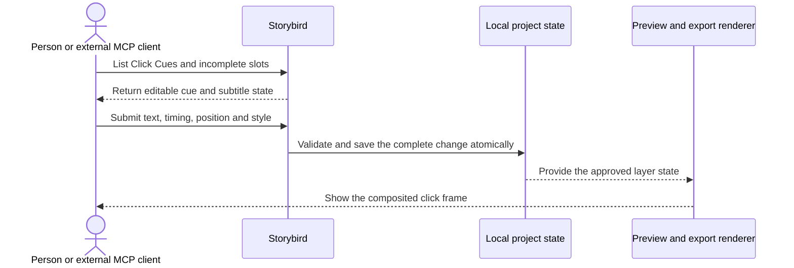

Values and rules:
- 설명 위치와 클릭 표시 위치의 좌표 범위는 가로와 세로 각각 0부터 1까지다.
- Click Cue 자막 위치와 독립 자막 위치의 허용 값은 상단 또는 하단이다.
- 유지할 Click Cue의 설명과 자막은 모두 공백이 아닌 문구여야 한다.
- Click Cue의 클릭 표시, 설명과 자막 표시 구간은 모두 클릭 시점을 포함한다.
- 독립 자막과 모든 표시 구간은 시작 시간이 종료 시간보다 빨라야 한다.
- Click Cue 삭제는 클릭 표시, 설명과 자막을 함께 삭제하는 하나의 작업이다.
- Storybird의 자동 문구 생성과 모델 API 호출 횟수는 0회다.

#### 7.3.4 Edge Cases

- 설명 또는 자막이 공백만 포함하면 해당 Click Cue를 미완성으로 유지한다.
- Click Cue의 클릭 시간을 변경했는데 기존 설명 또는 자막 구간이 새 클릭 시간을 포함하지 않으면 변경을 거부한다.
- 클릭 주변 자동 배치가 화면을 벗어나면 설명 전체가 영상 프레임 안에 있도록 배치한다.
- 자막 시간이 트림 또는 재배치된 프로젝트 범위를 벗어나면 저장하지 않는다.
- 존재하지 않는 Click Cue 또는 자막을 수정하거나 삭제하면 기존 프로젝트를 변경하지 않는다.
- Click Cue 전체 삭제를 실행 취소하면 클릭 표시, 설명과 자막이 함께 복원된다.

#### 7.3.5 Error Handling

- 유효하지 않은 시간, 0부터 1까지의 범위를 벗어난 좌표, 지원하지 않는 색상 또는 투명도는 저장하지 않고 해당 필드를 알리는 오류를 반환한다.
- 유지할 Click Cue에 설명 또는 자막이 비어 있으면 내보내기를 거부하고 누락된 Click Cue 식별자를 반환한다.
- 한 편집 요청에 여러 속성이 포함됐을 때 하나라도 실패하면 부분 변경을 남기지 않는다.
- 프로젝트 저장이 실패하면 프리뷰와 MCP 응답에 저장 전 상태를 유지한다.

#### 7.3.6 Acceptance Criteria

- [ ] UI와 MCP에서 Click Cue 전체 목록과 미완성 목록을 조회할 수 있다.
- [ ] Click Cue의 클릭 표시, 설명과 자막을 하나의 그룹으로 편집할 수 있다.
- [ ] 클릭 표시의 시간, 0부터 1까지의 좌표, 색상, 크기와 투명도를 편집할 수 있다.
- [ ] 설명의 텍스트, 시간, 클릭 주변 또는 0부터 1까지의 위치와 스타일을 편집할 수 있다.
- [ ] 자막의 텍스트, 시간, 상단 또는 하단 위치와 스타일을 편집할 수 있다.
- [ ] 클릭 표시, 설명과 자막의 표시 구간은 모두 Click Cue 클릭 시점을 포함한다.
- [ ] 유지할 Click Cue의 설명과 자막은 모두 공백이 아닌 문구를 가진다.
- [ ] Click Cue 삭제는 클릭 표시, 설명과 자막을 함께 제거하고 실행 취소 시 함께 복원한다.
- [ ] 독립 자막을 UI와 MCP에서 생성, 조회, 수정하고 삭제할 수 있다.
- [ ] 독립 자막의 시작 시간은 종료 시간보다 빠르고 편집된 프로젝트 범위 안에 있다.
- [ ] 유효하지 않은 속성이 포함된 요청은 부분 변경을 저장하지 않는다.
- [ ] 프리뷰와 MP4는 저장된 동일한 시간, 위치와 스타일을 사용한다.
- [ ] Storybird는 설명 또는 자막을 자동 생성하거나 모델 API를 호출하지 않는다.
- **Demo checkpoint:** Section 3의 각 클릭 시점 프리뷰에서 클릭 링, 사람 또는 외부 MCP 클라이언트가 입력한 설명과 자막이 동시에 표시된다.

### 7.4. F4: 제품 데모 효과

#### 7.4.1 User Story

- 제품 데모 제작자로서 중요한 화면 영역을 강조하고 부드럽게 확대하고 싶다. 그래야 시청자의 시선을 실제 조작 위치로 유도할 수 있다.
- 제품 데모 제작자로서 시작 메시지와 종료 행동 유도 문구를 넣고 싶다. 그래야 영상의 목적과 다음 행동을 명확히 전달할 수 있다.
- 외부 MCP 클라이언트를 사용하는 에이전트로서 모든 효과를 조회하고 편집하고 싶다. 그래야 UI 편집 없이 동일한 영상을 완성할 수 있다.

#### 7.4.2 User Flow

1. 사람 또는 외부 MCP 클라이언트가 효과를 추가할 프로젝트 시간 범위를 선택한다.
2. 스포트라이트 영역을 지정하고 배경의 어두움 정도를 편집한다.
3. 팬·줌의 시작 및 종료 중심점과 배율을 지정한다.
4. 시작 또는 클립 사이에 타이틀 카드를 배치하고 문구와 스타일을 편집한다.
5. 영상 마지막에 CTA(Call To Action, 시청자에게 다음 행동을 제안하는 문구) 카드를 배치한다.
6. F10에서 제안한 효과는 적용, 수정 또는 거부한다.
7. 프리뷰에서 영상 내용, Click Cue, 자막과 카드의 합성 결과를 확인한다.

#### 7.4.3 Technical Description

스포트라이트:
- UI와 MCP는 프로젝트 시간 범위와 영상 안의 직사각형 강조 영역을 지정한다.
- 강조 영역의 위치와 크기는 가로 및 세로 각각 0부터 1까지의 좌표로 표현한다.
- 강조 영역 밖의 영상만 어둡게 처리하며 어두움 정도를 편집할 수 있다.
- 같은 시간에 활성화되는 스포트라이트는 하나만 허용한다.

팬·줌:
- 시작과 종료 상태는 각각 영상 안의 중심점과 1배부터 3배까지의 확대 배율을 가진다.
- 해당 시간 범위에서 시작 상태에서 종료 상태로 화면을 이동하고 확대한다.
- 같은 시간에 활성화되는 팬·줌 효과는 하나만 허용한다.
- 클릭 표시와 클릭 위치 주변 설명은 영상 내용에 연결되어 팬·줌과 함께 이동한다.
- 상단 또는 하단 자막은 화면 고정 요소이므로 팬·줌에 따라 이동하거나 확대되지 않는다.

타이틀과 CTA 카드:
- 타이틀 카드는 영상 시작 또는 클립 사이에 배치할 수 있는 전체 화면 카드다.
- 타이틀 카드는 공백이 아닌 제목을 가져야 한다.
- CTA 카드는 영상 마지막에만 배치하는 전체 화면 카드다.
- CTA 카드는 공백이 아닌 제목과 버튼 모양의 라벨을 가져야 한다.
- MP4의 CTA 버튼은 시각적 요소이며 실제 링크나 클릭 동작을 제공하지 않는다.
- 타이틀과 CTA 카드의 텍스트는 화면 고정 요소다.

저장과 자동 제안:
- UI와 MCP는 모든 효과의 생성, 조회, 수정과 삭제를 동일한 명령과 검증으로 수행한다.
- F10의 규칙 기반 효과 제안은 편집 가능한 초안으로만 제공하며 사람 또는 외부 MCP 클라이언트가 적용하기 전에는 프로젝트 출력 상태를 변경하지 않는다.
- 하나의 편집 요청에 유효하지 않은 속성이 있으면 어떤 속성도 저장하지 않는다.

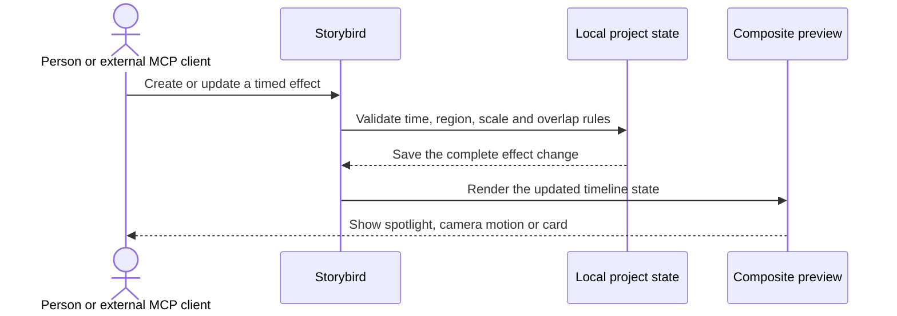

Values and rules:
- 모든 효과의 시작 시간은 종료 시간보다 빠르고 프로젝트 시간 범위 안에 있어야 한다.
- 스포트라이트 영역의 좌표와 크기는 0부터 1까지의 영상 범위 안에 있어야 한다.
- 팬·줌의 허용 배율은 1배부터 3배까지다.
- 같은 시간에 활성화되는 스포트라이트와 팬·줌은 종류별로 각각 하나다.
- 타이틀 카드는 영상 시작 또는 클립 사이에만 배치한다.
- CTA 카드는 영상 마지막에만 배치하며 실제 링크 동작 수는 0개다.
- 자동 제안이 사용자 또는 외부 MCP 클라이언트의 적용 없이 출력 상태를 변경하는 횟수는 0회다.

#### 7.4.4 Edge Cases

- 스포트라이트 영역이 영상 경계를 일부 벗어나면 저장하지 않는다.
- 같은 종류의 효과 시간 범위가 기존 효과와 겹치면 중복 효과를 만들지 않는다.
- 팬·줌이 적용된 구간의 Click Cue는 영상 내용과 함께 움직이지만 자막은 화면 고정 위치를 유지한다.
- 타이틀 카드 삽입으로 프로젝트 시간이 늘어나면 뒤에 있는 클립과 레이어의 프로젝트 시간을 함께 이동한다.
- CTA 카드 앞의 마지막 클립을 삭제하거나 재배치해도 CTA 카드는 새 프로젝트 마지막에 유지한다.
- 빈 제목 또는 빈 CTA 라벨은 유효한 카드로 저장하지 않는다.

#### 7.4.5 Error Handling

- 프로젝트 범위 밖 시간, 잘못된 스포트라이트 영역 또는 1배부터 3배 범위 밖 배율은 저장하지 않고 잘못된 값을 반환한다.
- 같은 종류의 효과가 겹치면 충돌하는 효과와 시간 구간을 반환한다.
- 영상 마지막이 아닌 위치의 CTA 요청은 저장하지 않는다.
- 유효하지 않은 속성이 포함된 편집 요청은 부분 저장하지 않는다.
- 저장이나 프리뷰 갱신이 실패하면 이전 효과 상태를 유지한다.

#### 7.4.6 Acceptance Criteria

- [ ] 스포트라이트, 팬·줌, 타이틀 카드와 CTA 카드를 UI와 MCP에서 생성, 조회, 수정하고 삭제할 수 있다.
- [ ] 모든 효과의 시작 시간은 종료 시간보다 빠르고 프로젝트 범위 안에 있다.
- [ ] 스포트라이트 영역은 0부터 1까지의 영상 좌표와 크기를 사용한다.
- [ ] 팬·줌 배율은 1배부터 3배까지만 저장된다.
- [ ] 같은 시간에는 스포트라이트와 팬·줌이 종류별로 각각 하나만 활성화된다.
- [ ] 팬·줌 중 클릭 표시와 설명은 영상 내용과 함께 이동하고 자막은 화면 고정 위치를 유지한다.
- [ ] 타이틀 카드는 영상 시작 또는 클립 사이에 배치되고 공백이 아닌 제목을 가진다.
- [ ] CTA 카드는 영상 마지막에 배치되고 공백이 아닌 제목과 버튼 모양 라벨을 가진다.
- [ ] CTA 카드의 실제 링크 또는 클릭 동작은 0개다.
- [ ] F10의 제안은 명시적으로 적용하기 전에는 출력 상태를 변경하지 않는다.
- [ ] 유효하지 않은 요청은 효과 상태를 부분 변경하지 않는다.
- **Demo checkpoint:** Section 3의 클릭 시점에 화면이 대상 영역으로 확대되고 주변이 어두워지며 영상 마지막에는 비대화형 CTA 카드가 표시된다.

### 7.5. F5: 합성 프리뷰

#### 7.5.1 User Story

- 제품 데모 제작자로서 편집 결과를 최종 영상과 같은 모습으로 확인하고 싶다. 그래야 내보내기 전에 잘못된 위치, 시간 또는 스타일을 수정할 수 있다.
- 외부 MCP 클라이언트를 사용하는 에이전트로서 특정 프로젝트 시간의 합성 프레임을 조회하고 싶다. 그래야 자체 LLM으로 화면을 검사하고 다음 편집을 결정할 수 있다.

#### 7.5.2 User Flow

1. 사람은 편집기에서 영상을 재생, 일시정지하거나 타임라인의 특정 시점으로 이동한다.
2. Storybird는 해당 시점의 영상 클립과 모든 활성 레이어 및 효과를 합성한다.
3. 편집 변경이 발생하면 프리뷰가 새 프로젝트 상태를 반영한다.
4. 외부 MCP 클라이언트는 프로젝트 식별자와 프로젝트 시간을 지정해 합성 프레임을 요청한다.
5. Storybird는 합성 PNG와 실제 렌더링 시간, 표시된 레이어 및 미완성 Click Cue 정보를 반환한다.
6. 프리뷰 요청은 프로젝트 상태를 변경하지 않는다.

#### 7.5.3 Technical Description

UI 프리뷰:
- UI는 프로젝트 타임라인의 재생, 일시정지와 시점 이동을 제공한다.
- 합성 결과에는 편집된 영상 클립, Click Cue의 클릭 표시·설명·자막, 독립 자막, 스포트라이트, 팬·줌, 타이틀과 CTA 카드가 포함된다.
- 화면 비율과 프로젝트의 영상 좌표를 유지하면서 편집기 크기에 맞게 표시한다.
- 미완성 Click Cue도 현재 입력된 요소까지 프리뷰하되 편집기에 미완성 상태를 표시한다.

MCP 프리뷰:
- 외부 MCP 클라이언트는 0초 이상 프로젝트 종료 시간 미만의 시점을 요청한다.
- Storybird는 프로젝트 해상도로 모든 활성 요소를 합성한 PNG를 반환한다.
- 응답에는 실제로 렌더링한 프로젝트 시간, 표시된 레이어 식별자와 미완성 Click Cue 식별자가 포함된다.
- 승인된 프로젝트 이외의 영상 또는 현재 프레임과 관계없는 화면은 반환하지 않는다.
- 프리뷰 조회는 프로젝트와 타임라인을 변경하지 않는 읽기 작업이다.

정확성과 반응성:
- 프리뷰와 MP4 내보내기는 동일한 프로젝트 시간, 좌표와 레이어 상태를 사용한다.
- 1080p, 120초, 시간 기반 레이어 100개 기준 프로젝트에서 시점 이동과 편집 속성 변경의 95%는 500ms 이내에 프리뷰에 반영된다.
- 프리뷰와 최종 MP4의 효과 표시 시간 차이는 원본 영상 1프레임 이내다.
- Storybird는 프리뷰를 모델 API 또는 자체 네트워크 경로로 전송하지 않는다.

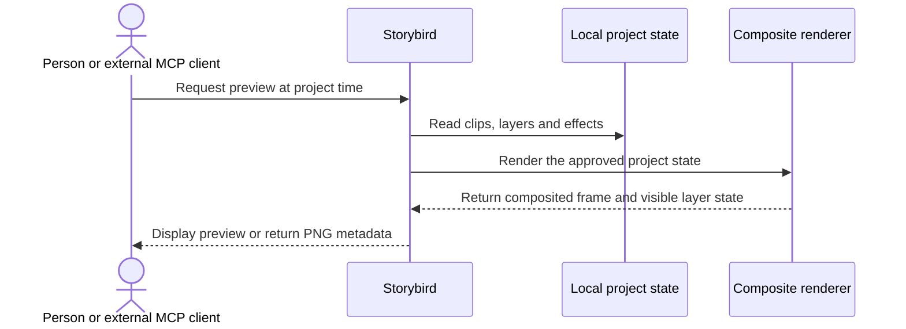

Values and rules:
- MCP 프리뷰 요청 시간은 0초 이상 프로젝트 종료 시간 미만이다.
- MCP 프리뷰 이미지는 프로젝트 해상도의 PNG다.
- 1080p, 120초, 레이어 100개 기준 프로젝트에서 변경의 95%가 500ms 이내에 반영된다.
- 프리뷰와 MP4의 효과 표시 시간 차이는 최대 원본 영상 1프레임이다.
- 프리뷰 요청으로 발생하는 프로젝트 변경 수는 0개다.
- Storybird가 프리뷰를 모델 API 또는 자체 네트워크로 전송하는 횟수는 0회다.

#### 7.5.4 Edge Cases

- 미완성 Click Cue는 프리뷰할 수 있지만 누락된 설명 또는 자막 상태를 함께 표시한다.
- 타임라인 편집 중 재생 위치가 삭제된 구간에 있으면 새 프로젝트 시간에서 가장 가까운 유효 시점으로 이동한다.
- 팬·줌 구간의 클릭 표시와 설명은 영상과 함께 이동하고 자막은 화면 고정 위치를 유지한다.
- 프로젝트 종료 시간의 프레임 요청은 허용 범위 밖 요청으로 처리한다.
- 표시할 레이어가 없는 시점에는 영상 프레임만 반환한다.

#### 7.5.5 Error Handling

- 범위 밖 시간을 요청하면 프레임을 반환하지 않고 허용 시간 범위를 알린다.
- 원본 영상이 없거나 손상되면 누락된 자산을 명시하고 프로젝트를 변경하지 않는다.
- 프레임 합성에 실패하면 이전 프리뷰와 프로젝트 상태를 유지하고 렌더링 실패를 반환한다.
- 승인되지 않은 프로젝트 프레임 요청은 영상을 반환하지 않는다.

#### 7.5.6 Acceptance Criteria

- [ ] UI에서 프로젝트를 재생, 일시정지하고 임의의 유효 시점으로 이동할 수 있다.
- [ ] 프리뷰는 영상 클립, Click Cue, 독립 자막, 스포트라이트, 팬·줌, 타이틀과 CTA 카드를 합성한다.
- [ ] 화면 비율과 영상 좌표가 편집기 크기와 관계없이 유지된다.
- [ ] 미완성 Click Cue는 현재 요소를 프리뷰하고 미완성 상태를 표시한다.
- [ ] MCP는 0초 이상 프로젝트 종료 시간 미만의 시점에 대해 프로젝트 해상도 PNG를 반환한다.
- [ ] MCP 프리뷰 응답은 실제 렌더링 시간, 표시된 레이어와 미완성 Click Cue 식별자를 포함한다.
- [ ] 1080p, 120초, 레이어 100개 기준 프로젝트에서 변경의 95%가 500ms 이내에 반영된다.
- [ ] 프리뷰와 최종 MP4의 효과 표시 시간 차이는 원본 영상 1프레임 이내다.
- [ ] 프리뷰 요청은 프로젝트를 변경하지 않는다.
- [ ] Storybird는 프리뷰를 모델 API 또는 자체 네트워크 경로로 전송하지 않는다.
- **Demo checkpoint:** Section 3에서 사람과 외부 MCP 클라이언트가 동일한 클릭 시점의 클릭 표시, 설명, 자막과 스포트라이트가 합성된 같은 프레임을 확인한다.

### 7.6. F6: MP4 내보내기

#### 7.6.1 User Story

- 제품 데모 제작자로서 편집 결과를 별도 플레이어나 자산 없이 공유할 수 있는 영상으로 내보내고 싶다.
- 외부 MCP 클라이언트를 사용하는 에이전트로서 유효한 프로젝트의 내보내기를 시작하고 상태를 확인하고 싶다. 그래야 UI 편집 없이 최종 결과물을 완성할 수 있다.

#### 7.6.2 User Flow

1. 사람 또는 외부 MCP 클라이언트가 프로젝트 내보내기를 요청한다.
2. Storybird가 재생 가능한 클립, Click Cue 완성 여부와 모든 레이어 유효성을 검사한다.
3. 유효하지 않으면 누락되거나 잘못된 레이어를 반환하고 시작하지 않는다.
4. 유효하면 임시 파일에 영상과 모든 레이어를 합성한다.
5. UI 또는 MCP에서 진행률을 확인하고 필요하면 취소한다.
6. 렌더링과 파일 검증이 모두 성공한 뒤 목적지에 완성된 MP4를 반영한다.
7. 실패하거나 취소하면 임시 결과를 제거하고 원본 및 기존 출력 파일을 유지한다.

#### 7.6.3 Technical Description

사전 검증:
- 출력 타임라인에는 재생 가능한 영상 클립이 하나 이상 있어야 한다.
- 유지된 모든 Click Cue는 공백이 아닌 설명과 자막을 가져야 한다.
- 모든 클립, 레이어와 효과의 시간, 좌표와 스타일은 프로젝트 검증을 통과해야 한다.
- 검증 실패는 누락되거나 잘못된 레이어 식별자를 반환하며 파일 생성을 시작하지 않는다.

렌더링:
- 결과는 H.264 비디오 트랙 하나를 가진 무음 MP4다.
- 프로젝트 영상의 해상도와 화면 비율을 유지한다.
- 편집된 클립, Click Cue, 독립 자막, 스포트라이트, 팬·줌, 타이틀과 CTA 카드를 영상 픽셀에 합성한다.
- HTML, 실행 스크립트 또는 별도 자산 디렉터리를 생성하지 않는다.
- 프리뷰와 내보내기는 같은 프로젝트 시간과 레이어 상태를 사용하며 효과 시간 차이는 원본 영상 1프레임 이내다.

파일 처리와 상태:
- UI에서는 사용자가 선택한 저장 위치를 사용한다.
- MCP에서는 허용된 상위 디렉터리 안에 고유한 파일명을 생성해 기존 파일을 덮어쓰지 않는다.
- 원본 녹화 파일은 내보내기 목적지가 될 수 없다.
- 완성되지 않은 결과는 임시 파일로 유지하고 렌더링과 검증이 모두 성공한 뒤에만 목적지에 반영한다.
- 진행률, 완료, 실패와 취소 상태를 UI와 MCP에 제공한다.
- 앱 인스턴스당 동시에 하나의 내보내기만 실행한다.

성능과 외부 경계:
- 편집 기능을 조합한 기준 프로젝트 10개가 모두 출력에 성공해야 한다.
- 지정 프레임에서 텍스트와 효과 누락은 0건이어야 한다.
- 기준 Mac에서 1080p 120초 프로젝트를 240초 이내에 출력한다.
- Storybird는 내보내기 과정에서 모델 API를 호출하거나 자체 네트워크 요청을 생성하지 않는다.

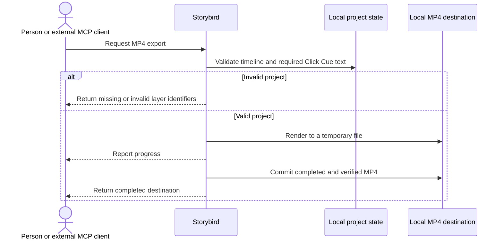

Values and rules:
- 출력은 H.264 비디오 트랙 1개와 오디오 트랙 0개를 가진 MP4 한 파일이다.
- 재생 가능한 영상 클립은 최소 1개다.
- 유지된 Click Cue의 빈 설명 또는 자막 수는 0개여야 한다.
- HTML, 스크립트와 별도 자산 디렉터리 생성 수는 각각 0개다.
- 앱 인스턴스당 활성 내보내기는 1개다.
- 프리뷰와 내보내기 효과 시간 차이는 최대 원본 영상 1프레임이다.
- 기준 프로젝트 10개에서 지정 프레임의 텍스트 및 효과 누락 수는 0건이다.
- 1080p 120초 기준 프로젝트의 내보내기 상한은 기준 Mac에서 240초다.
- Storybird의 모델 API 호출과 자체 네트워크 요청은 각각 0건이다.

#### 7.6.4 Edge Cases

- 모든 클립을 삭제한 빈 타임라인은 내보내기를 시작하지 않는다.
- 미완성 Click Cue는 프리뷰할 수 있지만 내보내기를 차단한다.
- 목적지가 원본 녹화와 같으면 원본 교체를 허용하지 않는다.
- MCP가 지정한 디렉터리에 같은 이름이 있으면 고유한 새 이름을 사용한다.
- 내보내기 중 프로젝트가 수정되면 시작 시 검증한 프로젝트 상태를 일관되게 렌더링하고 이후 변경은 다음 내보내기에 반영한다.
- 이미 내보내기가 진행 중일 때 두 번째 요청이 오면 현재 작업을 유지하고 새 요청을 거부한다.

#### 7.6.5 Error Handling

- 빈 타임라인, 미완성 Click Cue 또는 유효하지 않은 레이어가 있으면 렌더링을 시작하지 않고 해당 식별자를 반환한다.
- 목적지가 원본 녹화이거나 쓸 수 없는 위치면 파일을 만들지 않고 오류를 반환한다.
- 취소하면 임시 파일을 제거하고 기존 목적지와 원본을 변경하지 않는다.
- 렌더링, 인코딩 또는 최종 검증이 실패하면 완성되지 않은 파일을 목적지에 반영하지 않는다.
- 실패한 내보내기는 프로젝트 편집 상태를 변경하지 않는다.

#### 7.6.6 Acceptance Criteria

- [ ] 유효한 프로젝트는 H.264 비디오 트랙 1개와 오디오 트랙 0개를 가진 MP4 한 파일로 출력된다.
- [ ] 결과 MP4는 프로젝트 영상의 해상도와 화면 비율을 유지한다.
- [ ] 모든 클립, Click Cue, 독립 자막, 스포트라이트, 팬·줌, 타이틀과 CTA가 영상 픽셀에 합성된다.
- [ ] HTML, 스크립트와 별도 자산 디렉터리는 생성되지 않는다.
- [ ] 재생 가능한 영상 클립이 없거나 유지된 Click Cue의 설명 또는 자막이 비어 있으면 내보내기를 시작하지 않는다.
- [ ] 유효하지 않은 프로젝트는 누락되거나 잘못된 레이어 식별자를 반환한다.
- [ ] UI는 사용자가 선택한 위치를 사용하고 MCP는 허용된 디렉터리에 고유한 파일명을 생성한다.
- [ ] 원본 녹화 파일은 내보내기로 교체되지 않는다.
- [ ] 실패하거나 취소된 내보내기는 기존 목적지와 원본을 변경하지 않는다.
- [ ] UI와 MCP에서 진행률, 완료, 실패와 취소 상태를 확인할 수 있다.
- [ ] 앱 인스턴스당 활성 내보내기는 하나다.
- [ ] 기준 프로젝트 10개가 모두 출력되고 지정 프레임의 텍스트와 효과 누락은 0건이다.
- [ ] 프리뷰와 내보내기의 효과 시간 차이는 원본 영상 1프레임 이내다.
- [ ] 1080p 120초 프로젝트는 기준 Mac에서 240초 이내에 출력된다.
- [ ] Storybird의 모델 API 호출과 자체 네트워크 요청은 각각 0건이다.
- **Demo checkpoint:** Section 3에서 완성된 Click Cue와 효과가 포함된 MP4가 생성되고 지정 클릭 프레임에 프리뷰와 동일한 클릭 표시, 설명과 자막이 보인다.

### 7.7. F7: MCP 세션·권한·화면 제어

#### 7.7.1 User Story

- 외부 MCP 클라이언트를 사용하는 에이전트로서 사용자가 승인한 화면 또는 창을 관찰하고 포인터로 조작하고 싶다. 그래야 Storybird에 LLM을 내장하지 않고 제품 사용 흐름을 녹화할 수 있다.
- 사용자로서 외부 에이전트가 볼 화면과 수행할 포인터 제어를 승인하고 언제든 중지하고 싶다. 그래야 화면과 입력의 통제권을 유지할 수 있다.

#### 7.7.2 User Flow

1. 외부 MCP 클라이언트가 캡처 가능한 소스 목록을 요청한다.
2. Storybird는 허용된 화면과 창만 반환한다.
3. 외부 클라이언트가 소스 하나를 선택해 세션 시작을 요청한다.
4. Storybird는 선택 소스, 화면 전달과 포인터 권한을 네이티브 화면에 공개한다.
5. 사용자가 승인하면 선택 소스의 관찰과 포인터 이동·좌우 클릭·스크롤을 허용한다.
6. 사용자가 거부하거나 세션을 중지하면 프레임 전달과 입력을 수행하지 않는다.
7. 연결이 종료되면 활성 권한과 선택 소스를 해제한다.

#### 7.7.3 Technical Description

로컬 연결과 소스 조회:
- 외부 MCP 클라이언트는 로컬 stdio 경계의 MCP companion을 통해 Storybird 도구를 호출한다.
- companion은 인증된 사용자 전용 로컬 연결을 통해 Storybird 애플리케이션에 요청을 전달한다.
- companion 자체에는 화면 캡처 권한과 프로젝트 쓰기 권한이 없다.
- 소스 목록은 Storybird 자체 창, 시스템 유틸리티, 화면 밖에 있거나 지나치게 작은 창을 제외한다.

승인과 세션:
- 세션 요청은 정확히 하나의 화면 또는 창을 선택한다.
- Storybird는 외부 클라이언트와 선택 소스, 화면 전달 및 포인터 제어 범위를 네이티브 승인 화면에 표시한다.
- 사용자 승인 전에는 선택 소스 PNG를 반환하거나 포인터 입력을 게시하지 않는다.
- 앱 인스턴스당 활성 MCP 제어 세션은 하나다.
- 세션 중 소스를 바꿀 수 없으며 다른 소스를 사용하려면 기존 세션을 중지하고 새 승인을 받아야 한다.
- 사용자가 세션을 중지하거나 인증된 로컬 연결이 끊기면 이후 모든 관찰과 입력 명령을 거부한다.

화면과 포인터 제어:
- 관찰 요청은 승인된 선택 소스의 현재 픽셀만 PNG로 반환한다.
- 포인터 위치는 선택 소스 기준 가로와 세로 각각 0부터 1까지의 좌표를 사용한다.
- 허용 입력은 포인터 이동, 좌우 클릭, 가로 스크롤과 세로 스크롤이다.
- 키보드 입력, DOM(Document Object Model, 웹 화면 구조), 쿠키 또는 자격 증명을 관찰하거나 합성하지 않는다.

외부 경계:
- Storybird는 LLM 실행, 모델 API 호출, 모델 API 키 저장 또는 자체 네트워크 전송을 수행하지 않는다.
- 외부 MCP 클라이언트가 모델 연결과 Storybird에서 받은 데이터의 이후 전송을 책임진다.
- 프로젝트와 레이어 편집은 F8, 합성 프리뷰와 내보내기는 F9가 담당한다.

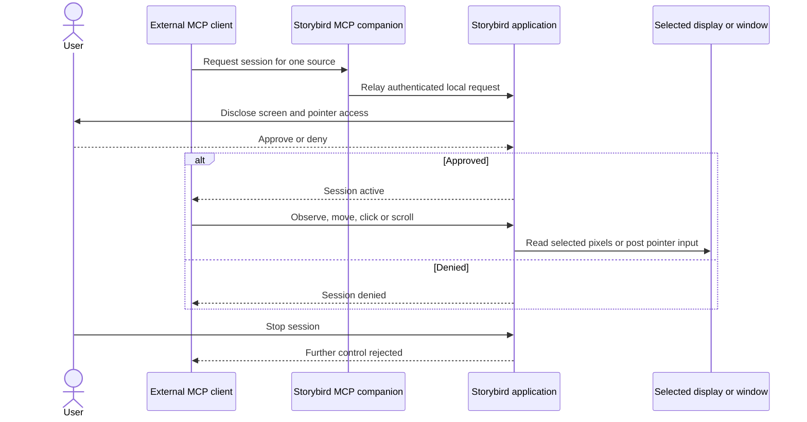

Values and rules:
- 앱 인스턴스당 활성 MCP 제어 세션은 1개다.
- 한 세션이 사용하는 소스는 정확히 1개다.
- 포인터 좌표의 허용 범위는 가로와 세로 각각 0부터 1까지다.
- 허용 입력은 포인터 이동, 좌우 클릭, 가로 및 세로 스크롤이다.
- 승인 전 프레임 전달과 포인터 입력 수는 각각 0건이다.
- 키보드, DOM, 쿠키와 자격 증명 수집 또는 합성 수는 각각 0건이다.
- Storybird의 모델 API 호출, 모델 API 키 저장과 자체 네트워크 요청은 각각 0건이다.

#### 7.7.4 Edge Cases

- 활성 세션 중 두 번째 시작 요청이 오면 기존 세션과 선택 소스를 유지하고 새 요청을 거부한다.
- 승인된 창이 닫히거나 프레임을 제공하지 못하면 다른 소스로 자동 전환하지 않고 세션 오류를 반환한다.
- 범위 밖 포인터 좌표는 화면 입력을 게시하지 않는다.
- 사용자가 승인 화면을 닫거나 거부하면 세션을 만들지 않는다.
- 연결이 끊긴 뒤 늦게 도착한 명령은 실행하지 않는다.
- 다른 소스를 요청하면 기존 세션 중지와 새 승인이 필요하다.

#### 7.7.5 Error Handling

- 인증된 로컬 Storybird 애플리케이션 연결이 없으면 도구 실행을 거부한다.
- 사용자 승인이 없거나 철회됐으면 프레임과 포인터 결과를 반환하지 않는다.
- 유효 프레임이 없으면 이전 프레임이나 다른 화면을 대신 반환하지 않고 오류를 반환한다.
- 잘못된 좌표 또는 지원하지 않는 입력 종류는 포인터 이벤트를 만들지 않고 오류를 반환한다.
- 세션 종료 후 요청은 종료된 세션임을 명시하고 실행하지 않는다.

#### 7.7.6 Acceptance Criteria

- [ ] 소스 목록에서 Storybird 자체 창, 시스템 유틸리티, 화면 밖 또는 지나치게 작은 창이 제외된다.
- [ ] 사용자는 외부 MCP 클라이언트, 선택 소스, 화면 전달과 포인터 제어 범위를 네이티브 화면에서 확인한다.
- [ ] 사용자 승인 전 프레임 전달과 포인터 입력은 각각 0건이다.
- [ ] 앱 인스턴스당 활성 MCP 제어 세션은 하나이고 세션은 정확히 하나의 소스에 고정된다.
- [ ] 승인된 소스의 현재 픽셀만 PNG로 반환된다.
- [ ] 0부터 1까지의 좌표로 포인터 이동, 좌우 클릭과 가로·세로 스크롤을 수행할 수 있다.
- [ ] 범위 밖 좌표와 지원하지 않는 입력은 포인터 이벤트를 만들지 않는다.
- [ ] 사용자가 세션을 중지하거나 인증된 연결이 끊기면 이후 관찰과 입력이 거부된다.
- [ ] MCP companion은 화면 권한과 프로젝트 쓰기 권한을 갖지 않는다.
- [ ] 키보드, DOM, 쿠키와 자격 증명의 관찰 또는 합성은 각각 0건이다.
- [ ] Storybird의 모델 API 호출, API 키 저장과 자체 네트워크 요청은 각각 0건이다.
- **Demo checkpoint:** Section 3에서 사용자가 네이티브 승인을 완료하면 외부 에이전트가 선택한 창만 관찰하고 클릭과 스크롤로 녹화한 뒤 세션을 안전하게 종료한다.

### 7.8. F8: MCP 프로젝트·타임라인·레이어 편집

#### 7.8.1 User Story

- 외부 MCP 클라이언트를 사용하는 에이전트로서 Storybird 프로젝트의 모든 편집 속성을 조회하고 수정하고 싶다. 그래야 프로젝트 파일을 직접 건드리거나 UI를 조작하지 않고 데모를 완성할 수 있다.
- 사용자로서 외부 에이전트의 변경이 Storybird UI와 같은 검증 및 실행 취소 규칙을 따르길 원한다. 그래야 자동 편집도 안전하게 확인하고 되돌릴 수 있다.

#### 7.8.2 User Flow

1. 외부 MCP 클라이언트가 프로젝트 목록 또는 한 프로젝트의 현재 상태와 수정 버전을 조회한다.
2. 클립, Click Cue, 자막, 효과 또는 규칙 기반 제안을 선택한다.
3. 현재 수정 버전을 기준으로 하나의 편집 명령을 제출한다.
4. Storybird가 대상, 시간, 좌표, 스타일과 버전을 검증한다.
5. 유효하면 관련 레이어 변경을 포함해 하나의 원자적 편집으로 저장하고 새 버전을 반환한다.
6. 유효하지 않거나 버전이 오래됐으면 아무것도 변경하지 않고 현재 버전과 오류를 반환한다.
7. 성공한 변경은 Storybird 편집기와 프리뷰 상태에 반영된다.

#### 7.8.3 Technical Description

프로젝트 조회:
- MCP는 프로젝트 목록, 이름, 설명, 편집 가능한 프로젝트 상태와 현재 수정 버전을 조회할 수 있다.
- 조회 결과는 클립, Click Cue, 독립 자막, 효과와 F10 편집 제안의 식별자 및 편집 가능한 속성을 포함한다.
- 설명 또는 자막이 비어 있는 미완성 Click Cue를 별도로 조회할 수 있다.

편집 명령:
- F2의 클립 분할, 트림, 삭제, 재배치, 속도, 정지 구간과 실행 취소·재실행을 제공한다.
- F3의 Click Cue 및 독립 자막 생성, 조회, 수정과 삭제를 제공한다.
- F4의 스포트라이트, 팬·줌, 타이틀 및 CTA 생성, 조회, 수정과 삭제를 제공한다.
- F10의 규칙 기반 제안을 조회하고 적용, 수정하거나 거부할 수 있다.
- UI에서 편집할 수 있는 모든 속성은 동일한 의미와 검증으로 MCP에서도 편집할 수 있어야 한다.

수정 버전과 저장:
- 프로젝트 조회는 현재 수정 버전을 반환한다.
- 변경 요청은 편집 기준이 된 수정 버전을 포함한다.
- 다른 편집으로 현재 버전이 달라졌으면 이전 상태를 덮어쓰지 않고 요청을 거부한다.
- 성공한 편집은 새 수정 버전과 변경된 대상 식별자를 반환한다.
- 한 명령과 이에 연결된 클립·레이어 시간 변경은 하나의 원자적 저장 및 실행 취소 단위다.
- 실패한 편집은 프로젝트 상태, 수정 버전과 실행 취소 기록을 변경하지 않는다.
- 기준 프로젝트에서 성공한 변경의 95%는 500ms 이내에 Storybird UI 프리뷰에 반영된다.

권한과 외부 경계:
- 인증된 로컬 MCP 연결의 비파괴 편집은 명령마다 네이티브 승인을 반복하지 않는다.
- 프로젝트 영구 삭제는 이 Feature의 범위가 아니다.
- 외부 MCP 클라이언트는 프로젝트 파일이나 영상 자산 경로에 직접 쓰지 않는다.
- Storybird 애플리케이션만 프로젝트와 자산을 검증하고 기록한다.
- 설명과 자막은 프로젝트 편집 명령으로 입력하며 키보드를 합성하지 않는다.
- Storybird는 문구 생성, LLM 실행, 모델 API 호출 또는 자체 네트워크 전송을 수행하지 않는다.

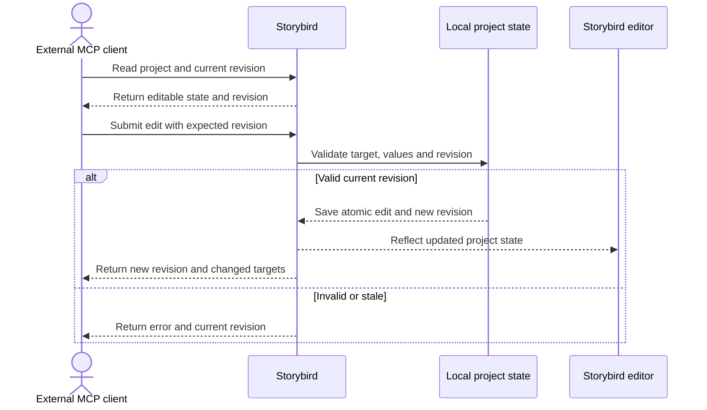

Values and rules:
- UI 편집 속성의 MCP 지원율은 100%다.
- 모든 변경 요청은 기준 수정 버전을 포함한다.
- 성공한 변경은 수정 버전을 정확히 하나 증가시키고 새 버전을 반환한다.
- 실패한 변경으로 증가하는 수정 버전과 추가되는 실행 취소 기록은 각각 0개다.
- 기준 프로젝트에서 성공한 변경의 95%는 500ms 이내에 UI 프리뷰에 반영된다.
- 외부 MCP 클라이언트가 프로젝트 파일 또는 영상 자산에 직접 기록하는 횟수는 0회다.
- Storybird의 키보드 합성, 문구 자동 생성, 모델 API 호출과 자체 네트워크 요청은 각각 0건이다.

#### 7.8.4 Edge Cases

- 사람이 UI에서 편집한 직후 에이전트가 오래된 버전으로 요청하면 사람의 변경을 덮어쓰지 않는다.
- 하나의 명령이 클립과 연결 레이어 시간을 함께 바꾸면 전체를 하나의 실행 취소 단위로 처리한다.
- 존재하지 않거나 이미 삭제된 대상 식별자를 사용하면 현재 프로젝트를 유지한다.
- 미완성 Click Cue의 문구를 채우는 동안 다른 속성이 변경되면 최신 상태를 다시 조회하게 한다.
- 같은 값으로 다시 요청해도 검증을 통과한 실제 프로젝트 변경이 없으면 불필요한 새 상태를 만들지 않는다.

#### 7.8.5 Error Handling

- 오래된 수정 버전은 현재 버전과 함께 충돌 오류를 반환하고 저장하지 않는다.
- 존재하지 않는 대상은 해당 식별자를 반환하고 프로젝트를 변경하지 않는다.
- 잘못된 시간, 좌표, 스타일 또는 상태 전환은 잘못된 속성을 명시하고 부분 저장하지 않는다.
- 프로젝트 저장이 실패하면 이전 상태, 수정 버전과 실행 취소 기록을 유지한다.
- 프로젝트 직접 파일 쓰기 또는 이 Feature 범위 밖의 영구 삭제 요청은 허용하지 않는다.

#### 7.8.6 Acceptance Criteria

- [ ] MCP에서 프로젝트 목록, 현재 편집 상태, 수정 버전과 미완성 Click Cue를 조회할 수 있다.
- [ ] F2, F3, F4와 F10의 UI 편집 속성 100%를 MCP에서 동일하게 편집할 수 있다.
- [ ] 모든 변경 요청은 기준 수정 버전을 포함한다.
- [ ] 유효한 현재 버전의 변경은 원자적으로 저장되고 수정 버전을 하나 증가시키며 새 버전과 변경 대상을 반환한다.
- [ ] 오래된 수정 버전은 현재 버전을 반환하고 기존 프로젝트를 변경하지 않는다.
- [ ] 실패한 변경은 프로젝트, 수정 버전과 실행 취소 기록을 변경하지 않는다.
- [ ] 성공한 변경의 95%는 1080p, 120초, 레이어 100개 기준 프로젝트에서 500ms 이내에 UI 프리뷰에 반영된다.
- [ ] 비파괴 편집 명령마다 네이티브 승인을 반복하지 않는다.
- [ ] 프로젝트 영구 삭제는 이 Feature에서 수행할 수 없다.
- [ ] 외부 MCP 클라이언트는 프로젝트 파일과 영상 자산에 직접 기록하지 않는다.
- [ ] Storybird만 프로젝트와 자산을 검증하고 저장한다.
- [ ] Storybird의 키보드 합성, 문구 자동 생성, 모델 API 호출과 자체 네트워크 요청은 각각 0건이다.
- **Demo checkpoint:** Section 3에서 외부 에이전트가 미완성 Click Cue의 설명과 자막을 입력하고 실수 구간 및 효과를 편집하면 동일한 변경이 Storybird 편집기에 나타난다.

### 7.9. F9: MCP 프리뷰·내보내기 오케스트레이션

#### 7.9.1 User Story

- 외부 MCP 클라이언트를 사용하는 에이전트로서 편집된 프로젝트의 특정 시점을 이미지로 검사하고 싶다. 그래야 화면 결과를 확인한 뒤 다음 편집을 결정할 수 있다.
- 외부 MCP 클라이언트를 사용하는 에이전트로서 MP4 내보내기를 시작하고 완료까지 추적하고 싶다. 그래야 UI 개입 없이 최종 결과물 경로를 확인할 수 있다.

#### 7.9.2 User Flow

1. 외부 MCP 클라이언트가 프로젝트 식별자와 프로젝트 시간을 지정해 합성 프리뷰를 요청한다.
2. Storybird가 F5와 같은 합성 결과를 PNG와 메타데이터로 반환한다.
3. 외부 클라이언트가 내보내기 전 검증을 요청한다.
4. 유효하면 Storybird가 고유한 내보내기 작업 식별자를 반환하고 렌더링을 시작한다.
5. 외부 클라이언트가 상태와 0부터 100%까지의 진행률을 조회하거나 작업을 취소한다.
6. 완료되면 Storybird가 완성된 MP4의 로컬 경로를 반환한다.
7. 실패 또는 취소되면 Storybird가 임시 파일을 제거하고 원인을 반환한다.

#### 7.9.3 Technical Description

합성 프리뷰:
- MCP 요청은 프로젝트 식별자와 0초 이상 프로젝트 종료 시간 미만의 시간을 포함한다.
- Storybird는 F5와 동일한 프로젝트 상태 및 합성 규칙으로 프로젝트 해상도의 PNG를 만든다.
- 응답은 실제 렌더링 시간, 표시된 레이어 식별자와 미완성 Click Cue 식별자를 포함한다.
- 프리뷰 요청은 프로젝트, 수정 버전과 실행 취소 기록을 변경하지 않는다.
- 승인되지 않았거나 원본 영상이 손상된 프로젝트는 영상을 반환하지 않는다.

내보내기 작업:
- Storybird는 F6의 타임라인, Click Cue와 레이어 검증을 먼저 수행한다.
- 유효하면 고유한 작업 식별자를 만들고 상태를 검증 중에서 렌더링 중으로 전환한다.
- 진행률은 0부터 100%까지 반환한다.
- 완료 상태에서만 생성된 MP4의 로컬 경로를 반환한다.
- MCP가 제공한 허용 디렉터리 안에 고유한 파일명을 사용하며 기존 파일과 원본 녹화를 덮어쓰지 않는다.
- 앱 인스턴스당 활성 내보내기는 하나다.

상태 전환:
- 허용 상태는 검증 중, 렌더링 중, 완료, 실패와 취소다.
- 정상 경로는 검증 중에서 렌더링 중을 거쳐 완료로 전환한다.
- 검증 중 또는 렌더링 중 작업은 실패 또는 취소로 전환할 수 있다.
- 완료, 실패 또는 취소 상태는 종료 상태이며 다시 진행 상태로 전환할 수 없다.
- MCP 응답은 MP4 내용을 전송하지 않고 상태와 로컬 결과 경로만 반환한다.

외부 경계:
- F5와 동일한 프리뷰, F6와 동일한 검증·렌더링·파일 안전 규칙을 사용한다.
- 비파괴 프리뷰와 내보내기 명령마다 네이티브 편집 승인을 반복하지 않는다.
- Storybird는 모델 API 호출 또는 자체 네트워크 전송을 수행하지 않는다.
- 화면과 포인터 제어는 F7, 프로젝트 편집은 F8의 범위다.

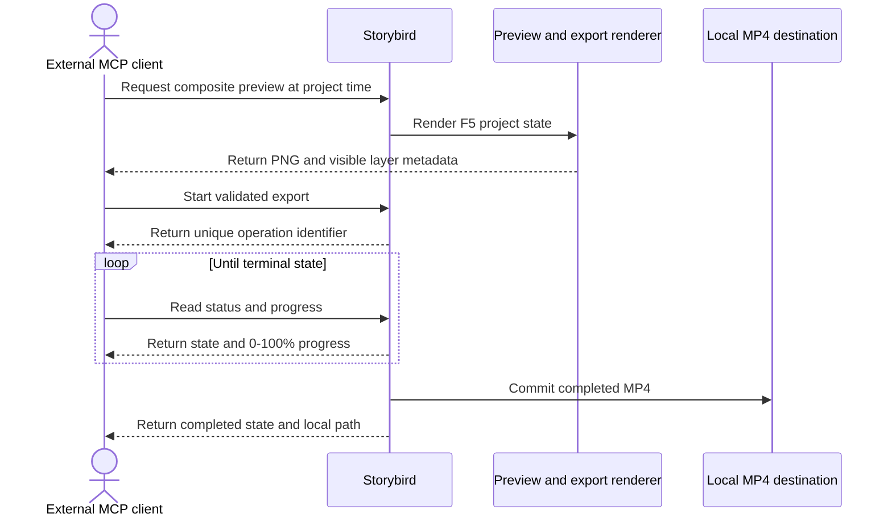

Values and rules:
- 프리뷰 요청 시간은 0초 이상 프로젝트 종료 시간 미만이다.
- 프리뷰 이미지는 프로젝트 해상도의 PNG다.
- 내보내기 진행률 범위는 0부터 100%까지다.
- 허용 상태는 검증 중, 렌더링 중, 완료, 실패와 취소다.
- 완료, 실패와 취소는 다시 진행 상태로 전환하지 않는 종료 상태다.
- 앱 인스턴스당 활성 내보내기는 1개다.
- 프리뷰와 MP4 효과 표시 시간 차이는 최대 원본 영상 1프레임이다.
- 프리뷰 요청으로 발생하는 프로젝트 변경 수와 MCP로 전송되는 MP4 파일 내용 수는 각각 0개다.
- Storybird의 모델 API 호출과 자체 네트워크 요청은 각각 0건이다.

#### 7.9.4 Edge Cases

- 미완성 Click Cue는 프리뷰할 수 있지만 내보내기 검증을 통과하지 못한다.
- 범위 밖 프리뷰 시간은 PNG를 만들지 않는다.
- 두 번째 동시 내보내기 요청은 현재 작업을 유지하고 거부한다.
- 완료된 작업을 취소하거나 종료 상태를 다시 시작하려는 요청은 상태를 변경하지 않는다.
- 존재하지 않는 작업 식별자를 조회해도 다른 작업 상태를 노출하지 않는다.
- 프로젝트가 내보내기 시작 뒤 수정되면 시작 시 검증한 프로젝트 상태를 일관되게 렌더링한다.

#### 7.9.5 Error Handling

- 승인되지 않았거나 손상된 프로젝트는 프리뷰 이미지와 내보내기 결과를 반환하지 않는다.
- 빈 타임라인, 미완성 Click Cue와 잘못된 레이어는 렌더링 전에 해당 식별자를 반환한다.
- 존재하지 않는 작업 식별자는 상태를 변경하지 않고 오류를 반환한다.
- 실패 또는 취소 시 임시 파일을 제거하고 기존 파일과 원본을 유지한다.
- 결과 경로는 완료 상태에서만 반환한다.

#### 7.9.6 Acceptance Criteria

- [ ] MCP는 0초 이상 프로젝트 종료 시간 미만의 시점에서 프로젝트 해상도 합성 PNG를 요청할 수 있다.
- [ ] 프리뷰 응답은 실제 렌더링 시간, 표시된 레이어와 미완성 Click Cue 식별자를 포함한다.
- [ ] 프리뷰 요청은 프로젝트, 수정 버전과 실행 취소 기록을 변경하지 않는다.
- [ ] 유효한 프로젝트의 내보내기는 고유한 작업 식별자를 반환한다.
- [ ] 내보내기 상태는 검증 중, 렌더링 중, 완료, 실패 또는 취소 중 하나다.
- [ ] 진행률은 0부터 100%까지다.
- [ ] 완료, 실패와 취소 상태는 다시 진행 상태로 전환하지 않는다.
- [ ] 완료 상태에서만 완성된 MP4 로컬 경로를 반환한다.
- [ ] MCP 응답으로 MP4 파일 내용을 전송하지 않는다.
- [ ] 앱 인스턴스당 활성 내보내기는 하나다.
- [ ] 기존 파일과 원본 녹화를 덮어쓰지 않는다.
- [ ] 실패 또는 취소 시 임시 파일을 제거한다.
- [ ] 프리뷰와 MP4 효과 표시 시간 차이는 원본 영상 1프레임 이내다.
- [ ] Storybird의 모델 API 호출과 자체 네트워크 요청은 각각 0건이다.
- **Demo checkpoint:** Section 3에서 외부 에이전트가 클릭 시점의 합성 PNG를 검사한 뒤 내보내기를 시작하고 완료 상태와 생성된 MP4 로컬 경로를 확인한다.

### 7.10. F10: 규칙 기반 클릭 편집 제안

#### 7.10.1 User Story

- 제품 데모 제작자로서 녹화된 클릭을 바탕으로 반복적인 분할과 시선 유도 효과의 초안을 받고 싶다. 그래야 모든 효과를 처음부터 수동으로 만들지 않고 빠르게 편집할 수 있다.
- 외부 MCP 클라이언트를 사용하는 에이전트로서 같은 제안을 조회, 수정, 적용하거나 거부하고 싶다. 그래야 UI와 동일한 자동화 기반으로 데모를 완성할 수 있다.

#### 7.10.2 User Flow

1. 녹화가 완료되면 Storybird가 각 Click Cue에 연결된 제안 묶음을 생성한다.
2. 사람 또는 외부 MCP 클라이언트가 대기 중인 제안을 조회한다.
3. 제안된 분할 지점, 클릭 표시 스타일, 스포트라이트와 팬·줌을 확인한다.
4. 필요한 값을 수정한 뒤 제안 전체를 적용하거나 거부한다.
5. 적용한 제안은 한 번의 실행 취소로 되돌릴 수 있는 편집으로 저장된다.
6. 적용 전 제안은 프리뷰와 MP4 출력 상태를 변경하지 않는다.

#### 7.10.3 Technical Description

제안 생성:
- Click Cue 하나마다 제안 묶음 하나를 생성한다.
- 제안 묶음은 클릭 시점의 타임라인 마커, 클릭 시점의 분할 지점, 클릭 표시 기본 스타일, 클릭 좌표 중심의 스포트라이트와 팬·줌 초안을 포함한다.
- 같은 프로젝트와 Click Cue 입력으로 다시 생성해도 별도의 중복 묶음을 추가하지 않고 기존 대기 제안을 유지하거나 갱신한다.
- 같은 입력은 같은 제안 결과를 만든다.

제안 상태와 편집:
- 허용 상태는 대기, 적용과 거부다.
- 대기 상태에서는 제안 값을 수정할 수 있다.
- 적용은 제안에 포함된 유효한 편집을 하나의 원자적 저장 및 실행 취소 단위로 프로젝트에 반영한다.
- 거부는 프로젝트 출력 상태를 변경하지 않는다.
- 명시적으로 적용하기 전에는 원본 영상, 프로젝트 출력 상태와 수정 버전을 변경하지 않는다.
- 적용 또는 거부된 제안을 다시 적용해도 중복 편집을 만들지 않는다.

Click Cue와의 관계:
- Click Cue가 클립 편집으로 이동하면 대기 중인 제안 시간도 같은 프로젝트 시간으로 이동한다.
- Click Cue를 삭제하면 대기 또는 거부 상태의 제안도 제거한다.
- 적용된 효과는 일반 프로젝트 레이어가 되며 이후 F2 또는 F4의 규칙으로 별도 편집하고 삭제한다.

외부 경계:
- UI와 MCP는 제안 조회, 수정, 적용과 거부를 동일한 상태 및 검증 규칙으로 수행한다.
- Storybird의 결정론적인 규칙만 사용한다.
- Storybird는 제안 생성에 LLM, 모델 API 또는 자체 네트워크 전송을 사용하지 않는다.

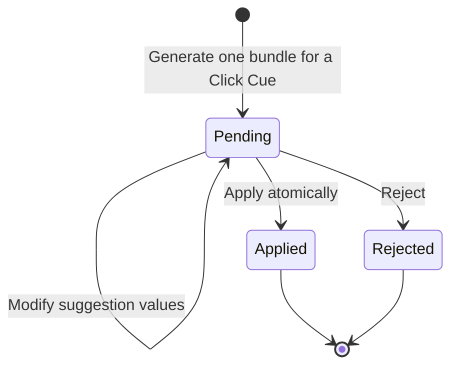

Values and rules:
- Click Cue 하나당 제안 묶음은 최대 1개다.
- 제안 상태의 허용 값은 대기, 적용과 거부다.
- 적용은 프로젝트 편집 및 실행 취소 단위 1개를 생성한다.
- 거부 또는 적용 전 제안이 변경하는 프로젝트 출력 상태와 수정 버전 수는 각각 0개다.
- 동일 입력에서 생성되는 중복 제안 묶음 수는 0개다.
- Storybird의 LLM 실행, 모델 API 호출과 자체 네트워크 요청은 각각 0건이다.

#### 7.10.4 Edge Cases

- 유효한 Click Cue가 없으면 제안 묶음을 만들지 않는다.
- Click Cue의 좌표 또는 시간이 유효하지 않으면 해당 제안을 만들지 않고 오류를 반환한다.
- 대기 제안을 가진 Click Cue를 삭제하면 연결된 대기 제안도 제거한다.
- 적용한 제안의 원본 Click Cue를 나중에 삭제해도 이미 생성된 일반 효과 레이어는 자동 삭제하지 않는다.
- 프로젝트 편집으로 제안 기준 버전이 오래되면 최신 Click Cue 상태를 다시 조회하게 한다.
- 이미 적용 또는 거부한 제안에 같은 명령이 다시 오면 프로젝트를 중복 변경하지 않는다.

#### 7.10.5 Error Handling

- 존재하지 않는 Click Cue 또는 제안을 요청하면 프로젝트를 변경하지 않고 대상 식별자를 반환한다.
- 제안 묶음의 편집 하나라도 유효하지 않으면 어느 편집도 적용하지 않는다.
- 오래된 프로젝트 수정 버전으로 적용하면 현재 버전을 반환하고 제안 상태와 프로젝트를 유지한다.
- 적용 저장이 실패하면 제안을 대기 상태로 유지하고 프로젝트와 실행 취소 기록을 변경하지 않는다.

#### 7.10.6 Acceptance Criteria

- [ ] 유효한 Click Cue 하나마다 제안 묶음이 최대 하나 생성된다.
- [ ] 제안은 클릭 시점의 마커·분할 지점, 클릭 표시 스타일, 클릭 좌표 중심의 스포트라이트와 팬·줌을 포함한다.
- [ ] 같은 입력으로 다시 생성해도 중복 제안 묶음이 생기지 않는다.
- [ ] 제안 상태는 대기, 적용 또는 거부 중 하나다.
- [ ] 대기 제안을 UI와 MCP에서 조회하고 수정할 수 있다.
- [ ] 적용은 관련 편집을 원자적인 프로젝트 편집 및 실행 취소 단위 하나로 저장한다.
- [ ] 거부 또는 적용 전 제안은 원본, 프로젝트 출력 상태와 수정 버전을 변경하지 않는다.
- [ ] Click Cue가 이동하면 대기 제안 시간도 함께 이동한다.
- [ ] Click Cue를 삭제하면 대기 또는 거부 제안도 제거한다.
- [ ] 적용된 효과는 일반 레이어로 별도 편집하고 삭제할 수 있다.
- [ ] 이미 적용 또는 거부한 제안은 프로젝트를 중복 변경하지 않는다.
- [ ] Storybird는 제안 생성에 LLM, 모델 API 또는 자체 네트워크를 사용하지 않는다.
- **Demo checkpoint:** Section 3에서 녹화가 끝나면 각 클릭에 스포트라이트와 팬·줌 제안이 나타나며 사용자가 선택한 제안만 영상에 반영된다.

---

## Section 8. MVP Metrics

### 8.1. Data Collection Methods

Storybird는 MVP 측정을 위해 클라우드 분석이나 사용자 영상 수집 기능을 추가하지 않는다. 측정은 로컬 자동 테스트와 명시적으로 동의한 대표 사용자의 사용성 테스트로 수행한다.

- K1 사람의 작업 완료율
  - 대표 사용자 5명 이상의 사용성 테스트에서 녹화, 불필요한 구간 삭제, Click Cue 작성, 효과 적용과 MP4 출력 체크리스트를 기록한다.

- K2 데모 제작 시간
  - 소스 선택 시작부터 MP4 완료까지의 로컬 이벤트 시간을 참가자별로 측정하고 중앙값을 계산한다.

- K3 재녹화 방지율
  - 의도적인 실수 구간을 포함한 동일한 시나리오를 제공하고 새 녹화 없이 완료한 참가자 비율을 계산한다.

- K4 출력 신뢰성
  - 편집 조합이 다른 기준 프로젝트 10개를 자동 내보내고 비디오 트랙, 지정 프레임, Click Cue 텍스트와 효과, 시간 및 HTML 생성 여부를 검사한다.

- K5 MCP 편집 동등성과 에이전트 완료율
  - UI 편집 속성과 F7, F8 및 F9 MCP 명령의 대응 목록을 자동 비교한다.
  - 외부 MCP 클라이언트 기반 녹화·편집·내보내기 시나리오 10개를 실행한다.
  - UI와 MCP 결과의 프로젝트 상태, 합성 프리뷰와 MP4를 비교하고 프로젝트 직접 파일 쓰기가 없는지 검사한다.

- NF1 편집 반응성
  - 1080p, 120초, 시간 기반 레이어 100개 기준 프로젝트에서 타임라인 탐색과 속성 변경 100회의 반영 시간을 측정한다.

- NF2 렌더링 정확성
  - 기준 프로젝트 10개의 지정 클릭 프레임, Click Cue 텍스트, 효과와 출력 시간을 자동 검사한다.

- NF3 저장 안전성
  - 저장, 취소와 렌더링 실패 20개를 주입하고 전후 원본 해시와 마지막 유효 프로젝트를 비교한다.

- NF4 보안과 개인정보
  - Storybird의 네트워크 요청, 모델 API 호출과 키보드 이벤트를 계측한다.
  - 승인 거부와 잘못된 요청 20개를 실행한다.
  - 저장된 앱 및 프로젝트 자산에 모델 API 키가 없는지 검사한다.

- NF5 MCP 동등성
  - F7, F8 및 F9 도구와 UI 기능의 대응률을 검사하고 외부 MCP 클라이언트 시나리오 10개를 실행한다.

- NF6 오프라인 동작
  - Storybird의 네트워크를 차단한 상태에서 녹화, 편집과 MP4 출력 기준 시나리오 10개를 실행한다. 외부 MCP 클라이언트 또는 LLM 런타임의 네트워크는 측정 범위에 포함하지 않는다.

- NF7 내보내기 성능
  - 기준 Mac에서 1080p 120초 프로젝트의 내보내기 시작부터 완성된 MP4 생성까지 측정한다.

### 8.2. Success Thresholds

KPI는 MVP 사용성 검증에서 측정하고 NFR은 MVP 출시 전과 관련 기능이 변경된 모든 릴리스 후보에서 검사한다.

- K1 사람의 작업 완료율
  - 기준: 현재 전체 시나리오 완료 불가
  - 성공 기준: 대표 사용자 5명 이상 중 80% 이상이 도움 없이 전체 시나리오 완료

- K2 데모 제작 시간
  - 기준: 현재 전체 편집 시나리오 측정 불가
  - 성공 기준: 60–120초 제품 흐름의 제작 시간 중앙값 10분 이하

- K3 재녹화 방지율
  - 기준: 실수 구간 제거가 불가능해 재녹화 필요
  - 성공 기준: 실수 포함 시나리오의 80% 이상을 전체 재녹화 없이 완료

- K4 출력 신뢰성
  - 기준: 기본 클릭과 자막 합성만 지원
  - 성공 기준: 기준 프로젝트 10개 중 10개 출력 성공, 지정 프레임의 텍스트 및 효과 누락 0건, 시간 오차 원본 영상 1프레임 이내, HTML 및 별도 실행 자산 생성 0건

- K5 MCP 편집 동등성과 에이전트 완료율
  - 기준: 모든 MVP 편집 기능을 MCP에서 제어할 수 없음
  - 성공 기준: MCP 지원율 100%, 외부 에이전트 시나리오 10개 중 10개 성공, 프로젝트 직접 파일 쓰기 0건, 잘못된 요청의 부분 저장 0건

- NF1 편집 반응성
  - 성공 기준: 1080p, 120초, 시간 기반 레이어 100개 프로젝트의 측정 100회 중 95%가 500ms 이내에 프리뷰 반영

- NF2 렌더링 정확성
  - 성공 기준: 기준 프로젝트 10개 중 10개 통과, 지정 프레임의 Click Cue 텍스트와 효과 누락 0건, 프리뷰와 MP4 시간 오차 원본 영상 1프레임 이내

- NF3 저장 안전성
  - 성공 기준: 실패 주입 테스트 20개 중 20개에서 원본과 마지막 유효 프로젝트 보존

- NF4 보안과 개인정보
  - 성공 기준: Storybird 네트워크 요청, 모델 API 호출, 키보드 이벤트 수집·합성과 모델 API 키 저장 각각 0건; 잘못된 요청 20개 중 20개에서 포인터 입력 및 프로젝트 저장 0건; 모든 MCP 화면·포인터 세션의 네이티브 승인 적용률 100%

- NF5 MCP 동등성
  - 성공 기준: F7, F8 및 F9의 UI 대응률 100%, 외부 MCP 에이전트 시나리오 10개 중 10개 성공

- NF6 오프라인 동작
  - 성공 기준: Storybird 네트워크 차단 시나리오 10개 중 10개에서 녹화, 편집과 MP4 출력 성공

- NF7 내보내기 성능
  - 성공 기준: 기준 Mac에서 1080p 120초 프로젝트를 240초 이내에 출력

---

## Section 9. Out of Scope

### 9.1. Deferred Features

| Deferred feature | Reason for deferral | Target phase |
| --- | --- | --- |
| 마이크·시스템 오디오·보이스오버 트랙 | 영상 편집과 MCP 동등성을 먼저 검증한다. | Phase 2 |
| 웹캠·PIP·토킹 헤드 영상 | 추가 영상 트랙과 동기화가 필요하다. | Phase 2 |
| 이미지·스티커·전환 효과 | 핵심 제품 데모 레이어 이후 확장한다. | Phase 2 |
| 외부에서 생성한 TTS 음성 파일 가져오기 | Storybird 자체 AI 없이 오디오 트랙으로만 지원한다. | Phase 2 |
| 클라우드 동기화·협업·공유 링크 | 로컬 우선 MVP 범위를 유지한다. | Phase 3 |
| 시청 분석·CRM 연동 | MP4 제작 가설 검증 이후 검토한다. | Phase 3 |
| 인터랙티브 HTML 플레이어·클릭 분기·샌드박스 | Storybird 결과물은 MP4로 고정한다. | 계획 없음 |
| DOM 복제·텍스트 토큰 치환·웹 접근 제한 | 영상 기반 앱이며 HTML 캡처를 제공하지 않는다. | 계획 없음 |
| Storybird 내장 LLM·OCR·STT·AI 문구 생성 | 화면 해석과 문구 생성은 외부 MCP 클라이언트의 책임이다. | 계획 없음 |
| 키보드 관찰·합성 | 보안 및 개인정보 경계를 유지한다. | 계획 없음 |
| 녹화 도중 다중 소스 전환 | 한 녹화 세션은 하나의 화면 또는 창에 고정한다. | 계획 없음 |

### 9.2. Technical Debt Roadmap

| Item | Description | Priority | Target phase |
| --- | --- | --- | --- |
| MCP 도구 버전과 기능 협상 | 기존 외부 클라이언트를 깨지 않고 도구를 확장할 버전 정책을 마련한다. | 높음 | Phase 2 |
| 앱 재시작 이후 실행 취소 기록 복구 | MVP의 실행 취소 범위는 현재 편집 세션으로 제한된다. | 높음 | Phase 2 |
| 장시간·대규모 프로젝트 최적화 | MVP 검증 범위인 1080p, 120초, 레이어 100개를 초과하는 프로젝트를 지원한다. | 중간 | Phase 2 |
| 레거시 스크린샷 프로젝트 변환 | 기존 프로젝트는 보존하되 영상 타임라인 변환은 후속 제공한다. | 중간 | Phase 2 |
| 추가 코덱·화면 비율·오디오 결합 | MVP의 무음 H.264 MP4 제한을 후속 단계에서 확장한다. | 중간 | Phase 2 |
| 시각 회귀 테스트 환경 확대 | MVP 기준 프로젝트 10개 이후 해상도, 색상 환경과 기기 범위를 확대한다. | 중간 | Phase 2 |

---
